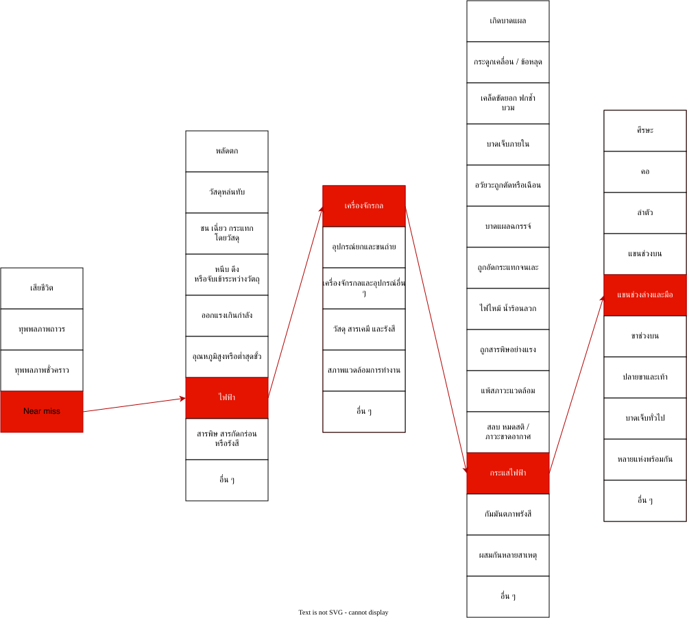

เริ่มเรื่อง โดยเรื่องนี้เป็นเรื่องที่เกิดจากตัวผมเอง ตอนนั้นผมและเพื่อนได้ทำงานตัวนึงเป็นของรายวิชาคอมพิวเตอร์ ซึ่งจะต้องมีขั้นตอนนึงที่เราจะต้อง ใช้พาวเวอร์ซัพพายที่ปล่อยไฟได้ 24โวล และจะต้องมาจ่ายให้ตัวแปลงไฟโดยปรับให้ไฟอยู่ที่ค่า 5-6 โวล เพื่อต่อกับอุปกร์ชนิดนึงคือ Servo motor  โดยงานนี้เป็นงานคู่ ตัวผมเองทำได้ปกติทั้งการแปลงไฟและตัว Servo ทำงานปกติ ด้วยความที่ทำได้ เลยอาสาจะช่วยเพื่อคู่อื่น ผมก็จะไปช่วยเพื่อนคู่นึง ในการปรับตัวแปลงไฟ ด้วยความที่ไม่รอบคอบ ไม่ได้ดูว่าเพื่อนต่อ สายไฟ จากปลั๊กเสียบที่จ่ายไฟบ้านมาที่ตัวพาวเวอร์ซัพพาย ขั้วบวกกับขั้วลบสลับกัน เมื่อเสียบปลั๊กดันเกิดไฟช็อตเนื่องจากไฟสลับขั้วกัน มีกลิ่นไหม้และเสียงช็อต แต่ด้วยความที่ผมยังตั้งสติอยู่เลยรีบดึงปลั๊กออกทันทีที่ได้ยินเสียง ก็เป็นเหตุการณ์ประมาณนี้ ทำให้ตัวอุปกรณืมีรอยไหม้และไม่สามารถการันตีว่าจะใช้ต่อได้
