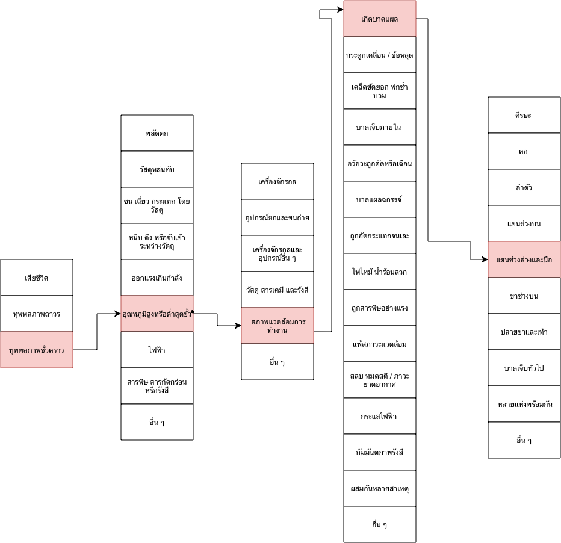

# 🚨 บันทึกเหตุการณ์: อุบัติเหตุที่ [สถานที่/เหตุการณ์]

## 📝 สรุปเรื่องราว (Overview)
ขณะที่กำลังช่วยงานในครัวของร้านอาหาร มีหน้าที่เตรียมอาหารและช่วยจัดภาชนะ หลังจากต้มน้ำและทำอาหารเสร็จ
ต้องยกหม้อที่มีน้ำร้อนออกจากเตาเพื่อไปวางบริเวณเตรียมอาหาร แต่เนื่องจากต้องทำงานอย่างรวดเร็วและไม่ได้ใช้ถุงมือกันความร้อน
ขณะยกหม้อ น้ำร้อนเกิดการกระเพื่อมและหกมาโดนบริเวณมือและแขน ทำให้เกิดอาการแสบร้อนและต้องหยุดงานชั่วคราวเพื่อปฐมพยาบาล
