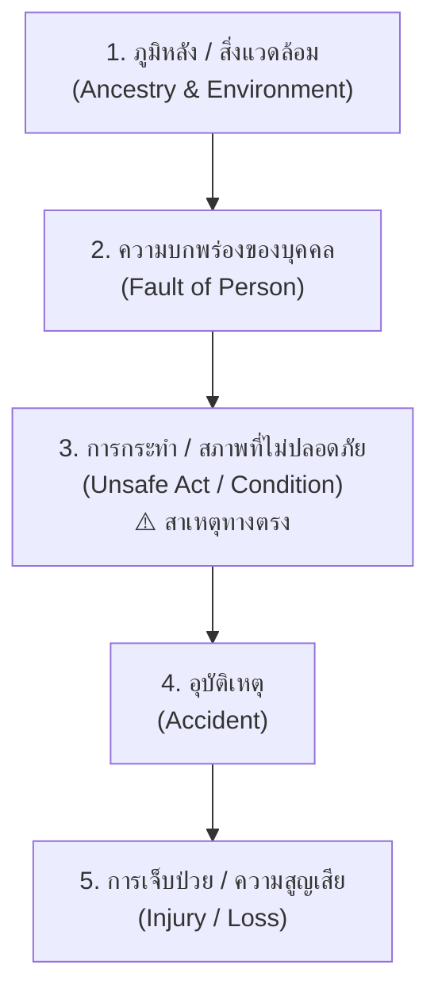
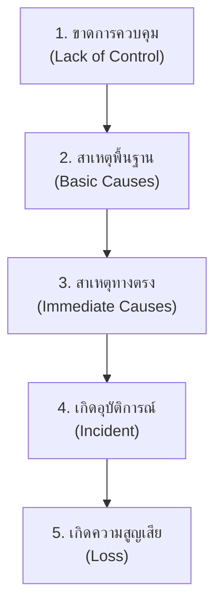
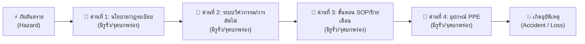

# Week 05: พื้นฐานการป้องกันอุบัติเหตุ (Basics of Accident Prevention)

---

## ส่วนที่ 2: ทฤษฎีการเกิดอุบัติเหตุ (Accident Causation Theories)

> **บทนำ**  
> ในชีวิตประจำวัน เมื่อเกิดอุบัติเหตุขึ้น คนส่วนใหญ่มักสรุปง่าย ๆ ว่า *"ดวงไม่ดี"* หรือ *"ประมาทเอง"* แต่ในทางวิชาการอาชีวอนามัยและความปลอดภัย **อุบัติเหตุไม่ได้เกิดขึ้นจากโชคชะตา และไม่ได้เกิดจากความประมาทของบุคคลเพียงอย่างเดียว**  
> 
---

### 2.1 ทฤษฎีโดมิโนของไฮน์ริช (Heinrich's Domino Theory, 1931)

####   เปรียบเทียบเข้าใจง่าย  "ทฤษฎีตัวล้ม"
ลองจินตนาการถึง **ตัวโดมิโน 5 ตัว** ที่เรานำมาตั้งเรียงต่อกันเป็นแถว หากตัวแรกถูกชนจนล้ม มันก็จะล้มชนตัวที่ 2, 3, 4 ต่อเนื่องกันเป็นปฏิกิริยาลูกโซ่ จนกระทั่งตัวสุดท้ายล้มลงในที่สุด!

####  ความหมายของโดมิโนแต่ละตัว 

| ตัวที่ | ชื่อโดมิโน (Domino Name)                                                   | ความหมาย (Meaning)                                                                                    | ตัวอย่างกรณีศึกษาของ 5 ตัวละครจากทั่วโลก (Global Character Cases)                                                                                                                                                                                                                                                                                                                                                                                                                                                                                                                                                                                                     |
| :----: | :------------------------------------------------------------------------- | :---------------------------------------------------------------------------------------------------- | :-------------------------------------------------------------------------------------------------------------------------------------------------------------------------------------------------------------------------------------------------------------------------------------------------------------------------------------------------------------------------------------------------------------------------------------------------------------------------------------------------------------------------------------------------------------------------------------------------------------------------------------------------------------------- |
| **1**  | **ภูมิหลังและสิ่งแวดล้อมทางสังคม** *(Ancestry & Social Environment)*    | สภาพแวดล้อมการเลี้ยงดู ครอบครัว หรือวัฒนธรรมองค์กรเดิมที่ไม่เคยให้ความสำคัญกับความปลอดภัย             | • **โรเบอร์โต (Roberto - บราซิล):** เติบโตมาในอู่ซ่อมรถชานเมืองที่พ่อและพี่ชายไม่เคยสวมแว่นตานิรภัย เชื่อว่า "มือเก๋าเขาไม่ใส่กัน" • **อลิซ (Alice - อังกฤษ):** ถูกสอนมาตั้งแต่เด็กให้ขี่สกู๊ตเตอร์ย้อนศรบนฟุตบาทเพราะ "เร็วดี ไม่ต้องไปรอไฟแดง" • **เคนจิ (Kenji - ญี่ปุ่น):** อยู่ในวัฒนธรรมองค์กรบ้างาน (Karoshi) ที่กดดันให้ทำงานล่วงเวลาห้ามปฏิเสธ • **คาร์ลอส (Carlos - เม็กซิโก):** เติบโตในสายงานรับเหมาก่อสร้างที่เน้นเร่งงานไวมากกว่าความปลอดภัย • **ไมเคิล (Michael - สหรัฐฯ):** ทำงานในฝ่ายซ่อมบำรุงที่ไม่มีหัวหน้าคอยกำกับดูแลนโยบายความปลอดภัย                                                                                              |
| **2**  | **ความบกพร่องส่วนบุคคล** *(Fault of Person)*                            | นิสัย อารมณ์ หรือสภาวะร่างกายส่วนตัวที่เป็นข้อบกพร่อง เช่น ใจร้อน ลัดขั้นตอน หรือเหนื่อยล้าสะสม       | • **โรเบอร์โต:** ติดนิสัยชะล่าใจ มั่นใจว่าสายตาดีและชินกับงานเจียรโลหะ • **อลิซ:** ใจร้อน ไม่เคารพกฎจราจร ชอบมุดแทรกทำเวลา • **เคนจิ:** อดนอนสะสม (นอนวันละ 3 ชม.) สมองเบลอ ปฏิกิริยาตอบสนองช้าลง • **คาร์ลอส:** มั่นใจในตัวเองสูงเกินไป ชอบทำงานแบบลัดขั้นตอน (Shortcut) • **ไมเคิล:** ชอบเสี่ยง มั่นใจในการทรงตัวบนบันได ไม่รอให้ใครมาช่วยจับ                                                                                                                                                                                                                                                                                                           |
| **3**  | **การกระทำ / สภาพการณ์ที่ไม่ปลอดภัย** *(Unsafe Act / Unsafe Condition)* | **"ชนวนเหตุสำคัญที่สุด (Direct Cause)"** พฤติกรรมเสี่ยงหน้างาน หรืออุปกรณ์/สิ่งแวดล้อมที่ชำรุดอันตราย | • **โรเบอร์โต:** ใช้หินเจียรตัดเหล็กโดยไม่สวมแว่นตานิรภัย (Unsafe Act) + เครื่องเจียรไม่มีการ์ดกั้นสะเก็ด (Unsafe Condition) • **อลิซ:** ขี่สกู๊ตเตอร์ 30 กม./ชม. ย้อนศรบนฟุตบาทแคบ (Unsafe Act) + มุมตึกบังสายตาและพื้นขังน้ำลื่น (Unsafe Condition) • **เคนจิ:** ขับรถยกฟอร์คลิฟต์ยกตู้สินค้าบังทัศนวิสัยด้านหน้า (Unsafe Act) + ทางเดินไม่มีเส้นแบ่งเลนพนักงาน (Unsafe Condition) • **คาร์ลอส:** ไม่สวมเข็มขัดนิรภัยและไม่คล้องสายเซฟตี้บนหลังคาสูง 6 เมตร (Unsafe Act) + หลังคาลื่นไม่มีตาข่ายกันตก (Unsafe Condition) • **ไมเคิล:** ปีนยืนบนขั้นสูงสุดของบันไดอลูมิเนียมโดยไม่ใช้สายรัด (Unsafe Act) + ขาบันไดวางบนคราบน้ำมันลื่น (Unsafe Condition) |
| **4**  | **อุบัติเหตุ** *(Accident)*                                             | เหตุการณ์ไม่คาดคิดที่เกิดขึ้นเฉียบพลันจากการเสียหลัก ลื่นไถล ชน กระแทก หรือตกร่วง                     | • **โรเบอร์โต:** สะเก็ดหินเจียรและเศษโลหะร้อนแดงกระเด็นหลุดพุ่งเข้าตาขวาอย่างจังขณะทำงาน • **อลิซ:** สกู๊ตเตอร์พุ่งประสานงาอย่างจังกับคนเดินเท้าที่เพิ่งก้าวออกจากมุมตึก และลื่นไถลหงายท้อง • **เคนจิ:** รถยกฟอร์คลิฟต์พุ่งชนเสาอาคารโรงงานอย่างแรงเนื่องจากมองไม่เห็นทางด้านหน้า • **คาร์ลอส:** เหยียบกระเบื้องหลังคาใสที่แตกร้าว ทำให้กระเบื้องทะลุ ตกร่วงจากหลังคาสูง 6 เมตรทันที • **ไมเคิล:** ขาบันไดลื่นไถลบนคราบน้ำมัน เสียหลักหงายท้องตกร่วงลงมาจากความสูง 3 เมตรกะทันหัน                                                                                                                                                                         |
| **5**  | **การบาดเจ็บและความสูญเสีย** *(Injury & Loss)*                          | ผลลัพธ์ความสูญเสียสุดท้ายต่อร่างกาย ทรัพย์สิน กระบวนการผลิต หรือสิ่งแวดล้อม                           | • **โรเบอร์โต:** กระจกตาเป็นแผลลึก ติดเชื้ออักเสบ ตาขวาสูญเสียการมองเห็น 80% ทุพพลภาพถาวร • **อลิซ:** ฟันหน้าหัก 2 ซี่ หน้าผากแตกเย็บ 10 เข็ม ส่วนคนเดินเท้าข้อมือเคล็ด ต้องจ่ายค่ารักษาหลายแสนบาท • **เคนจิ:** งาฟอร์คลิฟต์หัก สินค้ามูลค่า 5 แสนบาทพังเสียหายทั้งหมด และเคนจิซี่โครงร้าวจากแรงกระแทกพวงมาลัย • **คาร์ลอส:** ตกลงมากระแทกพื้นด้านล่าง กระดูกเชิงกรานและกระดูกสันหลังแตกหัก เป็นอัมพาตครึ่งท่อนตลอดชีวิต • **ไมเคิล:** ข้อมือและกระดูกแขนแตกหัก ต้องผ่าตัดดามเหล็ก หยุดงานพักฟื้น 3 เดือน และโรงงานเสียค่ารักษาพยาบาลนับแสน                                                                                                               |

> 🛠️ **วิธีป้องกันฉบับเข้าใจง่าย: การดึงโดมิโนตัวที่ 3 ออกไป (Removing Domino 3)**  
> ไฮน์ริชชี้ว่า เราอาจจะเปลี่ยนประวัติการเลี้ยงดู (โดมิโนตัวที่ 1) หรือเปลี่ยนนิสัยลึกๆ ของคน (โดมิโนตัวที่ 2) ได้ยาก **แต่เราสามารถหยุดอุบัติเหตุและความสูญเสียได้ทันทีด้วยการ "ดึงโดมิโนตัวที่ 3 (Unsafe Act / Unsafe Condition) ออกไป!"**  
> 
> ⏳ **หากเราทะลุมิติย้อนเวลากลับไปเตือนทั้ง 5 คนด้วยภาษาท้องถิ่นก่อนเกิดเรื่องได้สำเร็จ**  
> 1. 🇧🇷 **ย้อนเวลาไปเตือนโรเบอร์โต (ภาษาโปรตุเกส - บราซิล)**  
>    * 🗣️ *"Pára aí, Roberto! Coloque os óculos de proteção e instale a proteção da esmerilhadora agora mesmo!"*  
>    * 🇹🇭 *(**แปลไทย** "ยั้งมือไว้ก่อน โรเบอร์โต! สวมแว่นตานิรภัยเซฟตี้ และติดตั้งฝาครอบบังหินเจียรเดี๋ยวนี้!")*  
>    * ➔ **ผลลัพธ์** หยุดการไม่ใส่แว่นและติดการ์ดบัง ➔ สะเก็ดหินเจียรไม่เจาะตา ➔ ไม่สูญเสียการมองเห็น!
> 
> 2. 🇬🇧 **ย้อนเวลาไปเตือนอลิซ (ภาษาอังกฤษ - สหราชอาณาจักร)**  
>    * 🗣️ *"Stop right there, Alice! Slow down and ride in the proper direction of traffic!"*  
>    * 🇹🇭 *(**แปลไทย** "หยุดตรงนั้นเลย อลิซ! ชะลอความเร็ว แล้วเปลี่ยนกลับไปขี่ตามทิศทางจราจรปกติ!")*  
>    * ➔ **ผลลัพธ์** หยุดการขี่ย้อนศรบนฟุตบาท ➔ ไม่ชนประสานงาคนเดินเท้า ➔ อลิซฟันไม่หัก ไม่ต้องจ่ายค่าทำขวัญ!
> 
> 3. 🇯🇵 **ย้อนเวลาไปเตือนเคนจิ (ภาษาญี่ปุ่น - ญี่ปุ่น)**  
>    * 🗣️ *"ケンジさん、止まって！フォークリフトをバックで運転するか、誘導員を呼んでください！"* *(Kenji-san, tomotte! Fōkurifuto o bakku de unten suru ka, yūdōin o yonde kudasai!)*  
>    * 🇹🇭 *(**แปลไทย** "หยุดก่อน เคนจิซัง! เปลี่ยนเป็นขับถอยหลัง หรือขอคนเดินนำทางเพื่อมองทางให้ชัด!")*  
>    * ➔ **ผลลัพธ์** หยุดการขับมองไม่เห็นทาง ➔ รถยกไม่ชนเสาโรงงาน ➔ เคนจิซี่โครงไม่ร้าว สินค้า 5 แสนไม่พัง!
> 
> 4. 🇲🇽 **ย้อนเวลาไปเตือนคาร์ลอส (ภาษาสเปน - เม็กซิโก):**  
>    * 🗣️ *"¡Alto ahí, Carlos! ¡Ponte el arnés y engancha la línea de vida a la estructura de inmediato!"*  
>    * 🇹🇭 *(**แปลไทย** "หยุดก้าวขา คาร์ลอส! สวมชุดฮาร์เนสและคล้องสายช่วยชีวิต Safety Lanyard เข้ากับโครงสร้างทันที!")*  
>    * ➔ **ผลลัพธ์** หยุดการทำงานบนที่สูงโดยไม่คล้องสายเซฟตี้ ➔ แม้กระเบื้องจะแตกทะลุ แต่ตัวถูกรั้งกลางอากาศ ➔ คาร์ลอสไม่ตกลงมาพิการ!
> 
> 5. 🇺🇸 **ย้อนเวลาไปเตือนไมเคิล (ภาษาอังกฤษ - สหรัฐอเมริกา):**  
>    * 🗣️ *"Hold on, Michael! Get down from that ladder, clean up the oil spill, and get someone to spot you!"*  
>    * 🇹🇭 *(**แปลไทย** "ช้าก่อน ไมเคิล! ลงมาจากบันไดนั่นก่อน เช็ดคราบน้ำมันบนพื้น แล้วหาเพื่อนมาช่วยจับขาบันได!")*  
>    * ➔ **ผลลัพธ์** หยุดการปีนขั้นบนสุดบนพื้นมันลื่น ➔ บันไดไม่ไถล ➔ ไมเคิลไม่ต้องแขนหัก!
> 
> 💡 **สรุปบทเรียน:** เมื่อโดมิโนตัวที่ 3 ถูกดึงออก ปฏิกิริยาลูกโซ่จะถูกตัดขาดทันที โดมิโนตัวที่ 4 (อุบัติเหตุ) และ 5 (ความสูญเสีย) ก็จะไม่ล้มลงมา!

---

### 2.2 ทฤษฎีโดมิโนดัดแปลงของเบิร์ดและลอฟตัส (Bird & Loftus Modified Domino Theory, 1976)

####  เปรียบเทียบเข้าใจง่าย  "อย่าโทษแต่คนทำงาน ให้ดูระบบบริหารด้วย"
ทฤษฎีโดมิโนเดิมของไฮน์ริชถูกวิจารณ์ว่ามุ่งโทษไปที่นิสัยและความประมาทของตัวบุคคล (พนักงาน) เป็นหลัก ต่อมา **Frank Bird & Loftus** จึงได้ปรับปรุงทฤษฎีใหม่ โดยชี้ให้เห็นว่า **"การที่พนักงานประมาท หน้างานเสี่ยง มักมีสาเหตุรากเหง้ามาจากการบริหารจัดการขององค์กรที่ล้มเหลว"**

#### 📌 อธิบายขั้นตอนความเชื่อมโยง ถ่ายทอดผ่านกรณีศึกษา 5 ประเทศทั่วโลก

1. **1. การขาดการควบคุมโดยฝ่ายบริหาร (Lack of Control)**
   * *ความหมาย:* รากเหง้าของปัญหา เกิดจากฝ่ายบริหารไม่มีนโยบายความปลอดภัย ไม่จัดฝึกอบรม ไม่มีระบบสุ่มตรวจ หรือตัดลดงบเซฟตี้
   * *ตัวอย่างทั่วโลก:* 
     
     🇩🇪 **ฮันส์ (Hans - เยอรมนี)** บริษัทขนส่งในเบอร์ลินตัดงบซ่อมบำรุงรถบรรทุก ไม่มีการตรวจประเมินระบบเบรกตามระยะเวลา 
     	
     🇨🇳 **หลี่เหว่ย (Li Wei - จีน)** นิคมอุตสาหกรรมในเซินเจิ้นไม่มีระบบ Audit ตรวจสอบคลังเก็บสารเคมีไวไฟประจำปี

2. **2. สาเหตุพื้นฐาน (Basic Causes):**
   * *ปัจจัยส่วนบุคคล (Personal Factors):* พนักงานขาดความรู้ ขาดทักษะ อดนอน หรือเจ็บป่วยเพราะไม่ได้รับการดูแล
   * *ปัจจัยจากการทำงาน (Job Factors):* เครื่องมือเก่าชำรุด ไม่มีขั้นตอน SOP หรือเร่งรัดโควตางานเกินกำลัง
   * *ตัวอย่างทั่วโลก:* 
     
     🇦🇪 **ทาริก (Tariq - ดูไบ/อาหรับ)** เป็นแรงงานย้ายถิ่นไม่เคยได้รับการอบรมเรื่องความปลอดภัยจากความร้อน (ปัจจัยคน) + หน้างานไม่มีเต็นท์พักพยาบาลบังแดด (ปัจจัยงาน) 
     
     🇿🇦 **ควาเม (Kwame - แอฟริกาใต้)** หัวหน้าเหมืองเร่งรัดโควตาขุดทองคำ (ปัจจัยคน) + ไม้ค้ำยันอุโมงค์เหมืองแร่อายุ 20 ปีผุกร่อน (ปัจจัยงาน)

3. **3. สาเหตุทางตรง (Immediate Causes):**
   * *การกระทำที่ไม่ปลอดภัย (Unsafe Act):* พฤติกรรมเสี่ยงของพนักงานหน้างาน
   * *สภาพการณ์ที่ไม่ปลอดภัย (Unsafe Condition):* สภาพแวดล้อม อุปกรณ์ เครื่องจักรชำรุดอันตราย
   * *ตัวอย่างทั่วโลก:* 
     
     🇷🇺 **อะเล็กเซย์ (Aleksei - รัสเซีย)** ยื่นหน้าเข้าไปมองหัวเปิดวาล์วเตาถลุงเหล็กโดยไม่สวมกระบังหน้าทนไฟ (Unsafe Act) + วาล์วน้ำเหล็กหลอมแรงดันสูงรั่วซึม (Unsafe Condition) 
     
     🇩🇪 **ฮันส์:** ขับรถบรรทุกเร็วเกินกำหนดบนทางหลวง Autobahn ช่วงฝนตก (Unsafe Act) + ผ้าเบรกรถเสื่อมสภาพไม่จับจานเบรก (Unsafe Condition)

4. **4. เกิดอุบัติการณ์ (Incident):**
   * *ความหมาย:* เหตุการณ์เฉียบพลันจากการสัมผัสกับพลังงาน ความร้อน ก๊าซพิษ หรือการกระแทกตกหล่น
   * *ตัวอย่างทั่วโลก:* 
     
     🇷🇺 **อะเล็กเซย์:** น้ำเหล็กหลอมอุณหภูมิ 1,500°C พุ่งสแปลชกระเด็นออกจากวาล์วใส่ใบหน้า 
     
     🇦🇪 **ทาริก:** เกิดภาวะโรคลมแดด (Heatstroke) วูบหมดสติหน้างานขณะยืนริมขอบนั่งร้านสูงชั้น 30 
     
     🇨🇳 **หลี่เหว่ย:** ประกายไฟสปาร์กจุดระเบิดไอระเหยสารเคมี เกิดการระเบิดและเพลิงไหม้คลังสินค้าอย่างรุนแรง

5. **5. เกิดความสูญเสีย (Loss):**
   * *ความหมาย:* ผลลัพธ์ความสูญเสียต่อชีวิต ร่างกาย ทรัพย์สิน กระบวนการผลิต และสิ่งแวดล้อม
   * *ตัวอย่างทั่วโลก:* 
     
     🇿🇦 **ควาเม:** เพดานอุโมงค์เหมืองถล่มลงมาทับ ควาเมถูกติดค้างใต้อุโมงค์ เหมืองหยุดขุดแร่ 5 วัน สูญเสียงบกู้ภัยมหาศาล 
     
     🇩🇪 **ฮันส์:** รถบรรทุกพุ่งชนขอบทางด่วนพลิกคว่ำ ตู้สินค้ามูลค่า 2 ล้านบาทพังเสียหายทั้งหมด และฮันส์บาดเจ็บสาหัส

> 💡 **หัวใจสำคัญของทฤษฎี Bird & Loftus:** การป้องกันอุบัติเหตุในยุคปัจจุบัน จึงไม่ใช่แค่การนั่งจับผิดหรือดุด่าพนักงานหน้างาน (สาเหตุทางตรง) แต่ฝ่ายบริหารต้องเป็นผู้เริ่มต้นวางระบบ (กุมโดมิโนตัวที่ 1) จัดฝึกอบรม จัดหาอุปกรณ์ดีๆ และสร้างระบบควบคุมที่ไม่ปล่อยให้เกิดความสูญเสียขึ้น!

---

### 2.3 โมเดลเนยแข็งสวิส (Reason's Swiss Cheese Model, 1990)

#### 🧀 เปรียบเทียบเข้าใจง่าย: "ทฤษฎีแผ่นเนยมีรู"
James Reason ได้เปรียบเทียบ **"ระบบและมาตรการความปลอดภัยในองค์กร"** เหมือนกับ **แผ่นเนยแข็งสวิส (Swiss Cheese) หลายๆ แผ่นที่ตั้งเรียงต่อกัน**

* แผ่นเนยแต่ละแผ่น คือ **"ด่านป้องกันอันตราย"** เช่น:
  * *แผ่นที่ 1:* นโยบายและกฎความปลอดภัย
  * *แผ่นที่ 2:* ระบบวิศวกรรม (เช่น อุปกรณ์ตัดไฟอัตโนมัติ, การ์ดกั้นเครื่องจักร)
  * *แผ่นที่ 3:* ขั้นตอนการทำงานและป้ายเตือน
  * *แผ่นที่ 4:* อุปกรณ์เซฟตี้ส่วนบุคคล (PPE) เช่น หมวกนิรภัย, แว่นตา
* **"รู" บนแผ่นเนย** คือ **จุดบกพร่องหรือจุดอ่อน** ที่แฝงอยู่ในแต่ละด่าน (เนยแข็งสวิสธรรมชาติจะมีรูพรุน)

#### ⚡ อุบัติเหตุเกิดขึ้นได้อย่างไรตามโมเดลเนยแข็ง?
ในสถานการณ์ปกติ แม้แผ่นเนยแผ่นที่ 1 จะมีรูรั่ว แต่มักจะมีแผ่นเนยแผ่นที่ 2 หรือ 3 คอย "บล็อก" อันตรายไว้ได้ ทำให้ไม่เกิดอุบัติเหตุ  
**แต่ถ้าวันใดวันหนึ่ง "รูรั่วของเนยทุกๆ แผ่น เกิดตรงกันเป็นเส้นตรงพอดี!" (Alignment of Flaws)** อันตรายก็จะทะลุผ่านทุกด่านป้องกันตั้งแต่แผ่นแรกจนถึงแผ่นสุดท้าย ทำให้เกิดอุบัติเหตุรุนแรงทันที!

#### 🔍 ประเภทของจุดบกพร่อง (รูรั่ว) บนแผ่นเนย:

* **1. ข้อผิดพลาดระยะสั้น/หน้างาน (Active Failures):**
  * รูรั่วที่เกิดจากพฤติกรรมผิดพลาดของพนักงานหน้างาน ณ วินาทีนั้น เช่น พนักงานกดยืนยันผิดปุ่ม, ลืมสวมแว่นตานิรภัย, หรือใจลอย
* **2. เงื่อนไขที่ซ่อนเร้นเชิงระบบ (Latent Conditions):**
  * รูรั่วที่แฝงตัวอยู่นานแล้วในระดับผู้บริหารหรือการออกแบบระบบ โดยไม่มีใครสังเกตเห็น เช่น การออกแบบระบบซับซ้อนเกินไปจนคนสับสน, การลดงบซ่อมบำรุงเครื่องจักร, หรือการตัดลดอัตรากำลังคนจนพนักงานต้องทำงานคูณสอง

---

#### 📌 ถอดรหัสการทะลุผ่านของรูเนยแข็งผ่านกรณีศึกษาตัวละครทั่วโลก (Global Cases)

* 🇫🇷 **กรณีที่ 1: ปีแอร์ (Pierre - ฝรั่งเศส/ยุโรป) ในโรงงานผลิตสารเคมี**
  * 🕳️ **ด่านที่ 1 (นโยบาย):** *[Latent]* บริษัทตัดงบประเมินความเสี่ยงและงบซ่อมบำรุงประจำปี
  * 🕳️ **ด่านที่ 2 (วิศวกรรม):** *[Latent]* เซนเซอร์ตรวจจับก๊าซพิษรั่วชำรุดสะสมนาน 6 เดือนโดยไม่มีการเปลี่ยน
  * 🕳️ **ด่านที่ 3 (ขั้นตอน SOP):** *[Active]* ปีแอร์ไม่ได้ตรวจสอบใบบันทึกเช็กลิสต์ความปลอดภัยก่อนเริ่มทำงาน
  * 🕳️ **ด่านที่ 4 (อุปกรณ์ PPE):** *[Active]* ปีแอร์ถอดหน้ากากกรองก๊าซพิษออกเพราะรู้สึกอึดอัดและร้อน
  * 💥 **ผลลัพธ์การตรงกันของรูเนย (Alignment):** ก๊าซพิษรั่วซึมออกมา ➔ เซนเซอร์ไม่ร้องเตือน ➔ ไม่มีใบบันทึกเตือน ➔ ปีแอร์ไม่สวมหน้ากาก ➔ **ก๊าซพิษทะลุผ่านทุกด่าน ทำให้ปีแอร์สูดก๊าซพิษหมดสติสาหัสทันที!**

---

* 🇪🇬 **กรณีที่ 2: อับดุลเลาะฮ์ (Abdullah - อียิปต์/อาหรับ) บนแท่นขุดเจาะน้ำมัน**
  * 🕳️ **ด่านที่ 1 (นโยบาย):** *[Latent]* ผู้บริหารเร่งรัดขุดเจาะน้ำมันให้ทันสัญญา ข้ามขั้นตอน Safety Audit
  * 🕳️ **ด่านที่ 2 (วิศวกรรม):** *[Latent]* วาล์วตัดแรงดันก๊าซฉุกเฉิน (Emergency Shutdown Valve) เกิดคราบสนิมเกาะจนกลไกติดขัด
  * 🕳️ **ด่านที่ 3 (ขั้นตอน SOP):** *[Active]* อับดุลเลาะฮ์ข้ามขั้นตอนการวัดแรงดันก๊าซในท่อก่อนเปิดเครื่องสูบ
  * 🕳️ **ด่านที่ 4 (อุปกรณ์ PPE):** *[Active]* อับดุลเลาะฮ์สวมชุดทนไฟชำรุดที่มีรอยขาดบริเวณแขน
  * 💥 **ผลลัพธ์การตรงกันของรูเนย (Alignment):** แรงดันก๊าซพุ่งสูง ➔ วาล์วฉุกเฉินไม่ทำงาน ➔ อับดุลเลาะฮ์ไม่ได้วัดแรงดัน ➔ ชุดทนไฟขาด ➔ **เกิดการระเบิดและเปลวไฟลวกแขนอับดุลเลาะฮ์บาดเจ็บหนัก!**

---

* 🇨🇳 **กรณีที่ 3: เฉิน (Chen - จีน/เอเชีย) ในโรงงานแบตเตอรี่รถยนต์ไฟฟ้า (EV)**
  * 🕳️ **ด่านที่ 1 (นโยบาย):** *[Latent]* โรงงานเพิ่มโควตาผลิตเป็น 2 เท่า ทำให้กะทำงานดึกไม่มีผู้ควบคุมความปลอดภัย (Safety Officer) อยู่ดูแล
  * 🕳️ **ด่านที่ 2 (วิศวกรรม):** *[Latent]* ระบบระบายความร้อนหม้อบดลิเธียมมีตะกรันเกาะ ทำให้อุณหภูมิสูงผิดปกติ
  * 🕳️ **ด่านที่ 3 (ขั้นตอน SOP):** *[Active]* เฉินไม่ได้สังเกตสัญญาณไฟเตือนความร้อนบนหน้าจอเพราะมัวแต่เร่งแพ็กงาน
  * 🕳️ **ด่านที่ 4 (อุปกรณ์ PPE):** *[Active]* เฉินไม่ได้สวมถุงมือฉนวนทนความร้อนขณะจับขอบหม้อบด
  * 💥 **ผลลัพธ์การตรงกันของรูเนย (Alignment):** หม้อบดเกิดความร้อนสูง ➔ สัญญาณเตือนถูกละเลย ➔ ไม่มี Safety Officer สั่งหยุด ➔ เฉินจับหม้อบดมือเปล่า ➔ **เกิดการระเบิดและเปลวไฟลวกมือเฉินบาดเจ็บสาหัส!**

> 💡 **สรุป**  
> ปรัชญาของ Swiss Cheese Model บอกเราว่า **ไม่มีด่านป้องกันใดที่สมบูรณ์แบบ 100%** หน้าที่ของนักจัดการความปลอดภัยจึงไม่ใช่แค่การสั่งให้พนักงานระวังตัว (อุดรูแผ่นสุดท้าย) แต่ต้องพยายาม **"อุดรูรั่วในแผ่นเนยทุกๆ แผ่น"** และคอยหมั่นตรวจเช็กไม่ให้รูรั่วของแต่ละด่านซ้อนตรงกันนั่นเอง

## 📝 คำถาม / แบบทดสอบทบทวน ส่วนที่ 2

> 📌 **โจทย์และคำสั่งสำหรับนักศึกษา:**  
> ให้นักศึกษาเลือก **อุบัติการณ์หรืออุบัติเหตุจริง 1 เหตุการณ์** (โดยเลือกจาก: **ข่าวสารในสื่อ**, **ประสบการณ์ตรงของตัวนักศึกษาเอง**, หรือ **เหตุการณ์ที่เกิดขึ้นกับคนใกล้ชิด**) จากนั้นให้ทำการวิเคราะห์ถอดบทเรียนผ่าน **กรอบทฤษฎีการเกิดอุบัติเหตุทั้ง 3 ทฤษฎี** พร้อมทั้งสมมติว่า **"หากนักศึกษาสามารถทะลุมิติย้อนเวลากลับไปเตือนตัวเอง คนใกล้ชิด หรือบุคคลในข่าวคนนั้นได้ก่อนเกิดเหตุ นักศึกษาจะพูดเตือนว่าอย่างไรเพื่อหยุดยั้งอุบัติเหตุ?"**  
> 

---

รายละเอียดจากข่าว: ก่อนเกิดเหตุ ผู้เสียชีวิตกำลังสอนงานพนักงานรุ่นน้อง เอามือเข้าไปบริเวณเครื่องจนไปโดนเซ็นเซอร์ ทำให้เครื่องทำงานและกดทับร่าง 

1️⃣ ทฤษฎีโดมิโนไฮน์ริช

โดมิโน1 (สิ่งแวดล้อม): จุดสอนงานอยู่ใกล้เครื่องจักรกำลังทำงาน ไม่มีเขตกั้นปลอดภัย
โดมิโน2 (บกพร่องบุคคล): รุ่นพี่ชำนาญ ประเมินความเสี่ยงต่ำ คิดว่าคุ้นเครื่องดีไม่เป็นไร
โดมิโน3 (Unsafe Act): เอามือเข้าใกล้จุดเซ็นเซอร์ขณะสอนงาน ไม่ตัดไฟ/ล็อกเครื่องก่อน (ไม่ทำ Lockout-Tagout)
โดมิโน4 (อุบัติเหตุ): มือโดนเซ็นเซอร์ เครื่องทำงานเอง
โดมิโน5 (บาดเจ็บ): ถูกกดทับ เสียชีวิต

คำเตือนย้อนเวลา:
🗣️ "อย่าเอามือเข้าใกล้เซ็นเซอร์ ตัดไฟ ล็อกเครื่องก่อนสอนงานทุกครั้ง แค่นี้ไม่ต้องเสียชีวิต"

2️⃣ ทฤษฎีเบิร์ด&ลอฟตัส

ขั้น1 (ขาดควบคุม): โรงงานไม่มีระบบ LOTO (Lockout-Tagout) บังคับก่อนสอนงานใกล้เครื่องจักร
ขั้น2 (สาเหตุพื้นฐาน): ขาดการอบรมความปลอดภัยเรื่องเซ็นเซอร์เครื่องจักรก่อนให้สอนงานหน้างานจริง
ขั้น3 (สาเหตุตรง): มือโดนเซ็นเซอร์ขณะเครื่องไม่ได้ปิด
ขั้น4 (อุบัติการณ์): เครื่องทำงานกะทันหันกดทับ
ขั้น5 (สูญเสีย): เสียชีวิต 1 ราย + ผลกระทบจิตใจรุ่นน้องที่เห็นเหตุการณ์

คำเตือนย้อนเวลา:
🗣️ "ฝ่ายบริหารต้องบังคับใช้ระบบล็อกเครื่องก่อนซ่อม/สอนงานทุกครั้ง ไม่ใช่ปล่อยให้พนักงานประเมินความเสี่ยงเอง"

3️⃣ Swiss Cheese Model

ด่าน1 (นโยบาย): ไม่มีนโยบายบังคับ LOTO ชัดเจนในโรงงาน
ด่าน2 (วิศวกรรม): เซ็นเซอร์เครื่องไวเกินไป ไม่มีการ์ดป้องกันมือเข้าใกล้
ด่าน3 (SOP/ป้ายเตือน): ไม่มี SOP สอนงานหน้าเครื่องจักรที่กำลังทำงาน ไม่มีป้ายเตือนจุดเซ็นเซอร์
ด่าน4 (PPE): ไม่มีมาตรการป้องกันมือ (เช่น การ์ดมือ)

จุดรูตรงกัน: ไม่มีนโยบาย+เซ็นเซอร์ไม่มีการ์ด+ไม่มี SOP+ไม่มีอุปกรณ์ป้องกัน รวมกันพอดีตอนสอนงาน เลยเสียชีวิต

คำเตือนย้อนเวลา:
🗣️ "อุดรูด่าน3 ก่อน — ตั้ง SOP ห้ามเอามือเข้าใกล้เซ็นเซอร์ขณะสอนงาน ต้องหยุดเครื่องเสมอ ต่อให้ด่านอื่นรั่ว ด่านนี้กันได้ทัน"