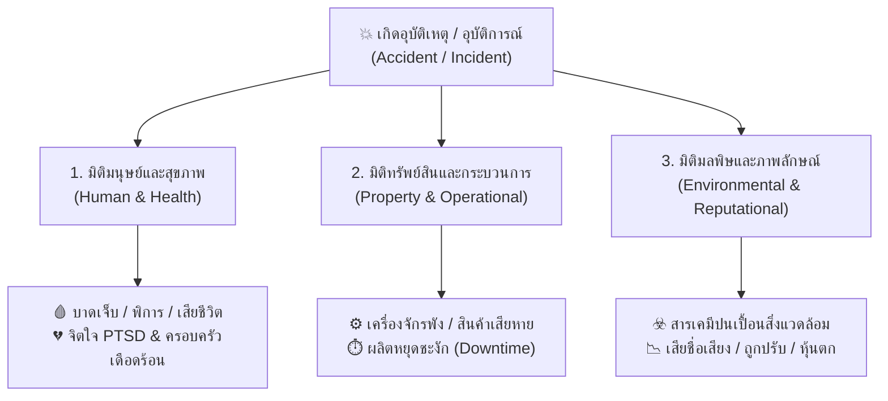

# Week 05: พื้นฐานการป้องกันอุบัติเหตุ (Basics of Accident Prevention)

---

## 📊 ส่วนที่ 3: ประเภทความสูญเสีย (Types of Losses in OHS)

> 💡 **บทนำ**  
> เมื่อเกิดอุบัติเหตุขึ้นในสถานที่ทำงาน คนทั่วไปมักมองเห็นเฉพาะ **"การบาดเจ็บของคน"** แต่ในทางอาชีวอนามัยและความปลอดภัย ความสูญเสียเปรียบเสมือน **"ระเบิดวงกว้าง"** ที่ไม่ได้กระทบแค่ร่างกายของผู้ประสบเหตุเท่านั้น แต่แผ่ขยายผลกระทบออกไปเป็น **3 มิติหลัก (3 Loss Dimensions)** ดังนี้:

---

### 🌐 ตาราง 3 มิติความสูญเสีย ถ่ายทอดผ่านกรณีศึกษาตัวละครทั่วโลก

| มิติความสูญเสีย (Loss Dimension)                                    | ขอบเขตผลกระทบ (Impact Scope)                                                                                                                                                                | ตัวอย่างเหตุการณ์และผลกระทบจริงจากตัวละครทั่วโลก (Global Character Examples)                                                                                                                                                                   |
| :------------------------------------------------------------------ | :------------------------------------------------------------------------------------------------------------------------------------------------------------------------------------------ | :--------------------------------------------------------------------------------------------------------------------------------------------------------------------------------------------------------------------------------------------- |
| **1. มิติการบาดเจ็บและสุขภาพ (Human & Health Loss)**             | • การบาดเจ็บเฉียบพลัน     (เจ็บเล็กน้อย/พิการ/เสียชีวิต) • โรคจากการทำงานสะสมเรื้อรัง • ผลกระทบทางจิตใจ     (PTSD/ภาวะซึมเศร้า) • ความเดือดร้อนของครอบครัวผู้ประสบเหตุ       | 🇲🇽 **คาร์ลอส (Carlos - เม็กซิโก):** ตกจากหลังคาสูง 6 เมตร กระดูกสันหลังและกระดูกเชิงกรานแตกหัก สูญเสียความสามารถในการเดิน (อัมพาตครึ่งท่อนถาวร) ไม่สามารถทำงานหาเลี้ยงลูกเมียได้ เกิดภาวะโศกเศร้าซึมเศร้ารุนแรงทั้งครอบครัว                  |
| **2. มิติทรัพย์สินและกระบวนการ (Property & Operational Loss)**   | • เครื่องจักร เครื่องมือ และอุปกรณ์ชำรุดเสียหาย • วัตถุดิบและชิ้นงานเสียหายถอนคืนไม่ได้ • สายการผลิตหยุดชะงัก    (Downtime) • ค่าใช้จ่ายซ่อมแซมและจัดหาเครื่องมือทดแทน          | 🇯🇵 **เคนจิ (Kenji - ญี่ปุ่น):** ขับฟอร์คลิฟต์ชนเสาอาคาร ทำให้อุปกรณ์งายกหัก ชิ้นส่วนเซมิคอนดักเตอร์มูลค่า 500,000 บาทตกกระจายเสียหายทั้งหมด สายประกอบรถยนต์ต้องหยุดผลิต (Downtime) 12 ชั่วโมง คิดเป็นมูลค่าสูญเสียโอกาสการผลิตกว่า 3 ล้านบาท |
| **3. มิติมลพิษและภาพลักษณ์ (Environmental & Reputational Loss)** | • สารเคมี/ก๊าซพิษรั่วไหลปนเปื้อน ดิน น้ำ อากาศ • ค่าปรับและโทษอาญาจากการฝ่าฝืนกฎหมาย • เสียชื่อเสียง แบรนด์ถูกแบน ลูกค้าcancelสัญญา • ราคาหุ้นตก และถูกเพิกถอนใบอนุญาตประกอบกิจการ | 🇨🇳 **หลี่เหว่ย (Li Wei - จีน):** คลังเคมีระเบิดทำให้สารตัวทำละลายไวไฟรั่วไหลลงสู่แม่น้ำสายหลัก ชุมชน 50,000 ครัวเรือนขาดน้ำประปา ปลานับแสนตัวตาย โรงงานถูกศาลสั่งปรับ 10 ล้านหยวน ถูกเพิกถอนใบอนุญาต และหุ้นบริษัทตก 40%                     |

---

### 🎨 สรุปแผนผังเชื่อมโยง 3 มิติความสูญเสีย (Mermaid Diagram)

---

> 💡 **บทสรุปสำคัญ:**  
> การป้องกันอุบัติเหตุจึงไม่ได้มีไว้เพื่อ *"ทำตามกฎหมายบังคับ"* เท่านั้น แต่คือการ **ปกป้องชีวิตมนุษย์ (Human Capital)** **คุ้มครองทรัพย์สินองค์กร (Asset Protection)** และ **รักษาความยั่งยืนของสิ่งแวดล้อมและชื่อเสียงธุรกิจ (Business Sustainability)** ในระยะยาว

## 📝 คำถาม / แบบทดสอบทบทวน ส่วนที่ 3

> 📌 **โจทย์และคำสั่งสำหรับนักศึกษา:**  
> จากเหตุการณ์จริงที่นักศึกษาได้เลือกวิเคราะห์ไว้ใน **ส่วนที่ 2 (แบบทดสอบทบทวน ส่วนที่ 2)** ให้นักศึกษาเขียน **เล่าเรื่องหรือสะท้อนความคิดเห็น (Reflection & Loss Analysis)** โดยตอบคำถามว่า:  
> **"นอกจากบาดแผล ร่างกายของผู้เจ็บป่วย หรือความเสียหายที่เห็นเด่นชัดด้วยตาเปล่า ณ หน้างาน (เช่น ไฟไหม้ เครื่องจักรพัง หรือการระเบิด) นักศึกษามองเห็น 'ความสูญเสียที่ซ่อนเร้น (Hidden Losses)' หรือผลกระทบอื่นๆ ในมิติใดอีกบ้างที่ตามมาหลังจากเหตุการณ์นั้นจบลง?"**

---

### 📋 แนวทางการเขียนตอบและประเด็นสะท้อนความคิดเห็น (Reflection Guidelines):

ให้นักศึกษาเขียนบรรยายความยาวประมาณ 10-15 บรรทัด โดยเจาะลึกความสูญเสียที่มากกว่าตาเห็น ในประเด็นดังต่อไปนี้:

1. 💔 **ผลกระทบทางจิตใจและสังคมซ่อนเร้น (Hidden Psychological & Social Losses):**
   * บาดแผลทางกายสร้างความหวาดระแวงทางจิตใจ เกิดภาวะวิตกกังวลทุกครั้งที่ต้องยกวัตถุขนาดใหญ่หรือของมีน้ำหนัก กลัวการเกิดอุบัติเหตุซ้ำ (PTSD เล็กๆ) อีกทั้งครอบครัวยังได้รับผลกระทบจากความเครียด พ่อเกิดความรู้สึกผิดที่เป็นส่วนหนึ่งในเหตุการณ์เร่งรีบ ส่วนการบาดเจ็บยังส่งผลกระทบต่อรายได้เนื่องจากต้องหยุดพักฟื้น ไม่สามารถทำงานหรือยกของหนักได้ตามปกติ ทำให้ภาระค่าใช้จ่ายภายในบ้านตึงตัวขึ้น
2. ⏱️ **ความสูญเสียทางกระบวนการและโอกาสทางธุรกิจ (Hidden Operational & Opportunity Losses):**
   * ในมุมของการทำงาน เหตุการณ์นี้ทำให้เกิดการเสียเวลาโดยทันที การส่งมอบถังดับเพลิงล่าช้ากว่ากำหนด ส่งผลต่อความน่าเชื่อถือในสายตาของลูกค้า ค่าใช้จ่ายแฝงที่ตามมาไม่ใช่แค่ค่ารักษาพยาบาล แต่ยังรวมถึงค่ายา ค่าเดินทางไปโรงพยาบาลเพื่อตัดไหม และการเสียโอกาสในการรับงานอื่นในระหว่างที่ยังไม่สามารถกลับมาเดินได้ปกติ
3. ☣️ **ความสูญเสียต่อชุมชน สิ่งแวดล้อม และภาพลักษณ์ (Hidden Environmental & Reputational Losses):**
   * แม้จะเป็นกิจการครอบครัว แต่การเกิดอุบัติเหตุจากการทำงานที่ไร้ระบบความปลอดภัยและการแต่งกายที่ไม่เหมาะสม (ใส่รองเท้าแตะ) สะท้อนถึงการขาดมาตรฐานความปลอดภัยอย่างรุนแรง บั่นทอนความเชื่อมั่นของลูกค้าต่อความน่าเชื่อถือในการให้บริการ และหากเป็นระดับองค์กร เหตุการณ์ลักษณะนี้จะส่งผลเสียต่อภาพลักษณ์องค์กรอย่างมหาศาล

