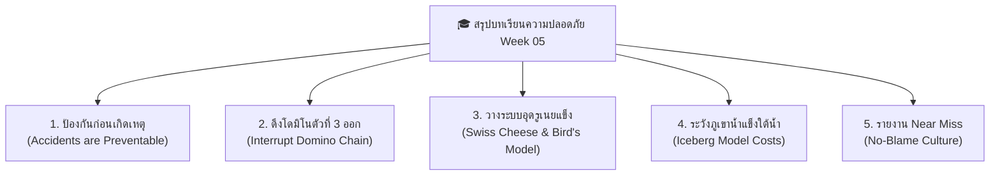

# Week 05: พื้นฐานการป้องกันอุบัติเหตุ (Basics of Accident Prevention)

---

## 📝 สรุปเนื้อหาประจำสัปดาห์ (Week 05 Summary)

> 💡 **บทสรุปภาพรวม (Executive Summary):**  
> สัปดาห์นี้เราได้เรียนรู้ว่า **"อุบัติเหตุไม่ใช่เรื่องของโชคชะตาหรือดวงชะตา"** แต่คือเหตุการณ์ที่มีสาเหตุรากเหง้าซ่อนอยู่เสมอ หากเรารู้วิธีวิเคราะห์ผ่านทฤษฎีโดมิโน โมเดลเนยแข็งสวิส และทฤษฎีภูเขาน้ำแข็ง เราจะสามารถตัดปฏิกิริยาลูกโซ่อุบัติเหตุและอุดรูรั่วเชิงระบบได้อย่างมีประสิทธิภาพ

---

### 🌐 5 ประเด็นสรุปสำคัญ คำคมและสุภาษิตนานาชาติ (Global Safety Proverbs)

---

#### 1️⃣ อุบัติเหตุไม่ได้เกิดจากโชคชะตา แต่ป้องกันได้เสมอ
* 🇬🇧 "An ounce of prevention is worth a pound of cure."
🇹🇭 ("การป้องกันเพียงหนึ่งออนซ์ มีค่ามากกว่าการรักษาพยาบาลถึงหนึ่งปอนด์") — Benjamin Franklin
* เชื่อมโยงเคสเรา: การยอมเสียเงินแค่หลักพันซื้อรองเท้าเซฟตี้หัวเหล็กและรถเข็นยกของตั้งแต่แรก คุ้มค่ากว่าการต้องมาจ่ายค่าหมอ ค่าเย็บแผล และเสียเวลานอนพักฟื้นจนขาดรายได้หลักหมื่นบาทในภายหลังอย่างมหาศาล
---

#### 2️⃣ การดึงโดมิโนตัวที่ 3 ออกเพื่อตัดวงจรอันตราย (Domino Theory)
* 🇯🇵 "転ばぬ先の杖" (Korobanu saki no tsue)
🇹🇭 ("ยื่นไม้เท้าพยุงตัวไว้ล่วงหน้า ก่อนที่จะลื่นไถลหกล้มลงไป")
* เชื่อมโยงเคสเรา: ถึงเราจะชินกับการทำงานเสี่ยงๆ ที่บ้าน (โดมิโนตัวที่ 1) หรือรีบร้อนเพราะกลัวส่งของไม่ทัน (โดมิโนตัวที่ 2) แต่ถ้าเรายื่น "ไม้เท้าป้องกัน" ด้วยการ ดึงโดมิโนตัวที่ 3 ออก คือ เปลี่ยนมาใส่รองเท้าเซฟตี้ ไม่ยกรอบเดียวด้วยมือเปล่า และเผื่อเวลาทำงาน ความเจ็บปวดจากการถูกถังทับ (โดมิโนตัวที่ 4 และ 5) ก็จะไม่เกิดขึ้นเลย

---

#### 3️⃣ อย่าโทษแค่คนทำงาน ให้เน้นอุดรูรั่วเชิงระบบ (Bird & Loftus & Swiss Cheese Model)
* 🇩🇪 "Vorsorge ist besser als Nachsorge."
🇹🇭 ("การคิดวางแผนป้องกันระบบไว้ก่อน ดีกว่าการตามล้างตามเช็ดแก้ปัญหาทีหลัง")
* เชื่อมโยงเคสเรา: เหตุการณ์นี้ไม่ใช่แค่ความผิดของตัวเราหรือพ่อที่ประมาท แต่เกิดจากระบบของบ้านเราที่ ขาดการควบคุม ไม่มีกฎเหล็กเรื่อง PPE ไม่มีรถเข็นช่วยยก และไร้ขั้นตอน SOP ในการย้ายของหนัก พอรูรั่วของเนยแข็งทุกแผ่นตรงกันพอดี (ไม่มีกฎ + ไม่มีรถเข็น + งานรีบ + ใส่รองเท้าแตะ) อันตราย 20 kg เลยทะลุใส่เท้าเต็มๆ การแก้ไขจึงต้องเริ่มจากการวางระบบที่บ้านให้ปลอดภัยตั้งแต่ต้น
---

#### 4️⃣ ตระหนักถึงความสูญเสียที่ซ่อนอยู่ใต้น้ำ (Iceberg Model Costs)
* 🇨🇳 "宜未雨而绸缪，毋临渴而掘井" (Yí wèi yǔ ér chóumóu, wú lín kě ér jué jǐng)
🇹🇭 ("จงซ่อมหลังคาบ้านตั้งแต่แดดออกก่อนฝนจะตก อย่ารอจนกระทั่งคอแห้งหิวน้ำแล้วค่อยเริ่มขุดบ่อน้ำ")
* เชื่อมโยงเคสเรา: ค่าหมอทำแผล 6,000 บาท เป็นแค่ยอดภูเขาน้ำแข็งพ้นน้ำ แต่ความสูญเสียทางอ้อมใต้น้ำที่ซ่อนอยู่จริงสูงถึง 36,000 บาท (คิดเป็น 6 เท่า!) ทั้งงานชะงัก ขาดรายได้เพราะเจ็บเท้าเดินไม่ได้ ส่งของล่าช้าจนลูกค้าบ่น และค่าจ้างคนมาทำงานแทน หากรอให้ถังหล่นใส่เท้าแล้วค่อยคิดป้องกัน ก็เท่ากับต้องจ่ายต้นทุนแฝงสุดแพงไปเรียบร้อยแล้ว

---

#### 5️⃣ สร้างวัฒนธรรมความปลอดภัยและการรายงาน Near Miss
* 🇲🇽 🇪🇸 "Más vale prevenir que lamentar." / 🇹🇭 "เปลี่ยนจาก 'วัวหายแล้วล้อมคอก' เป็น 'ล้อมคอกก่อนวัวจะหาย'"
* เชื่อมโยงเคสเรา: ต่อไปนี้ถ้ามีเหตุการณ์เกือบหลุดมือ หรือเห็นจุดเสี่ยง ต้องกล้าพูดกล้าเตือนกันทันที เช่น "เฮ้ย พ่อ ถังมันหนัก 20 กิโลนะ อย่าเพิ่งยก!" สร้างวัฒนธรรมที่เปิดใจคุยกันได้ เพื่อช่วยกันล้อมคอกป้องกันไว้ก่อน ไม่ต้องรอให้มีเลือดตกยางออกหรือเสียน้ำตาแล้วค่อยมานั่งเสียใจทีหลัง
---

> ⭐️ **ข้อคิดสะกิดใจส่งท้ายบทเรียน (Final Thought):**  
> *"Safety is not a gadget, but a state of mind."*  
> (ความปลอดภัยไม่ใช่แค่อุปกรณ์เซฟตี้ที่สวมใส่ แต่คือสภาวะจิตใจ ความตระหนักรู้ และความใส่ใจดูแลกันในทุกๆ วันทำงาน)
