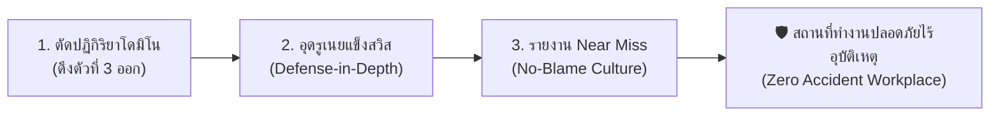

# Week 05: พื้นฐานการป้องกันอุบัติเหตุ (Basics of Accident Prevention)
**วิชา:** OCCUPATIONAL HEALTH AND SAFETY (อาชีวอนามัยและความปลอดภัย)  
**รหัสนักศึกษา:** 69030037  
**ชื่อ-นามสกุล:** ฉัตรพิสุทธิ์ เพียรธานี  

---

## 🛡️ ส่วนที่ 5: การประยุกต์ใช้ในการป้องกันอุบัติเหตุ (Practical Applications in Safety Management)

> 💡 **บทนำ:**  
> ทฤษฎีความปลอดภัยไม่ได้มีไว้แค่สละเวลาท่องจำไปสอบผ่านเท่านั้น แต่คือ **"ยุทธวิธีกู้ชีวิตหน้างานจริง"** ที่นักจัดการความปลอดภัยและวิศวกรต้องนำไปประยุกต์ใช้อย่างมีกลยุทธ์ เพื่อเปลี่ยนหน้างานที่เสี่ยงอันตรายให้กลายเป็น **"พื้นที่ปลอดภัย 100%"** ผ่าน 3 กลยุทธ์หลักดังต่อไปนี้:

---

### 🚀 3 กลยุทธ์ปฏิบัติการหน้างาน

---

#### 1️⃣ กลยุทธ์ที่ 1: การตัดปฏิกิริยาลูกโซ่โดมิโน (Interrupting the Domino Chain)
* **หลักการ:** ไฮน์ริชชี้ว่า โดมิโนตัวที่ 1 (ภูมิหลัง) และ 2 (นิสัย) แก้ไขยากที่สุด **แต่เราสามารถหยุดอุบัติเหตุได้ทันทีโดยการ "ดึงโดมิโนตัวที่ 3 (Unsafe Act / Unsafe Condition) ออกไป!"**
* 🎭 **สถานการณ์ตัวละคร (บราซิล - เหงื่อตกปนตื่นเต้น):**  
  🇧🇷 **โรเบอร์โต** ช่างเจียรเหล็กสุดเก๋า กำลังเร่งงานส่งมอบกะดึก เหงื่อไหลไคลย้อยจนแว่นตาหมอง โรเบอร์โตรำคาญจึงถอดแว่นตานิรภัยออก แล้วเตรียมกดสวิตช์หินเจียรที่ไม่มีการ์ดบัง!  
  💥 **การตัดวงจรหน้างาน:** เจ้าหน้าที่ความปลอดภัย (จป.) วิ่งกระโดดสไลด์เข้ามาหยุดมือโรเบอร์โตได้ทันวินาทีวิกฤต! จากนั้นสั่งติดตั้ง **ฝาครอบบังหินเจียร (Engineering Control - กำจัด Unsafe Condition)** และมอบ **แว่นตานิรภัยแบบมีรูระบายอากาศทูโทน (กำจัด Unsafe Act)** ➔ ผลลัพธ์: แม้โรเบอร์โตจะใจร้อนอยากรีบทำงานเสร็จ แต่อุบัติเหตุเศษเหล็กพุ่งเจาะตาก็ถูกตัดขาดทันที!

---

#### 2️⃣ กลยุทธ์ที่ 2: การสร้างแนวป้องกันหลายชั้นและอุดรูเนยแข็ง (Swiss Cheese Defense-in-Depth & Plugging Flaws)
* **หลักการ:** อย่าหวังพึ่งพาแนวป้องกันเพียงด่านเดียว! ต้องสร้าง **แนวป้องกันหลายชั้น (Defense-in-Depth)** ทั้งนโยบาย ➔ วิศวกรรม ➔ ขั้นตอน SOP ➔ อุปกรณ์ PPE และคอยสุ่มตรวจ **อุดรูรั่วซ่อนเร้น (Latent Conditions)** อยู่เสมอ
* 🎭 **สถานการณ์ตัวละคร (เยอรมนี - เครียดแต่จบสวย):**  
  🇩🇪 **ฮันส์** ขับรถบรรทุกส่งสินค้าข้ามประเทศ อากาศหนาวเหน็บและฝนตกหนัก ฮันส์เกิดอาการง่วงนอนสะลึมสะลือ ตาปรือหน้าพวงมาลัย (*Active Failure - รูรั่วด่านคน*)  
  🛡️ **การอุดรูเนยแข็ง 4 ด่าน:**  
  * *ด่านที่ 1 (นโยบาย):* บริษัทมีกฎเข้มงวดให้หยุดพักทุก 4 ชั่วโมง  
  * *ด่านที่ 2 (วิศวกรรม):* รถบรรทุกติดตั้งระบบเบรกฉุกเฉินอัตโนมัติ (AEB) และระบบเตือนออกนอกเลน  
  * *ด่านที่ 3 (SOP):* กำหนดให้วิ่งชิดซ้ายไม่เกิน 80 กม./ชม. ช่วงฝนตก  
  * *ด่านที่ 4 (PPE):* ฮันส์สวมเข็มขัดนิรภัยแน่นหนา  
  ➔ ผลลัพธ์: แม้รูรั่วที่ด่านตัวฮันส์จะเปิดออก (ง่วง) แต่ด่านวิศวกรรมระบบเตือนเสียงดังขึ้น พร้อมเบรกอัตโนมัติทำงาน ช่วยเซฟชีวิตฮันส์และรถบรรทุกไม่ให้พุ่งตกเหว!

---

#### 3️⃣ กลยุทธ์ที่ 3: การรายงานเกือบเกิดอุบัติเหตุ (Near Miss Reporting) & วัฒนธรรมไม่มุ่งโทษบุคคล (No-Blame Culture)
* **หลักการ:** ตามสามเหลี่ยมไฮน์ริช ทุกๆ 1 อุบัติเหตุรุนแรง มี **Near Miss (เหตุการณ์เกือบเกิดอุบัติเหตุ) ซ่อนอยู่ถึง 300 ครั้ง!** หากองค์กรสร้าง **วัฒนธรรมความปลอดภัยแบบไม่มุ่งโทษบุคคล (No-Blame Culture)** พนักงานจะกล้าแจ้งเหตุ Near Miss นำไปสู่การปรับปรุงแก้ไขก่อนจะกลายเป็นอุบัติเหตุจริง
* 🎭 **สถานการณ์ตัวละคร (ญี่ปุ่น - ลุ้นระทึกแต่ฮา):**  
  🇯🇵 **เคนจิ** ขับฟอร์คลิฟต์ถอยหลังในคลังสินค้า ด้วยความรีบ งาฟอร์คลิฟต์ไปเกี่ยวเฉียดลังสินค้ามูลค่า 1 ล้านเยนตกอย่างน่าเสียวไส้ลงมากระแทกพื้นห่างจากเท้าเคนจิแค่ 5 เซนติเมตร! (*Near Miss - ไม่มีใครบาดเจ็บ สินค้าไม่พัง*)  
  😅 **ถ้าเป็นสังคมเก่า:** เคนจิคงแอบยกลังเก็บเงียบๆ เพราะกลัวโดนประธานบริษัทดุและหักเงินเดือน  
  🏆 **การใช้ No-Blame Culture:** เคนจิเดินเข้าห้องประธานบริษัทแล้วยื่น **"ใบรายงาน Near Miss"** ประธานบริษัทนอกจากจะไม่ดุด่าแล้ว ยังยิ้มกว้างมอบเงินรางวัล **"Safety Hero of the Month"** 5,000 เยนให้เคนจิ! จากนั้นสั่งช่างให้มาขยายทางเดินคลังสินค้า และติดกระจกโค้งมุมอับทันที ➔ ป้องกันไม่ให้ฟอร์คลิฟต์คันอื่นชนสินค้าตกทับคนในอนาคต!

---

## 📝 ตอบคำถาม / แบบทดสอบทบทวน ส่วนที่ 5 (Practical Safety Action Plan)

#### 1️⃣ การกำหนดมาตรการตัดโดมิโนตัวที่ 3 (Domino Interrupt Action):
* **กำจัด Unsafe Act:** ออกกฎบังคับให้พนักงานทุกคนต้องผ่านการอบรมการทำงานบนที่สูง (Working at Height Training) ห้ามยืนเขย่งเท้าบนนั่งร้าน และออกกฎบังคับคล้องสาย Safety Harness ทุกครั้งที่ทำงานสูงเกิน 2 เมตร
* **กำจัด Unsafe Condition:** สั่งยกเลิกใช้นั่งร้านสภาพชำรุด เปลี่ยนมาใช้นั่งร้านที่มีราวกันตก 4 ด้าน (Guardrail) มีแผ่นปูลูกคลื่นกันลื่น และติดตั้งระบบล็อกล้อแบบ Double Lock ที่สมบูรณ์

#### 2️⃣ การออกแบบแนวป้องกัน 4 ชั้นตาม Swiss Cheese Model (Defense-in-Depth Design):
* 🧀 **ด่านที่ 1 (นโยบาย/กฎระเบียบ):** ประกาศใช้นโยบาย *"Zero Unsafe Act บนที่สูง"* และบังคับใช้ระบบใบอนุญาตทำงานบนที่สูง (Work Permit System) ก่อนเริ่มงานทุกครั้ง
* 🧀 **ด่านที่ 2 (ระบบวิศวกรรม/เซฟตี้):** ติดตั้งนั่งร้านมาตรฐานพร้อมราวกันตก (Guardrail) แผ่นกันตกขอบ (Toe Board) และระบบล็อกล้อนิรภัยอัตโนมัติ
* 🧀 **ด่านที่ 3 (ขั้นตอน SOP/ป้ายเตือน):** จัดทำ SOP เช็กลิสต์ตรวจสอบสภาพนั่งร้านก่อนใช้งาน (Pre-use Inspection Checklist) และติดป้ายเตือน *"เขตอันตราย! ต้องสวม ฮาร์เนส"*
* 🧀 **ด่านที่ 4 (อุปกรณ์ PPE):** จัดสรรชุด Full Body Harness พร้อมสายช่วยชีวิต Dual Lanyard Snap Hook และหมวกนิรภัยสายรัดคางให้ช่างทุกคน 100%

#### 3️⃣ การส่งเสริม Near Miss & บทพูดสร้างแรงจูงใจลูกน้อง (Safety Leadership & Motivation Speech):
* **มาตรการ Near Miss:** นำระบบ **"Safety Box & No-Blame Report"** มาใช้ โดยให้พนักงานหย่อนใบรายงานเหตุการณ์เกือบเกิดอุบัติเหตุ (Near Miss) ได้แบบไม่ระบุชื่อ หรือหากใครแจ้งเบาะแสเพื่อการปรับปรุง จะได้รับคูปองรางวัลทานอาหารฟรี เพื่อสร้างวัฒนธรรมความปลอดภัยทางบวก
* 🗣️ **บทพูดสร้างแรงจูงใจ (Safety Motivation Speech ก่อนเริ่มกะ):**  
  *"พี่น้องทุกคนครับ ก่อนเราจะปีนขึ้นไปซ่อมแซมหลอดไฟวันนี้ ขอให้ทุกคนนึกถึงหน้าลูกและภรรยาที่รอเราอยู่ที่บ้านตอนเย็นนะครับ การสวมชุดฮาร์เนสและการล็อกล้อนั่งร้าน เสียเวลาแค่ 2 นาที แต่ช่วยซะชีวิตและอนาคตของครอบครัวเราได้ 100% วันนี้เราจะทำงานด้วยความไม่ประมาท สวม PPE ให้ครบ เพื่อกลับบ้านไปกอดคนที่เรารักอย่างปลอดภัยทุกคนครับ!"*

---

