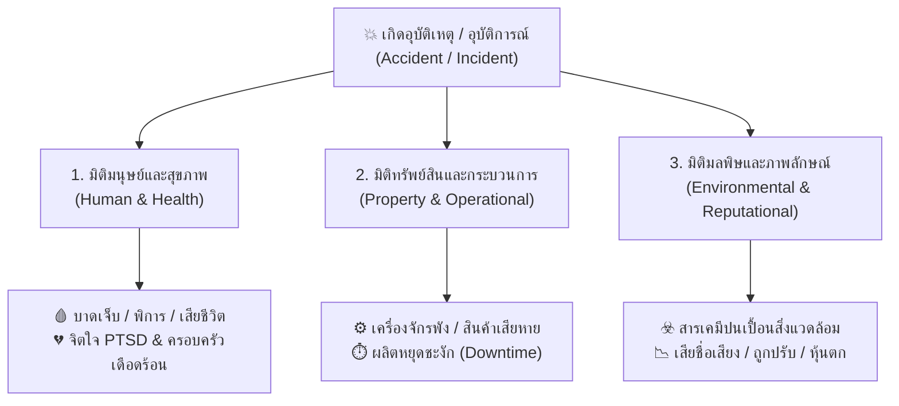

main
# Reflection & Loss Analysis

## ความสูญเสียที่ซ่อนเร้นจากอุบัติเหตุในการทำงานที่เกิดจากเครื่องจักร

จากเหตุการณ์อุบัติเหตุจากการทำงานที่เกิดขึ้นจากเครื่องจักร ข้าพเจ้ามองว่าอุบัติเหตุไม่ได้เกิดขึ้นจากสาเหตุใดสาเหตุหนึ่งเพียงอย่างเดียว แต่เป็นผลจากหลายปัจจัยที่เกิดขึ้นร่วมกัน ทั้งปัจจัยด้านคน เครื่องจักร วิธีการทำงาน และการบริหารจัดการด้านความปลอดภัย เช่น ผู้ปฏิบัติงานอาจขาดความรู้หรือประสบการณ์ในการใช้เครื่องจักร ไม่ปฏิบัติตามขั้นตอนการทำงาน หรือทำงานด้วยความเร่งรีบ ขณะเดียวกันเครื่องจักรอาจไม่ได้รับการตรวจสอบและบำรุงรักษาตามระยะ ทำให้อุปกรณ์บางส่วนชำรุดหรือทำงานผิดปกติ นอกจากนี้ หากไม่มีอุปกรณ์ป้องกันส่วนที่เป็นอันตราย ไม่มีระบบหยุดฉุกเฉิน หรือไม่มีการประเมินความเสี่ยงที่เพียงพอ ก็สามารถเพิ่มโอกาสและความรุนแรงของอุบัติเหตุได้

### 1. ผลกระทบทางจิตใจและสังคมซ่อนเร้น

สิ่งที่เห็นได้ชัดจากอุบัติเหตุคือการบาดเจ็บของผู้ปฏิบัติงาน แต่ความสูญเสียด้านจิตใจเป็นสิ่งที่มองไม่เห็นและอาจเกิดขึ้นเป็นเวลานาน ผู้ประสบเหตุอาจเกิดความกลัว ความเครียด ความวิตกกังวล หรือมีความทรงจำเกี่ยวกับเหตุการณ์ที่เกิดขึ้นซ้ำ ๆ จนไม่กล้ากลับไปทำงานกับเครื่องจักรอีก หากเหตุการณ์มีความรุนแรง ผู้ประสบเหตุอาจเกิดภาวะทางจิตใจ เช่น PTSD หรือภาวะซึมเศร้า ซึ่งส่งผลต่อคุณภาพชีวิตและความสามารถในการทำงาน

นอกจากตัวผู้ประสบเหตุแล้ว เพื่อนร่วมงานที่อยู่ในบริเวณที่เกิดเหตุหรือเห็นเหตุการณ์ก็สามารถได้รับผลกระทบทางจิตใจได้เช่นกัน พนักงานอาจรู้สึกกลัวว่าเหตุการณ์แบบเดียวกันจะเกิดขึ้นกับตนเอง ทำให้ขาดความมั่นใจในการทำงาน และอาจส่งผลต่อประสิทธิภาพในการทำงานในอนาคต บางคนอาจเกิดความเครียดจากการต้องทำงานแทนผู้ที่ได้รับบาดเจ็บหรือได้รับมอบหมายงานเพิ่มขึ้น

ในด้านครอบครัว หากผู้ประสบเหตุเป็นผู้หารายได้หลักของครอบครัวและต้องหยุดงานเป็นเวลานาน ครอบครัวอาจสูญเสียรายได้ในขณะที่ยังมีค่าใช้จ่ายต่าง ๆ เช่น ค่ารักษาพยาบาล ค่าเดินทาง และค่าใช้จ่ายในชีวิตประจำวัน หากผู้ประสบเหตุพิการหรือไม่สามารถกลับมาทำงานได้ตามเดิม ผลกระทบก็อาจเกิดขึ้นในระยะยาวและอาจนำไปสู่ปัญหาหนี้สินหรือปัญหาความสัมพันธ์ภายในครอบครัวได้

### 2. ความสูญเสียทางกระบวนการและโอกาสทางธุรกิจ

เมื่อเกิดอุบัติเหตุจากเครื่องจักร องค์กรไม่ได้สูญเสียเพียงค่าซ่อมเครื่องจักรเท่านั้น แต่ยังสูญเสียเวลาและโอกาสในการดำเนินธุรกิจด้วย หลังเกิดเหตุอาจจำเป็นต้องหยุดเครื่องจักรหรือหยุดสายการผลิตเพื่อช่วยเหลือผู้บาดเจ็บ ตรวจสอบพื้นที่ เก็บหลักฐาน และสอบสวนหาสาเหตุของอุบัติเหตุ การหยุดการผลิตหรือ Downtime แม้เพียงช่วงเวลาสั้น ๆ ก็อาจทำให้บริษัทผลิตสินค้าได้ไม่ตามเป้าหมาย

นอกจากนี้ ยังมีค่าใช้จ่ายทางอ้อมหรือ Hidden Costs ที่อาจไม่ได้ปรากฏให้เห็นทันที เช่น ค่ารักษาพยาบาล ค่าชดเชย ค่าซ่อมแซมหรือเปลี่ยนเครื่องจักร ค่าอะไหล่ ค่าใช้จ่ายในการสอบสวนอุบัติเหตุ และค่าใช้จ่ายในการปรับปรุงระบบความปลอดภัย หลังจากนั้นบริษัทอาจต้องส่งพนักงานไปอบรมเพิ่มเติม หรือรับสมัครและฝึกอบรมพนักงานใหม่เพื่อทดแทนผู้ที่ไม่สามารถกลับมาทำงานได้

ในกรณีที่งานเกิดความล่าช้า บริษัทอาจต้องให้พนักงานคนอื่นทำงานล่วงเวลา หรือ OT เพื่อเร่งผลิตสินค้าให้ทันกำหนด ทำให้ต้นทุนแรงงานเพิ่มขึ้นและพนักงานเกิดความเหนื่อยล้า ซึ่งความเหนื่อยล้าเองก็อาจเพิ่มความเสี่ยงต่อการเกิดอุบัติเหตุครั้งใหม่ได้

อุบัติเหตุยังสามารถส่งผลต่อโอกาสทางธุรกิจ เช่น หากบริษัทไม่สามารถส่งสินค้าให้ลูกค้าได้ตามกำหนด ลูกค้าอาจไม่พอใจ ลดจำนวนคำสั่งซื้อ หรือยกเลิกสัญญาในอนาคต หากเกิดอุบัติเหตุหลายครั้ง บริษัทอาจมีต้นทุนด้านประกันภัยสูงขึ้น และอาจต้องลงทุนด้านความปลอดภัยเพิ่มเติมเป็นจำนวนมาก ดังนั้น ความสูญเสียทางธุรกิจจึงไม่ได้จำกัดอยู่ที่ค่าใช้จ่ายที่เกิดขึ้นทันที แต่รวมถึงรายได้และโอกาสทางธุรกิจที่บริษัทอาจสูญเสียไปในอนาคตด้วย

### 3. ความสูญเสียต่อชุมชนและสิ่งแวดล้อม

อุบัติเหตุจากเครื่องจักรบางประเภทอาจทำให้เกิดการรั่วไหลของน้ำมัน สารเคมี เชื้อเพลิง ฝุ่น ควัน หรือก๊าซ หากไม่มีระบบควบคุมที่เหมาะสม สิ่งเหล่านี้สามารถแพร่กระจายออกนอกพื้นที่โรงงานและส่งผลกระทบต่อชุมชนโดยรอบได้ เช่น ทำให้คุณภาพอากาศ น้ำ หรือดินเสื่อมโทรม และอาจส่งผลกระทบต่อสุขภาพของประชาชนในพื้นที่

ความสูญเสียด้านสิ่งแวดล้อมบางอย่างอาจไม่ได้เห็นทันทีหลังเกิดเหตุ แต่สามารถสะสมและส่งผลในระยะยาว เช่น สารเคมีที่ตกค้างในดินหรือแหล่งน้ำอาจส่งผลต่อสิ่งมีชีวิต ระบบนิเวศ และสุขภาพของประชาชน หากเกิดการปนเปื้อนรุนแรง บริษัทอาจต้องเสียค่าใช้จ่ายจำนวนมากในการทำความสะอาดและฟื้นฟูพื้นที่ รวมถึงอาจต้องรับผิดชอบต่อความเสียหายที่เกิดขึ้น

นอกจากนี้ ชุมชนโดยรอบอาจเกิดความกังวลและไม่ไว้วางใจโรงงานหรือองค์กร หากประชาชนรู้สึกว่าบริษัทไม่สามารถควบคุมความเสี่ยงและดูแลความปลอดภัยได้อย่างเหมาะสม อาจเกิดการร้องเรียน การคัดค้าน หรือการเรียกร้องให้หน่วยงานที่เกี่ยวข้องเข้ามาตรวจสอบ

### 4. ความสูญเสียด้านชื่อเสียงและภาพลักษณ์ขององค์กร

อุบัติเหตุที่เกิดขึ้นจากเครื่องจักรสามารถส่งผลต่อภาพลักษณ์ขององค์กรได้ โดยเฉพาะเมื่ออุบัติเหตุมีความรุนแรงหรือเกิดซ้ำหลายครั้ง หากข่าวแพร่กระจายออกไป ลูกค้า คู่ค้า นักลงทุน และประชาชนอาจมองว่าองค์กรไม่มีระบบบริหารจัดการความปลอดภัยที่ดี

เมื่อความเชื่อมั่นลดลง องค์กรอาจสูญเสียลูกค้าและคู่ค้า รวมถึงอาจมีปัญหาในการสร้างความสัมพันธ์กับชุมชน หากบริษัทมีชื่อเสียงด้านความปลอดภัยไม่ดี ก็อาจทำให้การรับสมัครพนักงานที่มีความสามารถทำได้ยากขึ้น เพราะคนทำงานอาจไม่ต้องการเข้าทำงานในสถานที่ที่มีความเสี่ยงสูง

ในบางกรณี หากองค์กรฝ่าฝืนกฎหมายหรือมีการละเลยมาตรการความปลอดภัย อาจต้องรับโทษตามกฎหมาย เสียค่าปรับ หรือถูกสั่งให้ปรับปรุงกระบวนการทำงาน ซึ่งล้วนเป็นความสูญเสียที่เกิดขึ้นตามมาหลังอุบัติเหตุ

### 5. การวิเคราะห์สาเหตุของอุบัติเหตุ

จากการวิเคราะห์ ข้าพเจ้าคิดว่าสาเหตุของอุบัติเหตุจากเครื่องจักรควรมองเป็นลำดับ ไม่ควรโทษผู้ปฏิบัติงานเพียงคนเดียว เพราะอุบัติเหตุอาจเกิดจากความบกพร่องหลายระดับ เช่น สภาพเครื่องจักรที่ไม่ปลอดภัย วิธีการทำงานที่ไม่เหมาะสม การขาดการอบรม การกำกับดูแลที่ไม่เพียงพอ และการบริหารจัดการด้านความปลอดภัยที่ยังมีช่องโหว่

ตัวอย่างเช่น หากเครื่องจักรมีชิ้นส่วนที่สามารถเคลื่อนที่และหนีบหรือดึงร่างกายของผู้ปฏิบัติงานได้ แต่ไม่มี Guard ป้องกัน และไม่มีระบบ Lockout/Tagout ที่เหมาะสม เมื่อผู้ปฏิบัติงานเข้าไปซ่อมหรือแก้ไขเครื่องจักร ก็อาจเกิดอุบัติเหตุได้ แม้ว่าผู้ปฏิบัติงานจะเป็นผู้ที่อยู่ในจุดเกิดเหตุ แต่ต้นเหตุที่แท้จริงอาจเกี่ยวข้องกับระบบความปลอดภัยขององค์กรด้วย

ดังนั้น การสอบสวนอุบัติเหตุควรมุ่งค้นหา “สาเหตุที่แท้จริง” และ “สาเหตุพื้นฐาน” ไม่ใช่เพียงระบุว่าใครเป็นผู้ผิด เพราะหากแก้ไขเฉพาะพฤติกรรมของคน แต่ไม่แก้ไขสภาพเครื่องจักรหรือระบบการจัดการ อุบัติเหตุลักษณะเดิมก็สามารถเกิดขึ้นซ้ำได้อีก

### 6. แนวทางการป้องกันอุบัติเหตุ

จากเหตุการณ์ดังกล่าว ข้าพเจ้าเห็นว่าการป้องกันควรเริ่มตั้งแต่การประเมินความเสี่ยงของเครื่องจักรก่อนนำมาใช้งาน รวมถึงต้องมีการตรวจสอบและบำรุงรักษาอย่างสม่ำเสมอ หากพบว่าเครื่องจักรหรืออุปกรณ์มีความผิดปกติควรหยุดใช้งานและแก้ไขทันที

ควรติดตั้งอุปกรณ์ป้องกันบริเวณส่วนที่มีอันตราย เช่น Guard และระบบหยุดฉุกเฉิน รวมถึงจัดให้มีขั้นตอน Lockout/Tagout สำหรับการซ่อมบำรุง เพื่อป้องกันไม่ให้เครื่องจักรเริ่มทำงานโดยไม่ได้ตั้งใจ นอกจากนี้ ผู้ปฏิบัติงานต้องได้รับการอบรมเกี่ยวกับวิธีใช้งานเครื่องจักรที่ถูกต้องและเข้าใจอันตรายที่อาจเกิดขึ้น

องค์กรควรมีการตรวจสอบพื้นที่และพฤติกรรมการทำงานอย่างสม่ำเสมอ รวมถึงเปิดโอกาสให้พนักงานรายงานสภาพที่ไม่ปลอดภัยหรือเหตุการณ์เกือบเกิดอุบัติเหตุ (Near Miss) โดยไม่ต้องกลัวว่าจะถูกลงโทษ เพราะข้อมูลเหล่านี้สามารถนำมาใช้ค้นหาและแก้ไขความเสี่ยงก่อนที่จะเกิดอุบัติเหตุจริง

### สรุปความคิดเห็น

จากการวิเคราะห์เหตุการณ์นี้ ข้าพเจ้าได้เห็นว่าความสูญเสียจากอุบัติเหตุมีขอบเขตกว้างกว่าที่เห็น ณ จุดเกิดเหตุอย่างมาก การบาดเจ็บของผู้ปฏิบัติงานและเครื่องจักรที่เสียหายเป็นเพียงความสูญเสียส่วนหนึ่งเท่านั้น แต่ยังมีผลกระทบด้านจิตใจ ครอบครัว รายได้ กระบวนการผลิต ค่าใช้จ่าย โอกาสทางธุรกิจ สิ่งแวดล้อม ชุมชน และชื่อเสียงขององค์กรตามมา

สิ่งที่สำคัญที่สุดคือ อุบัติเหตุหนึ่งครั้งอาจสร้างผลกระทบต่อคนจำนวนมาก แม้คนเหล่านั้นจะไม่ได้อยู่ในจุดเกิดเหตุโดยตรง ดังนั้น การบริหารความปลอดภัยจึงไม่ควรรอให้เกิดอุบัติเหตุก่อนแล้วจึงแก้ไข แต่ควรค้นหาอันตราย ประเมินความเสี่ยง และควบคุมความเสี่ยงตั้งแต่ก่อนเกิดเหตุ

ข้าพเจ้าจึงเห็นว่าการป้องกันอุบัติเหตุจากเครื่องจักรต้องอาศัยความร่วมมือของทั้งผู้บริหาร หัวหน้างาน และผู้ปฏิบัติงาน โดยต้องให้ความสำคัญกับการบำรุงรักษาเครื่องจักร การอบรม การใช้อุปกรณ์ป้องกัน การปฏิบัติตามขั้นตอน และการตรวจสอบความปลอดภัยอย่างต่อเนื่อง หากองค์กรสามารถป้องกันอุบัติเหตุได้ตั้งแต่ต้น ก็จะช่วยลดทั้งการสูญเสียชีวิตและสุขภาพของคน ลดความเสียหายของทรัพย์สิน ลดต้นทุนทางธุรกิจ และสร้างความมั่นคงและความยั่งยืนให้กับองค์กรในระยะยาว
=======
---
course_code: "03376117"
course_name: OCCUPATIONAL HEALTH AND SAFETY (อาชีวอนามัยและความปลอดภัย)
semester: Week 05
topic: พื้นฐานการป้องกันอุบัติเหตุ (Basics of Accident Prevention)
tags:
  - OHS
  - Accident_Prevention
  - Domino_Theory
  - Loss_Types
  - Swiss_Cheese_Model
  - Safety_Management
---

# Week 05: พื้นฐานการป้องกันอุบัติเหตุ (Basics of Accident Prevention)

---

## 📊 ส่วนที่ 3: ประเภทความสูญเสีย (Types of Losses in OHS)

> 💡 **บทนำ**  
> เมื่อเกิดอุบัติเหตุขึ้นในสถานที่ทำงาน คนทั่วไปมักมองเห็นเฉพาะ **"การบาดเจ็บของคน"** แต่ในทางอาชีวอนามัยและความปลอดภัย ความสูญเสียเปรียบเสมือน **"ระเบิดวงกว้าง"** ที่ไม่ได้กระทบแค่ร่างกายของผู้ประสบเหตุเท่านั้น แต่แผ่ขยายผลกระทบออกไปเป็น **3 มิติหลัก (3 Loss Dimensions)** ดังนี้:

---

### 🌐 ตาราง 3 มิติความสูญเสีย ถ่ายทอดผ่านกรณีศึกษาตัวละครทั่วโลก

| มิติความสูญเสีย (Loss Dimension)                                    | ขอบเขตผลกระทบ (Impact Scope)                                                                                                                                                                | ตัวอย่างเหตุการณ์และผลกระทบจริงจากตัวละครทั่วโลก (Global Character Examples)                                                                                                                                                                   |
| :------------------------------------------------------------------ | :------------------------------------------------------------------------------------------------------------------------------------------------------------------------------------------ | :--------------------------------------------------------------------------------------------------------------------------------------------------------------------------------------------------------------------------------------------- |
| **1. มิติการบาดเจ็บและสุขภาพ (Human & Health Loss)**             | • การบาดเจ็บเฉียบพลัน     (เจ็บเล็กน้อย/พิการ/เสียชีวิต) • โรคจากการทำงานสะสมเรื้อรัง • ผลกระทบทางจิตใจ     (PTSD/ภาวะซึมเศร้า) • ความเดือดร้อนของครอบครัวผู้ประสบเหตุ       | 🇲🇽 **คาร์ลอส (Carlos - เม็กซิโก):** ตกจากหลังคาสูง 6 เมตร กระดูกสันหลังและกระดูกเชิงกรานแตกหัก สูญเสียความสามารถในการเดิน (อัมพาตครึ่งท่อนถาวร) ไม่สามารถทำงานหาเลี้ยงลูกเมียได้ เกิดภาวะโศกเศร้าซึมเศร้ารุนแรงทั้งครอบครัว                  |
| **2. มิติทรัพย์สินและกระบวนการ (Property & Operational Loss)**   | • เครื่องจักร เครื่องมือ และอุปกรณ์ชำรุดเสียหาย • วัตถุดิบและชิ้นงานเสียหายถอนคืนไม่ได้ • สายการผลิตหยุดชะงัก    (Downtime) • ค่าใช้จ่ายซ่อมแซมและจัดหาเครื่องมือทดแทน          | 🇯🇵 **เคนจิ (Kenji - ญี่ปุ่น):** ขับฟอร์คลิฟต์ชนเสาอาคาร ทำให้อุปกรณ์งายกหัก ชิ้นส่วนเซมิคอนดักเตอร์มูลค่า 500,000 บาทตกกระจายเสียหายทั้งหมด สายประกอบรถยนต์ต้องหยุดผลิต (Downtime) 12 ชั่วโมง คิดเป็นมูลค่าสูญเสียโอกาสการผลิตกว่า 3 ล้านบาท |
| **3. มิติมลพิษและภาพลักษณ์ (Environmental & Reputational Loss)** | • สารเคมี/ก๊าซพิษรั่วไหลปนเปื้อน ดิน น้ำ อากาศ • ค่าปรับและโทษอาญาจากการฝ่าฝืนกฎหมาย • เสียชื่อเสียง แบรนด์ถูกแบน ลูกค้าcancelสัญญา • ราคาหุ้นตก และถูกเพิกถอนใบอนุญาตประกอบกิจการ | 🇨🇳 **หลี่เหว่ย (Li Wei - จีน):** คลังเคมีระเบิดทำให้สารตัวทำละลายไวไฟรั่วไหลลงสู่แม่น้ำสายหลัก ชุมชน 50,000 ครัวเรือนขาดน้ำประปา ปลานับแสนตัวตาย โรงงานถูกศาลสั่งปรับ 10 ล้านหยวน ถูกเพิกถอนใบอนุญาต และหุ้นบริษัทตก 40%                     |

---

### 🎨 สรุปแผนผังเชื่อมโยง 3 มิติความสูญเสีย (Mermaid Diagram)

---

> 💡 **บทสรุปสำคัญ:**  
> การป้องกันอุบัติเหตุจึงไม่ได้มีไว้เพื่อ *"ทำตามกฎหมายบังคับ"* เท่านั้น แต่คือการ **ปกป้องชีวิตมนุษย์ (Human Capital)** **คุ้มครองทรัพย์สินองค์กร (Asset Protection)** และ **รักษาความยั่งยืนของสิ่งแวดล้อมและชื่อเสียงธุรกิจ (Business Sustainability)** ในระยะยาว

## 📝 คำถาม / แบบทดสอบทบทวน ส่วนที่ 3

> 📌 **โจทย์และคำสั่งสำหรับนักศึกษา:**  
> จากเหตุการณ์จริงที่นักศึกษาได้เลือกวิเคราะห์ไว้ใน **ส่วนที่ 2 (แบบทดสอบทบทวน ส่วนที่ 2)** ให้นักศึกษาเขียน **เล่าเรื่องหรือสะท้อนความคิดเห็น (Reflection & Loss Analysis)** โดยตอบคำถามว่า:  
> **"นอกจากบาดแผล ร่างกายของผู้เจ็บป่วย หรือความเสียหายที่เห็นเด่นชัดด้วยตาเปล่า ณ หน้างาน (เช่น ไฟไหม้ เครื่องจักรพัง หรือการระเบิด) นักศึกษามองเห็น 'ความสูญเสียที่ซ่อนเร้น (Hidden Losses)' หรือผลกระทบอื่นๆ ในมิติใดอีกบ้างที่ตามมาหลังจากเหตุการณ์นั้นจบลง?"**

---

### 📋 แนวทางการเขียนตอบและประเด็นสะท้อนความคิดเห็น (Reflection Guidelines):

ให้นักศึกษาเขียนบรรยายความยาวประมาณ 10-15 บรรทัด โดยเจาะลึกความสูญเสียที่มากกว่าตาเห็น ในประเด็นดังต่อไปนี้:

1. 💔 **ผลกระทบทางจิตใจและสังคมซ่อนเร้น (Hidden Psychological & Social Losses):**
   * บาดแผลทางจิตใจ (PTSD, ภาวะซึมเศร้า, ฝันร้าย) ของผู้ประสบเหตุ เพื่อนร่วมงานที่เห็นเหตุการณ์ หรือครอบครัว
   * ภาระหนี้สิน ความเดือดร้อนของลูกเมีย/พ่อแม่ เมื่อหัวหน้าครอบครัวต้องสูญเสียรายได้หรือพิการ
2. ⏱️ **ความสูญเสียทางกระบวนการและโอกาสทางธุรกิจ (Hidden Operational & Opportunity Losses):**
   * เวลาที่ต้องสูญเสียไปกับการสอบสวนสวนคดี/การหยุดสายการผลิต (Downtime)
   * ค่าใช้จ่ายแฝง เช่น ค่าทำงานล่วงเวลา (OT) ของพนักงานคนอื่นเพื่อเร่งงานทดแทน, ค่าฝึกอบรมคนใหม่, เบี้ยประกันภัยที่ปรับตัวสูงขึ้น
   * การถูกยกเลิกสัญญาจ้างจากลูกค้า หรือการเสียโอกาสในการแข่งขันทางธุรกิจ
3. ☣️ **ความสูญเสียต่อชุมชน สิ่งแวดล้อม และภาพลักษณ์ (Hidden Environmental & Reputational Losses):**
   * มลพิษตกค้างในระยะยาวต่อสุขภาพของคนในชุมชนรอบข้าง (ฝุ่น พิษ ก๊าซ คราบสารเคมี)
   * ความบอบช้ำต่อชื่อเสียงขององค์กร ความเชื่อมั่นของสังคมและหุ้นส่วนที่ลดลง

 main
