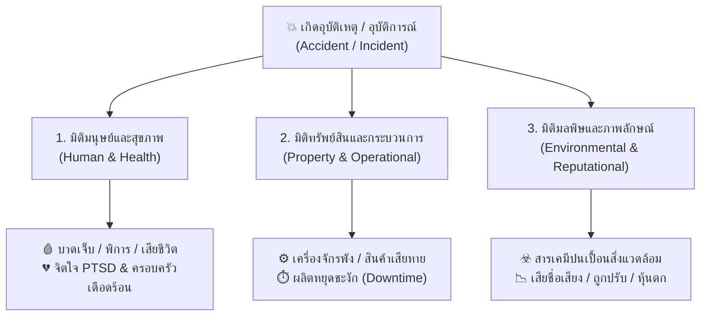

# Week 05: พื้นฐานการป้องกันอุบัติเหตุ (Basics of Accident Prevention)

---

## 📊 ส่วนที่ 3: ประเภทความสูญเสีย (Types of Losses in OHS)

> 💡 **บทนำ**  
> เมื่อเกิดอุบัติเหตุขึ้นในสถานที่ทำงาน คนทั่วไปมักมองเห็นเฉพาะ **"การบาดเจ็บของคน"** แต่ในทางอาชีวอนามัยและความปลอดภัย ความสูญเสียเปรียบเสมือน **"ระเบิดวงกว้าง"** ที่ไม่ได้กระทบแค่ร่างกายของผู้ประสบเหตุเท่านั้น แต่แผ่ขยายผลกระทบออกไปเป็น **3 มิติหลัก (3 Loss Dimensions)** ดังนี้:

---

### 🌐 ตาราง 3 มิติความสูญเสีย ถ่ายทอดผ่านกรณีศึกษาตัวละครทั่วโลก

| มิติความสูญเสีย (Loss Dimension)                                    | ขอบเขตผลกระทบ (Impact Scope)                                                                                                                                                                | ตัวอย่างเหตุการณ์และผลกระทบจริงจากตัวละครทั่วโลก (Global Character Examples)                                                                                                                                                                   |
| :------------------------------------------------------------------ | :------------------------------------------------------------------------------------------------------------------------------------------------------------------------------------------ | :--------------------------------------------------------------------------------------------------------------------------------------------------------------------------------------------------------------------------------------------- |
| **1. มิติการบาดเจ็บและสุขภาพ (Human & Health Loss)**             | • การบาดเจ็บเฉียบพลัน     (เจ็บเล็กน้อย/พิการ/เสียชีวิต) • โรคจากการทำงานสะสมเรื้อรัง • ผลกระทบทางจิตใจ     (PTSD/ภาวะซึมเศร้า) • ความเดือดร้อนของครอบครัวผู้ประสบเหตุ       | 🇲🇽 **คาร์ลอส (Carlos - เม็กซิโก):** ตกจากหลังคาสูง 6 เมตร กระดูกสันหลังและกระดูกเชิงกรานแตกหัก สูญเสียความสามารถในการเดิน (อัมพาตครึ่งท่อนถาวร) ไม่สามารถทำงานหาเลี้ยงลูกเมียได้ เกิดภาวะโศกเศร้าซึมเศร้ารุนแรงทั้งครอบครัว                  |
| **2. มิติทรัพย์สินและกระบวนการ (Property & Operational Loss)**   | • เครื่องจักร เครื่องมือ และอุปกรณ์ชำรุดเสียหาย • วัตถุดิบและชิ้นงานเสียหายถอนคืนไม่ได้ • สายการผลิตหยุดชะงัก    (Downtime) • ค่าใช้จ่ายซ่อมแซมและจัดหาเครื่องมือทดแทน          | 🇯🇵 **เคนจิ (Kenji - ญี่ปุ่น):** ขับฟอร์คลิฟต์ชนเสาอาคาร ทำให้อุปกรณ์งายกหัก ชิ้นส่วนเซมิคอนดักเตอร์มูลค่า 500,000 บาทตกกระจายเสียหายทั้งหมด สายประกอบรถยนต์ต้องหยุดผลิต (Downtime) 12 ชั่วโมง คิดเป็นมูลค่าสูญเสียโอกาสการผลิตกว่า 3 ล้านบาท |
| **3. มิติมลพิษและภาพลักษณ์ (Environmental & Reputational Loss)** | • สารเคมี/ก๊าซพิษรั่วไหลปนเปื้อน ดิน น้ำ อากาศ • ค่าปรับและโทษอาญาจากการฝ่าฝืนกฎหมาย • เสียชื่อเสียง แบรนด์ถูกแบน ลูกค้าcancelสัญญา • ราคาหุ้นตก และถูกเพิกถอนใบอนุญาตประกอบกิจการ | 🇨🇳 **หลี่เหว่ย (Li Wei - จีน):** คลังเคมีระเบิดทำให้สารตัวทำละลายไวไฟรั่วไหลลงสู่แม่น้ำสายหลัก ชุมชน 50,000 ครัวเรือนขาดน้ำประปา ปลานับแสนตัวตาย โรงงานถูกศาลสั่งปรับ 10 ล้านหยวน ถูกเพิกถอนใบอนุญาต และหุ้นบริษัทตก 40%                     |

---

### 🎨 สรุปแผนผังเชื่อมโยง 3 มิติความสูญเสีย (Mermaid Diagram)

```mermaid
flowchart TD
    A["💥 เกิดอุบัติเหตุ / อุบัติการณ์<br>(Accident / Incident)"] --> B["1. มิติมนุษย์และสุขภาพ<br>(Human & Health)"]
    A --> C["2. มิติทรัพย์สินและกระบวนการ<br>(Property & Operational)"]
    A --> D["3. มิติมลพิษและภาพลักษณ์<br>(Environmental & Reputational)"]

    B --> B1["🩸 บาดเจ็บ / พิการ / เสียชีวิต<br>💔 จิตใจ PTSD & ครอบครัวเดือดร้อน"]
    C --> C1["⚙️ เครื่องจักรพัง / สินค้าเสียหาย<br>⏱️ ผลิตหยุดชะงัก (Downtime)"]
    D --> D1["☣️ สารเคมีปนเปื้อนสิ่งแวดล้อม<br>📉 เสียชื่อเสียง / ถูกปรับ / หุ้นตก"]
```

---

> 💡 **บทสรุปสำคัญ:**  
> การป้องกันอุบัติเหตุจึงไม่ได้มีไว้เพื่อ *"ทำตามกฎหมายบังคับ"* เท่านั้น แต่คือการ **ปกป้องชีวิตมนุษย์ (Human Capital)** **คุ้มครองทรัพย์สินองค์กร (Asset Protection)** และ **รักษาความยั่งยืนของสิ่งแวดล้อมและชื่อเสียงธุรกิจ (Business Sustainability)** ในระยะยาว

## 📝 คำถาม / แบบทดสอบทบทวน ส่วนที่ 3

> 📌 **โจทย์และคำสั่งสำหรับนักศึกษา:**  
> จากเหตุการณ์จริงที่นักศึกษาได้เลือกวิเคราะห์ไว้ใน **ส่วนที่ 2 (แบบทดสอบทบทวน ส่วนที่ 2)** ให้นักศึกษาเขียน **เล่าเรื่องหรือสะท้อนความคิดเห็น (Reflection & Loss Analysis)** โดยตอบคำถามว่า:  
> **"นอกจากบาดแผล ร่างกายของผู้เจ็บป่วย หรือความเสียหายที่เห็นเด่นชัดด้วยตาเปล่า ณ หน้างาน (เช่น ไฟไหม้ เครื่องจักรพัง หรือการระเบิด) นักศึกษามองเห็น 'ความสูญเสียที่ซ่อนเร้น (Hidden Losses)' หรือผลกระทบอื่นๆ ในมิติใดอีกบ้างที่ตามมาหลังจากเหตุการณ์นั้นจบลง?"**

---

### 📋 แนวทางการเขียนตอบและประเด็นสะท้อนความคิดเห็น (Reflection Guidelines):

ให้นักศึกษาเขียนบรรยายความยาวประมาณ 10-15 บรรทัด โดยเจาะลึกความสูญเสียที่มากกว่าตาเห็น ในประเด็นดังต่อไปนี้:

1. 💔 **ผลกระทบทางจิตใจและสังคมซ่อนเร้น (Hidden Psychological & Social Losses):**
   * บาดแผลทางจิตใจ (PTSD, ภาวะซึมเศร้า, ฝันร้าย) ของผู้ประสบเหตุ เพื่อนร่วมงานที่เห็นเหตุการณ์ หรือครอบครัว
   * ภาระหนี้สิน ความเดือดร้อนของลูกเมีย/พ่อแม่ เมื่อหัวหน้าครอบครัวต้องสูญเสียรายได้หรือพิการ
2. ⏱️ **ความสูญเสียทางกระบวนการและโอกาสทางธุรกิจ (Hidden Operational & Opportunity Losses):**
   * เวลาที่ต้องสูญเสียไปกับการสอบสวนสวนคดี/การหยุดสายการผลิต (Downtime)
   * ค่าใช้จ่ายแฝง เช่น ค่าทำงานล่วงเวลา (OT) ของพนักงานคนอื่นเพื่อเร่งงานทดแทน, ค่าฝึกอบรมคนใหม่, เบี้ยประกันภัยที่ปรับตัวสูงขึ้น
   * การถูกยกเลิกสัญญาจ้างจากลูกค้า หรือการเสียโอกาสในการแข่งขันทางธุรกิจ
3. ☣️ **ความสูญเสียต่อชุมชน สิ่งแวดล้อม และภาพลักษณ์ (Hidden Environmental & Reputational Losses):**
   * มลพิษตกค้างในระยะยาวต่อสุขภาพของคนในชุมชนรอบข้าง (ฝุ่น พิษ ก๊าซ คราบสารเคมี)
   * ความบอบช้ำต่อชื่อเสียงขององค์กร ความเชื่อมั่นของสังคมและหุ้นส่วนที่ลดลง

ความสูญเสียจากอุบัติเหตุเปรียบเสมือน "แรงสั่นสะเทือนจากแผ่นดินไหว" ที่นอกจากจะทำลายจุดศูนย์กลางแผ่นดินไหว ณ หน้างานทันทีแล้ว ยังสร้างคลื่นความเสียหายซ่อนเร้นกระจายออกไปใน 3 มิติหลัก ดังการวิเคราะห์ถอดบทเรียนสะท้อนความคิดเห็นจากเหตุการณ์จริง (กรณีศึกษา กิตติ พนักงานคลังสินค้าถูกกล่องอะไหล่ตกใส่ศีรษะ) ดังนี้

📝 แบบบันทึกการสะท้อนความคิดเห็นและการวิเคราะห์ความสูญเสียซ่อนเร้น (Loss Analysis & Reflection)
จากเหตุการณ์ที่กิตติถูกกล่องอะไหล่หนัก 25 กิโลกรัมตกใส่ศีรษะจนเกิดบาดแผลฉกรรจ์ เย็บ 6 เข็ม ณ หน้างาน แม้ในภาพแรกจะมองเห็นเพียง "บาดแผลทางร่างกายและค่ารักษาพยาบาลเย็บแผล" แต่เมื่อเจาะลึกหลังจากเหตุการณ์สิ้นสุดลง พบความสูญเสียซ่อนเร้น (Hidden Losses) ที่แผ่ขยายออกไป 3 มิติ ดังนี้:

1. 💔 มิติการบาดเจ็บ สุขภาพ และสังคม (Human, Health & Social Dimension)
บาดแผลทางจิตใจและความหวาดกลัว (Psychological Impact): กิตติต้องเผชิญกับภาวะหวาดผวา (PTSD) ทุกครั้งที่ต้องเฉียดเข้าใกล้ชั้นวางสินค้าสูง เกิดความระแวง ฝันร้าย และความวิตกกังวลสะสม ซึ่งส่งผลต่อสมาธิในการทำงานในระยะยาว

ภาระครอบครัวและคุณภาพชีวิต: ในช่วงหยุดงานรักษาตัว 5 วัน แม้จะเป็นระยะเวลาสั้นๆ แต่กิตติขาดรายได้จากเบี้ยขยันและค่าทำงานล่วงเวลา (OT) ส่งผลกระทบต่อสภาพคล่องในครอบครัวที่ต้องดูแล ค่าใช้จ่ายในบ้านสะดุด และสร้างความตื่นตกใจ ห่วงใยอย่างหนักให้กับสมาชิกในครอบครัว

2. ⏱️ มิติทรัพย์สิน กระบวนการ และโอกาสทางธุรกิจ (Property & Operational Dimension)
ความสูญเสียเวลาและกระบวนการผลิต (Downtime & Investigation Losses): งานจัดส่งอะไหล่ชะงักทันทีในวันที่เกิดเหตุ หัวหน้างานและเจ้าหน้าที่ จป. ต้องเสียเวลาทำงานปกติรวมกว่า 10-15 ชั่วโมงในการปฐมพยาบาล นำส่งโรงพยาบาล กั้นพื้นที่เกิดเหตุ และจัดทำรายงานสอบสวนอุบัติเหตุ (Accident Investigation)

ต้นทุนแฝงในการทำงานทดแทน: คลังสินค้าต้องจ่ายค่า OT ให้พนักงานคนอื่นเพื่อมายกของทดแทนงานของกิตติที่ค้างอยู่ อีกทั้งสินค้าอะไหล่ในกล่องที่ตกร่วงเกิดรอยถลอกชำรุด ทำให้เสียมูลค่าสินค้าและเสียโอกาสในการส่งมอบงานแก่ลูกค้าให้ตรงตาม schedule

3. ☣️ มิติมลพิษ สิ่งแวดล้อม และภาพลักษณ์องค์กร (Environmental & Reputational Dimension)
ขวัญกำลังใจและวัฒนธรรมองค์กรบอบช้ำ (Morale & Reputational Loss): เพื่อนร่วมงานในคลังสินค้าเกิดความรู้สึกไม่มั่นคงในความปลอดภัย (Low Morale) บรรยากาศการทำงานเต็มไปด้วยความตึงเครียดและตั้งคำถามต่อความใส่ใจของฝ่ายบริหาร

ภาพลักษณ์และความน่าเชื่อถือ: หากเรื่องราวความล้มเหลวในการควบคุมความปลอดภัยและการละเลย PPE หลุดออกไปสู่ภายนอก หรือถูกหน่วยงานราชการ (กสร.) เข้าตรวจประเมิน องค์กรจะเสียความน่าเชื่อถือ เสี่ยงต่อการถูกปรับตามกฎหมายความปลอดภัย และส่งผลต่อการประเมินมาตรฐาน ISO/OHSAS ของโรงงาน
