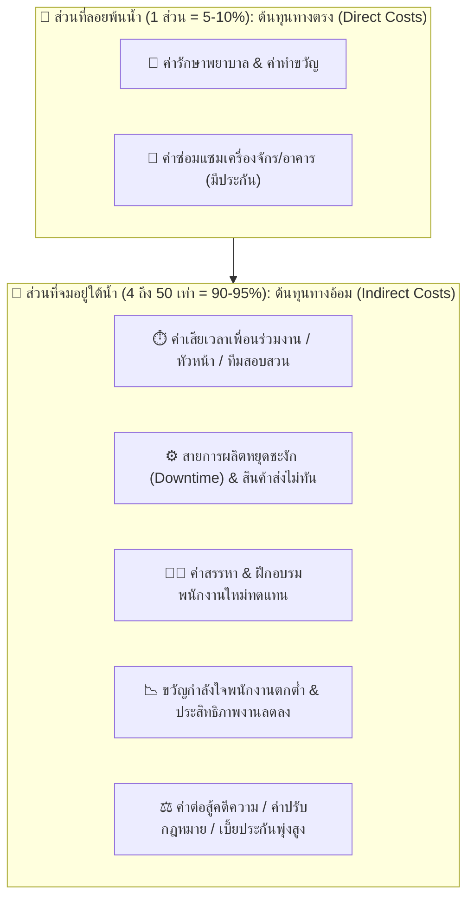

# Week 05: พื้นฐานการป้องกันอุบัติเหตุ (Basics of Accident Prevention)

---

## 🧊 ส่วนที่ 4: โครงสร้างต้นทุนความสูญเสีย (Cost of Accidents: Iceberg Model)

> 💡 **บทนำ**  
> เมื่อเกิดอุบัติเหตุขึ้น ผู้บริหารหลายคนมักมองเห็นเฉพาะ **"ยอดภูเขาน้ำแข็งที่ลอยพ้นน้ำ"** นั่นคือ **ต้นทุนทางตรง (Direct Costs)** เช่น ค่ารักษาพยาบาลหรือค่าประกันภัย แต่ในความเป็นจริง ความสูญเสียฉีดใหญ่ทางเศรษฐศาสตร์กลับซ่อนตัวอยู่ **"ใต้ผิวน้ำ"** นั่นคือ **ต้นทุนทางอ้อม (Indirect Costs)** ซึ่งมีมูลค่ามหาศาลแอบแฝงอยู่มากกว่า **4 ถึง 50 เท่า!**

---

### 🎨 แผนผังเปรียบเทียบทฤษฎีภูเขาน้ำแข็ง (Iceberg Model Diagram)



---

### 🌐 เจาะลึกประเภทต้นทุน ถ่ายทอดผ่านกรณีศึกษาตัวละครทั่วโลก

#### 4.1 ต้นทุนทางตรง (Direct Costs / Insured Costs)
คือ **ค่าใช้จ่ายที่เห็นเด่นชัดด้วยตาเปล่า มีใบเสร็จรับเงิน และสามารถเบิกเคลมประกันภัยได้ง่าย** (คิดเป็นเพียง 1 ส่วน หรือ 5-10% ของความสูญเสียทั้งหมด)
* **ค่ารักษาพยาบาล:** ค่าหมอ ค่ายา ค่าผ่าตัด ค่าห้องพักในโรงพยาบาล
* **ค่าทดแทนการหยุดงาน:** ค่าทำขวัญ ค่าชดเชยตามกฎหมายแรงงาน
* **ค่าซ่อมแซมทรัพย์สิน:** ค่าอะไหล่เครื่องจักร ค่าซ่อมอาคารที่ได้รับความคุ้มครองจากกรมธรรม์

> 🇩🇪 **ตัวอย่างทั่วโลก - ฮันส์ (Hans - เยอรมนี):**  
> ฮันส์ประสบอุบัติเหตุรถบรรทุกพลิกคว่ำบนทางหลวง Autobahn  
> * **ต้นทุนทางตรง (Direct Costs):** ค่ารักษาพยาบาลในโรงพยาบาลเบอร์ลิน 150,000 ยูโร + ค่าซ่อมซากรถบรรทุก 80,000 ยูโร ➔ **รวม 230,000 ยูโร (เบิกประกันภัยได้ทั้งหมด)**

---

#### 4.2 ต้นทุนทางอ้อม (Indirect Costs / Uninsured Costs)
คือ **ค่าใช้จ่ายแอบแฝงที่มองไม่เห็นทันที เบิกเคลมประกันไม่ได้ และมักมีมูลค่าสูงกว่าต้นทุนทางตรงถึง 4 ถึง 50 เท่า!** (คิดเป็น 90-95% ของความสูญเสียทั้งหมด)

| มิติต้นทุนทางอ้อม (Indirect Cost Dimensions) | รายละเอียดผลกระทบแอบแฝง (Hidden Impact Details) | กรณีศึกษาตัวละครทั่วโลก (Global Character Examples) |
| :--- | :--- | :--- |
| **1. ด้านเวลา<br>(Time Losses)** | • เวลาที่สูญเสียไปของเพื่อนร่วมงานที่ต้องหยุดงานมาช่วยมุงดู/ปฐมพยาบาล<br>• เวลาของหัวหน้างานและทีม Safety ที่ต้องใช้สอบสวนคดีและทำรายงานส่งรัฐ | 🇯🇵 **เคนจิ (Kenji - ญี่ปุ่น):** วิศวกรและผู้จัดการโรงงานต้องหยุดงาน 48 ชั่วโมงเพื่อสอบสวนสาเหตุรถยกชนเสา คิดเป็นค่าแรงที่เสียเปล่ากว่า 400,000 เยน |
| **2. ด้านการผลิต<br>(Operational Losses)** | • สายการผลิตหยุดชะงัก (Downtime)<br>• วัตถุดิบชำรุดเสียหาย<br>• ส่งมอบสินค้าให้ลูกค้าไม่ทันตามสัญญา ต้องจ่ายค่าปรับรุนแรง | 🇯🇵 **เคนจิ (Kenji - ญี่ปุ่น):** สายประกอบรถยนต์หยุดผลิต 12 ชั่วโมง ปรับส่งชิปเซมิคอนดักเตอร์ล่าช้า ➔ **สูญเสียรายได้แฝง 15 ล้านเยน (คิดเป็น 30 เท่าของค่างานฟอร์คลิฟต์ที่หัก)** |
| **3. ด้านบุคลากร<br>(Human Resource Losses)** | • ค่าใช้จ่ายในการประกาศรับสมัครพนักงานใหม่มาแทนผู้บาดเจ็บ/พิการ<br>• ค่าวิทยากรและเวลาในการฝึกอบรมช่างคนใหม่ให้ได้ทักษะเท่าคนเดิม | 🇲🇽 **คาร์ลอส (Carlos - เม็กซิโก):** บริษัทต้องจ่ายค่าลงประกาศรับสมัครช่างหลังคาคนใหม่ + ค่าอบรมทักษะ 3 เดือน ➔ **สูญเสียเงินแฝงสูงกว่าค่ารักษาพยาบาลขั้นต้น 15 เท่า** |
| **4. ด้านขวัญกำลังใจ<br>(Morale & Productivity)** | • พนักงานหน้างานเกิดความวิตกกังวลและหวาดกลัว<br>• ขวัญกำลังใจตกต่ำ ทำให้อัตราการผลิตและประสิทธิภาพงานลดลงทั่วทั้งกะ | 🇫🇷 **ปีแอร์ (Pierre - ฝรั่งเศส):** เพื่อนร่วมงานในกะผลิตก๊าซเสียขวัญ วิตกกังวลความปลอดภัย ทำให้อัตราการผลิตรวมของโรงงานตกต่ำลง 25% ในเดือนถัดมา |
| **5. ด้านกฎหมายและภาพลักษณ์<br>(Legal & Reputational Losses)** | • ค่าทนายความและค่าสู้คดีความในศาล<br>• เบี้ยประกันภัยโรงงานปรับตัวสูงขึ้นร้อยละ 100-300% ในปีถัดไป<br>• หุ้นบริษัทตก ลูกค้า cancel สัญญาจ้าง | 🇨🇳 **หลี่เหว่ย (Li Wei - จีน):** โรงงานถูกศาลสั่งปรับ 10 ล้านหยวน + เบี้ยประกันภัยปีถัดไปพุ่ง 300% + ราคาหุ้นตก 40% ➔ **สูญเสียเงินแฝงคิดเป็น 50 เท่าของค่ารักษาพยาบาล!** |

---

### 📊 สรุปตารางเปรียบเทียบอัตราส่วน Direct vs Indirect Costs

```
┌─────────────────────────────────────────────────────────────┐
│ 🧊 Direct Costs   (ต้นทุนทางตรง)  = 1 ส่วน   (5 - 10%)      │
├─────────────────────────────────────────────────────────────┤
│ 🌊 Indirect Costs (ต้นทุนทางอ้อม) = 4 - 50 เท่า (90 - 95%)  │
└─────────────────────────────────────────────────────────────┘
```

> 💡 **สรุปสำหรับนักจัดการความปลอดภัย:**  
> การลงทุนในระบบความปลอดภัย (Safety Investment) เช่น การซื้อ PPE ดีๆ การจัดอบรม หรือการซ่อมบำรุงเครื่องจักร **ไม่ใช่ "ค่าใช้จ่ายที่สิ้นเปลือง"** แต่เป็นการ **"ประหยัดเงินมหาศาล"** จากการป้องกันไม่ให้ภูเขาน้ำแข็งส่วนใต้น้ำ (Indirect Costs) พุ่งขึ้นมาทำลายองค์กรนั่นเอง!

## 📝 คำถาม / แบบทดสอบทบทวน ส่วนที่ 4

> 📌 **โจทย์และคำสั่งสำหรับนักศึกษา:**  
> จากเหตุการณ์จริงที่นักศึกษาได้เลือกวิเคราะห์ไว้ใน **ส่วนที่ 2 และส่วนที่ 3** ให้นักศึกษาประเมินและจำแนก **โครงสร้างต้นทุนความสูญเสียตามทฤษฎีภูเขาน้ำแข็ง (Iceberg Model Cost Analysis)** ออกเป็น 2 ส่วนหลัก พร้อมทั้งเสนอแนวคิดเชิงบริหาร:

---

### 📋 โครงสร้างแบบตอบคำถาม ส่วนที่ 4:

#### 1️⃣ การจำแนกต้นทุนทางตรง (Direct Costs / Insured Costs - ส่วนลอยพ้นน้ำ):
* ประเมินรายการค่าใช้จ่ายที่เห็นชัดเจนและมีประกันคุ้มครอง (เช่น ค่ารักษาพยาบาล ค่าเงินชดเชย ค่าซ่อมแซมซากเครื่องจักร)
* *(ประมาณการเป็นจำนวนเงินเบื้องต้น เช่น 50,000 บาท)*

---

#### 2️⃣ การจำแนกต้นทุนทางอ้อม (Indirect Costs / Uninsured Costs - ส่วนจมใต้น้ำ):
* ระบุรายการค่าใช้จ่ายแอบแฝงอย่างน้อย 3 ด้านขึ้นไป (เช่น ค่าเสียเวลาสอบสวน, ค่า Downtime สายการผลิตหยุดชะงัก, ค่าปรับส่งสินค้าล่าช้า, ค่าฝึกอบรมช่างคนใหม่, ค่าต่อสู้คดีความ หรือค่าเบี้ยประกันภัยปีถัดไปพุ่งสูง)
* *(ประมาณการเป็นจำนวนเงินแอบแฝง เช่น 500,000 บาท)*

---

#### 3️⃣ การเปรียบเทียบอัตราส่วนและการโน้มน้าวฝ่ายบริหาร (Management Pitching):
* **อัตราส่วนประเมิน:** ในกรณีนี้ ต้นทุนทางอ้อมคิดเป็นกี่เท่าของต้นทุนทางตรง? *(เช่น 1 : 10 เท่า)*
* **กลยุทธ์โน้มน้าวผู้บริหาร:** หากนักศึกษาต้องสวมบทบาทเป็น **เจ้าหน้าที่ความปลอดภัย (จป.)** นักศึกษาจะนำตัวเลขอัตราส่วนภูเขาน้ำแข็งนี้ ไปพูดโน้มน้าวผู้บริหารหรือเจ้าของบริษัทอย่างไร เพื่อให้อนุมัติ
*งบประมาณในการปรับปรุงความปลอดภัยหน้างาน? *(บรรยาย 3-5 บรรทัด)*


1️ต้นทุนทางตรง (Direct Costs / ส่วนลอยพ้นน้ำ)
ต้นทุนทางตรงในกรณีนี้ประกอบด้วยค่าชันสูตรศพและพิธีการทางนิติเวชประมาณ 10,000 บาท เงินช่วยเหลือและค่าทำศพเบื้องต้นให้แก่ครอบครัวผู้เสียชีวิตประมาณ 100,000 บาท เงินชดเชยตามกฎหมายแรงงานผ่านกองทุนเงินทดแทนประมาณ 200,000 บาท และค่าปรับจากหน่วยงานราชการหากตรวจพบความผิดด้านความปลอดภัยอีกประมาณ 50,000 บาท รวมต้นทุนทางตรงทั้งหมดประมาณ 360,000 บาท ซึ่งเป็นรายการที่เห็นชัดเจน มีเอกสารรองรับ และมักได้รับความคุ้มครองจากประกันภัยหรือกองทุนของภาครัฐ

2️ต้นทุนทางอ้อม (Indirect Costs / ส่วนจมใต้น้ำ)
ในส่วนที่มองไม่เห็นแต่บริษัทต้องแบกรับเองนั้นมีหลายด้าน เริ่มจากเวลาที่เสียไปกับการสอบสวนคดีทั้งจากตำรวจ เจ้าหน้าที่แรงงาน และฝ่ายบริษัทเอง รวมถึงการหยุดชะงักของงานในช่วงสอบสวนประมาณ 80,000 บาท ค่า OT ของพนักงานที่เหลือซึ่งต้องเร่งงานทดแทนช่วงขาดคนประมาณ 60,000 บาท ค่าสรรหาและฝึกอบรมพนักงานใหม่ทดแทนประมาณ 70,000 บาท เบี้ยประกันภัยแรงงานและประกันความรับผิดที่จะปรับตัวสูงขึ้นในปีถัดไปประมาณ 150,000 บาท ค่าทนายความและค่าใช้จ่ายในการต่อสู้คดีหรือเจรจากับครอบครัวผู้เสียชีวิตประมาณ 200,000 บาท ความเสียหายด้านภาพลักษณ์ที่ทำให้เสียโอกาสในการประมูลงานหรือสูญเสียลูกค้ารายเดิมประมาณ 400,000 บาท และผลกระทบด้านขวัญกำลังใจของพนักงานที่ตกต่ำลง ทำให้ประสิทธิภาพงานลดลงในช่วง 3-6 เดือนหลังเกิดเหตุอีกประมาณ 100,000 บาท รวมต้นทุนทางอ้อมทั้งหมดประมาณ 1,060,000 บาท

3️การเปรียบเทียบอัตราส่วนและกลยุทธ์โน้มน้าวฝ่ายบริหาร
เมื่อเปรียบเทียบต้นทุนทางตรง 360,000 บาท กับต้นทุนทางอ้อม 1,060,000 บาท จะเห็นว่าต้นทุนทางอ้อมสูงกว่าต้นทุนทางตรงประมาณ 3 เท่า นั่นหมายความว่าทุก 1 บาทที่บริษัทจ่ายแบบเห็นชัดเจนผ่านประกัน ยังมีอีกราว 3 บาทที่บริษัทต้องแบกรับเองโดยไม่มีใครมาช่วยจ่ายให้
หากสวมบทบาทเป็นเจ้าหน้าที่ความปลอดภัย (จป.) จะนำตัวเลขนี้ไปพูดกับผู้บริหารว่า ค่ารักษาและเงินชดเชยที่จ่ายไปเพียงสามแสนกว่าบาทนั้นเป็นแค่ยอดภูเขาน้ำแข็งที่โผล่พ้นน้ำ แต่ส่วนที่จมอยู่ใต้น้ำซึ่งบริษัทต้องรับผิดชอบเองล้วนๆ กลับสูงกว่าถึงสามเท่า ทั้งค่า Downtime ค่าฝึกคนใหม่ เบี้ยประกันที่จะขึ้นในปีถัดไป และที่หนักที่สุดคือโอกาสทางธุรกิจที่อาจเสียลูกค้าไปเพราะภาพลักษณ์เรื่องความปลอดภัยที่เสียหาย ดังนั้นหากลงทุนงบประมาณเพียงไม่กี่หมื่นบาทตอนนี้เพื่อทำระบบป้องกันไฟฟ้าแรงสูงและอบรมพนักงานให้ถูกต้อง ย่อมถูกกว่าการต้องมานั่งจ่ายค่าความเสียหายหลักล้านบาทในภายหลังมาก เพราะนี่ไม่ใช่ค่าใช้จ่ายที่สูญเปล่า แต่คือการลงทุนเพื่อป้องกันความเสียหายที่ใหญ่กว่าในอนาคต
