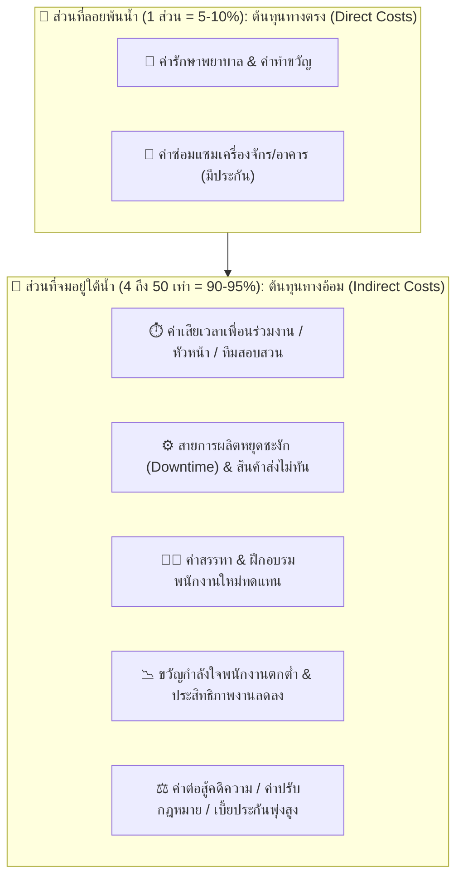

# Week 05: พื้นฐานการป้องกันอุบัติเหตุ (Basics of Accident Prevention)

---

## 🧊 ส่วนที่ 4: โครงสร้างต้นทุนความสูญเสีย (Cost of Accidents: Iceberg Model)

> 💡 **บทนำ**  
> เมื่อเกิดอุบัติเหตุขึ้น ผู้บริหารหลายคนมักมองเห็นเฉพาะ **"ยอดภูเขาน้ำแข็งที่ลอยพ้นน้ำ"** นั่นคือ **ต้นทุนทางตรง (Direct Costs)** เช่น ค่ารักษาพยาบาลหรือค่าประกันภัย แต่ในความเป็นจริง ความสูญเสียฉีดใหญ่ทางเศรษฐศาสตร์กลับซ่อนตัวอยู่ **"ใต้ผิวน้ำ"** นั่นคือ **ต้นทุนทางอ้อม (Indirect Costs)** ซึ่งมีมูลค่ามหาศาลแอบแฝงอยู่มากกว่า **4 ถึง 50 เท่า!**

---

### 🎨 แผนผังเปรียบเทียบทฤษฎีภูเขาน้ำแข็ง (Iceberg Model Diagram)



---

### 🌐 เจาะลึกประเภทต้นทุน ถ่ายทอดผ่านกรณีศึกษาตัวละครทั่วโลก

#### 4.1 ต้นทุนทางตรง (Direct Costs / Insured Costs)
คือ **ค่าใช้จ่ายที่เห็นเด่นชัดด้วยตาเปล่า มีใบเสร็จรับเงิน และสามารถเบิกเคลมประกันภัยได้ง่าย** (คิดเป็นเพียง 1 ส่วน หรือ 5-10% ของความสูญเสียทั้งหมด)
* **ค่ารักษาพยาบาล:** ค่าหมอ ค่ายา ค่าผ่าตัด ค่าห้องพักในโรงพยาบาล
* **ค่าทดแทนการหยุดงาน:** ค่าทำขวัญ ค่าชดเชยตามกฎหมายแรงงาน
* **ค่าซ่อมแซมทรัพย์สิน:** ค่าอะไหล่เครื่องจักร ค่าซ่อมอาคารที่ได้รับความคุ้มครองจากกรมธรรม์

> 🇩🇪 **ตัวอย่างทั่วโลก - ฮันส์ (Hans - เยอรมนี):**  
> ฮันส์ประสบอุบัติเหตุรถบรรทุกพลิกคว่ำบนทางหลวง Autobahn  
> * **ต้นทุนทางตรง (Direct Costs):** ค่ารักษาพยาบาลในโรงพยาบาลเบอร์ลิน 150,000 ยูโร + ค่าซ่อมซากรถบรรทุก 80,000 ยูโร ➔ **รวม 230,000 ยูโร (เบิกประกันภัยได้ทั้งหมด)**

---

#### 4.2 ต้นทุนทางอ้อม (Indirect Costs / Uninsured Costs)
คือ **ค่าใช้จ่ายแอบแฝงที่มองไม่เห็นทันที เบิกเคลมประกันไม่ได้ และมักมีมูลค่าสูงกว่าต้นทุนทางตรงถึง 4 ถึง 50 เท่า!** (คิดเป็น 90-95% ของความสูญเสียทั้งหมด)

| มิติต้นทุนทางอ้อม (Indirect Cost Dimensions) | รายละเอียดผลกระทบแอบแฝง (Hidden Impact Details) | กรณีศึกษาตัวละครทั่วโลก (Global Character Examples) |
| :--- | :--- | :--- |
| **1. ด้านเวลา<br>(Time Losses)** | • เวลาที่สูญเสียไปของเพื่อนร่วมงานที่ต้องหยุดงานมาช่วยมุงดู/ปฐมพยาบาล<br>• เวลาของหัวหน้างานและทีม Safety ที่ต้องใช้สอบสวนคดีและทำรายงานส่งรัฐ | 🇯🇵 **เคนจิ (Kenji - ญี่ปุ่น):** วิศวกรและผู้จัดการโรงงานต้องหยุดงาน 48 ชั่วโมงเพื่อสอบสวนสาเหตุรถยกชนเสา คิดเป็นค่าแรงที่เสียเปล่ากว่า 400,000 เยน |
| **2. ด้านการผลิต<br>(Operational Losses)** | • สายการผลิตหยุดชะงัก (Downtime)<br>• วัตถุดิบชำรุดเสียหาย<br>• ส่งมอบสินค้าให้ลูกค้าไม่ทันตามสัญญา ต้องจ่ายค่าปรับรุนแรง | 🇯🇵 **เคนจิ (Kenji - ญี่ปุ่น):** สายประกอบรถยนต์หยุดผลิต 12 ชั่วโมง ปรับส่งชิปเซมิคอนดักเตอร์ล่าช้า ➔ **สูญเสียรายได้แฝง 15 ล้านเยน (คิดเป็น 30 เท่าของค่างานฟอร์คลิฟต์ที่หัก)** |
| **3. ด้านบุคลากร<br>(Human Resource Losses)** | • ค่าใช้จ่ายในการประกาศรับสมัครพนักงานใหม่มาแทนผู้บาดเจ็บ/พิการ<br>• ค่าวิทยากรและเวลาในการฝึกอบรมช่างคนใหม่ให้ได้ทักษะเท่าคนเดิม | 🇲🇽 **คาร์ลอส (Carlos - เม็กซิโก):** บริษัทต้องจ่ายค่าลงประกาศรับสมัครช่างหลังคาคนใหม่ + ค่าอบรมทักษะ 3 เดือน ➔ **สูญเสียเงินแฝงสูงกว่าค่ารักษาพยาบาลขั้นต้น 15 เท่า** |
| **4. ด้านขวัญกำลังใจ<br>(Morale & Productivity)** | • พนักงานหน้างานเกิดความวิตกกังวลและหวาดกลัว<br>• ขวัญกำลังใจตกต่ำ ทำให้อัตราการผลิตและประสิทธิภาพงานลดลงทั่วทั้งกะ | 🇫🇷 **ปีแอร์ (Pierre - ฝรั่งเศส):** เพื่อนร่วมงานในกะผลิตก๊าซเสียขวัญ วิตกกังวลความปลอดภัย ทำให้อัตราการผลิตรวมของโรงงานตกต่ำลง 25% ในเดือนถัดมา |
| **5. ด้านกฎหมายและภาพลักษณ์<br>(Legal & Reputational Losses)** | • ค่าทนายความและค่าสู้คดีความในศาล<br>• เบี้ยประกันภัยโรงงานปรับตัวสูงขึ้นร้อยละ 100-300% ในปีถัดไป<br>• หุ้นบริษัทตก ลูกค้า cancel สัญญาจ้าง | 🇨🇳 **หลี่เหว่ย (Li Wei - จีน):** โรงงานถูกศาลสั่งปรับ 10 ล้านหยวน + เบี้ยประกันภัยปีถัดไปพุ่ง 300% + ราคาหุ้นตก 40% ➔ **สูญเสียเงินแฝงคิดเป็น 50 เท่าของค่ารักษาพยาบาล!** |

---

### 📊 สรุปตารางเปรียบเทียบอัตราส่วน Direct vs Indirect Costs

```
┌─────────────────────────────────────────────────────────────┐
│ 🧊 Direct Costs   (ต้นทุนทางตรง)  = 1 ส่วน   (5 - 10%)      │
├─────────────────────────────────────────────────────────────┤
│ 🌊 Indirect Costs (ต้นทุนทางอ้อม) = 4 - 50 เท่า (90 - 95%)  │
└─────────────────────────────────────────────────────────────┘
```

> 💡 **สรุปสำหรับนักจัดการความปลอดภัย:**  
> การลงทุนในระบบความปลอดภัย (Safety Investment) เช่น การซื้อ PPE ดีๆ การจัดอบรม หรือการซ่อมบำรุงเครื่องจักร **ไม่ใช่ "ค่าใช้จ่ายที่สิ้นเปลือง"** แต่เป็นการ **"ประหยัดเงินมหาศาล"** จากการป้องกันไม่ให้ภูเขาน้ำแข็งส่วนใต้น้ำ (Indirect Costs) พุ่งขึ้นมาทำลายองค์กรนั่นเอง!

## 📝 คำถาม / แบบทดสอบทบทวน ส่วนที่ 4

Iceberg Model Cost Analysis
1. การจำแนกต้นทุนทางตรง (Direct Costs)

ต้นทุนทางตรงที่เห็นได้ชัดจากเหตุการณ์ ได้แก่

ค่ารักษาพยาบาลและค่ายา ประมาณ 10,000 บาท
ค่าซ่อมรถจักรยานยนต์ ประมาณ 15,000 บาท
ค่าซ่อมรถยนต์ประมาณ 10,000 บาท
ค่าเดินทางไปโรงพยาบาลและค่าใช้จ่ายอื่น ๆ ประมาณ 5,000 บาท

รวมต้นทุนทางตรงประมาณ 40,000 บาท

2. การจำแนกต้นทุนทางอ้อม (Indirect Costs)

ต้นทุนทางอ้อมที่อาจเกิดขึ้นจากเหตุการณ์ ได้แก่

ค่าเสียเวลาในการไปโรงพยาบาลและดูแลผู้บาดเจ็บ ประมาณ 10,000 บาท
ค่าเสียโอกาสด้านการเรียน เนื่องจากต้องหยุดเรียนและตามงาน ประมาณ 5,000 บาท
ค่าเดินทางและค่าใช้จ่ายในการดูแลหลังเกิดเหตุ ประมาณ 10,000 บาท
ค่าใช้จ่ายในการเดินทางระหว่างรถอยู่ระหว่างการซ่อม ประมาณ 10,000 บาท
ผลกระทบทางจิตใจ เช่น ความเครียด ความกลัว และความกังวลหลังเกิดอุบัติเหตุ

รวมต้นทุนทางอ้อมที่ประเมินได้ประมาณ 35,000 บาท

3. การเปรียบเทียบอัตราส่วนและการโน้มน้าวฝ่ายบริหาร

ต้นทุนทางตรง : ต้นทุนทางอ้อม

40,000 : 35,000 บาท

คิดเป็นประมาณ 1 : 0.9 เท่า

หากผมเป็น จป. ผมจะเสนอให้มีการส่งเสริมเรื่องความปลอดภัย เช่น การอบรม การสวมหมวกกันน็อก และการขับขี่อย่างระมัดระวัง เพราะการป้องกันอุบัติเหตุช่วยลดค่าใช้จ่ายและความสูญเสียที่อาจเกิดขึ้นในอนาคต ทั้งค่ารักษาพยาบาล ค่าซ่อมแซม ค่าเสียเวลา และผลกระทบต่อการเรียนหรือการทำงาน ดังนั้นการลงทุนด้านความปลอดภัยจึงช่วยลดความเสี่ยงและความสูญเสียในระยะยาว
