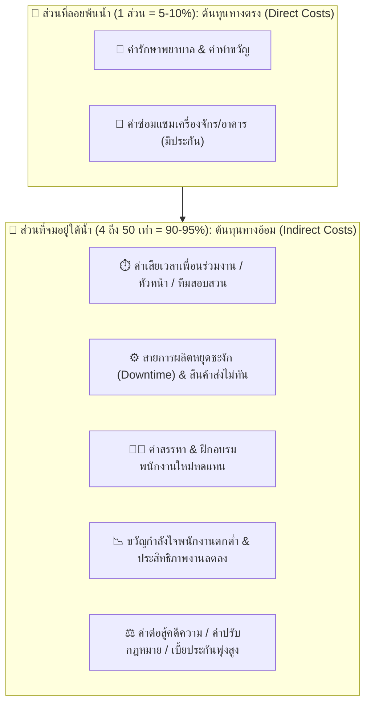

 main
# ส่วนที่ 4 การวิเคราะห์ต้นทุนความสูญเสียตามทฤษฎีภูเขาน้ำแข็ง (Iceberg Model)

จากเหตุการณ์อุบัติเหตุจากการทำงานที่เกิดจากเครื่องจักร ข้าพเจ้ามองว่าความสูญเสียที่เกิดขึ้นไม่ได้มีเพียงค่ารักษาพยาบาลหรือค่าซ่อมแซมเครื่องจักรเท่านั้น แต่ยังมีค่าใช้จ่ายอื่น ๆ ที่ซ่อนอยู่และอาจส่งผลกระทบต่อองค์กรในระยะยาว ซึ่งสามารถแบ่งออกเป็นต้นทุนทางตรงและต้นทุนทางอ้อมตามแนวคิด Iceberg Model ได้ดังนี้

## 1. ต้นทุนทางตรง (Direct Costs)

ต้นทุนทางตรงเป็นค่าใช้จ่ายที่สามารถมองเห็นและประเมินได้ค่อนข้างชัดเจนหลังจากเกิดอุบัติเหตุ และเป็นค่าใช้จ่ายที่บางส่วนอาจสามารถเบิกจากประกันหรือสิทธิที่เกี่ยวข้องได้

ในกรณีอุบัติเหตุจากเครื่องจักร ข้าพเจ้าประเมินค่าใช้จ่ายเบื้องต้นดังนี้

| รายการ                | รายละเอียด                                                   |   ประมาณการ |
| --------------------- | ------------------------------------------------------------ | ----------: |
| ค่ารักษาพยาบาล        | ค่าห้องฉุกเฉิน ค่ายา ค่าตรวจ และค่ารักษาผู้บาดเจ็บ           |  50,000 บาท |
| ค่าชดเชยหรือเงินทดแทน | เงินชดเชยระหว่างหยุดงานหรือค่าใช้จ่ายตามสิทธิของผู้ประสบเหตุ |  30,000 บาท |
| ค่าซ่อมแซมเครื่องจักร | ค่าอะไหล่และค่าแรงช่างในการซ่อมเครื่องจักร                   | 100,000 บาท |
| ค่าเปลี่ยนอุปกรณ์     | ค่าเปลี่ยนชิ้นส่วนหรืออุปกรณ์ที่ไม่สามารถซ่อมได้             |  50,000 บาท |
| รวม                   |                                                              | 230,000 บาท |

ดังนั้น ข้าพเจ้าประเมินว่าต้นทุนทางตรงจากอุบัติเหตุครั้งนี้อยู่ที่ประมาณ 230,000 บาท ซึ่งเป็นค่าใช้จ่ายที่เห็นได้ค่อนข้างชัดเจนและสามารถคำนวณได้ง่ายกว่าต้นทุนประเภทอื่น

## 2. ต้นทุนทางอ้อม (Indirect Costs)

ต้นทุนทางอ้อมเป็นค่าใช้จ่ายที่ไม่สามารถมองเห็นได้ทันทีหลังเกิดเหตุ และบางรายการอาจไม่ได้อยู่ในค่าใช้จ่ายของอุบัติเหตุโดยตรง แต่มีผลต่อการดำเนินงานและรายได้ขององค์กร

ในกรณีนี้ ข้าพเจ้าประเมินต้นทุนทางอ้อมได้ดังนี้

| ด้านต้นทุน                     | รายละเอียด                                                                             |   ประมาณการ |
| ------------------------------ | -------------------------------------------------------------------------------------- | ----------: |
| ด้านเวลา                       | เวลาของหัวหน้างาน จป. วิศวกร และพนักงานที่ต้องหยุดงานเพื่อช่วยเหลือและสอบสวนอุบัติเหตุ |  40,000 บาท |
| ด้านการผลิต                    | เครื่องจักรและสายการผลิตหยุดทำงาน ทำให้สูญเสียโอกาสในการผลิต                           | 250,000 บาท |
| ด้านสินค้าและการส่งมอบ         | วัตถุดิบหรือสินค้าที่เสียหาย และค่าใช้จ่ายจากการส่งสินค้าไม่ทันกำหนด                   |  80,000 บาท |
| ด้านบุคลากร                    | ค่าใช้จ่ายในการรับสมัครและฝึกอบรมพนักงานใหม่หรือพนักงานทดแทน                           |  60,000 บาท |
| ค่าแรงล่วงเวลา                 | ค่า OT ของพนักงานที่ต้องทำงานเพิ่มเพื่อชดเชยงานที่ล่าช้า                               |  50,000 บาท |
| ด้านกฎหมายและการสอบสวน         | ค่าใช้จ่ายเกี่ยวกับการสอบสวน เอกสาร และการดำเนินการที่เกี่ยวข้อง                       |  30,000 บาท |
| ด้านขวัญกำลังใจและประสิทธิภาพ  | ประสิทธิภาพการทำงานลดลงเนื่องจากพนักงานเกิดความกังวลและไม่มั่นใจในความปลอดภัย          |  70,000 บาท |
| ด้านชื่อเสียงและโอกาสทางธุรกิจ | ความเชื่อมั่นของลูกค้าและคู่ค้าลดลง และอาจสูญเสียโอกาสในการรับงาน                      | 100,000 บาท |
| รวม                            |                                                                                        | 680,000 บาท |

จากการประเมิน ต้นทุนทางอ้อมมีมูลค่าประมาณ 680,000 บาท ซึ่งสูงกว่าต้นทุนทางตรงอย่างมาก โดยเฉพาะต้นทุนจากการหยุดการผลิตและการสูญเสียโอกาสทางธุรกิจ

## 3. การเปรียบเทียบอัตราส่วนและการโน้มน้าวฝ่ายบริหาร

จากการประมาณค่าใช้จ่ายทั้งหมด

ต้นทุนทางตรงเท่ากับ 230,000 บาท

ต้นทุนทางอ้อมเท่ากับ 680,000 บาท

ต้นทุนรวมเท่ากับ 910,000 บาท

ดังนั้น อัตราส่วนต้นทุนทางตรงต่อต้นทุนทางอ้อมคือประมาณ 1 : 3 กล่าวคือ เมื่อบริษัทมีต้นทุนทางตรง 1 บาท อาจมีต้นทุนทางอ้อมตามมาอีกประมาณ 3 บาท

ตัวเลขนี้แสดงให้เห็นว่าความเสียหายจากอุบัติเหตุไม่ได้จบลงที่ค่ารักษาพยาบาลหรือค่าซ่อมเครื่องจักรเท่านั้น แต่ยังมีค่าใช้จ่ายที่เกิดขึ้นตามมาอีกหลายด้าน เช่น การหยุดการผลิต ค่า OT ค่าฝึกอบรมพนักงานใหม่ การสอบสวนอุบัติเหตุ และการสูญเสียโอกาสทางธุรกิจ

### แนวทางการพูดโน้มน้าวผู้บริหารในฐานะเจ้าหน้าที่ความปลอดภัย

หากข้าพเจ้าเป็นเจ้าหน้าที่ความปลอดภัย ข้าพเจ้าจะอธิบายให้ผู้บริหารเห็นว่าการลงทุนด้านความปลอดภัยไม่ควรถูกมองว่าเป็นค่าใช้จ่ายที่ไม่จำเป็น เพราะจากเหตุการณ์นี้บริษัทมีต้นทุนทางตรงประมาณ 230,000 บาท แต่เมื่อรวมต้นทุนทางอ้อมแล้ว ความเสียหายเพิ่มขึ้นเป็นประมาณ 910,000 บาท ดังนั้น หากบริษัทลงทุนในการป้องกัน เช่น การบำรุงรักษาเครื่องจักร การติดตั้งอุปกรณ์ป้องกัน การอบรมพนักงาน และการตรวจสอบความปลอดภัยอย่างสม่ำเสมอ บริษัทจะสามารถลดโอกาสเกิดอุบัติเหตุและลดค่าใช้จ่ายที่อาจเกิดขึ้นในอนาคตได้

ข้าพเจ้าจะเสนอให้ผู้บริหารพิจารณางบประมาณด้านความปลอดภัยในลักษณะของการลงทุน เพราะค่าใช้จ่ายในการป้องกันอุบัติเหตุมีโอกาสน้อยกว่าความเสียหายที่บริษัทต้องจ่ายหลังเกิดเหตุ นอกจากนี้ การมีระบบความปลอดภัยที่ดีจะช่วยให้พนักงานมีความมั่นใจในการทำงาน ลดการหยุดผลิต และสร้างความเชื่อมั่นให้กับลูกค้าและคู่ค้า

## สรุป

จากการวิเคราะห์ตามทฤษฎีภูเขาน้ำแข็ง ข้าพเจ้าเห็นว่าต้นทุนที่มองเห็นได้เป็นเพียงส่วนหนึ่งของความสูญเสียทั้งหมดเท่านั้น ในกรณีอุบัติเหตุจากเครื่องจักร ต้นทุนทางตรงประมาณ 230,000 บาท แต่ต้นทุนทางอ้อมประมาณ 680,000 บาท ซึ่งคิดเป็นประมาณ 3 เท่าของต้นทุนทางตรง

ต้นทุนทางอ้อมเหล่านี้ประกอบด้วยการเสียเวลา การหยุดการผลิต ค่า OT ค่าฝึกอบรมพนักงานใหม่ ความเสียหายจากการส่งมอบสินค้าไม่ทัน ผลกระทบต่อขวัญกำลังใจของพนักงาน ค่าใช้จ่ายด้านกฎหมาย รวมถึงการสูญเสียความเชื่อมั่นจากลูกค้าและคู่ค้า

ดังนั้น การป้องกันอุบัติเหตุจึงมีความสำคัญทั้งในด้านความปลอดภัยและด้านเศรษฐกิจขององค์กร การตรวจสอบและบำรุงรักษาเครื่องจักร การอบรมพนักงาน การจัดหาอุปกรณ์ป้องกัน และการปรับปรุงระบบความปลอดภัยอย่างต่อเนื่อง ถือเป็นการลงทุนที่ช่วยลดความสูญเสียทั้งทางตรงและทางอ้อม และช่วยให้องค์กรสามารถดำเนินงานได้อย่างปลอดภัยและต่อเนื่องในระยะยาว
=======
---
course_code: "03376117"
course_name: OCCUPATIONAL HEALTH AND SAFETY (อาชีวอนามัยและความปลอดภัย)
semester: Week 05
topic: พื้นฐานการป้องกันอุบัติเหตุ (Basics of Accident Prevention)
tags:
  - OHS
  - Accident_Prevention
  - Domino_Theory
  - Loss_Types
  - Swiss_Cheese_Model
  - Safety_Management
  - Iceberg_Model
---

# Week 05: พื้นฐานการป้องกันอุบัติเหตุ (Basics of Accident Prevention)

---

## 🧊 ส่วนที่ 4: โครงสร้างต้นทุนความสูญเสีย (Cost of Accidents: Iceberg Model)

> 💡 **บทนำ**  
> เมื่อเกิดอุบัติเหตุขึ้น ผู้บริหารหลายคนมักมองเห็นเฉพาะ **"ยอดภูเขาน้ำแข็งที่ลอยพ้นน้ำ"** นั่นคือ **ต้นทุนทางตรง (Direct Costs)** เช่น ค่ารักษาพยาบาลหรือค่าประกันภัย แต่ในความเป็นจริง ความสูญเสียฉีดใหญ่ทางเศรษฐศาสตร์กลับซ่อนตัวอยู่ **"ใต้ผิวน้ำ"** นั่นคือ **ต้นทุนทางอ้อม (Indirect Costs)** ซึ่งมีมูลค่ามหาศาลแอบแฝงอยู่มากกว่า **4 ถึง 50 เท่า!**

---

### 🎨 แผนผังเปรียบเทียบทฤษฎีภูเขาน้ำแข็ง (Iceberg Model Diagram)



---

### 🌐 เจาะลึกประเภทต้นทุน ถ่ายทอดผ่านกรณีศึกษาตัวละครทั่วโลก

#### 4.1 ต้นทุนทางตรง (Direct Costs / Insured Costs)
คือ **ค่าใช้จ่ายที่เห็นเด่นชัดด้วยตาเปล่า มีใบเสร็จรับเงิน และสามารถเบิกเคลมประกันภัยได้ง่าย** (คิดเป็นเพียง 1 ส่วน หรือ 5-10% ของความสูญเสียทั้งหมด)
* **ค่ารักษาพยาบาล:** ค่าหมอ ค่ายา ค่าผ่าตัด ค่าห้องพักในโรงพยาบาล
* **ค่าทดแทนการหยุดงาน:** ค่าทำขวัญ ค่าชดเชยตามกฎหมายแรงงาน
* **ค่าซ่อมแซมทรัพย์สิน:** ค่าอะไหล่เครื่องจักร ค่าซ่อมอาคารที่ได้รับความคุ้มครองจากกรมธรรม์

> 🇩🇪 **ตัวอย่างทั่วโลก - ฮันส์ (Hans - เยอรมนี):**  
> ฮันส์ประสบอุบัติเหตุรถบรรทุกพลิกคว่ำบนทางหลวง Autobahn  
> * **ต้นทุนทางตรง (Direct Costs):** ค่ารักษาพยาบาลในโรงพยาบาลเบอร์ลิน 150,000 ยูโร + ค่าซ่อมซากรถบรรทุก 80,000 ยูโร ➔ **รวม 230,000 ยูโร (เบิกประกันภัยได้ทั้งหมด)**

---

#### 4.2 ต้นทุนทางอ้อม (Indirect Costs / Uninsured Costs)
คือ **ค่าใช้จ่ายแอบแฝงที่มองไม่เห็นทันที เบิกเคลมประกันไม่ได้ และมักมีมูลค่าสูงกว่าต้นทุนทางตรงถึง 4 ถึง 50 เท่า!** (คิดเป็น 90-95% ของความสูญเสียทั้งหมด)

| มิติต้นทุนทางอ้อม (Indirect Cost Dimensions) | รายละเอียดผลกระทบแอบแฝง (Hidden Impact Details) | กรณีศึกษาตัวละครทั่วโลก (Global Character Examples) |
| :--- | :--- | :--- |
| **1. ด้านเวลา<br>(Time Losses)** | • เวลาที่สูญเสียไปของเพื่อนร่วมงานที่ต้องหยุดงานมาช่วยมุงดู/ปฐมพยาบาล<br>• เวลาของหัวหน้างานและทีม Safety ที่ต้องใช้สอบสวนคดีและทำรายงานส่งรัฐ | 🇯🇵 **เคนจิ (Kenji - ญี่ปุ่น):** วิศวกรและผู้จัดการโรงงานต้องหยุดงาน 48 ชั่วโมงเพื่อสอบสวนสาเหตุรถยกชนเสา คิดเป็นค่าแรงที่เสียเปล่ากว่า 400,000 เยน |
| **2. ด้านการผลิต<br>(Operational Losses)** | • สายการผลิตหยุดชะงัก (Downtime)<br>• วัตถุดิบชำรุดเสียหาย<br>• ส่งมอบสินค้าให้ลูกค้าไม่ทันตามสัญญา ต้องจ่ายค่าปรับรุนแรง | 🇯🇵 **เคนจิ (Kenji - ญี่ปุ่น):** สายประกอบรถยนต์หยุดผลิต 12 ชั่วโมง ปรับส่งชิปเซมิคอนดักเตอร์ล่าช้า ➔ **สูญเสียรายได้แฝง 15 ล้านเยน (คิดเป็น 30 เท่าของค่างานฟอร์คลิฟต์ที่หัก)** |
| **3. ด้านบุคลากร<br>(Human Resource Losses)** | • ค่าใช้จ่ายในการประกาศรับสมัครพนักงานใหม่มาแทนผู้บาดเจ็บ/พิการ<br>• ค่าวิทยากรและเวลาในการฝึกอบรมช่างคนใหม่ให้ได้ทักษะเท่าคนเดิม | 🇲🇽 **คาร์ลอส (Carlos - เม็กซิโก):** บริษัทต้องจ่ายค่าลงประกาศรับสมัครช่างหลังคาคนใหม่ + ค่าอบรมทักษะ 3 เดือน ➔ **สูญเสียเงินแฝงสูงกว่าค่ารักษาพยาบาลขั้นต้น 15 เท่า** |
| **4. ด้านขวัญกำลังใจ<br>(Morale & Productivity)** | • พนักงานหน้างานเกิดความวิตกกังวลและหวาดกลัว<br>• ขวัญกำลังใจตกต่ำ ทำให้อัตราการผลิตและประสิทธิภาพงานลดลงทั่วทั้งกะ | 🇫🇷 **ปีแอร์ (Pierre - ฝรั่งเศส):** เพื่อนร่วมงานในกะผลิตก๊าซเสียขวัญ วิตกกังวลความปลอดภัย ทำให้อัตราการผลิตรวมของโรงงานตกต่ำลง 25% ในเดือนถัดมา |
| **5. ด้านกฎหมายและภาพลักษณ์<br>(Legal & Reputational Losses)** | • ค่าทนายความและค่าสู้คดีความในศาล<br>• เบี้ยประกันภัยโรงงานปรับตัวสูงขึ้นร้อยละ 100-300% ในปีถัดไป<br>• หุ้นบริษัทตก ลูกค้า cancel สัญญาจ้าง | 🇨🇳 **หลี่เหว่ย (Li Wei - จีน):** โรงงานถูกศาลสั่งปรับ 10 ล้านหยวน + เบี้ยประกันภัยปีถัดไปพุ่ง 300% + ราคาหุ้นตก 40% ➔ **สูญเสียเงินแฝงคิดเป็น 50 เท่าของค่ารักษาพยาบาล!** |

---

### 📊 สรุปตารางเปรียบเทียบอัตราส่วน Direct vs Indirect Costs

```
┌─────────────────────────────────────────────────────────────┐
│ 🧊 Direct Costs   (ต้นทุนทางตรง)  = 1 ส่วน   (5 - 10%)      │
├─────────────────────────────────────────────────────────────┤
│ 🌊 Indirect Costs (ต้นทุนทางอ้อม) = 4 - 50 เท่า (90 - 95%)  │
└─────────────────────────────────────────────────────────────┘
```

> 💡 **สรุปสำหรับนักจัดการความปลอดภัย:**  
> การลงทุนในระบบความปลอดภัย (Safety Investment) เช่น การซื้อ PPE ดีๆ การจัดอบรม หรือการซ่อมบำรุงเครื่องจักร **ไม่ใช่ "ค่าใช้จ่ายที่สิ้นเปลือง"** แต่เป็นการ **"ประหยัดเงินมหาศาล"** จากการป้องกันไม่ให้ภูเขาน้ำแข็งส่วนใต้น้ำ (Indirect Costs) พุ่งขึ้นมาทำลายองค์กรนั่นเอง!

## 📝 คำถาม / แบบทดสอบทบทวน ส่วนที่ 4

> 📌 **โจทย์และคำสั่งสำหรับนักศึกษา:**  
> จากเหตุการณ์จริงที่นักศึกษาได้เลือกวิเคราะห์ไว้ใน **ส่วนที่ 2 และส่วนที่ 3** ให้นักศึกษาประเมินและจำแนก **โครงสร้างต้นทุนความสูญเสียตามทฤษฎีภูเขาน้ำแข็ง (Iceberg Model Cost Analysis)** ออกเป็น 2 ส่วนหลัก พร้อมทั้งเสนอแนวคิดเชิงบริหาร:

---

### 📋 โครงสร้างแบบตอบคำถาม ส่วนที่ 4:

#### 1️⃣ การจำแนกต้นทุนทางตรง (Direct Costs / Insured Costs - ส่วนลอยพ้นน้ำ):
* ประเมินรายการค่าใช้จ่ายที่เห็นชัดเจนและมีประกันคุ้มครอง (เช่น ค่ารักษาพยาบาล ค่าเงินชดเชย ค่าซ่อมแซมซากเครื่องจักร)
* *(ประมาณการเป็นจำนวนเงินเบื้องต้น เช่น 50,000 บาท)*

---

#### 2️⃣ การจำแนกต้นทุนทางอ้อม (Indirect Costs / Uninsured Costs - ส่วนจมใต้น้ำ):
* ระบุรายการค่าใช้จ่ายแอบแฝงอย่างน้อย 3 ด้านขึ้นไป (เช่น ค่าเสียเวลาสอบสวน, ค่า Downtime สายการผลิตหยุดชะงัก, ค่าปรับส่งสินค้าล่าช้า, ค่าฝึกอบรมช่างคนใหม่, ค่าต่อสู้คดีความ หรือค่าเบี้ยประกันภัยปีถัดไปพุ่งสูง)
* *(ประมาณการเป็นจำนวนเงินแอบแฝง เช่น 500,000 บาท)*

---

#### 3️⃣ การเปรียบเทียบอัตราส่วนและการโน้มน้าวฝ่ายบริหาร (Management Pitching):
* **อัตราส่วนประเมิน:** ในกรณีนี้ ต้นทุนทางอ้อมคิดเป็นกี่เท่าของต้นทุนทางตรง? *(เช่น 1 : 10 เท่า)*
* **กลยุทธ์โน้มน้าวผู้บริหาร:** หากนักศึกษาต้องสวมบทบาทเป็น **เจ้าหน้าที่ความปลอดภัย (จป.)** นักศึกษาจะนำตัวเลขอัตราส่วนภูเขาน้ำแข็งนี้ ไปพูดโน้มน้าวผู้บริหารหรือเจ้าของบริษัทอย่างไร เพื่อให้อนุมัติงบประมาณในการปรับปรุงความปลอดภัยหน้างาน? *(บรรยาย 3-5 บรรทัด)*
main
