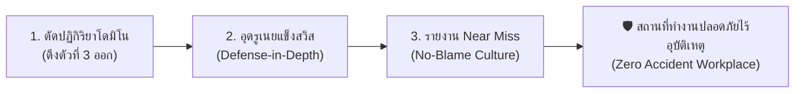

 main
# ส่วนที่ 5 แผนปฏิบัติการป้องกันอุบัติเหตุหน้างาน

## Practical Safety Action Plan

จากเหตุการณ์อุบัติเหตุจากการทำงานที่เกิดจากเครื่องจักร ข้าพเจ้าเห็นว่าการป้องกันอุบัติเหตุไม่ควรแก้ไขเฉพาะปัญหาที่เกิดขึ้นหลังเกิดเหตุ แต่ควรป้องกันตั้งแต่ต้นเหตุ โดยพิจารณาทั้งพฤติกรรมของผู้ปฏิบัติงาน สภาพของเครื่องจักร ระบบการทำงาน และการบริหารจัดการด้านความปลอดภัย ดังนั้น ข้าพเจ้าจึงเสนอแผนปฏิบัติการดังต่อไปนี้

## 1. การกำหนดมาตรการตัดโดมิโนตัวที่ 3 (Domino Interrupt Action)

ในกรณีอุบัติเหตุจากเครื่องจักร ข้าพเจ้าจะกำจัด Unsafe Act โดยกำหนดให้ผู้ปฏิบัติงานต้องผ่านการอบรมและทดสอบก่อนใช้งานเครื่องจักร รวมถึงต้องปฏิบัติตามขั้นตอนการทำงานอย่างเคร่งครัด และห้ามถอดหรือเปิดอุปกรณ์ป้องกันของเครื่องจักรขณะทำงาน

สำหรับ Unsafe Condition จะดำเนินการตรวจสอบเครื่องจักรอย่างสม่ำเสมอ และติดตั้งอุปกรณ์ป้องกัน เช่น ฝาครอบบริเวณจุดหมุน จุดหนีบ หรือส่วนที่มีการเคลื่อนไหว รวมถึงติดตั้งปุ่มหยุดฉุกเฉินในตำแหน่งที่เข้าถึงได้ง่าย

ก่อนซ่อมบำรุงหรือเข้าไปในบริเวณอันตราย ต้องปิดแหล่งพลังงานและใช้ระบบ Lockout/Tagout เพื่อป้องกันเครื่องจักรทำงานโดยไม่ตั้งใจ หากพบเครื่องจักรชำรุดหรือมีสภาพไม่ปลอดภัย ต้องหยุดใช้งานทันทีและแจ้งหัวหน้างานหรือเจ้าหน้าที่ความปลอดภัยเพื่อดำเนินการแก้ไข

การดำเนินการดังกล่าวจะช่วยตัดวงจรระหว่างสาเหตุที่นำไปสู่อุบัติเหตุกับเหตุการณ์ที่ทำให้เกิดการบาดเจ็บ โดยไม่รอให้เกิดอุบัติเหตุแล้วจึงค่อยแก้ไข

---

## 2. การออกแบบแนวป้องกัน 4 ชั้นตาม Swiss Cheese Model

### ด่านที่ 1 นโยบายและกฎระเบียบ

องค์กรควรกำหนดนโยบายความปลอดภัยในการใช้เครื่องจักรอย่างชัดเจน และกำหนดให้พนักงานที่ผ่านการอบรมและได้รับอนุญาตเท่านั้นจึงสามารถใช้งานเครื่องจักรได้ นอกจากนี้ควรกำหนดกฎห้ามถอดฝาครอบหรืออุปกรณ์ป้องกันของเครื่องจักรขณะเครื่องกำลังทำงาน และกำหนดให้มีการตรวจสอบเครื่องจักรก่อนเริ่มงานทุกกะ

ควรกำหนดความรับผิดชอบของผู้ปฏิบัติงาน หัวหน้างาน ฝ่ายซ่อมบำรุง และเจ้าหน้าที่ความปลอดภัยให้ชัดเจน รวมถึงมีการตรวจติดตามว่ากฎด้านความปลอดภัยถูกนำไปปฏิบัติจริงหรือไม่

### ด่านที่ 2 ระบบวิศวกรรมและการควบคุมอันตราย

ควรติดตั้ง Guard หรือฝาครอบบริเวณส่วนที่เป็นอันตรายของเครื่องจักร เพื่อป้องกันไม่ให้ร่างกายของผู้ปฏิบัติงานสัมผัสกับชิ้นส่วนที่กำลังเคลื่อนที่ รวมถึงติดตั้งระบบ Emergency Stop เพื่อให้สามารถหยุดเครื่องจักรได้อย่างรวดเร็วเมื่อเกิดเหตุผิดปกติ

สำหรับงานซ่อมบำรุงควรใช้ระบบ Lockout/Tagout เพื่อแยกและควบคุมแหล่งพลังงานก่อนเริ่มงาน นอกจากนี้ควรมีระบบ Interlock ในกรณีที่เหมาะสม เพื่อป้องกันไม่ให้เครื่องจักรทำงานในขณะที่เปิดฝาครอบหรือมีคนอยู่ในบริเวณอันตราย

เครื่องจักรทุกเครื่องควรได้รับการตรวจสอบและบำรุงรักษาตามแผน หากพบชิ้นส่วนชำรุดต้องแก้ไขก่อนนำเครื่องจักรกลับมาใช้งาน

### ด่านที่ 3 ขั้นตอนการทำงาน SOP ป้ายเตือน และการอบรม

องค์กรควรจัดทำ SOP หรือขั้นตอนการปฏิบัติงานที่ชัดเจนสำหรับเครื่องจักรแต่ละประเภท โดยระบุขั้นตอนตั้งแต่การตรวจสอบก่อนใช้งาน วิธีการเดินเครื่อง วิธีหยุดเครื่อง วิธีแก้ไขปัญหาเบื้องต้น และวิธีการซ่อมบำรุงอย่างปลอดภัย

ควรติดป้ายเตือนบริเวณจุดอันตราย เช่น จุดหนีบ จุดหมุน จุดตัด หรือบริเวณที่มีความร้อน เพื่อให้ผู้ปฏิบัติงานสามารถสังเกตเห็นได้ง่าย

นอกจากนี้ควรมีการอบรมพนักงานทั้งก่อนเริ่มปฏิบัติงานและอบรมทบทวนเป็นระยะ โดยเน้นให้พนักงานเข้าใจถึงอันตรายของเครื่องจักร วิธีการป้องกัน และสิ่งที่ต้องทำเมื่อพบความผิดปกติ รวมถึงควรมีการทดสอบความเข้าใจหลังการอบรม

### ด่านที่ 4 อุปกรณ์ป้องกันส่วนบุคคล (PPE)

ผู้ปฏิบัติงานต้องสวม PPE ให้เหมาะสมกับลักษณะงานและอันตรายของเครื่องจักร เช่น แว่นตานิรภัยหรือกระบังหน้าเพื่อป้องกันเศษวัสดุกระเด็น รองเท้านิรภัยเพื่อป้องกันเท้าจากวัสดุตกหล่น และอุปกรณ์ป้องกันเสียงในพื้นที่ที่มีระดับเสียงสูง

หากงานมีความเสี่ยงต่อการกระเด็นของสารหรือวัสดุ ควรใช้อุปกรณ์ป้องกันเพิ่มเติมตามลักษณะของอันตราย อย่างไรก็ตาม PPE ควรเป็นมาตรการป้องกันชั้นสุดท้าย ไม่ควรใช้แทนการแก้ไขที่เครื่องจักรหรือระบบงาน

พนักงานต้องได้รับการสอนวิธีเลือก ใช้ ตรวจสอบ และเก็บรักษา PPE อย่างถูกต้อง รวมถึงหัวหน้างานต้องตรวจสอบให้พนักงานสวม PPE ก่อนเริ่มงาน

การมีแนวป้องกันทั้ง 4 ชั้นจะช่วยลดโอกาสที่ความผิดพลาดของคนหรือความบกพร่องของเครื่องจักรจะเกิดขึ้นพร้อมกันจนทำให้เกิดอุบัติเหตุรุนแรง

---

## 3. การส่งเสริม Near Miss และบทพูดสร้างแรงจูงใจ

### มาตรการส่งเสริมการรายงาน Near Miss

ข้าพเจ้าจะจัดให้มีระบบรายงาน Near Miss ที่ใช้งานง่ายและใช้เวลาไม่นาน เช่น แบบฟอร์มกระดาษหรือระบบออนไลน์ โดยให้พนักงานสามารถรายงานเหตุการณ์ที่เกือบทำให้เกิดอุบัติเหตุได้โดยไม่ต้องกลัวว่าจะถูกลงโทษ

องค์กรควรสร้างวัฒนธรรมที่เน้นการแก้ไขปัญหามากกว่าการหาคนผิด หากพนักงานรายงาน Near Miss ควรมีการขอบคุณและนำข้อมูลไปตรวจสอบหาสาเหตุอย่างจริงจัง ไม่ควรเพิกเฉยต่อเหตุการณ์ที่ไม่มีผู้บาดเจ็บ เพราะ Near Miss อาจเป็นสัญญาณเตือนว่าระบบความปลอดภัยกำลังมีปัญหา

เมื่อได้รับรายงาน ควรดำเนินการตามขั้นตอน คือ ตรวจสอบเหตุการณ์ วิเคราะห์สาเหตุ กำหนดมาตรการแก้ไข ผู้รับผิดชอบ และกำหนดระยะเวลาในการแก้ไข จากนั้นต้องติดตามว่ามาตรการที่กำหนดสามารถลดความเสี่ยงได้จริงหรือไม่

นอกจากนี้ สามารถจัดกิจกรรมรณรงค์การรายงาน Near Miss และนำตัวอย่างเหตุการณ์ที่ได้รับการแก้ไขแล้วมาแจ้งให้พนักงานทราบ เพื่อให้ทุกคนเห็นว่าการรายงานของตนเองสามารถช่วยป้องกันอุบัติเหตุที่รุนแรงกว่าได้

### บทพูดสร้างแรงจูงใจในฐานะหัวหน้างานหรือเจ้าหน้าที่ความปลอดภัย

“ก่อนเริ่มงานวันนี้ ผมอยากให้ทุกคนคิดถึงความปลอดภัยของตัวเองเป็นอันดับแรก ถ้าเห็นเครื่องจักรหรือพื้นที่ทำงานมีสิ่งผิดปกติ อย่าฝืนทำงานและอย่ากลัวที่จะหยุดเพื่อแจ้งหัวหน้างาน”

“การสวม PPE และการทำตามขั้นตอนความปลอดภัยอาจใช้เวลาเพิ่มขึ้นเพียงเล็กน้อย แต่สามารถป้องกันการบาดเจ็บที่อาจเปลี่ยนชีวิตเราและครอบครัวได้”

“เป้าหมายของเราไม่ใช่แค่ทำงานให้เสร็จ แต่ต้องทำงานให้เสร็จและทุกคนกลับบ้านอย่างปลอดภัย เพราะคนที่รอเราอยู่ที่บ้านสำคัญกว่างานทุกชิ้น”

## สรุปแผนปฏิบัติการ

จากเหตุการณ์อุบัติเหตุจากเครื่องจักร ข้าพเจ้าเห็นว่าการป้องกันอุบัติเหตุควรดำเนินการอย่างเป็นระบบ ไม่ควรพึ่งพาความระมัดระวังของผู้ปฏิบัติงานเพียงอย่างเดียว โดยต้องตัด Unsafe Act และ Unsafe Condition ตั้งแต่ต้น พร้อมสร้างแนวป้องกันหลายชั้นตามแนวคิด Swiss Cheese Model

มาตรการสำคัญ ได้แก่ การกำหนดกฎและนโยบายด้านความปลอดภัย การควบคุมอันตรายด้วยระบบวิศวกรรม การจัดทำ SOP และการอบรมพนักงาน รวมถึงการเลือกใช้ PPE อย่างเหมาะสม นอกจากนี้ การส่งเสริมให้พนักงานรายงาน Near Miss โดยไม่กลัวการถูกลงโทษ จะช่วยให้องค์กรสามารถค้นพบความเสี่ยงก่อนที่จะพัฒนาไปเป็นอุบัติเหตุจริง

ข้าพเจ้าเห็นว่าหากทุกฝ่ายร่วมมือกันตั้งแต่ผู้บริหาร หัวหน้างาน เจ้าหน้าที่ความปลอดภัย และผู้ปฏิบัติงาน จะสามารถลดโอกาสการเกิดอุบัติเหตุ ลดความสูญเสียทั้งทางตรงและทางอ้อม และสร้างสถานที่ทำงานที่ปลอดภัยมากขึ้นได้
=======
---
course_code: "03376117"
course_name: OCCUPATIONAL HEALTH AND SAFETY (อาชีวอนามัยและความปลอดภัย)
semester: Week 05
topic: พื้นฐานการป้องกันอุบัติเหตุ (Basics of Accident Prevention)
tags:
  - OHS
  - Accident_Prevention
  - Domino_Theory
  - Loss_Types
  - Swiss_Cheese_Model
  - Safety_Management
  - Practical_Applications
---

# Week 05: พื้นฐานการป้องกันอุบัติเหตุ (Basics of Accident Prevention)

---

## 🛡️ ส่วนที่ 5: การประยุกต์ใช้ในการป้องกันอุบัติเหตุ (Practical Applications in Safety Management)

> 💡 **บทนำ:**  
> ทฤษฎีความปลอดภัยไม่ได้มีไว้แค่สละเวลาท่องจำไปสอบผ่านเท่านั้น แต่คือ **"ยุทธวิธีกู้ชีวิตหน้างานจริง"** ที่นักจัดการความปลอดภัยและวิศวกรต้องนำไปประยุกต์ใช้อย่างมีกลยุทธ์ เพื่อเปลี่ยนหน้างานที่เสี่ยงอันตรายให้กลายเป็น **"พื้นที่ปลอดภัย 100%"** ผ่าน 3 กลยุทธ์หลักดังต่อไปนี้:

---

### 🚀 3 กลยุทธ์ปฏิบัติการหน้างาน

---

#### 1️⃣ กลยุทธ์ที่ 1: การตัดปฏิกิริยาลูกโซ่โดมิโน (Interrupting the Domino Chain)
* **หลักการ:** ไฮน์ริชชี้ว่า โดมิโนตัวที่ 1 (ภูมิหลัง) และ 2 (นิสัย) แก้ไขยากที่สุด **แต่เราสามารถหยุดอุบัติเหตุได้ทันทีโดยการ "ดึงโดมิโนตัวที่ 3 (Unsafe Act / Unsafe Condition) ออกไป!"**
* 🎭 **สถานการณ์ตัวละคร (บราซิล - เหงื่อตกปนตื่นเต้น):**  
  🇧🇷 **โรเบอร์โต** ช่างเจียรเหล็กสุดเก๋า กำลังเร่งงานส่งมอบกะดึก เหงื่อไหลไคลย้อยจนแว่นตาหมอง โรเบอร์โตรำคาญจึงถอดแว่นตานิรภัยออก แล้วเตรียมกดสวิตช์หินเจียรที่ไม่มีการ์ดบัง!  
  💥 **การตัดวงจรหน้างาน:** เจ้าหน้าที่ความปลอดภัย (จป.) วิ่งกระโดดสไลด์เข้ามาหยุดมือโรเบอร์โตได้ทันวินาทีวิกฤต! จากนั้นสั่งติดตั้ง **ฝาครอบบังหินเจียร (Engineering Control - กำจัด Unsafe Condition)** และมอบ **แว่นตานิรภัยแบบมีรูระบายอากาศทูโทน (กำจัด Unsafe Act)** ➔ ผลลัพธ์: แม้โรเบอร์โตจะใจร้อนอยากรีบทำงานเสร็จ แต่อุบัติเหตุเศษเหล็กพุ่งเจาะตาก็ถูกตัดขาดทันที!

---

#### 2️⃣ กลยุทธ์ที่ 2: การสร้างแนวป้องกันหลายชั้นและอุดรูเนยแข็ง (Swiss Cheese Defense-in-Depth & Plugging Flaws)
* **หลักการ:** อย่าหวังพึ่งพาแนวป้องกันเพียงด่านเดียว! ต้องสร้าง **แนวป้องกันหลายชั้น (Defense-in-Depth)** ทั้งนโยบาย ➔ วิศวกรรม ➔ ขั้นตอน SOP ➔ อุปกรณ์ PPE และคอยสุ่มตรวจ **อุดรูรั่วซ่อนเร้น (Latent Conditions)** อยู่เสมอ
* 🎭 **สถานการณ์ตัวละคร (เยอรมนี - เครียดแต่จบสวย):**  
  🇩🇪 **ฮันส์** ขับรถบรรทุกส่งสินค้าข้ามประเทศ อากาศหนาวเหน็บและฝนตกหนัก ฮันส์เกิดอาการง่วงนอนสะลึมสะลือ ตาปรือหน้าพวงมาลัย (*Active Failure - รูรั่วด่านคน*)  
  🛡️ **การอุดรูเนยแข็ง 4 ด่าน:**  
  * *ด่านที่ 1 (นโยบาย):* บริษัทมีกฎเข้มงวดให้หยุดพักทุก 4 ชั่วโมง  
  * *ด่านที่ 2 (วิศวกรรม):* รถบรรทุกติดตั้งระบบเบรกฉุกเฉินอัตโนมัติ (AEB) และระบบเตือนออกนอกเลน  
  * *ด่านที่ 3 (SOP):* กำหนดให้วิ่งชิดซ้ายไม่เกิน 80 กม./ชม. ช่วงฝนตก  
  * *ด่านที่ 4 (PPE):* ฮันส์สวมเข็มขัดนิรภัยแน่นหนา  
  ➔ ผลลัพธ์: แม้รูรั่วที่ด่านตัวฮันส์จะเปิดออก (ง่วง) แต่ด่านวิศวกรรมระบบเตือนเสียงดังขึ้น พร้อมเบรกอัตโนมัติทำงาน ช่วยเซฟชีวิตฮันส์และรถบรรทุกไม่ให้พุ่งตกเหว!

---

#### 3️⃣ กลยุทธ์ที่ 3: การรายงานเกือบเกิดอุบัติเหตุ (Near Miss Reporting) & วัฒนธรรมไม่มุ่งโทษบุคคล (No-Blame Culture)
* **หลักการ:** ตามสามเหลี่ยมไฮน์ริช ทุกๆ 1 อุบัติเหตุรุนแรง มี **Near Miss (เหตุการณ์เกือบเกิดอุบัติเหตุ) ซ่อนอยู่ถึง 300 ครั้ง!** หากองค์กรสร้าง **วัฒนธรรมความปลอดภัยแบบไม่มุ่งโทษบุคคล (No-Blame Culture)** พนักงานจะกล้าแจ้งเหตุ Near Miss นำไปสู่การปรับปรุงแก้ไขก่อนจะกลายเป็นอุบัติเหตุจริง
* 🎭 **สถานการณ์ตัวละคร (ญี่ปุ่น - ลุ้นระทึกแต่ฮา):**  
  🇯🇵 **เคนจิ** ขับฟอร์คลิฟต์ถอยหลังในคลังสินค้า ด้วยความรีบ งาฟอร์คลิฟต์ไปเกี่ยวเฉียดลังสินค้ามูลค่า 1 ล้านเยนตกอย่างน่าเสียวไส้ลงมากระแทกพื้นห่างจากเท้าเคนจิแค่ 5 เซนติเมตร! (*Near Miss - ไม่มีใครบาดเจ็บ สินค้าไม่พัง*)  
  😅 **ถ้าเป็นสังคมเก่า:** เคนจิคงแอบยกลังเก็บเงียบๆ เพราะกลัวโดนประธานบริษัทดุและหักเงินเดือน  
  🏆 **การใช้ No-Blame Culture:** เคนจิเดินเข้าห้องประธานบริษัทแล้วยื่น **"ใบรายงาน Near Miss"** ประธานบริษัทนอกจากจะไม่ดุด่าแล้ว ยังยิ้มกว้างมอบเงินรางวัล **"Safety Hero of the Month"** 5,000 เยนให้เคนจิ! จากนั้นสั่งช่างให้มาขยายทางเดินคลังสินค้า และติดกระจกโค้งมุมอับทันที ➔ ป้องกันไม่ให้ฟอร์คลิฟต์คันอื่นชนสินค้าตกทับคนในอนาคต!

---

## 📝 คำถาม / แบบทดสอบทบทวน ส่วนที่ 5

> 📌 **โจทย์และคำสั่งสำหรับนักศึกษา:**  
> จากเหตุการณ์จริงที่นักศึกษาได้เลือกวิเคราะห์และถอดบทเรียนมาตั้งแต่ **ส่วนที่ 2, 3 และ 4** ให้นักศึกษาจัดทำ **"แผนปฏิบัติการป้องกันอุบัติเหตุหน้างาน (Practical Safety Action Plan)"** โดยตอบคำถาม 3 ประเด็นดังต่อไปนี้:

---

### 📋 โครงสร้างแบบตอบคำถาม ส่วนที่ 5:

#### 1️⃣ การกำหนดมาตรการตัดโดมิโนตัวที่ 3 (Domino Interrupt Action):
* นักศึกษาจะมีมาตรการเฉพาะเจาะจงอย่างไรในการ **กำจัด Unsafe Act (พฤติกรรมเสี่ยง)** และ **กำจัด Unsafe Condition (สภาพแวดล้อมเสี่ยง)** ในเหตุการณ์นั้น? *(บรรยาย 3-5 บรรทัด)*

---

#### 2️⃣ การออกแบบแนวป้องกัน 4 ชั้นตาม Swiss Cheese Model (Defense-in-Depth Design):
* ออกแบบมาตรการป้องกันให้ครบทั้ง 4 ด่านเพื่อไม่ให้รูเนยตรงกัน:
  * 🧀 *ด่านที่ 1 (นโยบาย/กฎระเบียบ):* ...
  * 🧀 *ด่านที่ 2 (ระบบวิศวกรรม/การตัดไฟ/การ์ดกั้น):* ...
  * 🧀 *ด่านที่ 3 (ขั้นตอน SOP/ป้ายเตือน/การอบรม):* ...
  * 🧀 *ด่านที่ 4 (อุปกรณ์ป้องกันส่วนบุคคล PPE):* ...

---

#### 3️⃣ การส่งเสริม Near Miss & บทพูดสร้างแรงจูงใจลูกน้อง (Safety Leadership & Motivation Speech):
* **มาตรการ Near Miss:** จะใช้วิธีการใดจูงใจให้คนทำงานกล้าแจ้งเหตุการณ์เกือบเกิดอุบัติเหตุโดยไม่กลัวโดนลงโทษ?
* 🗣️ **บทพูดสร้างแรงจูงใจ (Motivations Speech):** สมมติว่านักศึกษาเป็น **หัวหน้างาน/จป.** ก่อนเริ่มงานกะเช้า นักศึกษาจะพูดปลุกใจลูกน้อง 3 บรรทัดอย่างไร ให้ทุกคนตระหนักถึงความปลอดภัยและอยากสวมใส่อุปกรณ์ PPE กลับบ้านไปหาครอบครัวอย่างปลอดภัย?
 main
