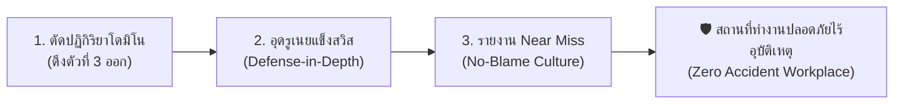

# Week 05: พื้นฐานการป้องกันอุบัติเหตุ (Basics of Accident Prevention)

---

## 🛡️ ส่วนที่ 5: การประยุกต์ใช้ในการป้องกันอุบัติเหตุ (Practical Applications in Safety Management)

> 💡 **บทนำ:**  
> ทฤษฎีความปลอดภัยไม่ได้มีไว้แค่สละเวลาท่องจำไปสอบผ่านเท่านั้น แต่คือ **"ยุทธวิธีกู้ชีวิตหน้างานจริง"** ที่นักจัดการความปลอดภัยและวิศวกรต้องนำไปประยุกต์ใช้อย่างมีกลยุทธ์ เพื่อเปลี่ยนหน้างานที่เสี่ยงอันตรายให้กลายเป็น **"พื้นที่ปลอดภัย 100%"** ผ่าน 3 กลยุทธ์หลักดังต่อไปนี้:

---

### 🚀 3 กลยุทธ์ปฏิบัติการหน้างาน

---

#### 1️⃣ กลยุทธ์ที่ 1: การตัดปฏิกิริยาลูกโซ่โดมิโน (Interrupting the Domino Chain)
* **หลักการ:** ไฮน์ริชชี้ว่า โดมิโนตัวที่ 1 (ภูมิหลัง) และ 2 (นิสัย) แก้ไขยากที่สุด **แต่เราสามารถหยุดอุบัติเหตุได้ทันทีโดยการ "ดึงโดมิโนตัวที่ 3 (Unsafe Act / Unsafe Condition) ออกไป!"**
* 🎭 **สถานการณ์ตัวละคร (บราซิล - เหงื่อตกปนตื่นเต้น):**  
  🇧🇷 **โรเบอร์โต** ช่างเจียรเหล็กสุดเก๋า กำลังเร่งงานส่งมอบกะดึก เหงื่อไหลไคลย้อยจนแว่นตาหมอง โรเบอร์โตรำคาญจึงถอดแว่นตานิรภัยออก แล้วเตรียมกดสวิตช์หินเจียรที่ไม่มีการ์ดบัง!  
  💥 **การตัดวงจรหน้างาน:** เจ้าหน้าที่ความปลอดภัย (จป.) วิ่งกระโดดสไลด์เข้ามาหยุดมือโรเบอร์โตได้ทันวินาทีวิกฤต! จากนั้นสั่งติดตั้ง **ฝาครอบบังหินเจียร (Engineering Control - กำจัด Unsafe Condition)** และมอบ **แว่นตานิรภัยแบบมีรูระบายอากาศทูโทน (กำจัด Unsafe Act)** ➔ ผลลัพธ์: แม้โรเบอร์โตจะใจร้อนอยากรีบทำงานเสร็จ แต่อุบัติเหตุเศษเหล็กพุ่งเจาะตาก็ถูกตัดขาดทันที!

---

#### 2️⃣ กลยุทธ์ที่ 2: การสร้างแนวป้องกันหลายชั้นและอุดรูเนยแข็ง (Swiss Cheese Defense-in-Depth & Plugging Flaws)
* **หลักการ:** อย่าหวังพึ่งพาแนวป้องกันเพียงด่านเดียว! ต้องสร้าง **แนวป้องกันหลายชั้น (Defense-in-Depth)** ทั้งนโยบาย ➔ วิศวกรรม ➔ ขั้นตอน SOP ➔ อุปกรณ์ PPE และคอยสุ่มตรวจ **อุดรูรั่วซ่อนเร้น (Latent Conditions)** อยู่เสมอ
* 🎭 **สถานการณ์ตัวละคร (เยอรมนี - เครียดแต่จบสวย):**  
  🇩🇪 **ฮันส์** ขับรถบรรทุกส่งสินค้าข้ามประเทศ อากาศหนาวเหน็บและฝนตกหนัก ฮันส์เกิดอาการง่วงนอนสะลึมสะลือ ตาปรือหน้าพวงมาลัย (*Active Failure - รูรั่วด่านคน*)  
  🛡️ **การอุดรูเนยแข็ง 4 ด่าน:**  
  * *ด่านที่ 1 (นโยบาย):* บริษัทมีกฎเข้มงวดให้หยุดพักทุก 4 ชั่วโมง  
  * *ด่านที่ 2 (วิศวกรรม):* รถบรรทุกติดตั้งระบบเบรกฉุกเฉินอัตโนมัติ (AEB) และระบบเตือนออกนอกเลน  
  * *ด่านที่ 3 (SOP):* กำหนดให้วิ่งชิดซ้ายไม่เกิน 80 กม./ชม. ช่วงฝนตก  
  * *ด่านที่ 4 (PPE):* ฮันส์สวมเข็มขัดนิรภัยแน่นหนา  
  ➔ ผลลัพธ์: แม้รูรั่วที่ด่านตัวฮันส์จะเปิดออก (ง่วง) แต่ด่านวิศวกรรมระบบเตือนเสียงดังขึ้น พร้อมเบรกอัตโนมัติทำงาน ช่วยเซฟชีวิตฮันส์และรถบรรทุกไม่ให้พุ่งตกเหว!

---

#### 3️⃣ กลยุทธ์ที่ 3: การรายงานเกือบเกิดอุบัติเหตุ (Near Miss Reporting) & วัฒนธรรมไม่มุ่งโทษบุคคล (No-Blame Culture)
* **หลักการ:** ตามสามเหลี่ยมไฮน์ริช ทุกๆ 1 อุบัติเหตุรุนแรง มี **Near Miss (เหตุการณ์เกือบเกิดอุบัติเหตุ) ซ่อนอยู่ถึง 300 ครั้ง!** หากองค์กรสร้าง **วัฒนธรรมความปลอดภัยแบบไม่มุ่งโทษบุคคล (No-Blame Culture)** พนักงานจะกล้าแจ้งเหตุ Near Miss นำไปสู่การปรับปรุงแก้ไขก่อนจะกลายเป็นอุบัติเหตุจริง
* 🎭 **สถานการณ์ตัวละคร (ญี่ปุ่น - ลุ้นระทึกแต่ฮา):**  
  🇯🇵 **เคนจิ** ขับฟอร์คลิฟต์ถอยหลังในคลังสินค้า ด้วยความรีบ งาฟอร์คลิฟต์ไปเกี่ยวเฉียดลังสินค้ามูลค่า 1 ล้านเยนตกอย่างน่าเสียวไส้ลงมากระแทกพื้นห่างจากเท้าเคนจิแค่ 5 เซนติเมตร! (*Near Miss - ไม่มีใครบาดเจ็บ สินค้าไม่พัง*)  
  😅 **ถ้าเป็นสังคมเก่า:** เคนจิคงแอบยกลังเก็บเงียบๆ เพราะกลัวโดนประธานบริษัทดุและหักเงินเดือน  
  🏆 **การใช้ No-Blame Culture:** เคนจิเดินเข้าห้องประธานบริษัทแล้วยื่น **"ใบรายงาน Near Miss"** ประธานบริษัทนอกจากจะไม่ดุด่าแล้ว ยังยิ้มกว้างมอบเงินรางวัล **"Safety Hero of the Month"** 5,000 เยนให้เคนจิ! จากนั้นสั่งช่างให้มาขยายทางเดินคลังสินค้า และติดกระจกโค้งมุมอับทันที ➔ ป้องกันไม่ให้ฟอร์คลิฟต์คันอื่นชนสินค้าตกทับคนในอนาคต!

---

## 📝 คำถาม / แบบทดสอบทบทวน ส่วนที่ 5

1. การกำหนดมาตรการตัดโดมิโนตัวที่ 3

Unsafe Act: กำหนดให้ผู้ขับขี่ต้องสวมหมวกกันน็อกทุกครั้งก่อนขับรถ และต้องลดความเร็วเมื่อเข้าใกล้ทางแยก รวมถึงไม่ขับรถในขณะที่รีบร้อนหรือมีอาการง่วงนอน

Unsafe Condition: ปรับปรุงบริเวณทางแยกให้มองเห็นได้ชัดเจน ติดป้ายเตือนและกระจกโค้งบริเวณมุมอับ รวมถึงจัดการจราจรให้มีความปลอดภัยมากขึ้น

มาตรการเหล่านี้ช่วยลดทั้งพฤติกรรมเสี่ยงและสภาพแวดล้อมที่อาจทำให้เกิดอุบัติเหตุ ซึ่งตรงกับแนวคิดการตัดโดมิโนตัวที่ 3

2. การออกแบบแนวป้องกัน 4 ชั้นตาม Swiss Cheese Model

ด่านที่ 1 นโยบาย/กฎระเบียบ:
กำหนดกฎให้ทุกคนที่ขับรถจักรยานยนต์ต้องสวมหมวกกันน็อก และต้องปฏิบัติตามกฎจราจรอย่างเคร่งครัด

ด่านที่ 2 ระบบวิศวกรรม:
ติดตั้งกระจกโค้งบริเวณทางแยกที่มีมุมอับ และติดตั้งป้ายเตือนหรือลูกระนาดเพื่อช่วยลดความเร็วของรถ

ด่านที่ 3 ขั้นตอน SOP/ป้ายเตือน/การอบรม:
อบรมเรื่องการขับขี่ปลอดภัย สอนให้ชะลอความเร็วบริเวณทางแยก และติดป้ายเตือนให้สวมหมวกกันน็อกและระวังรถที่กำลังออกจากซอย

ด่านที่ 4 PPE:
ผู้ขับขี่ต้องสวมหมวกกันน็อกที่ได้มาตรฐานและรัดสายรัดให้เรียบร้อยทุกครั้งก่อนออกเดินทาง

การสร้างแนวป้องกันหลายชั้นช่วยไม่ให้ความผิดพลาดจากด่านใดด่านหนึ่งนำไปสู่อุบัติเหตุได้ง่าย

3. การส่งเสริม Near Miss และบทพูดสร้างแรงจูงใจ

มาตรการ Near Miss:
จัดให้มีช่องทางแจ้ง Near Miss ที่ง่าย เช่น แบบฟอร์มสั้น ๆ หรือแจ้งหัวหน้างานโดยตรง และไม่ลงโทษผู้ที่แจ้งเหตุ เพื่อให้ทุกคนกล้าแจ้งปัญหาและช่วยกันแก้ไขก่อนเกิดอุบัติเหตุจริง แนวคิดนี้สอดคล้องกับ No-Blame Culture ในไฟล์

บทพูดสร้างแรงจูงใจ:

“ก่อนออกเดินทางทุกครั้ง อย่าลืมใส่หมวกกันน็อกและตรวจสอบความพร้อมของตัวเอง
อย่ารีบจนลืมความปลอดภัย เพราะอุบัติเหตุเกิดขึ้นได้ในเวลาไม่กี่วินาที
ทำงานและเดินทางอย่างปลอดภัย เพื่อให้ทุกคนได้กลับบ้านไปหาครอบครัวอย่างปลอดภัย”
