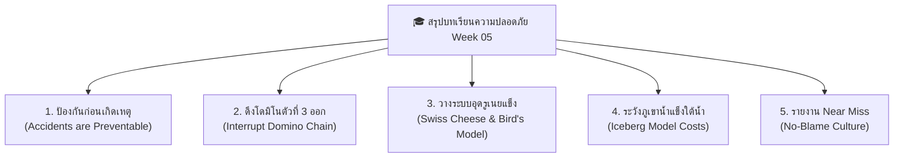

 main
# Week 05 พื้นฐานการป้องกันอุบัติเหตุ

## หัวข้อและข้อคิดจากบทเรียน

### 1. อุบัติเหตุสามารถป้องกันได้

อุบัติเหตุจากการทำงานไม่ได้เกิดขึ้นโดยบังเอิญเสมอไป แต่ส่วนใหญ่มีสาเหตุหรือความเสี่ยงที่สามารถมองเห็นและแก้ไขได้ก่อนเกิดเหตุ เช่น เครื่องจักรชำรุด ไม่มีอุปกรณ์ป้องกัน หรือพนักงานทำงานโดยไม่ปฏิบัติตามขั้นตอน

**ข้อคิด:**
ผมคิดว่าการป้องกันอุบัติเหตุควรทำตั้งแต่ก่อนเกิดเหตุ ไม่ควรรอให้มีคนได้รับบาดเจ็บก่อนแล้วค่อยแก้ไข เพราะการตรวจสอบและแก้ไขความเสี่ยงตั้งแต่แรกสามารถช่วยลดความสูญเสียได้มาก

---

### 2. ทฤษฎีโดมิโน (Domino Theory)

อุบัติเหตุไม่ได้เกิดจากสาเหตุเดียว แต่มักเกิดจากเหตุการณ์หลายอย่างต่อเนื่องกัน เช่น การจัดการด้านความปลอดภัยไม่ดี เครื่องจักรมีปัญหา พนักงานมีพฤติกรรมไม่ปลอดภัย จนสุดท้ายเกิดอุบัติเหตุและทำให้เกิดการบาดเจ็บหรือความเสียหาย

**ข้อคิด:**
จากเหตุการณ์เครื่องจักรที่ผมวิเคราะห์ ผมคิดว่าถ้าเราสามารถหยุดสาเหตุใดสาเหตุหนึ่งได้ เช่น หยุดใช้เครื่องจักรที่ผิดปกติหรือแก้ไขพฤติกรรมที่ไม่ปลอดภัย ก็สามารถหยุดเหตุการณ์ไม่ให้พัฒนาไปจนเกิดอุบัติเหตุได้

---

### 3. การกำจัดพฤติกรรมและสภาพการทำงานที่ไม่ปลอดภัย

พฤติกรรมที่ไม่ปลอดภัย เช่น การไม่สวม PPE การเอามือเข้าไปใกล้ส่วนที่กำลังเคลื่อนที่ของเครื่องจักร หรือการซ่อมเครื่องจักรโดยไม่ตัดแหล่งพลังงาน ล้วนเพิ่มโอกาสเกิดอุบัติเหตุ ส่วนสภาพที่ไม่ปลอดภัย เช่น เครื่องจักรไม่มีการ์ดป้องกัน พื้นที่ทำงานรก หรือปุ่มหยุดฉุกเฉินใช้งานไม่ได้ ก็เป็นปัจจัยสำคัญเช่นกัน

**ข้อคิด:**
ผมคิดว่าการป้องกันต้องแก้ทั้งที่ตัวคนและตัวเครื่องจักร ไม่ควรโทษพนักงานเพียงอย่างเดียว เพราะถ้าเครื่องจักรยังมีจุดอันตรายอยู่ ต่อให้พนักงานระวังมากก็ยังมีโอกาสเกิดอุบัติเหตุได้

---

### 4. Swiss Cheese Model

การป้องกันอุบัติเหตุควรมีหลายชั้น ไม่ควรฝากความปลอดภัยไว้กับวิธีใดวิธีหนึ่ง เช่น มีทั้งกฎของบริษัท ระบบป้องกันทางวิศวกรรม ขั้นตอนการทำงาน การอบรม และ PPE เพื่อช่วยป้องกันความผิดพลาดที่อาจเกิดขึ้น

**ข้อคิด:**
ผมมองว่าถ้ามาตรการหนึ่งผิดพลาด เรายังควรมีมาตรการอื่นช่วยป้องกันไว้ เพราะในสถานที่ทำงานเราไม่สามารถมั่นใจได้ว่าคนหรือระบบจะไม่ผิดพลาดเลย

---

### 5. ความสูญเสียด้านคนและสุขภาพ

เมื่อเกิดอุบัติเหตุ สิ่งที่เห็นได้ชัดคือการบาดเจ็บ เช่น แขนขาหัก ถูกเครื่องจักรหนีบ หรืออาจรุนแรงถึงขั้นเสียชีวิต แต่ยังมีผลกระทบอื่นตามมา เช่น ผู้บาดเจ็บต้องหยุดงาน สูญเสียรายได้ และครอบครัวอาจได้รับความเดือดร้อน

**ข้อคิด:**
ผมคิดว่าความสูญเสียที่สำคัญที่สุดคือชีวิตและสุขภาพของคน เพราะเงินหรือเครื่องจักรสามารถซ่อมหรือซื้อใหม่ได้ แต่สุขภาพที่เสียไปหรือชีวิตที่สูญเสียไม่สามารถนำกลับคืนมาได้

---

### 6. ความสูญเสียด้านทรัพย์สินและการผลิต

อุบัติเหตุจากเครื่องจักรอาจทำให้เครื่องจักรเสียหาย วัตถุดิบหรือสินค้าชำรุด และต้องหยุดสายการผลิตเพื่อซ่อมแซม ส่งผลให้บริษัทเสียเวลาและเสียรายได้

**ข้อคิด:**
ผมคิดว่าการดูแลเครื่องจักรและตรวจสอบก่อนใช้งานเป็นเรื่องสำคัญ เพราะการป้องกันเครื่องจักรเสียหายช่วยลดทั้งอุบัติเหตุและค่าใช้จ่ายของบริษัทได้พร้อมกัน

---

### 7. ความสูญเสียที่ซ่อนอยู่ (Hidden Losses)

หลังเกิดอุบัติเหตุยังมีค่าใช้จ่ายที่มองไม่เห็นทันที เช่น ค่าเสียเวลาของหัวหน้างานและพนักงาน ค่าใช้จ่ายในการสอบสวน ค่าอบรมพนักงานใหม่ ค่าทำงานล่วงเวลา และค่าเสียโอกาสจากการหยุดผลิต

**ข้อคิด:**
ผมคิดว่าอุบัติเหตุหนึ่งครั้งไม่ได้เสียหายแค่ในวันที่เกิดเหตุ แต่ผลกระทบสามารถต่อเนื่องไปอีกหลายวันหรือหลายเดือน ดังนั้นการป้องกันตั้งแต่ต้นจึงคุ้มค่ากว่าการแก้ปัญหาภายหลัง

---

### 8. Iceberg Model หรือทฤษฎีภูเขาน้ำแข็ง

ความสูญเสียจากอุบัติเหตุเปรียบเหมือนภูเขาน้ำแข็ง เพราะสิ่งที่เราเห็น เช่น ค่ารักษาพยาบาลและค่าซ่อมเครื่องจักร เป็นเพียงส่วนหนึ่งเท่านั้น ยังมีต้นทุนทางอ้อมที่ซ่อนอยู่ เช่น การหยุดผลิต การเสียโอกาสทางธุรกิจ และผลกระทบต่อขวัญกำลังใจของพนักงาน

**ข้อคิด:**
ผมคิดว่าผู้บริหารไม่ควรมองว่าการลงทุนด้านความปลอดภัยเป็นค่าใช้จ่ายที่ไม่จำเป็น เพราะเงินที่ใช้ป้องกันอุบัติเหตุอาจช่วยประหยัดค่าใช้จ่ายที่สูงกว่ามากในอนาคต

---

### 9. ผลกระทบทางจิตใจและสังคม

ผู้ที่ประสบอุบัติเหตุอาจไม่ได้รับผลกระทบเฉพาะทางร่างกาย แต่อาจเกิดความกลัว ความเครียด หรือไม่กล้ากลับไปทำงานเหมือนเดิม เพื่อนร่วมงานที่เห็นเหตุการณ์ก็อาจเกิดความกังวลในการทำงานกับเครื่องจักรเช่นกัน

**ข้อคิด:**
ผมคิดว่าการดูแลผู้ประสบอุบัติเหตุควรดูแลทั้งร่างกายและจิตใจ เพราะบางครั้งบาดแผลทางจิตใจอาจมองไม่เห็น แต่ส่งผลต่อการใช้ชีวิตและการทำงานในระยะยาว

---

### 10. ผลกระทบต่อครอบครัว

ถ้าพนักงานได้รับบาดเจ็บรุนแรงหรือพิการจนไม่สามารถทำงานได้ ครอบครัวอาจสูญเสียรายได้และมีค่าใช้จ่ายเพิ่มขึ้น ทั้งค่ารักษาพยาบาล ค่าเดินทาง และค่าใช้จ่ายในการดูแลผู้บาดเจ็บ

**ข้อคิด:**
ผมคิดว่าความปลอดภัยในการทำงานไม่ได้เกี่ยวข้องกับตัวพนักงานเพียงคนเดียว แต่เกี่ยวข้องกับครอบครัวของพนักงานด้วย เพราะถ้าพนักงานเกิดอะไรขึ้น ครอบครัวก็ได้รับผลกระทบตามไปด้วย

---

### 11. Near Miss หรือเหตุการณ์เกือบเกิดอุบัติเหตุ

Near Miss คือเหตุการณ์ที่เกือบจะเกิดอุบัติเหตุ แต่ยังไม่มีคนได้รับบาดเจ็บหรือไม่มีความเสียหายรุนแรง เช่น เครื่องจักรเกือบหนีบมือ หรือชิ้นส่วนเครื่องจักรหลุดแต่ไม่มีใครได้รับอันตราย

**ข้อคิด:**
ผมคิดว่าไม่ควรมองว่า Near Miss เป็นเรื่องเล็ก เพราะมันเป็นสัญญาณเตือนว่ามีความเสี่ยงอยู่ หากเรารีบรายงานและแก้ไข ก็สามารถป้องกันไม่ให้เหตุการณ์ครั้งต่อไปกลายเป็นอุบัติเหตุจริงได้

---

### 12. การสร้างวัฒนธรรมความปลอดภัย

ทุกคนในองค์กรควรมีส่วนร่วมในการดูแลความปลอดภัย ไม่ใช่เป็นหน้าที่ของเจ้าหน้าที่ความปลอดภัยเพียงคนเดียว พนักงานควรกล้าแจ้งปัญหาและเตือนกันเมื่อพบสิ่งที่ไม่ปลอดภัย

**ข้อคิด:**
ผมคิดว่าสถานที่ทำงานจะปลอดภัยได้จริงเมื่อทุกคนช่วยกันดูแล หากเห็นเครื่องจักรผิดปกติหรือเห็นเพื่อนกำลังทำงานเสี่ยง ก็ควรช่วยกันเตือนและแก้ไข ไม่ควรคิดว่าไม่ใช่หน้าที่ของตัวเอง

---

### 13. การไม่โทษคนเพียงอย่างเดียว

เมื่อเกิดอุบัติเหตุ เราไม่ควรรีบสรุปว่าคนงานประมาทเพียงอย่างเดียว แต่ควรหาสาเหตุให้ครบ เช่น เครื่องจักรมีปัญหาหรือไม่ มีการอบรมเพียงพอหรือไม่ ขั้นตอนการทำงานชัดเจนหรือไม่ และหัวหน้างานมีการควบคุมดูแลหรือไม่

**ข้อคิด:**
ผมคิดว่าการหาสาเหตุที่แท้จริงสำคัญกว่าการหาคนผิด เพราะถ้าเราแก้แค่คน แต่ไม่แก้ระบบ อุบัติเหตุแบบเดิมก็สามารถเกิดขึ้นกับคนอื่นได้อีก

---

### 14. การตรวจสอบและบำรุงรักษาเครื่องจักร

เครื่องจักรควรได้รับการตรวจสอบและบำรุงรักษาอย่างสม่ำเสมอ โดยเฉพาะส่วนที่เกี่ยวข้องกับความปลอดภัย เช่น การ์ดป้องกัน ปุ่มหยุดฉุกเฉิน ระบบไฟฟ้า และส่วนที่มีการเคลื่อนไหว

**ข้อคิด:**
จากเหตุการณ์เครื่องจักร ผมมองว่าการตรวจสอบก่อนเริ่มงานเป็นเรื่องที่ไม่ควรมองข้าม เพราะการพบปัญหาก่อนใช้งานสามารถป้องกันอุบัติเหตุได้ดีกว่าการรอให้เครื่องเสียแล้วค่อยแก้

---

### 15. การใช้ PPE

PPE เป็นอุปกรณ์ช่วยลดความรุนแรงของการบาดเจ็บ เช่น หมวกนิรภัย แว่นตานิรภัย ถุงมือ รองเท้านิรภัย และอุปกรณ์ป้องกันการได้ยิน แต่ PPE ไม่ควรเป็นวิธีป้องกันเพียงอย่างเดียว

**ข้อคิด:**
ผมคิดว่าพนักงานต้องใส่ PPE ให้ถูกต้องและเหมาะกับงาน แต่บริษัทก็ควรแก้ไขอันตรายที่ต้นเหตุด้วย เพราะ PPE เป็นด่านสุดท้ายในการป้องกัน ไม่ใช่สิ่งที่สามารถทดแทนการแก้ไขเครื่องจักรที่อันตรายได้

---

### 16. ความปลอดภัยเป็นความรับผิดชอบของทุกคน

การทำงานอย่างปลอดภัยต้องอาศัยความร่วมมือจากผู้บริหาร หัวหน้างาน เจ้าหน้าที่ความปลอดภัย และพนักงานทุกคน ผู้บริหารต้องสนับสนุนงบประมาณ หัวหน้างานต้องควบคุมการทำงาน และพนักงานต้องปฏิบัติตามกฎความปลอดภัย

**ข้อคิด:**
ผมคิดว่าถ้าทุกคนช่วยกันตั้งแต่ต้น โอกาสเกิดอุบัติเหตุก็จะลดลง เพราะความปลอดภัยไม่ใช่หน้าที่ของคนใดคนหนึ่ง แต่เป็นความรับผิดชอบร่วมกันของทุกคน

---

## สรุปข้อคิดที่ได้จากบทเรียน

จากบทเรียนนี้ ผมได้เข้าใจว่าอุบัติเหตุจากการทำงานไม่ได้ส่งผลแค่คนที่ได้รับบาดเจ็บหรือเครื่องจักรที่เสียหาย แต่ยังมีความสูญเสียที่ซ่อนอยู่ตามมาอีกหลายด้าน ทั้งด้านร่างกาย จิตใจ ครอบครัว เวลา ค่าใช้จ่าย การผลิต และชื่อเสียงขององค์กร

สำหรับเหตุการณ์เครื่องจักรที่ผมเลือกวิเคราะห์ ผมคิดว่าสิ่งสำคัญที่สุดคือการหาสาเหตุของอุบัติเหตุและแก้ไขตั้งแต่ต้นทาง ไม่ควรรอให้เกิดอุบัติเหตุก่อนแล้วจึงค่อยแก้ไข รวมถึงควรเปิดโอกาสให้พนักงานรายงานความเสี่ยงและ Near Miss ได้โดยไม่ต้องกลัวว่าจะถูกตำหนิ

สุดท้าย ผมมองว่าความปลอดภัยในการทำงานไม่ใช่แค่การใส่ PPE หรือทำตามกฎเท่านั้น แต่คือการมีสติ ตรวจสอบความเสี่ยงก่อนทำงาน และช่วยกันดูแลความปลอดภัยของตัวเองและคนรอบข้าง เพราะการป้องกันอุบัติเหตุตั้งแต่แรกย่อมดีกว่าการต้องมานั่งแก้ไขความเสียหายหลังเกิดเหตุ
=======
---
course_code: "03376117"
course_name: OCCUPATIONAL HEALTH AND SAFETY (อาชีวอนามัยและความปลอดภัย)
semester: Week 05
topic: พื้นฐานการป้องกันอุบัติเหตุ (Basics of Accident Prevention)
tags:
  - OHS
  - Accident_Prevention
  - Domino_Theory
  - Loss_Types
  - Swiss_Cheese_Model
  - Safety_Management
  - Summary_Proverbs
---

# Week 05: พื้นฐานการป้องกันอุบัติเหตุ (Basics of Accident Prevention)

---

## 📝 สรุปเนื้อหาประจำสัปดาห์ (Week 05 Summary)

> 💡 **บทสรุปภาพรวม (Executive Summary):**  
> สัปดาห์นี้เราได้เรียนรู้ว่า **"อุบัติเหตุไม่ใช่เรื่องของโชคชะตาหรือดวงชะตา"** แต่คือเหตุการณ์ที่มีสาเหตุรากเหง้าซ่อนอยู่เสมอ หากเรารู้วิธีวิเคราะห์ผ่านทฤษฎีโดมิโน โมเดลเนยแข็งสวิส และทฤษฎีภูเขาน้ำแข็ง เราจะสามารถตัดปฏิกิริยาลูกโซ่อุบัติเหตุและอุดรูรั่วเชิงระบบได้อย่างมีประสิทธิภาพ

---

### 🌐 5 ประเด็นสรุปสำคัญ คำคมและสุภาษิตนานาชาติ (Global Safety Proverbs)

---

#### 1️⃣ อุบัติเหตุไม่ได้เกิดจากโชคชะตา แต่ป้องกันได้เสมอ
* 🇬🇧 **สุภาษิตภาษาอังกฤษ (UK / USA):**  
  🗣️ *"An ounce of prevention is worth a pound of cure."*  
  🇹🇭 *(แปลไทย: "การป้องกันเพียงหนึ่งออนซ์ มีค่ามากกว่าการรักษาพยาบาลถึงหนึ่งปอนด์")* — Benjamin Franklin
* 💡 **แก่น OHS:** อุบัติเหตุไม่ใช่เรื่องสุดวิสัย การลงทุนป้องกันความปลอดภัยเพียงเล็กน้อยในวันนี้ ช่วยประหยัดชีวิตและงบประมาณในการรักษาพยาบาลมหาศาลในวันข้างหน้า

---

#### 2️⃣ การดึงโดมิโนตัวที่ 3 ออกเพื่อตัดวงจรอันตราย (Domino Theory)
* 🇯🇵 **สุภาษิตภาษาญี่ปุ่น (Japan):**  
  🗣️ *"転ばぬ先の杖"* *(Korobanu saki no tsue)*  
  🇹🇭 *(แปลไทย: "ยื่นไม้เท้าพยุงตัวไว้ล่วงหน้า ก่อนที่จะลื่นไถลหกล้มลงไป")*
* 💡 **แก่น OHS:** ไฮน์ริชสอนว่า เราไม่อาจเปลี่ยนประวัติหรือนิสัยลึกๆ ของคนได้ทันที แต่เราสามารถยื่น "ไม้เท้าป้องกัน" โดยการ **กำจัด Unsafe Act และ Unsafe Condition (ดึงโดมิโนตัวที่ 3 ออก)** เพื่อไม่ให้อุบัติเหตุและความสูญเสียล้มตามลงมา

---

#### 3️⃣ อย่าโทษแค่คนทำงาน ให้เน้นอุดรูรั่วเชิงระบบ (Bird & Loftus & Swiss Cheese Model)
* 🇩🇪 **สุภาษิตภาษาเยอรมัน (Germany):**  
  🗣️ *"Vorsorge ist besser als Nachsorge."*  
  🇹🇭 *(แปลไทย: "การคิดวางแผนป้องกันระบบไว้ก่อน ดีกว่าการตามล้างตามเช็ดแก้ปัญหาทีหลัง")*
* 💡 **แก่น OHS:** ทฤษฎี Bird & Loftus และ Swiss Cheese Model เน้นย้ำว่า ฝ่ายบริหารต้องกุมโดมิโนตัวที่ 1 (Lack of Control) เพื่อสร้างแนวป้องกันหลายชั้น (Defense-in-Depth) และคอยอุด **"รูรั่วซ่อนเร้นเชิงระบบ (Latent Conditions)"** ก่อนที่รูเนยแข็งทุกแผ่นจะตรงกัน

---

#### 4️⃣ ตระหนักถึงความสูญเสียที่ซ่อนอยู่ใต้น้ำ (Iceberg Model Costs)
* 🇨🇳 **สุภาษิตภาษาจีน (China):**  
  🗣️ *"宜未雨而绸缪，毋临渴而掘井"* *(Yí wèi yǔ ér chóumóu, wú lín kě ér jué jǐng)*  
  🇹🇭 *(แปลไทย: "จงซ่อมหลังคาบ้านตั้งแต่แดดออกก่อนฝนจะตก อย่ารอจนกระทั่งคอแห้งหิวน้ำแล้วค่อยเริ่มขุดบ่อน้ำ")*
* 💡 **แก่น OHS:** ความสูญเสียจากอุบัติเหตุเปรียบเหมือนภูเขาน้ำแข็ง ค่ารักษาพยาบาลทางตรงคือยอดพ้นน้ำแค่ 1 ส่วน แต่ **ต้นทุนทางอ้อมใต้น้ำ (Downtime, ขวัญกำลังใจ, คดีความ, ภาพลักษณ์) มีขนาดใหญ่กว่า 4 ถึง 50 เท่า** หากรอให้เกิดเหตุแล้วค่อยแก้ ก็สายเกินไปเสียแล้ว

---

#### 5️⃣ สร้างวัฒนธรรมความปลอดภัยและการรายงาน Near Miss
* 🇲🇽 🇪🇸 **สุภาษิตภาษาสเปน (Mexico / Spain):**  
  🗣️ *"Más vale prevenir que lamentar."*  
  🇹🇭 *(แปลไทย: "การป้องกันไว้ก่อน มีคุณค่าและดีกว่าการต้องมานั่งโศกเศร้าเสียใจทีหลัง")*
* 🇹🇭 **สุภาษิตไทย (Thailand):**  
  🗣️ *"เปลี่ยนจาก 'วัวหายแล้วล้อมคอก' เป็น 'ล้อมคอกก่อนวัวจะหาย'"*
* 💡 **แก่น OHS:** ส่งเสริม **วัฒนธรรมการไม่มุ่งโทษบุคคล (No-Blame Culture)** เพื่อให้พนักงานกล้าแจ้งเหตุการณ์เกือบเกิดอุบัติเหตุ (Near Miss) 300 ครั้ง นำไปสู่การล้อมคอกแก้ไขก่อนจะเกิดอุบัติเหตุรุนแรงจริง

---

> ⭐️ **ข้อคิดสะกิดใจส่งท้ายบทเรียน (Final Thought):**  
> *"Safety is not a gadget, but a state of mind."*  
> (ความปลอดภัยไม่ใช่แค่อุปกรณ์เซฟตี้ที่สวมใส่ แต่คือสภาวะจิตใจ ความตระหนักรู้ และความใส่ใจดูแลกันในทุกๆ วันทำงาน)
 main
