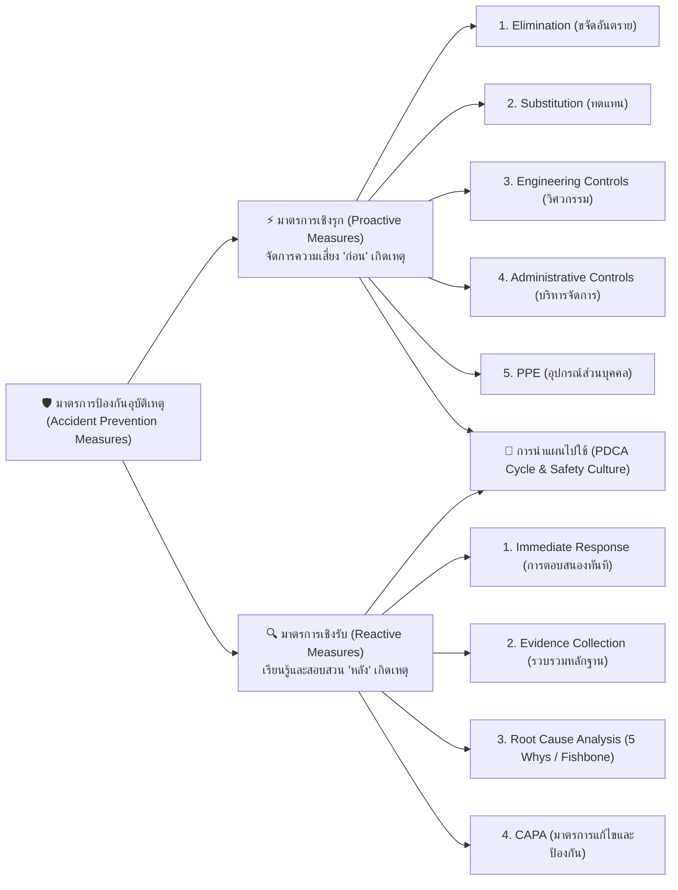
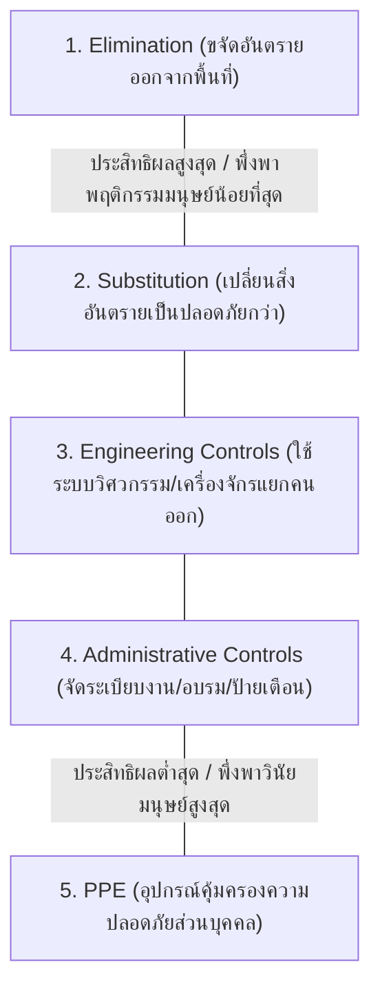
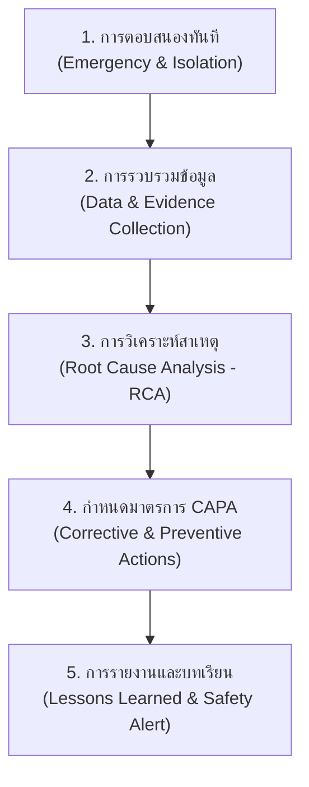
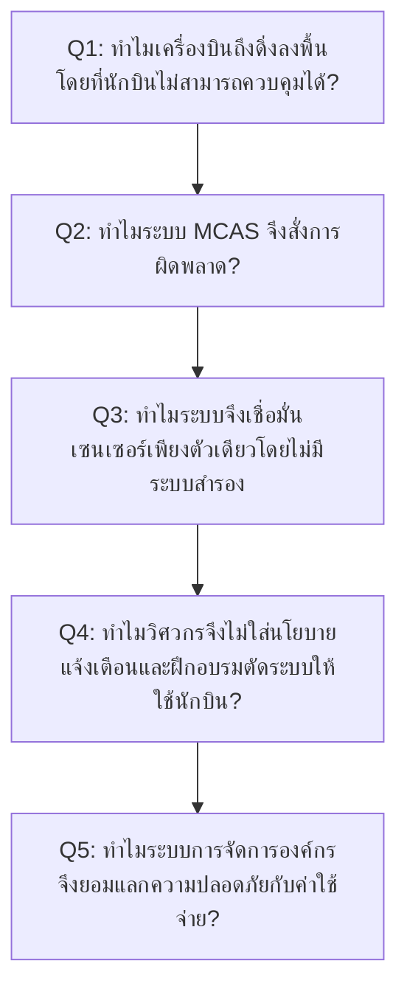
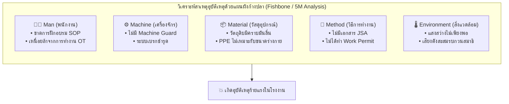
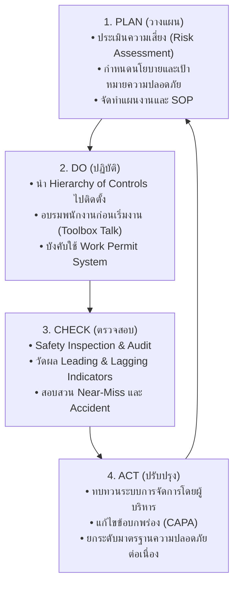

# Week 06: มาตรการป้องกันอุบัติเหตุ (Accident Prevention Measures)

---

## วัตถุประสงค์การเรียนรู้ประจำสัปดาห์ (Learning Objectives)

เมื่อศึกษาเนื้อหาในสัปดาห์นี้แล้ว ผู้เรียนมีความสามารถดังต่อไปนี้
1. **เข้าใจและจำแนกความแตกต่าง** ระหว่างมาตรการป้องกันอุบัติเหตุเชิงรุก (Proactive Measures) และมาตรการป้องกันอุบัติเหตุเชิงรับ (Reactive Measures) ได้อย่างถูกต้อง
2. **ประยุกต์ใช้ลำดับชั้นการควบคุมอันตราย (Hierarchy of Controls)** ทั้ง 5 ระดับ (Elimination, Substitution, Engineering Controls, Administrative Controls, PPE) ในการออกแบบมาตรการความปลอดภัยเชิงรุก
3. **อธิบายขั้นตอนการสอบสวนอุบัติเหตุ (Accident Investigation)** และประยุกต์ใช้เครื่องมือวิเคราะห์สาเหตุรากเหง้า (Root Cause Analysis: RCA) เช่น **5 Whys Analysis** และ **Fishbone Diagram** โดยปรับเปลี่ยนมุมมองจากการ "หาคนผิด" (Finding Fault) เป็น "การหาข้อบกพร่องของระบบ" (Finding Systemic Root Cause)
4. **วางแผนการนำมาตรการความปลอดภัยไปปฏิบัติจริง** ในองค์กรผ่านวงจร **PDCA Cycle** (Plan-Do-Check-Act) และเข้าใจปัจจัยความสำเร็จของการสร้างวัฒนธรรมความปลอดภัย (Safety Culture)

---

## ส่วนที่ 1 บทนำและการปรับเปลี่ยนกระบวนทัศน์ (Paradigm Shift in Safety)

> [!IMPORTANT] ต่อจากสัปดาห์ที่แล้ว
>ในสัปดาห์ที่ 5 เราได้เรียนรู้แล้วว่า อุบัติเหตุไม่ได้เกิดขึ้นจากโชคชะตา แต่เป็นผลลัพธ์จากปฏิกิริยาลูกโซ่ของความบกพร่องในระบบ (ทฤษฎีโดมิโน และ Swiss Cheese Model) คำถามสำคัญสำหรับวิศวกรและผู้บริหารในสัปดาห์นี้คือ **"เราจะหยุดยั้งไม่ให้ลูกโบว์ลิ่งแห่งความสูญเสียกวาดตัวโดมิโนล้มได้อย่างไร?"**  
> 
> คำตอบยู่ที่ **"การบริหารจัดการมาตรการป้องกันอุบัติเหตุ"** ซึ่งเปรียบเสมือนการสร้างระบบภูมิคุ้มกันให้แก่องค์กร โดยแบ่งออกเป็น 2 เสาหลักสำคัญ คือ **มาตรการเชิงรุก (Proactive Measures)** ที่เปรียบเหมือน "การฉีดวัคซีนป้องกันโรคก่อนป่วย" และ **มาตรการเชิงรับ (Reactive Measures)** ที่เปรียบเหมือน "การผ่าตัดชันสูตรหาสาเหตุของโรคเมื่อเกิดการเจ็บป่วย เพื่อสร้างยารักษาไม่ให้เกิดโรคซ้ำ"

---

### 1.1 ตารางเปรียบเทียบมาตรการเชิงรุก (Proactive) vs มาตรการเชิงรับ (Reactive)

| มิติการเปรียบเทียบ               | มาตรการเชิงรุก (Proactive Measures)                                | มาตรการเชิงรับ (Reactive Measures)                                    |
| :------------------------------- | :----------------------------------------------------------------- | :-------------------------------------------------------------------- |
| **ปรัชญาหลัก (Core Philosophy)** | *"ป้องกันก่อนเกิดเหตุ" (Predict & Prevent)*                        | *"เรียนรู้จากความสูญเสียเพื่อไม่ให้เกิดซ้ำ" (Fix & Learn)*            |
| **ช่วงเวลาการทำงาน (Timing)**    | ทำล่วงหน้าก่อนที่อุบัติเหตุจะเกิดขึ้น (Before Event)               | ทำหลังจากเกิดอุบัติเหตุหรือ Incident ขึ้นแล้ว (After Event)           |
| **เป้าหมาย (Goal)**              | ขจัด หรือ ลด Hazard และ Risk ให้อยู่ในระดับยอมรับได้               | ค้นหา Root Cause เพื่อกำหนดมาตรการแก้ไขและป้องกัน (CAPA)              |
| **เครื่องมือที่ใช้ (Tools)**     | Hierarchy of Controls, JSA, Work Permit, Safety Audit              | Accident Investigation, 5 Whys, Fishbone Diagram                      |
| **ดัชนีชี้วัด (Indicators)**     | **Leading Indicators** (จำนวนการซ้อมรับมือ, จำนวนรายงาน Near-Miss) | **Lagging Indicators** (อัตราการบาดเจ็บ LTIFR, ค่าใช้จ่ายความสูญเสีย) |

---

## ส่วนที่ 2 มาตรการป้องกันเชิงรุก (Proactive Measures) และ Hierarchy of Controls

การป้องกันเชิงรุกที่มีประสิทธิภาพสูงสุด ต้องยึดหลัก **Hierarchy of Controls (ลำดับชั้นการควบคุมอันตราย)** ซึ่งจัดลำดับมาตรการจาก "มีประสิทธิผลสูงสุด" ไปยัง "มีประสิทธิผลต่ำสุด"

---

### 2.1 ถ่ายทอดผ่านกรณีศึกษา 5 ตัวละครจากทั่วโลก (Global Character Cases)

เพื่อให้เห็นภาพการประยุกต์ใช้ Hierarchy of Controls ในชีวิตจริงอย่างแจ่มชัด ลองมาดูสถานการณ์การทำงานของตัวละคร 5 คนใน 5 ประเทศทั่วโลก

>[!EXAMPLE] ### 1. เดวิด (David - สหราชอาณาจักร)
>**ตำแหน่ง**  วิศวกรแท่นขุดเจาะน้ำมันกลางทะเลเหนือ (Offshore Energy Platform)

| รายการ                            | รายละเอียด                                                                                                                                                                                                                              |
| --------------------------------- | --------------------------------------------------------------------------------------------------------------------------------------------------------------------------------------------------------------------------------------- |
| สถานการณ์                         | แท่นขุดเจาะต้องมีการซ่อมบำรุงวาล์วก๊าซแรงดันสูง ซึ่งในอดีตวิศวกรต้องมุดเข้าไปในพื้นที่อับอากาศเสี่ยงต่อก๊าซพิษและก๊าซระเบิด                                                                                                             |
| การใช้ Elimination & Substitution | ทีมวิศวกรเลือกใช้ **Elimination (การขจัด)**  - โดยการออกแบบเปลี่ยนระบบวาล์วเป็นแบบถอดประกอบภายนอกผ่านแขนกลอัตโนมัติ ทำให้ไม่ต้องส่งคนเข้าไปในพื้นที่เสี่ยงอับอากาศอีกต่อไป                                                           |
| คำพูดเตือนใจหน้างาน               | "Why put a diver into a hazardous confined space when we can eliminate the risk at the design stage entirely?"      "ทำไมต้องส่งคนลงไปในพื้นที่อับอากาศอันตราย ในเมื่อเราสามารถขจัดความเสี่ยงนั้นออกไปได้ตั้งแต่ขั้นตอนการออกแบบ" |
	
>[!EXAMPLE] ### 2. ฮานส์ (Hans - เยอรมนี)
>**ตำแหน่ง**  นายช่างควบคุมหุ่นยนต์ ในโรงงานประกอบรถยนต์สมาร์ตแฟกทอรี (Automated Automotive Factory)

| รายการ                            | รายละเอียด                                                                                                                                                                                                                                                            |
| --------------------------------- | --------------------------------------------------------------------------------------------------------------------------------------------------------------------------------------------------------------------------------------------------------------------- |
| สถานการณ์                         | ฮานส์ต้องป้อนชิ้นส่วนโครงเหล็กเข้าสู่แขนกลหุ่นยนต์เชื่อมโลหะความเร็วสูง หากแขนกลทำงานขณะมีคนอยู่ข้างใน จะเกิดอันตรายถึงชีวิตทันที                                                                                                                                     |
| การใช้ Elimination & Substitution | เลือกใช้ **Engineering Controls (มาตรการทางวิศวกรรม)** - โรงงานติดตั้ง **Light Curtain (ม่านแสงเซนเซอร์อินฟราเรด)** และระบบ **Safety Interlock** หากร่างของฮานส์ตัดผ่านม่านแสง ระบบไฟฟ้าจะตัดการทำงานของหุ่นยนต์ทันทีใน 0.01 วินาที โดยไม่ต้องรอให้ฮานส์กดปุ่มหยุด |
| คำพูดเตือนใจหน้างาน               | "Verlasse dich nicht auf das menschliche Verhalten, vertraue auf die technische Verriegelung!"  "อย่าฝากชีวิตไว้กับพฤติกรรมมนุษย์ แต่จงเชื่อมั่นในระบบอินเทอร์ล็อคทางวิศวกรรม!"                                                                              |

>[!EXAMPLE] ### 3. ยูกิ (Yuki - ญี่ปุ่น)  
> **ตำแหน่ง**  วิศวกรความปลอดภัย โรงงานประกอบรถยนต์โตโยต้า (Toyota Assembly Plant)

| รายการ                            | รายละเอียด                                                                                                                                                                                                                                                                                         |
| --------------------------------- | -------------------------------------------------------------------------------------------------------------------------------------------------------------------------------------------------------------------------------------------------------------------------------------------------- |
| สถานการณ์                         | ยูกิต้องควบคุมความปลอดภัยในการเดินผ่านทางตัดแยกระหว่างคนเดินเท้ากับเส้นทางรถลากชิ้นส่วน (Tugger Train / AGV) และการส่งชิ้นส่วนอะไหล่หนักข้ามสายการผลิต                                                                                                                                              |
| การใช้ Administrative Controls & Karakuri | **1. Shisa Koshō (指差呼称):** หยุดตรงทางแยก มองและชี้นิ้วไป **3 ทิศทาง (ขวา ซ้าย ตรงไป)** พร้อมส่งเสียง "Yoshi!" เพื่อตั้งสติก่อนข้าม **2. Pull-inward Gate Protocol:** ออกแบบประตูกั้นทางเดินให้ต้อง **"ดึงเข้าหาตัวเท่านั้น"** ห้ามผลักออก เพื่อไม่ให้บานประตูยื่นไปล้ำเลนรถลาก **3. Karakuri Kaizen (กลไกคาราคุริ):** ใช้ระบบลำเลียง Overhead ชิ้นส่วนแบบไม่ใช้ไฟฟ้า โดยใช้แรงโน้มถ่วงและลูกตุ้มถ่วงน้ำหนัก (Engineering Control & Ergonomics) |
| คำพูดเตือนใจหน้างาน               | "Migi Yoshi! Hidari Yoshi! Mae Yoshi! Anzen Kakunin Yoshi!"  (ขวาปลอดภัย! ซ้ายปลอดภัย! ตรงไปปลอดภัย! ตรวจสอบความปลอดภัย... เรียบร้อย!)                                                                                                                                                          |

>[!EXAMPLE] ### 4. ซาร่าห์ (Sarah - สหรัฐอเมริกา)  
> **ตำแหน่ง**  ช่างประกอบโครงเหล็กตึกสูง 50 ชั้น (High-rise Ironworker)

| รายการ                               | รายละเอียด                                                                                                                                                                                                                                                       |
| ------------------------------------ | ---------------------------------------------------------------------------------------------------------------------------------------------------------------------------------------------------------------------------------------------------------------- |
| สถานการณ์                            | ซาร่าห์ต้องเดินบนคานเหล็กความสูง 150 เมตรเหนือพื้นดิน ในพื้นที่ที่ยังไม่สามารถติดตั้งราวกั้นตก (Guardrail) ได้                                                                                                                                                   |
| การใช้ PPE เป็น Last Line of Defense | สวมใส่ชุด **Full Body Harness**  - พร้อมสายรัดนิรภัยแบบสองตะขอ (Double Lanyard with Shock Absorber) คล้องไว้กับสายช่วยชีวิต (Lifeline) ตลอดเวลา                                                                                                               |
| คำพูดเตือนใจหน้างาน                  | "Your harness is your last line of defense. If Engineering Controls fail, this strap is the only thing between you and gravity!"  "ชุดฮาร์เนสคือปราการด่านสุดท้ายของคุณ ถ้าวิศวกรรมป้องกันไม่ได้ สายรัดนี้คือสิ่งเดียวที่กั้นระหว่างคุณกับแรงโน้มถ่วงโลก!" |

>[!EXAMPLE] ### 5. วิชัย (Vichai - ประเทศไทย)  
> **ตำแหน่ง**  หัวหน้าช่างโรงงานสิ่งทอและฟอกย้อม

| รายการ                            | รายละเอียด                                                                                                                                                                                                                                            |
| --------------------------------- | ----------------------------------------------------------------------------------------------------------------------------------------------------------------------------------------------------------------------------------------------------- |
| สถานการณ์                         | โรงงานเดิมมีไอระเหยสารเคมีและเสียงดังจากเครื่องจักร พนักงานมักปฏิเสธการใส่ PPE เพราะร้อนและรำคาญ                                                                                                                                                      |
| การบูรณาการ Hierarchy of Controls | ไม่บังคับพนักงานแจกแต่หน้ากาก (PPE)  - แต่เริ่มจากติดตั้ง **ระบบดูดระบายอากาศท้องถิ่น (Local Exhaust Ventilation - Engineering Control)** และทำ **SOP การสลับกะทำงานทุก 2 ชั่วโมง (Job Rotation - Administrative Control)** ทำให้ปริมาณสารเคมีลดลง |

---

### 2.2 สรุปการจำแนกมาตรการใน Hierarchy of Controls

| ระดับที่ | มาตรการ | หลักการทำงาน | ตัวอย่างในทางปฏิบัติ | ประสิทธิผล |
| :---: | :--- | :--- | :--- | :---: |
| **1** | **Elimination** *(ขจัด)* | เลิกใช้วิธีการ สารเคมี หรือเครื่องจักรที่อันตรายออกไปทั้งหมด | เปลี่ยนจากกระบวนการเชื่อมโลหะแบบมีควันพิษ เป็นการยึดน็อตสลักโครงสร้าง | **สูงสุด (100%)** |
| **2** | **Substitution** *(ทดแทน)* | เปลี่ยนไปใช้สิ่งอื่นที่มีอันตรายน้อยกว่า | เปลี่ยนตัวทำละลายอินทรีย์ทินเนอร์ เป็นสารล้างสูตรน้ำ (Water-based) | **สูง** |
| **3** | **Engineering Controls** *(วิศวกรรม)* | ออกแบบสิ่งกั้นหรือระบบเครื่องจักรแยกคนออกจากอันตราย | การติดฝาครอบเครื่องจักร (Machine Guard), เซนเซอร์ม่านแสง, การกั้นห้องลดเสียง | **ปานกลาง-สูง** |
| **4** | **Administrative Controls** *(บริหารจัดการ)* | ออกกฎระเบียบ ขั้นตอนงาน ป้ายเตือน และการฝึกอบรม | ระบบใบอนุญาตทำงานเสี่ยง (Work Permit), การสลับกะงาน (Job Rotation), JSA, SOP | **ปานกลาง** |
| **5** | **PPE** *(อุปกรณ์ส่วนบุคคล)* | สวมใส่อุปกรณ์ลดความรุนแรงเมื่ออันตรายมาถึงตัว | หมวกเซฟตี้, แว่นตากันสารเคมี, ปลั๊กอุดหู, รองเท้าหัวเหล็ก, ถุงมือกันบาด | **ต่ำสุด** *(พึ่งพาวินัยคน)* |

---

## 🔍 ส่วนที่ 3: มาตรการป้องกันเชิงรับ (Reactive Measures) และการสอบสวนอุบัติเหตุ

> [!IMPORTANT] **บทนำ**  
> แม้เราจะพยายามป้องกันเชิงรุกอย่างเต็มที่ แต่เมื่ออุบัติเหตุหรือเหตุการณ์เกือบเกิดอุบัติเหตุ (Near-Miss) เกิดขึ้น สิ่งสำคัญที่สุดคือ **"เราจะตอบสนองต่อมันอย่างไร?"**  
> 
> ในองค์กรยุคเก่า เมื่อเกิดอุบัติเหตุ ผู้บริหารมักถามว่า *"ใครทำพลาด? ใครต้องถูกลงโทษ?"* (**Finding Fault**) ซึ่งผลลัพธ์คือพนักงานจะปกปิดข้อมูล แอบซ่อน Near-Miss และทำให้ภัยซ่อนเร้นคงอยู่ต่อไป  
> ในทางกลับกัน องค์กรที่มีวัฒนธรรมความปลอดภัยระดับโลกจะเปลี่ยนคำถามเป็น **"เกิดอะไรขึ้นในระบบของเรา? ทำไมระบบจึงยอมให้เกิดเหตุการณ์นี้ได้?"** (**Finding Root Cause**) เพื่อนำบทเรียนนั้นมาปิดช่องโหว่

---

### 3.1 ขั้นตอนการสอบสวนอุบัติเหตุอย่างเป็นระบบ (Accident Investigation Steps)

| ลำดับ | การกระทำ                                                         | ตัวอย่าง actions                                                                                                                                                                                                                                                                                                       |
| ----- | ---------------------------------------------------------------- | ---------------------------------------------------------------------------------------------------------------------------------------------------------------------------------------------------------------------------------------------------------------------------------------------------------------------- |
| 1     | **การตอบสนองทันที  (Immediate Response)**                     | - ปฐมพยาบาลผู้บาดเจ็บ - ระงับเหตุฉุกเฉิน  - และกั้นพื้นที่เกิดเหตุ (Preserve the Scene)  - ห้ามเคลื่อนย้ายพยานวัตถุ                                                                                                                                                                                           |
| 2     | **การรวบรวมข้อมูลและหลักฐาน  (Evidence Collection)**          | **ใช้หลัก 4Ps** 1. **People** สัมภาษณ์ผู้บาดเจ็บ ประสบการณ์ทำงาน และผู้เห็นเหตุการณ์ (เน้นการรับฟัง ไม่จับผิด) 2. **Position** ถ่ายภาพ บันทึกตำแหน่งบุคคล เครื่องจักร และรอยไถล 3. **Parts** ตรวจสอบชิ้นส่วนอุปกรณ์ สายไฟ ฝาครอบที่ชำรุด 4. **Paper** ตรวจสอบเอกสาร SOP, Work Permit, ประวัติการบำรุงรักษา |
| 3     | **การวิเคราะห์สาเหตุรากเหง้า  (Root Cause Analysis - RCA)**   | ใช้เครื่องมือวิเคราะห์ เช่น **5 Whys Analysis** หรือ **Fishbone Diagram**                                                                                                                                                                                                                                              |
| 4     | **การกำหนดมาตรการ CAPA  (Corrective and Preventive Actions)** | **Corrective Action (การแก้ไขทันที)**  - ซ่อมแซมสายไฟที่ขาด - ทำความสะอาดคราบน้ำมัน **Preventive Action (การป้องกันเกิดซ้ำ)**  - เปลี่ยนระบบแผนบำรุงรักษาเชิงป้องกัน (PM) - ติดตั้งระบบตัดไฟอัตโนมัติ                                                                                                   |
| 5     | **การรายงานและสื่อสารบทเรียน  (Safety Alert Sharing)**        | ส่งสรุปบทเรียนเรียนรู้แจ้งทุกแผนกในองค์กรเพื่อป้องกันเหตุเกิดซ้ำในจุดอื่น                                                                                                                                                                                                                                              |

---

### 3.2 เครื่องมือวิเคราะห์สาเหตุรากเหง้า: 5 Whys Analysis

**5 Whys Analysis** คือการถามคำถามว่า *"ทำไม"* ต่อเนื่องกันอย่างน้อย 5 ครั้ง เพื่อเจาะลึกผ่าน "สาเหตุทางตรง" ไปสู่ "สาเหตุรากเหง้าเชิงบริหารจัดการ"

> [!EXAMPLE] #### **กรณีศึกษาระดับโลก บทเรียนอุบัติเหตุเครื่องบิน Boeing 737 MAX (MCAS System Failure)**
> **เมื่อซอฟต์แวร์สู้กับนักบิน ผลคือเครื่องบินโหม่งโลก**  
> ในปี 2018–2019 เกิดโศกนาฏกรรมทางการบินระดับโลก เมื่อเครื่องบินรุ่นใหม่ล่าสุด **Boeing 737 MAX** ตกติดต่อกัน 2 ลำในเวลาห่างกันเพียงไม่กี่เดือน (สายการบิน Lion Air **เที่ยวบิน 610** และ Ethiopian Airlines **เที่ยวบิน 302** ) พุ่งดิ่งลงพื้นดินด้วยความเร็วสูง ทำให้มีผู้เสียชีวิตรวม 346 คน  
> 
> สิ่งที่น่าตกใจที่สุดคือ **นักบินทั้งสองเที่ยวบิน พยายามยื้อคันบังคับอย่างสุดชีวิตเพื่อเชิดหัวเครื่องบินขึ้น แต่ระบบคอมพิวเตอร์อัตโนมัติกดหัวเครื่องบินลงซ้ำๆ จนดิ่งชนพื้น!**  
> 
> สาเหตุทางเทคนิคเกิดจากระบบซอฟต์แวร์ใหม่ **MCAS (Maneuvering Characteristics Augmentation System)** ซึ่งถูกออกแบบมาเพื่อป้องกันเครื่องบินร่วงหลอด (Stall) แต่กลับได้รับข้อมูลจาก **เซนเซอร์วัดมุมปะทะ (AoA Sensor) ที่ส่งค่าผิดพลาดเพียงตัวเดียว!** ทว่าเมื่อนำเทคนิค **5 Whys Analysis** มาสืบสวนเจาะลึก เราจะพบว่าสาเหตุแท้จริงไม่ได้หยุดอยู่แค่ระบบคอมพิวเตอร์หรือเซนเซอร์ แต่เกิดจากแรงกดดันทางการแข่งขันทางธุรกิจและการบริหารจัดการขององค์กรที่ปิดบังข้อมูลระบบนี้เพื่อประหยัดงบฝึกอบรมนักบิน!

### 1. Why แรก (Level: Physical Root Cause)

- **ถาม** ทำไมเครื่องบินถึงดิ่งลงพื้นโดยที่นักบินไม่สามารถควบคุมได้?
    
- **ตอบ** เพราะระบบซอฟต์แวร์อัตโนมัติที่ชื่อว่า **MCAS (Maneuvering Characteristics Augmentation System)** สั่งการให้แพนหางระดับ (Stabilizer) ปรับมุมกดหัวเครื่องบินลงซ้ำ ๆ โดยที่นักบินไม่สามารถหักล้างการทำงานของระบบได้ทันเวลา
    

### 2. Why ที่สอง (Level: Technical & Design Failure)

- **ถาม** แล้วทำไม MCAS ถึงทำงานผิดพลาดและกดหัวเครื่องบินลง?
    
- **ตอบ** เพราะ MCAS ได้รับข้อมูลที่ผิดพลาดจาก **เซนเซอร์วัดมุมปะทะ (AoA Sensor)** ที่ส่งค่าว่าเครื่องบินกำลังเชิดหัวสูงเกินไป (เสี่ยงต่อการร่วงหลง / Stall) ทั้งที่ความจริงเครื่องบินบินในระดับปกติ
    

### 3. Why ที่สาม (Level: Systems Engineering Failure)

- **ถาม ** แล้วทำไมระบบสำคัญที่ควบคุมการบินถึงถูกออกแบบให้พึ่งพาเซนเซอร์เพียงตัวเดียว (Single Point of Failure) โดยไม่มีระบบสำรอง (Redundancy)?
    
- **ตอบ** เพราะวิศวกร Boeing ประเมินว่า MCAS เป็นเพียงระบบเสริมเล็กๆ ที่ทำงานไม่รุนแรง นักบินสามารถแก้ไขได้ง่ายด้วยวิธีปกติ จึงไม่ได้ใส่ระบบตรวจสอบเซนเซอร์แบบ cross-check และ **ไม่ได้ใส่ข้อมูลระบบ MCAS ไว้ในคู่มือการบิน** เพื่อไม่ให้คู่มือซับซ้อนขึ้น
    

### 4. Why ที่สี่ (Level: Commercial & Competitive Pressure)

- **ถาม** แล้วทำไม Boeing ถึงตัดลดรายละเอียดข้อมูลคู่มือและพยายามหลีกเลี่ยงไม่ให้การมีอยู่ของ MCAS ส่งผลกระทบต่อการฝึกอบรมนักบิน?
    
- **ตอบ** เพราะ Boeing กำลังเร่งเปิดตัว 737 MAX เพื่อแข่งกับ **Airbus A320neo** และได้ให้คำมั่นสัญญาทางการค้ากับสายการบินว่า _"นักบินที่เคยบิน 737 NG สามารถบิน 737 MAX ได้ทันที โดยไม่ต้องเข้าฝึกในเครื่องฝึกบินจำลอง (Simulator) ใหม่"_ หากต้องมีการเทรนใน Simulator เพิ่มเติม สายการบินจะมีต้นทุนสูงขึ้น และ Boeing อาจเสียลูกค้าให้ Airbus
    

### 5. Why ที่ห้า (Level: Organizational Culture & Management Failure)

- **ถาม** แล้วทำไมองค์กรอย่าง Boeing ที่เคยขึ้นชื่อเรื่องความเป็นเลิศทางวิศวกรรมและความปลอดภัย ถึงยอมปล่อยให้แรงกดดันทางการตลาดมาอยู่เหนือมาตรฐานความปลอดภัย?
    
- **ตอบ** **(Root Cause)** 
  1. การเปลี่ยนแปลงทางวัฒนธรรมองค์กรอย่างยั่งยืนหลังการควบรวมกิจการกับ McDonnell Douglas ที่ปรับเป้าหมายจากการเป็น "Engineering-first" ไปสู่ "Financial-first" มุ่งเน้นมูลค่าหุ้น ผลกำไรระยะสั้น และกรอบเวลาที่กระชั้น 
  2. หน่วยงานกำกับดูแลอย่าง FAA (Federal Aviation Administration) ให้อำนาจ Boeing ในการตรวจสอบและรับรองความปลอดภัยของตัวเอง (ODA Program) ทำให้ขาดการตรวจสอบถ่วงดุลอย่างแท้จริง

***อ้างอิง***  [Summary of the FAA’s Review of the Boeing 737 MAX](References/737_RTS_Summary.pdf)

---
### 3.3 เครื่องมือวิเคราะห์สาเหตุรากเหง้า: แผนผังก้างปลา (Fishbone / Ishikawa Diagram)

เมื่ออุบัติเหตุมีความซับซ้อนและเกิดจากหลายปัจจัยร่วมกัน เราจะใช้ **Fishbone Diagram** จำแนกสาเหตุออกเป็น 5 หมวดหมู่หลัก (**5M**)

---

## 🔄 ส่วนที่ 4: การนำแผนไปใช้และการสร้างวัฒนธรรมความปลอดภัย (Plan Implementation & Safety Culture)

> [!IMPORTANT]
> *"แผนงานความปลอดภัยที่เขียนไว้อย่างสวยงามในเล่มรายงาน จะไม่มีค่าอะไรเลย หากมันไม่ถูกนำไปปฏิบัติจริงในพื้นที่ทำงาน"*  
> 
> การขับเคลื่อนงานความปลอดภัยให้ประสบความสำเร็จอย่างยั่งยืน ต้องอาศัย **วงจร PDCA (Plan-Do-Check-Act)** ควบคู่กับการสร้าง **วัฒนธรรมความปลอดภัย (Safety Culture)** ที่มีผู้นำเป็นแบบอย่าง

---

### 4.1 วงจร PDCA ในงานบริหารความปลอดภัย

---

### 4.2 กรณีศึกษาระดับโลก: การพลิกโฉมองค์กร Alcoa ด้วยความปลอดภัย (Paul O'Neill's Safety Transformation)

>[!EXAMPLE] ####  เรื่องเล่าบทเรียนความสำเร็จ (Global Success Case)
ในปี ค.ศ. 1987 **พอล โอเนีลล์ (Paul O'Neill)** ได้เข้ารับตำแหน่ง CEO คนใหม่ของ **Alcoa (Aluminum Company of America)** ยักษ์ใหญ่แห่งอุตสาหกรรมอลูมิเนียมของโลก ในการประชุมผู้ถือหุ้นและนักลงทุนครั้งแรกที่นิวยอร์ก นักลงทุนต่างคาดหวังว่าเขาจะพูดถึงอัตรากำไร ยอดขาย หรือการลดต้นทุน  
ทว่า พอล โอเนีลล์ ก้าวขึ้นเวทีแล้วกล่าวคำพูดที่ทำให้นักวิเคราะห์ Wall Street ถึงกับตกตะลึง  
*"I want to talk to you about worker safety. Every year, numerous Alcoa workers are injured so badly that they miss a day of work. Our safety record is not awful, but it's not world-class. I intend to make Alcoa the safest company in America. I intend to go for zero injuries!"*  
 🇹🇭 *(**แปลไทย** "ผมอยากจะคุยกับทุกท่านเรื่องความปลอดภัยของคนทำงาน ทุกๆ ปี มีพนักงาน Alcoa บาดเจ็บเจ็บหนักจนต้องหยุดงานมากมาย สถิติความปลอดภัยของเราไม่ได้แย่ที่สุด แต่ยังไม่ใช่ระดับโลก ผมตั้งใจจะทำให้ Alcoa เป็นบริษัทที่ปลอดภัยที่สุดในอเมริกา เป้าหมายของผมคืออุบัติเหตุต้องเป็นศูนย์!")*

นักลงทุนหลายคนตื่นตระหนกและรีบขายหุ้น Alcoa ทิ้งทันทีเพราะคิดว่า CEO คนนี้ "บ้าไปแล้ว" ที่เน้นเรื่องความปลอดภัยแทนเรื่องกำไร
`
#### 💡 ผลลัพธ์จากการขับเคลื่อนด้วย PDCA และ Leadership Commitment

| หัวข้อ        | Actions                                                                                                                                                           |
| ------------- | ----------------------------------------------------------------------------------------------------------------------------------------------------------------- |
| **P - Plan**  | โอเนีลล์ประกาศนโยบายว่า หากเกิดอุบัติเหตุบาดเจ็บขึ้นที่โรงงานใดในโลก  **ผู้จัดการโรงงานนั้นต้องรายงานตรงต่อเขานำเสนอแผนแก้ไขภายใน 24 ชั่วโมง!**                |
| **D - Do**    | ปรับปรุงมาตรการทางวิศวกรรม ปิดกั้นจุดเสี่ยง และเปิดช่องทางให้พนักงานระดับล่างสุดโทรศัพท์หา CEO ได้โดยตรงหากเห็นสภาพการทำงานที่ไม่ปลอดภัย                          |
| **C - Check** | ตรวจสอบดัชนีชี้วัด Leading Indicators ทุกวัน หากพบ Near-Miss ให้เร่งแก้ไขก่อนเกิดเหตุจริง                                                                         |
| **A - Act**   | เมื่อกระบวนการความปลอดภัยได้รับการปรับปรุง การสื่อสารระหว่างฝ่ายบริหารกับพนักงานเปิดกว้าง ข้อผิดพลาดในสายการผลิตอลูมิเนียมลดลง คุณภาพสินค้าสูงขึ้นอย่างเห็นได้ชัด |

**ผลลัพธ์สุดท้าย:**  
ภายในระยะเวลาเพียงไม่กี่ปี อัตราการบาดเจ็บของ Alcoa ลดลงเหลือเพียง **1 ใน 20 ของค่าเฉลี่ยอุตสาหกรรมสหรัฐฯ** และที่น่าทึ่งคือ **กำไรสุทธิของ Alcoa พุ่งสูงขึ้นถึง 5 เท่า** และมูลค่าตลาดของบริษัทเพิ่มขึ้นจาก 3 พันล้านดอลลาร์ เป็น 27 พันล้านดอลลาร์!

>[!TIP] **สรุปบทเรียน:**  
> **"Safety is not a cost center, but a strategic habit of excellence."**  
> *(ความปลอดภัยไม่ใช่ภาระค่าใช้จ่าย แต่คือวัฒนธรรมแห่งความยอดเยี่ยมที่ขับเคลื่อนองค์กรให้เติบโตอย่างยั่งยืน)*

---

## 📝 สรุปสาระสำคัญสำหรับผู้เรียน (Key Takeaways)

1. **มาตรการเชิงรุก (Proactive)** ต้องมาก่อนเสมอ โดยยึด **Hierarchy of Controls** 
     - พยายาม Elimination และ Engineering Controls ก่อนที่จะพึ่งพาเพียงแค่ป้ายเตือนหรือ PPE
2. **มาตรการเชิงรับ (Reactive)** ต้องเน้น **Finding Root Cause, Not Finding Fault**
     - การสอบสวนอุบัติเหตุทำขึ้นเพื่อซ่อมแซมระบบ ไม่ใช่การหาคนผิดมาลงโทษ
3. **5 Whys Analysis** 
    - เป็นเครื่องมือทรงพลังที่ช่วยให้วิศวกรมองข้ามพฤติกรรมส่วนบุคคล แล้วเจาะลึกไปถึงข้อบกพร่องในระบบการบริหารจัดการ
4. **การนำแผนไปใช้จริง**
    - ต้องขับเคลื่อนผ่านวงจร **PDCA** และต้องเริ่มจาก **Leadership Commitment** ของผู้บริหารที่แสดงให้พนักงานเห็นว่า *"ความปลอดภัยสำคัญกว่าผลกำไรระยะสั้น"*

## 🔍 แบบฝึกหัดทดสอบความเข้าใจ (Self-Assessment Questions)

เลือกตอบข้อต่อไปนี้

**ข้อ 1: ตามหลักการ Hierarchy of Controls มาตรการใดมีประสิทธิภาพในการป้องกันอุบัติเหตุสูงสุด?**
1. การติดป้ายเตือนอันตราย (Warning Signs) 
2. การสวมใส่อุปกรณ์ป้องกัน (PPE)
3. การยกเลิกการทำงานอันตรายนั้น (Elimination) 
4. การอบรมให้พนักงานตื่นตัว (Training)

**ข้อ 2: วัตถุประสงค์หลักของการใช้เทคนิค "5 Whys Analysis" ในการสอบสวนอุบัติเหตุคืออะไร?**
1. หาตัวผู้รับผิดชอบเพื่อลงโทษ 
2. ค้นหาความผิดพลาดของพนักงานรายบุคคล
3. เจาะลึกไปถึงรากของปัญหา (Root Cause) เพื่อป้องกันไม่ให้เกิดซ้ำ
4. ลดระยะเวลาในการรายงานอุบัติเหตุ

**ข้อ 3: กรณีศึกษาของ Alcoa ภายใต้การนำของพอล โอเนีลล์ พิสูจน์ให้เห็นถึงหลักการสำคัญข้อใด?**
1. ความปลอดภัยคือต้นทุนคงที่ที่ต้องยอมรับ
2. การลดต้นทุนการผลิตต้องทำเป็นอันดับแรก
3. ความปลอดภัยสามารถขับเคลื่อนนวัตกรรมและสร้างกำไรได้จริง (Safety as a Strategic Habit)
4. การสื่อสารภายในองค์กรไม่จำเป็นต่อความปลอดภัย

---

>[!NOTE]- **เฉลยคำตอบ** (คลิกเพื่อดูเฉลย)
> **ข้อ 1: ตอบ 3. การยกเลิกการทำงานอันตรายนั้น (Elimination)**   
>     ตามลำดับชั้นความปลอดภัย (Hierarchy of Controls) วิธีที่มีประสิทธิภาพสูงสุดคือการกำจัดอันตรายออกไปตั้งแต่ต้น แทนที่จะพึ่งพาวิธีอื่นที่รองลงมา 
>  **ข้อ 2: ตอบ 3. เจาะลึกไปถึงรากของปัญหา (Root Cause) เพื่อป้องกันไม่ให้เกิดซ้ำ**   
>     5 Whys ไม่ได้มุ่งหาคนผิด แต่ต้องการค้นหาสาเหตุที่แท้จริงของปัญหา เพื่อแก้ไขที่ต้นตอ 
>   **ข้อ 3: ตอบ 3. ความปลอดภัยสามารถขับเคลื่อนนวัตกรรมและสร้างกำไรได้จริง (Safety as a Strategic Habit)**  
>     กรณี Alcoa แสดงให้เห็นว่า เมื่อผู้นำให้ความสำคัญกับความปลอดภัยอย่างแท้จริง จะนำไปสู่การปรับปรุงกระบวนการผลิต คุณภาพสินค้า และผลกำไรที่ดีขึ้น

---

### การบ้าน
- ค้นคว้าเพิ่มเติมเกี่ยวกับงบประมาณในการร่างกฎหมายเกี่ยวกับความปลอดภัย เทียบกับค่าใช้จ่ายในการซื้อ PPE
    เช่น งบประมาณในการร่าง พ.ร.บ. ความปลอดภัย อาชีวอนามัย และ สวัสดิการแรงงาน พ.ศ. 2551 เทียบกับค่าใช้จ่ายในการซื้อ PPE
    หรือ งบประมาณในการร่าง พ.ร.บ. จราจร เทียบกับการซื้อหมวกนิรภัย สร้างโรบงพยาบาล หรือ ซื้อเครื่องมือกู้ชีพ   

---
