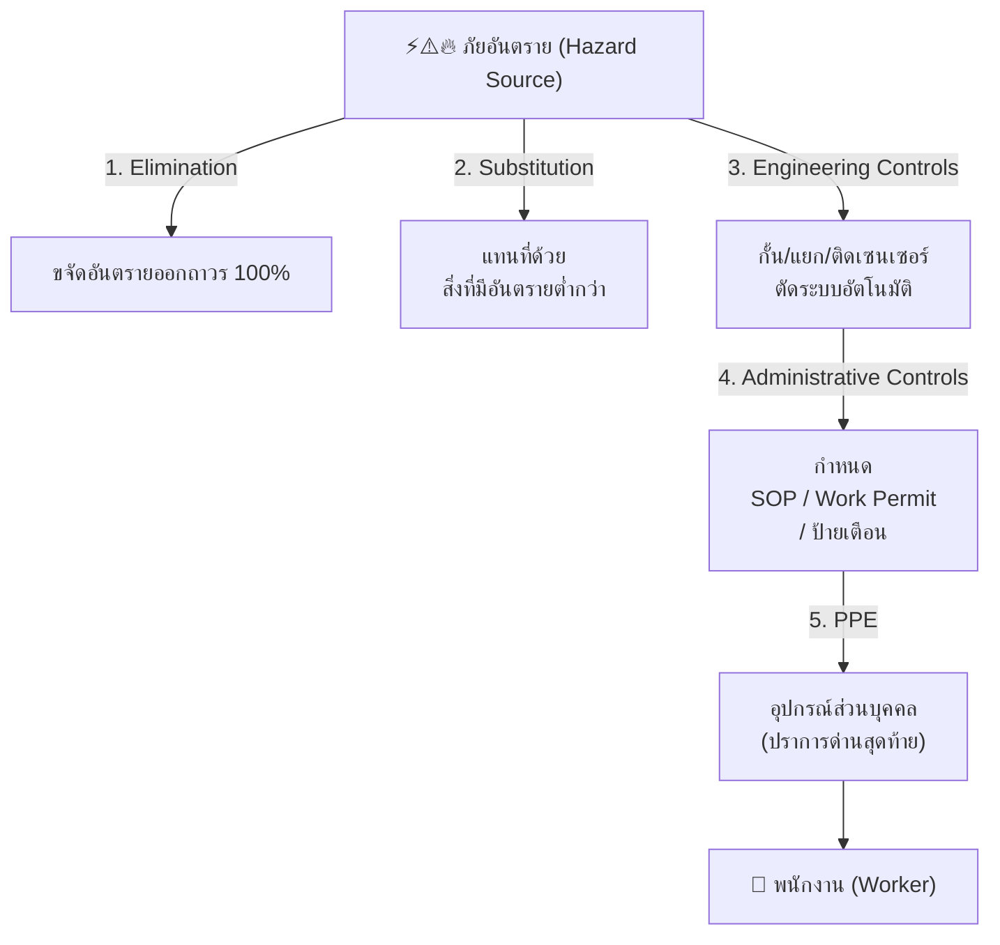
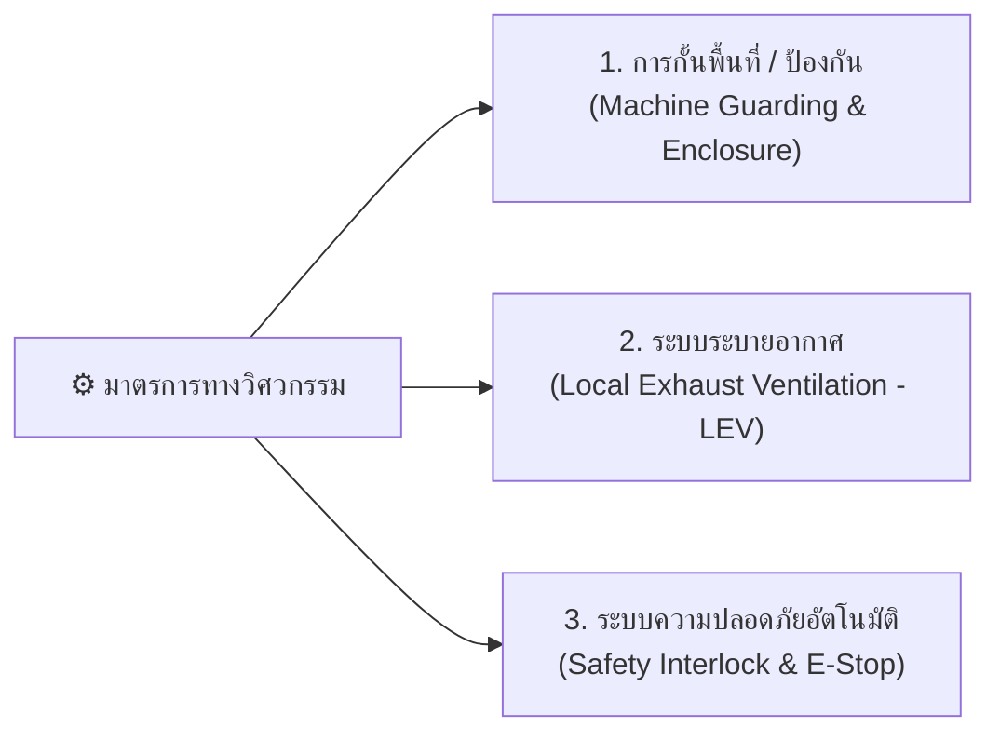
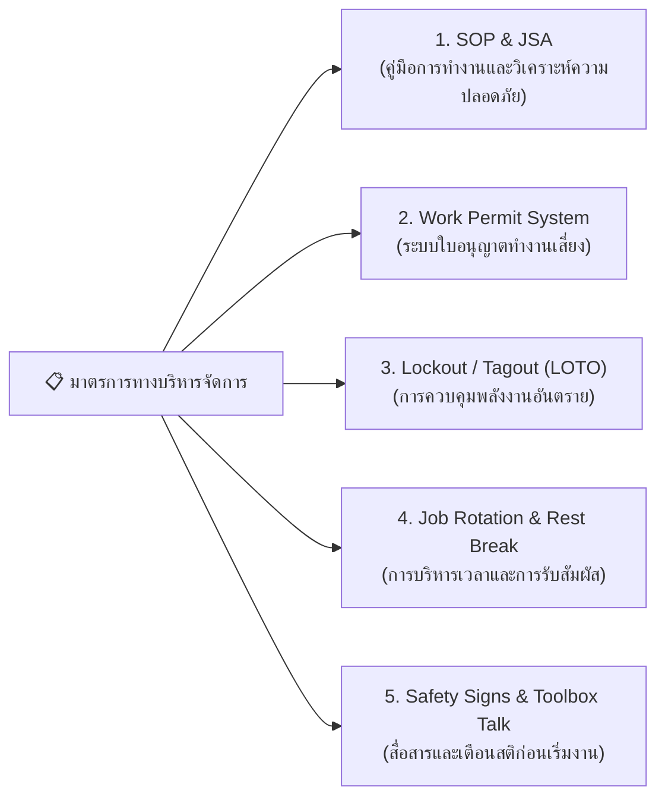
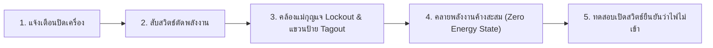

# Week 06-02 มาตรการป้องกันเชิงรุก (Proactive Measures)

---

## แนวคิดหลัก "การจัดการความเสี่ยงล่วงหน้าก่อนเกิดเหตุ" (Predict & Prevent)

>[!IMPORTANT]   
> ในโลกวิศวกรรมความปลอดภัย ปรัชญาที่เป็นรากฐานสำคัญที่สุดคือ **"การไม่ปล่อยให้ความปลอดภัยขึ้นอยู่กับโชคชะตาหรือสติปัญญาของพนักงานเพียงอย่างเดียว"**  
> 
> มนุษย์ทุกคนมีความล้า มีความเผลอเลอ และมีโอกาสตัดสินใจผิดพลาดได้ตลอดเวลา ดังนั้น **มาตรการป้องกันเชิงรุก (Proactive Measures)** จึงออกแบบมาเพื่อสร้าง "ปราการป้องกันหลายชั้น" โดยยึดหลัก **Hierarchy of Controls (ลำดับชั้นการควบคุมอันตราย)** เพื่อจัดการความเสี่ยงตั้งแต่แหล่งกำเนิด ก่อนที่อันตรายจะเข้าถึงตัวพนักงาน

---

## 1. มาตรการขจัดและการทดแทน (Elimination & Substitution)

สองระดับแรกของ Hierarchy of Controls ถือเป็นมาตรการที่มี **ประสิทธิผลสูงสุด** เพราะเป้าหมายคือการทำให้อันตรายนั้นหมดไป หรือลดระดับความรุนแรงลงตั้งแต่ต้นทาง

### 1.1 การขจัดอันตราย (Elimination)

| รายการ         | รายละเอียด / ตัวอย่าง                                                                                                                                                                                                                                                                                                                                                                                                                           |
| -------------- | ----------------------------------------------------------------------------------------------------------------------------------------------------------------------------------------------------------------------------------------------------------------------------------------------------------------------------------------------------------------------------------------------------------------------------------------------- |
| **แนวคิด**     | ยกเลิกขั้นตอน งาน สารเคมี หรืออุปกรณ์ที่เป็นอันตรายออกไปโดยเด็ดขาด                                                                                                                                                                                                                                                                                                                                                                              |
| **การปฏิบัติ** | **อุตสาหกรรมก่อสร้าง**    - เปลี่ยนจากการส่งคนปีนขึ้นไปตรวจสอบรอยแตกร้าวของปล่องควันสูง 100 เมตร มาใช้ **โดรนถ่ายภาพความละเอียดสูง (Drone Inspection)** แทน    ส่งผลให้ความเสี่ยงจากการตกร่วงจากที่สูงของพนักงานกลายเป็น **ศูนย์ (Eliminated)** **อุตสาหกรรมอิเล็กทรอนิกส์**    - เปลี่ยนจากการออกแบบบอร์ดที่ต้องใช้คนบัดกรีด้วยมือในพื้นที่อับอากาศ มาใช้ **แขนกลอัตโนมัติ (Automated Robotic Soldering)** ทำหน้าที่แทนทั้งหมด  |

### 1.2 การทดแทนด้วยสิ่งอื่นที่ปลอดภัยกว่า (Substitution)
| รายการ         | รายละเอียด / ตัวอย่าง                                                                                                                                                                                                                              |
| -------------- | -------------------------------------------------------------------------------------------------------------------------------------------------------------------------------------------------------------------------------------------------- |
| **แนวคิด**     | หากไม่สามารถยกเลิกงานได้ ให้เปลี่ยนไปใช้สารเคมี อุปกรณ์ หรือกระบวนการใหม่ที่มีความเสี่ยงต่ำกว่า                                                                                                                                                    |
| **การปฏิบัติ** | **อุตสาหกรรมสิ่งทอและฟอกย้อม**  - เปลี่ยนจากการใช้ตัวทำละลายอินทรีย์กัดกร่อนรุนแรง (Solvent-based Cleaner) ที่เสี่ยงต่อการเกิดมะเร็งและไฟไหม้  มาใช้ **สารทำความสะอาดสูตรน้ำ (Water-based Degreaser)** ที่ไม่มีไอระเหยเป็นพิษและไม่ติดไฟ  |

---

## 2. ⚙️ มาตรการทางวิศวกรรม (Engineering Controls)

>[!IMPORTANT]
> มาตรการทางวิศวกรรมเป็นวิธีการที่มีประสิทธิผลสูงมาก เพราะ **"ไม่ต้องพึ่งพาวินัยหรือพฤติกรรมมนุษย์"** ระบบจะทำหน้าที่ปกป้องพนักงานโดยอัตโนมัติ

### 2.1 การติดตั้งฝาครอบป้องกันเครื่องจักร (Machine Guarding)

| รายการ         | รายละเอียด / ตัวอย่าง                                                                                                                                                                    |
| -------------- | ---------------------------------------------------------------------------------------------------------------------------------------------------------------------------------------- |
| **แนวคิด**     | สร้างสิ่งกั้นทางกายภาพไม่ให้ส่วนหมุน ส่วนหนีบ หรือชิ้นส่วนตัดของเครื่องจักรเข้าถึงร่างกายคนได้                                                                                           |
| **การปฏิบัติ** | **อุตสาหกรรมปั๊มขึ้นรูปโลหะ**  - การติด **Fixed Guard (แผงกั้นถาวร)** ช่วยปิดช่องทางไม่ให้มือหลุดเข้าไปในจุดหนีบของเครื่องปั๊มไฮดรอลิก (Power Press) ป้องกันอุบัติเหตุนิ้วขาดได้ 100% |

### 2.2 ระบบอินเทอร์ล็อคและความปลอดภัยอัตโนมัติ (Safety Interlock Systems)

| รายการ | รายละเอียด / ตัวอย่าง |
| --- | --- |
| **แนวคิด** | ระบบไฟฟ้า/กลไกที่จะ **สั่งตัดการทำงานของเครื่องจักรทันที** หากประตูเปิดออก หรือมีมนุษย์ก้าวเข้าไปในเขตอันตราย |
| **การปฏิบัติ** | **ม่านแสงอินฟราเรด (Safety Light Curtain)**  - ติดตั้งหน้าเครื่องตัดกระดาษอุตสาหกรรม หากมือยื่นตัดผ่านลำแสง ใบมีดจะถูกล็อคเบรกทันทีใน 0.01 วินาที  **ระบบประตูล็อค (Interlocked Guard)**  - เครื่องบดอาหารจะไม่ยอมทำงานตราบใดที่ฝาปิดยังไม่ปิดล็อคสนิท |

### 2.3 ระบบระบายอากาศท้องถิ่น (Local Exhaust Ventilation: LEV)

| รายการ | รายละเอียด / ตัวอย่าง |
| --- | --- |
| **แนวคิด** | ดูดซับฝุ่น ละออง สารเคมี หรือควันพิษ ณ **จุดที่เกิดอันตราย (Source Control)** ก่อนที่ไอพิษจะฟุ้งกระจายเข้าสู่ระบบทางเดินหายใจ |
| **การปฏิบัติ** | **การติดตั้งฮู้ดดูดควัน (Exhaust Hood)** เหนือโต๊ะพ่นสีหรือโต๊ะเชื่อมโลหะ เพื่อดูดไอสารทำละลายและควันเชื่อมออกไปผ่านระบบกรองอากาศ |

### 2.4 กลไกคาราคุริเพื่อความปลอดภัยและการยศาสตร์ (Karakuri Kaizen - からくり)

| รายการ | รายละเอียด / ตัวอย่าง |
| --- | --- |
| **แนวคิด** | นวัตกรรมการออกแบบวิศวกรรมฉบับโรงงานโตโยต้า (Toyota) ที่ใช้ **กลไกทางกลศาสตร์ล้วนๆ** (แรงโน้มถ่วง, คานงัด, ลูกตุ้มถ่วงน้ำหนัก) โดย **ไม่ใช้ไฟฟ้าหรือมอเตอร์เลย (Zero Electrical Energy)** |
| **ประโยชน์ OHS** | **ด้านความปลอดภัย:** ขจัดความเสี่ยงจากไฟฟ้ารั่ว ไฟฟ้าลัดวงจร หรือถูกมอเตอร์ไฟฟ้าดึงหนีบ  **ด้านการยศาสตร์:** ช่วยลำเลียงชิ้นส่วนอะไหล่หนักข้ามหัว (Overhead Delivery) ลงมายังระดับความสูงพอดีมือโดยไม่ต้องก้มหรือยกของหนัก |
**ตัวอย่าง** https://youtube.com/playlist?list=PL9crFHNJTXjidRmBo_Ud1jyjhsabxbV75&si=hFJNh3vXUewbH2Jq
**ค้นหา**  Youtube ด้วยคำว่า `karakuri kaizen`

---

## 3. 📋 มาตรการทางบริหารจัดการ (Administrative Controls)

เมื่อไม่สามารถขจัด หรือติดตั้งระบบวิศวกรรมได้ทั้งหมด องค์กรต้องใช้ **มาตรการทางบริหารจัดการ** เพื่อควบคุมขั้นตอนการทำงาน สภาพแวดล้อม และพฤติกรรมคน

### 3.1 ระบบใบอนุญาตทำงานเสี่ยง (Permit-to-Work: PTW System)

| รายการ                     | รายละเอียด / ตัวอย่าง                                                                                                                                                                                                                                                                                                                                                                                               |
| -------------------------- | ------------------------------------------------------------------------------------------------------------------------------------------------------------------------------------------------------------------------------------------------------------------------------------------------------------------------------------------------------------------------------------------------------------------- |
| **แนวคิด**                 | เอกสารอนุมัติที่เป็นลายลักษณ์อักษร เพื่อยืนยันว่าพื้นที่เสี่ยงได้รับการตรวจสอบความปลอดภัยและเตรียมมาตรการป้องกันครบถ้วนก่อนเริ่มงาน                                                                                                                                                                                                                                                                                 |
| **งานเสี่ยงสูงที่ต้องใช้** | 1. **งานในที่อับอากาศ (Confined Space)**      - เช่น ถังไซโล อุโมงค์ ต้องวัดปริมาณออกซิเจน ($19.5\% - 23.5\%$) และก๊าซพิษก่อนลงปฏิบัติงาน  2. **งานที่ก่อให้เกิดความร้อน/เปลวไฟ (Hot Work)**     - เช่น งานเชื่อมตัดโลหะ ต้องเคลียร์สารติดไฟในระยะ 10 เมตร และมีคนเฝ้าระวังไฟ (Fire Watch)  3. **งานบนที่สูง (Work at Height)**      - ความสูงตั้งแต่ 2 เมตรขึ้นไป ต้องตรวจเช็กจุดยึดและอุปกรณ์กันตก |

### 3.2 ระบบการควบคุมพลังงานอันตราย (Lockout / Tagout: LOTO)

| รายการ | รายละเอียด / ตัวอย่าง |
| --- | --- |
| **แนวคิด** | การปลดแหล่งจ่ายพลังงาน (ไฟฟ้า, แรงดันลม, ไฮดรอลิก) พร้อม **ใส่กุญแจล็อค (Lockout)** และ **แขวนป้ายเตือน (Tagout)** ก่อนเข้าไปซ่อมแซมเครื่องจักร |
| **หลักการสำคัญ** | 🔒 **1 คน = 1 แม่กุญแจ (One Worker, One Lock, One Key)**  ช่างทุกคนที่เข้าไปซ่อมเครื่อง ต้องใช้แม่กุญแจส่วนตัวคล้องไว้ที่ตัวตัดไฟ ผู้ปลดล็อคได้มีเพียงเจ้าของกุญแจเท่านั้น |

**ตัวอย่าง**
	https://www.youtube.com/@SafeQuarry

### 3.3 กฎระเบียบความปลอดภัยเชิงพฤติกรรมและการเดินในโรงงาน (Operational Safety Protocols)

| รายการ                           | รายละเอียด / ตัวอย่าง                                                                                                                                                       |
| -------------------------------- | --------------------------------------------------------------------------------------------------------------------------------------------------------------------------- |
| **การหยุดชี้ 3 ทิศทาง ณ ทางแยก** | หยุดเดิน ณ ทางตัดเลนรถลากชิ้นส่วน (Tugger Train / AGV) แล้ว **ชี้นิ้ว 3 ทิศทาง (ขวา ซ้าย ตรงไป)**  พร้อมขาน *"ขวาปลอดภัย ซ้ายปลอดภัย ตรงไปปลอดภัย!"* เพื่อตัดความเผลอเลอ |
| **การดึงประตูกั้นเข้าหาตัว**     | ออกแบบและบังคับกฎประตูกั้นทางเดินเท้าให้ **"ต้องดึงเปิดเข้าหาตัวคนเดินเท่านั้น ห้ามผลักออก"**  เพื่อไม่ให้บานประตูกางล้ำเข้าไปในเลนรถลาก                                 |

---

## 4. 🥽 อุปกรณ์คุ้มครองความปลอดภัยส่วนบุคคล (PPE)

> [!IMPORTANT]
> **PPE คือ "ปราการด่านสุดท้าย (Last Line of Defense)"** 

### 4.1 ทำไม PPE จึงอยู่อันดับสุดท้าย และการเลือกใช้งานตามมาตรฐาน

| รายการ                 | รายละเอียด / ตัวอย่าง                                                                                                                                                                                                                                                                                                                                 |
| ---------------------- | ----------------------------------------------------------------------------------------------------------------------------------------------------------------------------------------------------------------------------------------------------------------------------------------------------------------------------------------------------- |
| **ข้อจำกัดของ PPE**    | 1. ไม่ได้ลดหรือกำจัดอันตรายที่แหล่งกำเนิด  2. ขึ้นอยู่กับพฤติกรรมและวินัยของพนักงาน  3. มีข้อจำกัดด้านความสบายและสร้างความเหนื่อยล้า                                                                                                                                                                                                            |
| **การเลือกตามมาตรฐาน** | • **หมวกนิรภัย (Hard Hat):** ป้องกันวัตถุตกใส่ (มาตรฐาน ANSI Z89.1 / มอก.)  • **แว่นตานิรภัย (Safety Glasses/Goggles):** มีแผงกั้นข้าง กันแรงกระแทก (ANSI Z87.1)  • **อุปกรณ์ลดเสียง (Earplugs/Earmuffs):** เลือกค่าการลดเสียง NRR เหมาะสมกับระดับเดซิเบล  • **รองเท้านิรภัย (Safety Boots):** หัวเหล็กรับแรงกระแทก 200 จูล พร้อมพื้นกันลื่น |

---

>[!IMPORTANT]  สรุปท้ายบทเรียน Week 06-02
> ในการออกแบบมาตรการความปลอดภัยเชิงรุก วิศวกรความปลอดภัยต้องพยายามผลักดันมาตรการจาก **ด้านบนของ Hierarchy of Controls ลงมาด้านล่างเสมอ** โดยใช้หลักคิด   
$$\text{Elimination} \rightarrow \text{Substitution} \rightarrow \text{Engineering} \rightarrow \text{Administrative} \rightarrow \text{PPE}$$ 
หากเราสามารถพึ่งพา **มาตรการทางวิศกรรม (Engineering Controls)** ได้มากเท่าใด ความเสี่ยงจากความผิดพลาดของมนุษย์ก็จะยิ่งลดลงมากเท่านั้น!