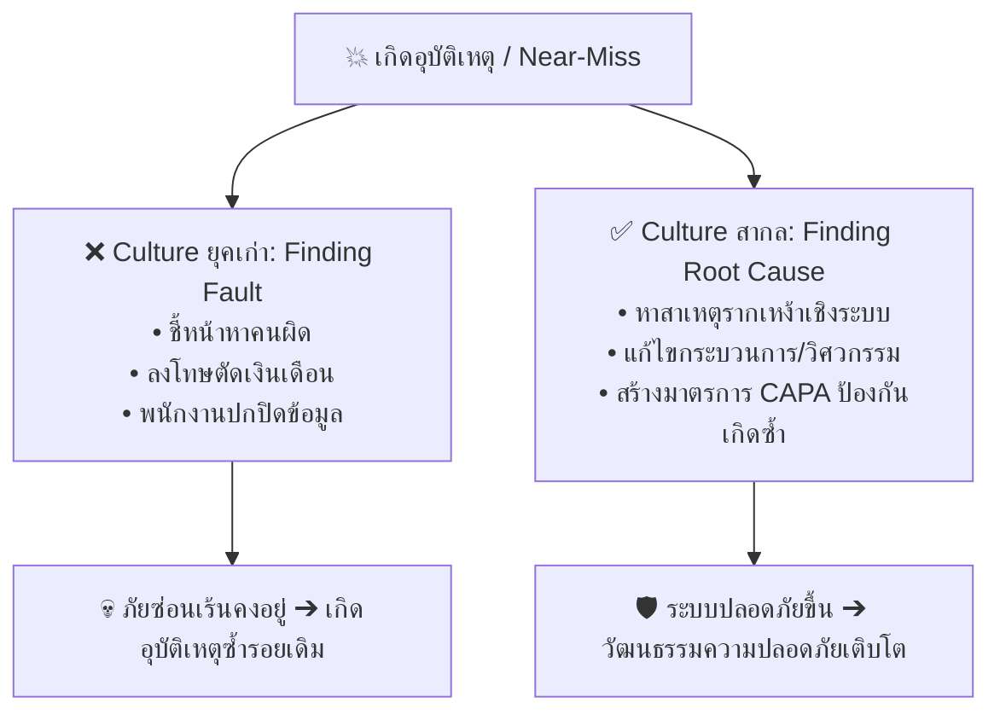
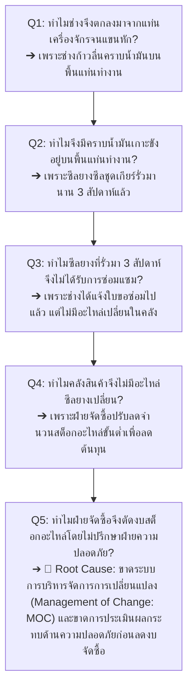
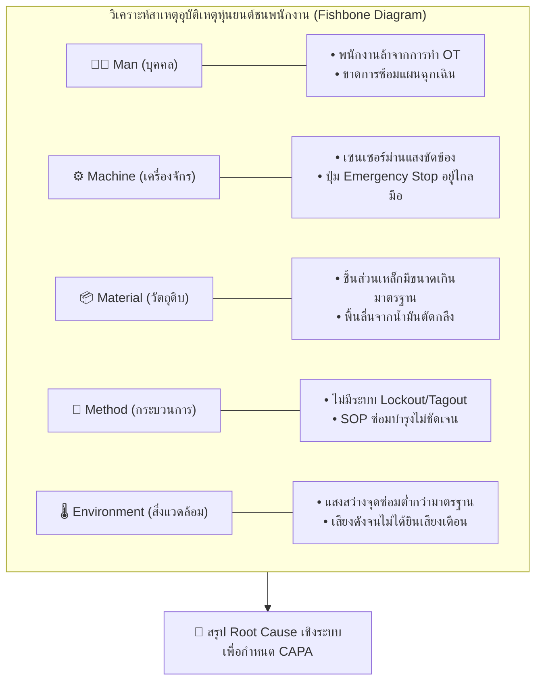

# Week 06-03: มาตรการป้องกันเชิงรับและการสอบสวนอุบัติเหตุ (Reactive Measures & Investigation)

---

## 🔍 แนวคิดหลัก: "เรียนรู้จากบทเรียนเพื่อไม่ให้เกิดซ้ำ" (Focus on Cause, Not Blame)

> [!IMPORTANT]  
> เมื่อเกิดอุบัติเหตุขึ้น ปฏิกิริยาอัตโนมัติของผู้บริหารยุคเก่ามักจะเป็นการชี้หน้าหาคนผิด แล้วลงโทษด้วยการ *"ตั้งกรรมการสอบ ปรับเงิน หรือไล่ออก"*  
> 
> แต่ในทางวิชาการอาชีวอนามัยและความปลอดภัยสากล การทำเช่นนั้นนอกจากจะไม่ได้ช่วยป้องกันอุบัติเหตุแล้ว ยังส่งผลเสียร้ายแรงเพราะจะทำให้พนักงาน **"แอบซ่อนอุบัติเหตุ ปิดบังเหตุการณ์เกือบเกิดอุบัติเหตุ (Near-Miss)"** จนกระทั่งภัยซ่อนเร้นนั้นสั่งสมและระเบิดกลายเป็นโศกนาฏกรรมใหญ่  
> 
> **มาตรการเชิงรับ (Reactive Measures)** ที่ถูกต้อง จึงไม่ใช่การลงโทษบุคคล แต่คือการ **"ชันสูตรระบบ"** เพื่อหา **สาเหตุรากเหง้า (Root Cause)** แล้วนำบทเรียนทรงคุณค่านั้นมาปิดช่องโหว่ทางวิศวกรรมและการบริหารจัดการ

---

## 1.   ขั้นตอนการสอบสวนอุบัติเหตุอย่างเป็นระบบ (5 Steps of Investigation)

เมื่อเกิดอุบัติเหตุขึ้นในสถานประกอบการ ทีมสอบสวนต้องปฏิบัติตาม 5 ขั้นตอนมาตรฐานดังนี้:

### 1.1 ขั้นที่ 1  การตอบสนองทันทีและการกั้นพื้นที่เกิดเหตุ (Immediate Response & Scene Preservation)

| ประเด็น                                   | การกระทำ (Actions)                                                                                                          |
| ----------------------------------------- | --------------------------------------------------------------------------------------------------------------------------- |
| **การปฐมพยาบาล**                          | ช่วยชีวิตผู้ได้รับบาดเจ็บและนำส่งโรงพยาบาลเป็นอันดับแรก                                                                     |
| **ควบคุมสถานการณ์**                       | ปิดวาล์วก๊าซ ตัดสวิตช์ไฟ หรือดับเพลิงเพื่อไม่ให้เกิดอันตรายลุกลาม                                                           |
| **รักษาสภาพพื้นที่ (Preserve the Scene)** | ล้อมรั้วกั้นพื้นที่ ห้ามไม่ให้ผู้ไม่มีส่วนเกี่ยวข้องเข้าไปเคลื่อนย้ายพยานวัตถุ ชิ้นส่วนเครื่องจักร หรือคราบรอยไถลโดยเด็ดขาด |

### 1.2 ขั้นที่ 2  การเก็บรวบรวมหลักฐานและข้อมูล (Evidence Collection: 4Ps)
ทีมสอบสวนต้องรวบรวมข้อเท็จจริงอย่างรอบด้านผ่านหลัก **4Ps**:

| องค์ประกอบ                       | การกระทำ (Actions)                                                                                                   |
| -------------------------------- | -------------------------------------------------------------------------------------------------------------------- |
| **People (บุคคล)**               | สัมภาษณ์ผู้บาดเจ็บ ผู้เห็นเหตุการณ์ และหัวหน้างาน  (ทำในบรรยากาศผ่อนคลาย เน้นการค้นหาความจริง ไม่ใช่การตั้งข้อหา) |
| **Position (ตำแหน่งและสถานที่)** | ถ่ายภาพ บันทึกวิดีโอ วัดระยะทาง ทิศทางแสง และตำแหน่งที่พนักงานยืนอยู่                                                |
| **Parts (ชิ้นส่วนอุปกรณ์)**      | ตรวจสอบสภาพเครื่องจักร สายไฟ อุปกรณ์ PPE และรอยแตกร้าว                                                               |
| **Paper (เอกสารหลักฐาน)**        | ตรวจสอบใบอนุญาตทำงาน (Work Permit), คู่มือ SOP, ประวัติการอบรม และบันทึก PM บำรุงรักษาเครื่องจักร                    |

---

## 2.  เครื่องมือวิเคราะห์สาเหตุรากเหง้า (Root Cause Analysis: RCA)

สาเหตุของการเกิดอุบัติเหตุแบ่งออกเป็น 2 ระดับ
1. **สาเหตุทางตรง (Immediate Causes)** 
	  พฤติกรรมที่ไม่ปลอดภัย (Unsafe Act) หรือสภาพแวดล้อมที่ไม่ปลอดภัย (Unsafe Condition) ที่เกิดขึ้นก่อนเกิดเหตุสดๆ ร้อนๆ
2. **สาเหตุรากเหง้า (Root Causes)** 
	   ข้อบกพร่องของระบบการบริหารจัดการ (Management System Failures) ที่ปล่อยให้สภาพการณ์ที่ไม่ปลอดภัยคงอยู่

### 2.1 เทคนิค 5 Whys Analysis (การถาม "ทำไม" 5 ครั้ง)

>[!EXAMPLE] 🇵🇰 มหัศจรรย์ช่างซ่อมริมถนนในปากีสถาน กับบทเรียนเรื่อง "สัญชาตญาณ VS ระบบความปลอดภัย"**  
> หากใครเคยดูคลิปวิดีโอช่างซ่อมริมถนนในเมืองเพศวาร์ (Peshawar) หรือกุจรานวาลา (Gujranwala) ประเทศปากีสถาน จะต้องทึ่งกับความสามารถอันน่าอัศจรรย์! ช่างที่นั่นสามารถซ่อมเสื้อสูบรถบรรทุกหนักที่แตกพัง ชุบแข็งเหล็ก หล่อเฟืองเกียร์ใหม่ หรือเชื่อมโลหะกลางฝุ่นทรายได้ด้วยเครื่องมือทำเองบนพื้นดิน โดยแทบไม่มีเครื่องมือวัดดิจิทัลหรือคู่มือทางวิศวกรรมสากลเลย  
> 
> พวกเขามี **"ทักษะความชำนาญและสัญชาตญาณการระมัดระวังตัวสูงมาก"** สามารถคุมไฟเชื่อม หลบสะเก็ดไฟ และกะระยะด้วยสายตาได้อย่างแม่นยำ แม้จะใส่เพียงชุดประจำชาติ (Shalwar Kameez) และรองเท้าแตะ โดยไม่มีแว่นตานิรภัย หมวกเซฟตี้ หรือชุด PPE ตามมาตรฐาน OSHA  
> 
> 💡 **ประเด็นสะท้อนคิดทาง OHS สำหรับวิศวกร:**  
> ช่างริมถนนปากีสถานใช้ **"ความระมัดระวังส่วนบุคคล (Individual Caution)"** ในการเอาชีวิตรอด แต่ในอุตสาหกรรมอุตสาหกรรมสมัยใหม่ ทำไมเราจึงไม่สามารถฝากความปลอดภัยไว้กับความระมัดระวังของคนเพียงอย่างเดียวได้?  
> 
> 1. **มนุษย์ไม่ใช่หุ่นยนต์:** แม้ช่างจะเก่งและระวังเพียงใด แต่หากวันใดเขา **อดนอน อ่อนล้า มีเรื่องเครียด หรือเผลอสายตาเพียง 1 วินาที** (เช่น ใบเจียร์แตก หรือถังแก๊สระเบิด) สัญชาตญาณจะหลบไม่ทัน และเกิดความสูญเสียถึงชีวิตทันที  
> 2. **เป้าหมายของวิชา OHS:** ไม่ใช่การปฏิเสธฝีมือช่าง แต่คือการ **"สร้างระบบการจัดการและมาตรการทางวิศวกรรม (Systems & Engineering Controls)"** เพื่อให้แม้ในวันที่คนทำงานล้า เผลอเลอ หรือตัดสินใจผิดพลาด ระบบก็ยังคงปกป้องชีวิตเขาไว้ได้อย่างปลอดภัย!

แต่ในทางวิศวกรรมความปลอดภัย เราจะใช้เทคนิค **Root Cause Analysis (RCA)** เพื่อวิเคราะห์หาสาเหตุรากเหง้าของอุบัติเหตุ โดยใช้เทคนิค **5 Whys Analysis (การถาม "ทำไม" 5 ครั้ง)** ซึ่งสามารถประยุกต์ใช้ได้ทั้ง **เชิงรับ (หลังเกิดเหตุ)** เพื่อสอบสวนหาสาเหตุ และ **เชิงรุก (ก่อนเกิดเหตุ)** เพื่อซ้อมจำลองสถานการณ์รับมือและปิดช่องโหว่ในระบบ

> [!TIP] **เงื่อนไขและข้อจำกัดทางวิชาการในการใช้ 5 Whys Analysis (Academic Rules)**
> 
> | ประเด็นเงื่อนไข | ข้อกำหนดทางวิชาการ OHS |
> | :--- | :--- |
> | **1. บริบทการใช้งาน** | • **เชิงรับ (Reactive):** สอบสวนเมื่อเกิด Near-Miss หรืออุบัติเหตุขึ้นแล้ว  • **เชิงรุก (Proactive):** ใช้ร่วมกับ What-If Analysis เพื่อซ้อมจำลองสถานการณ์ล้มเหลวล่วงหน้า |
> | **2. ขอบเขตความเหมาะสม** | เหมาะกับปัญหาที่มีสายเหตุปัจจัยสืบเนื่องเป็นเส้นตรง (Linear Cause Chain) หากอุบัติเหตุมีความซับซ้อนสูง แนะนำใช้ร่วมกับ Fishbone Diagram |
> | **3. กฎเหล็กการวิเคราะห์** | **ห้ามจบที่ Human Error:** คำตอบสุดท้าย (Root Cause) ต้องชี้ไปที่ความบกพร่องของระบบบริหารจัดการ (Management System Failure) ห้ามหยุดแค่การโทษพนักงานประมาท |
> | **4. การอ้างอิงหลักฐาน** | ทุกคำตอบในแต่ละ Why ต้องตั้งอยู่บน **ข้อเท็จจริงและหลักฐาน (Evidence-based 4Ps)** ห้ามใช้การคาดเดา |

>[!EXAMPLE] #### สถานการณ์ตัวอย่าง: ช่างซ่อมบำรุงลื่นไถลตกลงมาจากแท่นเครื่องจักรจนแขนหัก

> 💡 **การเปรียบเทียบผลลัพธ์การแก้ไข:**  
> - **หากหยุดที่ Q1:** แก้ไขโดย *"ด่าช่างว่าประมาท แล้วสั่งให้เดินระวังๆ"* (อุบัติเหตุจะเกิดซ้ำแน่นอน)  
> - **หากแก้ถึง Q5 (Root Cause):** ออกนโยบาย MOC บังคับให้การลดสต็อกอะไหล่เครื่องจักรความเสี่ยงสูงต้องได้รับการอนุมัติจาก จป.วิชาชีพ ก่อนเสมอ (ป้องกันอุบัติเหตุในโรงงานได้อย่างยั่งยืน!)

---

### 2.2 เทคนิคแผนผังก้างปลา (Fishbone Diagram / Ishikawa Diagram)

***อ้างอิงภาพประกอบ:*** [Anas Abdulrazzaq - Safety Tool of the Day: Fishbone Diagram](https://www.linkedin.com/posts/anas-abdulrazzaq-9360551b8_safety-tool-of-the-day-fishbone-diagram-activity-7455220456523014146-L4_F)

> [!NOTE] **ทำไมต้องใช้แผนผังก้างปลา (Fishbone Diagram)?**  
> หาก 5 Whys เปรียบเหมือน **"สว่านเจาะลึกลงไปในแนวดิ่ง"** แผนผังก้างปลาก็เปรียบเสมือน **"แหที่กางออกเพื่อจับกุมสาเหตุในแนวระนาบ 360 องศา"**  
> เหมาะสำหรับใช้สอบสวนอุบัติเหตุที่มีความซับซ้อน เกิดจากปัจจัยเกี่ยวเนื่องกันหลายฝ่าย เพื่อป้องกันไม่ให้ทีมสอบสวนตกสำรวจหมวดหมู่ใดหมวดหมู่หนึ่งไป

---

#### 📌 โครงสร้างหลักของแผนผังก้างปลาในงานความปลอดภัย (Anatomy of Safety Fishbone)

| องค์ประกอบ | สัญลักษณ์ในผัง | คำอธิบายและการประยุกต์ใช้ในงาน OHS |
| :--- | :--- | :--- |
| **1. หัวปลา (Fish Head)** | **Effect / Incident** | **ข้อความระบุอุบัติเหตุหรือความสูญเสีย** (ต้องชัดเจน เจาะจง ไม่คลุมเครือ เช่น *"พนักงานบาดเจ็บแขนหักจากหุ่นยนต์ชน"* หรือ *"เพลิงไหม้ถังเก็บสารเคมี"*) |
| **2. ก้างปลาหลัก (Major Bones)** | **6M Framework** | **แกนหมวดหมู่อันตรายหลัก 6 ด้าน** เพื่อใช้จำแนกปัญหาก่อนระดมสมอง |
| **3. ก้างปลาย่อย (Minor Bones)** | **Sub-causes** | **สาเหตุย่อยในแต่ละหมวด** ที่ได้จากการระดมสมองและการเก็บหลักฐาน **4Ps** |

---

#### 🧩 การจำแนกสาเหตุตามหลัก **6M Framework** ในงาน OHS

| หมวดหมู่ (6M)                  | คำนิยามทางวิศวกรรมความปลอดภัย                | ตัวอย่างสาเหตุย่อยที่มักพบหน้างาน                                                                                                                                                                 |
| :----------------------------- | :------------------------------------------- | :------------------------------------------------------------------------------------------------------------------------------------------------------------------------------------------------ |
| **1. Man (คน)**                | ปัจจัยด้านตัวบุคคล พฤติกรรม และขีดความสามารถ | • ความเหนื่อยล้าจากการทำ OT สะสม  • ขาดทักษะการทำงานเสี่ยง  • ไม่ได้เข้ารับการฝึกอบรม SOP ([ดูเพิ่ม Standard Operating Procedure](https://www.dittothailand.com/th/dittonews/what-is-sop/)) |
| **2. Machine (เครื่องจักร)**   | ปัจจัยด้านเครื่องมือ อุปกรณ์ และระบบควบคุม   | • ไม่มี Machine Guard ปิดจุดหนีบ  • ระบบเซนเซอร์ม่านแสง (Interlock) ชำรุด  • ปุ่มหยุดฉุกเฉิน (E-Stop) ไกลมือ                                                                                |
| **3. Material (วัสดุอุปกรณ์)** | ปัจจัยด้านวัตถุดิบ สารเคมี และชุดเซฟตี้      | • วัตถุดิบมีคราบน้ำมันลื่น  • สารเคมีไม่มีฉลาก GHS  • PPE ชำรุดหรือไม่เหมาะกับสรีระ                                                                                                         |
| **4. Method (วิธีการทำงาน)**   | ปัจจัยด้านขั้นตอนการทำงานและเอกสารควบคุม     | • ขาดเอกสารวิเคราะห์ความปลอดภัย (JSA)  • ไม่ได้ทำใบอนุญาตทำงาน (Work Permit)  • ไม่มีระบบ Lockout/Tagout (LOTO)                                                                             |
| **5. Measurement / Milieu**    | ปัจจัยด้านสภาพแวดล้อมและการวัดค่าความเสี่ยง  | • แสงสว่างจุดทำงานต่ำกว่ามาตรฐาน  • เสียงดังสะสมรบกวนการยินเสียงเตือน  • ไม่ได้ตรวจวัดก๊าซพิษก่อนลงทำงาน                                                                                    |
| **6. Management**              | ปัจจัยด้านระบบบริหารจัดการและวัฒนธรรมองค์กร  | • ตัดลดงบประมาณบำรุงรักษาเชิงป้องกัน (PM)  • มุ่งเน้นความเร็วในการผลิตเหนือความปลอดภัย  • ขาดระบบ Management of Change (MOC)                                                                |

---

>[!SUCCESS] **การทำงานร่วมกันระหว่าง Fishbone + 5 Whys (Combined Power)**  
> ในการทำงานจริง ทีมวิศวกรความปลอดภัยจะใช้ **Fishbone Diagram** เป็นตัวกางหมวดหมู่ระดมสมองหาปัจจัยย่อยทั้งหมดก่อน จากนั้นเมื่อพบก้างย่อยที่เป็นประเด็นสงสัย ให้ใช้ **5 Whys Analysis** ถามเจาะลึกลงไปในก้างย่อยนั้น เพื่อค้นหา **Root Cause** เชิงบริหารจัดการที่แท้จริง!

---

## 3.  การกำหนดมาตรการแก้ไขและป้องกัน (CAPA: Corrective & Preventive Action)

เมื่อทราบ Root Cause แล้ว ทีมสอบสวนต้องเสนอมาตรการ **CAPA** ซึ่งแบ่งออกเป็น 2 ส่วน

| ประเภทมาตรการ                             | ความหมาย                                                               | ตัวอย่างจากกรณีน้ำมันรั่วข้างต้น                                                                                                                             |
| :---------------------------------------- | :--------------------------------------------------------------------- | :----------------------------------------------------------------------------------------------------------------------------------------------------------- |
| **Corrective Action (การแก้ไขทันที)**     | การจัดการกับอาการและผลกระทบสดๆ ร้อนๆ เพื่อให้พื้นที่ปลอดภัยทันที       | • เช็ดทำความสะอาดคราบน้ำมันบนแท่นทำงาน • เปลี่ยนซีลยางชุดเกียร์ใหม่ทันที                                                                                  |
| **Preventive Action (การป้องกันเกิดซ้ำ)** | การแก้ไขที่โครงสร้างระบบการจัดการ เพื่อไม่ให้เหตุการณ์แบบนี้เกิดซ้ำอีก | • กำหนดระบบบริหารจัดการการเปลี่ยนแปลง (MOC) • ติดตั้งถาดรองรับคราบน้ำมันรั่วไหล (Drip Tray) ใต้เกียร์ทุกเครื่อง • ปรับรอบการตรวจเช็กสภาพซีลยางในแผน PM |

---

## 4. การออกแจ้งเตือนภัยความปลอดภัย (Safety Alert Sharing)

เมื่อการสอบสวนเสร็จสิ้น บทเรียนที่ได้รับต้องไม่ถูกเก็บไว้ในแฟ้มเอกสาร แต่ต้องถูกแปลงเป็น **"Safety Alert (เอกสารแจ้งเตือนความปลอดภัย)"** แผ่นเดียวที่เข้าใจง่าย สรุปเหตุการณ์ สาเหตุ และมาตรการป้องกัน เพื่อนำไปกระจายสื่อสารและพูดคุยใน **Toolbox Talk** ก่อนเริ่มงานแก่พนักงานทุกแผนกทั่วทั้งองค์กร

**เอกสารเพิ่มเติม**
[ป้ายความปลอดภัย](https://www.facebook.com/photo/?fbid=1635963874916097&set=a.254543366391495)

