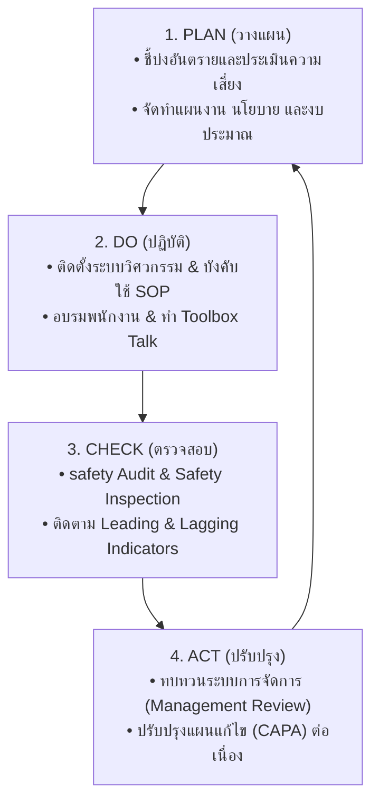
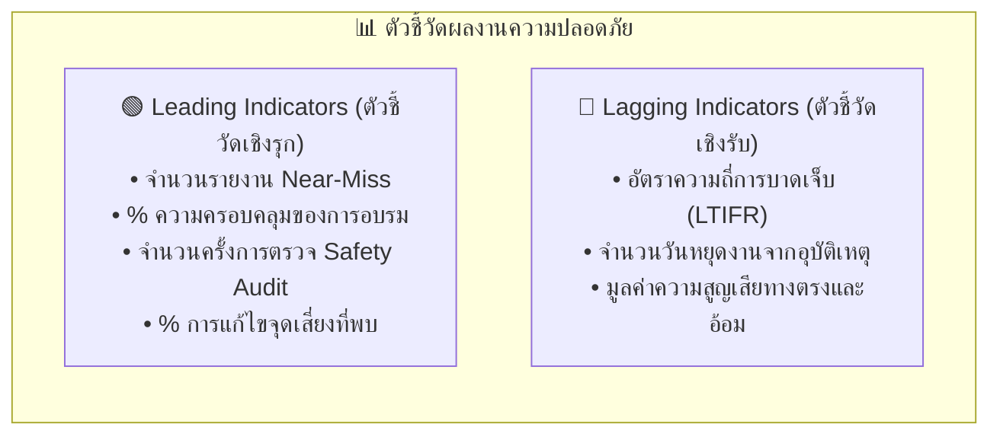
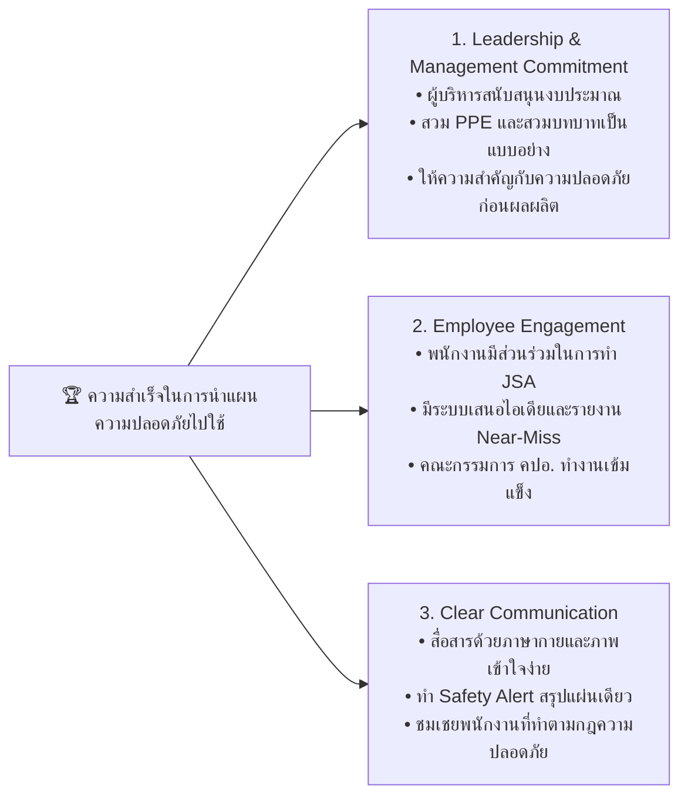
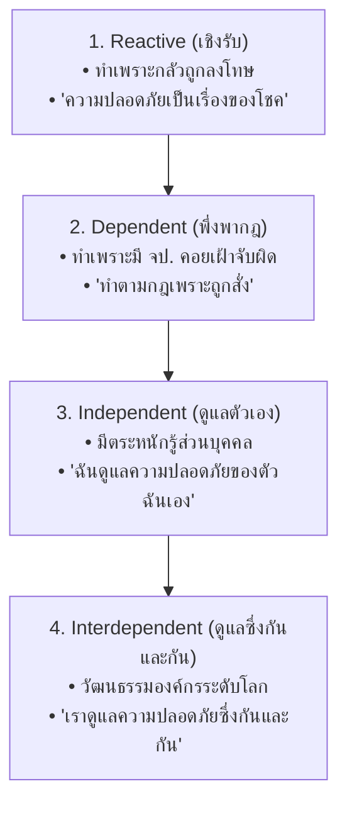

# Week 06-04: การนำแผนไปใช้และการสร้างวัฒนธรรมความปลอดภัย (Plan Implementation)

---

## 🎯 แนวคิดหลัก: "เปลี่ยนแผนงานบนกระดาษ สู่การปฏิบัติจริงหน้างาน"

>[!IMPORTANT]   
> ปัญหาใหญ่ของหลายองค์กรไม่ได้อยู่ที่การขาดแคลนนโยบายความปลอดภัย แต่คือ **"การที่แผนงานความปลอดภัยนอนนิ่งอยู่ในแฟ้มเอกสาร โดยไม่เคยถูกนำไปปฏิบัติจริงในพื้นที่ทำงาน"**  
> 
> การจะทำให้มาตรการป้องกันอุบัติเหตุเกิดขึ้นได้จริง ต้องอาศัย **วงจรบริหารงานคุณภาพ PDCA Cycle (Plan-Do-Check-Act)** ทำงานควบคู่ไปกับ **การมุ่งมั่นเอาจริงเอาจังของผู้บริหาร (Leadership Commitment)** และ **การมีส่วนร่วมของพนักงาน (Employee Engagement)** เพื่อยกระดับองค์กรไปสู่วัฒนธรรมความปลอดภัย (Safety Culture)

---

## 1.  การประยุกต์ใช้วงจร PDCA ในการขับเคลื่อนงานความปลอดภัย

### 1.1 P - Plan (ขั้นการวางแผน)

| สิ่งทีทำ                                                                  | ตัวอย่าง / เป้าหมาย / เหตุผล                                                                                           |
| ------------------------------------------------------------------------- | ---------------------------------------------------------------------------------------------------------------------- |
| **การประเมินความเสี่ยง  (Risk Assessment)**                            | ค้นหาว่าในพื้นที่ทำงานมี Hazard อะไรบ้าง และจุดใดมีความเสี่ยงสูง                                                       |
| **การจัดทำมาตรการและงบประมาณ**                                            | กำหนดมาตรการตาม Hierarchy of Controls จัดสรรงบประมาณสำหรับการติดตั้งระบบระบายอากาศ ฝาครอบเครื่องจักร และอุปกรณ์ PPE |
| **การจัดทำมาตรฐานการปฏิบัติงาน  (Standard Operating Procedure : SOP)** | เขียนขั้นตอนการทำงานที่ปลอดภัยสั้น กระชับ เข้าใจง่าย                                                                   |

### 1.2 D - Do (ขั้นการปฏิบัติตามแผน)

| สิ่งทีทำ                                                    | ตัวอย่าง / เป้าหมาย / เหตุผล                                                            |
| ----------------------------------------------------------- | --------------------------------------------------------------------------------------- |
| **การลงมือติดตั้งมาตรการทางวิศวกรรม**                       | ติดตั้งฝาครอบเครื่องจักร ม่านแสงอินฟราเรด ป้ายเตือนอันตราย                              |
| **การฝึกอบรมและปฐมนิเทศ  (Safety Induction & Training)** | อบรมพนักงานใหม่ และจัดการพูดคุยความปลอดภัยก่อนเริ่มงานทุกเช้า (**Toolbox Talk 5 นาที**) |
| **การบังคับใช้ระบบอนุญาตทำงาน  (Work Permit System)**    | ควบคุมการทำงานเสี่ยงสูงอย่างเคร่งครัด                                                   |
### 1.3 C - Check (ขั้นการตรวจสอบและวัดผล)
การตรวจสอบผลงานความปลอดภัยต้องวัดผ่านตัวชี้วัด 2 ประเภท:

>[!IMPORTANT]  **ข้อคิดสำหรับวิศวกร** 
>
>องค์กรที่ยอดเยี่ยมจะมุ่งเน้นการเพิ่ม **Leading Indicators (ชี้วัดเชิงรุก)** เพราะหากเราแก้ไขจุดเสี่ยงและซ้อมแผนฉุกเฉินมากขึ้น ตัวเลขความสูญเสียใน **Lagging Indicators** จะลดลงโดยอัตโนมัติ!

### 1.4 A - Act (ขั้นการปรับปรุงแก้ไขต่อเนื่อง)

| สิ่งทีทำ                                           | ตัวอย่าง / เป้าหมาย / เหตุผล                                                             |
| -------------------------------------------------- | ---------------------------------------------------------------------------------------- |
| **การทบทวนโดยฝ่ายบริหาร  (Management Review)**  | ผู้บริหารระดับสูงร่วมประชุมทบทวนผลงานความปลอดภัยทุกไตรมาส                                |
| **การยกระดับมาตรฐาน  (Continuous Improvement)** | นำผลลัพธ์จากการสอบสวน Near-Miss และข้อเสนอแนะของพนักงานมาปรับปรุง SOP ให้ทันสมัยอยู่เสมอ |

---

## 2.  3 ปัจจัยความสำเร็จหลัก (Key Success Factors)

---

## 3. ระดับพัฒนาการของวัฒนธรรมความปลอดภัย (Safety Culture Ladder)

>[!INFO] วัฒนธรรมความปลอดภัยขององค์กรสามารถแบ่งพัฒนาการออกเป็น 4 ระดับ ตามทฤษฎีของ **Bradley Curve (DuPont)**

>[!INPORTANT] **เป้าหมายสูงสุดของการเรียน OHS**  
>
การเรียนวิชานี้ไม่ได้มุ่งหวังเพียงแค่ให้ผู้เรียนจำข้อสอบได้ แต่คือการผลักดันให้ผู้เรียนก้าวจากระดับ **Reactive** ไปสู่ระดับ **Interdependent** ที่ทุกคนในองค์กรมองว่า  **"ความปลอดภัยคือคุณค่าหลัก (Core Value) ที่เราต้องดูแลกันและกันเพื่อกลับบ้านหาครอบครัวอย่างปลอดภัยทุกวัน!"**
