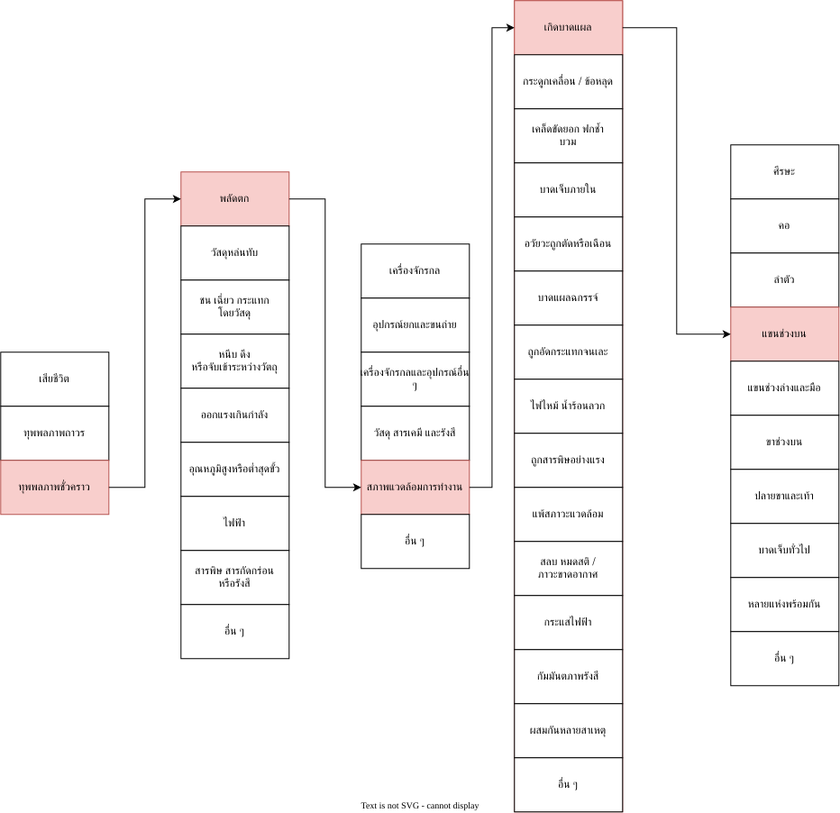

สถานการณ์

วันหนึ่ง ณ วันที่หลังฝนตกอากาศเย็นแจ่มใส มีเด็กอายุ 10 ขวบ ขี่จักรยานดูรอบบ่อเลี้ยงปลาธรรมชาติ ที่แห้งจากการวิดนํ้าบ่อเมื่อไม่กี่วันก่อน อย่างสนุกสนาน
โดยเด็กคนนั้นไม่ทรายบเลยว่า มันจะเป็นเหตุการที่ทำให้เด็กคนนั้นเกือบเสียชีวิตจากการสนุกของตนเอง
เหตุการเกิดขึ้นในตอนที่เด็กชายคนนั้นกำลังขี่จักรยานขอบบ่อเลี้ยงปลา จักรยานได้ลื่นล้มจากหญ้าที่ลื่นจากฝนตก
เด็กได้ลื่นล้มลงไปในบ่อพร้อมกับจักรยานของต้น ในบ่อที่แห้งนั้นมีรางต้นแม้ที่แห้ง และหักเป็นมุมหัวของหอกที่สร้างจากธรรมชาติ
เด็กคนนั้นลื่นตกลงไปโดยไม่อาจที่จะจับสิ่งใดเป็นที่ยืดเกาะได้ หนำซํ้ายังมีนํ้าหนักจากจักรยาน และโคลนที่เกิดจากการวิดนํ้าเมื่อไม่กี่วันก่อน 
เป็นตัวเร่งความเร็ว และลดความชะลอของพื้นดิน
หอกที่สร้างจากธรรมชาติ กำลังบรรจงที่คอของเด็กคนนั้น แต่เหตุการโชคดีได้เกิดขึ้นขาของเด็กคนนั้นไม่เหยียบลงบนรางไม้บริเวณนั้นพอดี โดยที่คอของเด็กนั้นห่างจากหอกธรรมชาติไม่
กี่เซนติเมจรเท่านั้น โดยเด็กคนนั้นบาดเจ็บแค่แผลถลอก บริเวณแขนเท่านั้น

Unsafe Condition (สภาพการณ์ที่ไม่ปลอดภัย) อะไรบ้าง? (เช่น หญ้าที่ลื่น  , โคลน , รางไม้ที่แห้ง)

