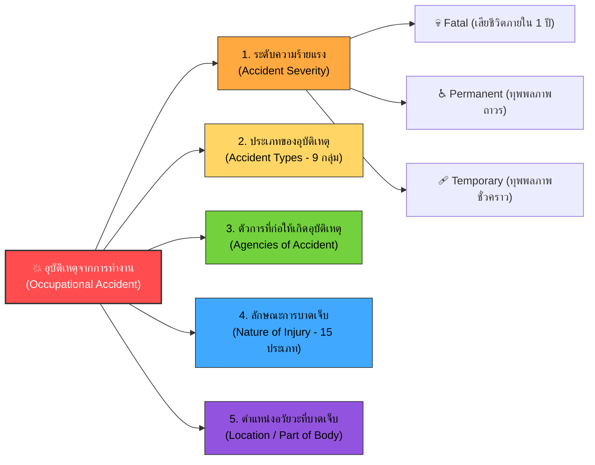

# Week 07: การจำแนกประเภทและสถิติอุบัติเหตุจากการทำงานตามมาตรฐาน ILO (Classification of Occupational Accidents)

---

## 🎯 วัตถุประสงค์การเรียนรู้ประจำสัปดาห์ (Learning Objectives)

เมื่อศึกษาเนื้อหาในสัปดาห์นี้ครบถ้วนแล้ว ผู้เรียนจะมีความสามารถดังต่อไปนี้:
1. **อธิบายความสำคัญและหลักการจำแนกอุบัติเหตุ** จากการทำงานตามมาตรฐานองค์การแรงงานระหว่างประเทศ (International Labour Organization: ILO) ได้อย่างถูกต้อง
2. **จำแนกระดับความร้ายแรงของอุบัติเหตุ (Severity of Accidents)** ได้แก่ การเสียชีวิต (Fatal), ทุพพลภาพถาวร (Permanent Disablement), และทุพพลภาพชั่วคราว (Temporary Disablement) ตามเกณฑ์เวลาและผลกระทบทางการแพทย์
3. **วิเคราะห์องค์ประกอบของการเกิดอุบัติเหตุครบ 5 มิติ** ได้แก่ ระดับความร้ายแรง (Severity), ประเภทอุบัติเหตุ (Type), ตัวการก่อเหตุ (Agency), ลักษณะการบาดเจ็บ (Nature of Injury), และอวัยวะที่บาดเจ็บ (Location of Injury)
4. **ประยุกต์ใช้ระบบการจำแนกอุบัติเหตุในการทำรายงานสถิติความปลอดภัย** และสืบหาแนวทางแก้ไขเชิงวิศวกรรมและการบริหารจัดการเพื่อป้องกันการเกิดเหตุซ้ำ

---

## 🧭 แผนผังภาพรวมระบบการจำแนกอุบัติเหตุตามมาตรฐานสากล (ILO Framework)

---

## ส่วนที่ 1  ความสำคัญของการจำแนกอุบัติเหตุ (Why Classification Matters?)

> [!NOTE] ทำไมต้องใช้มาตรฐาน ILO?
> การรายงานอุบัติเหตุโดยใช้ภาษาทั่วไป (เช่น "คนงานเจ็บหนัก", "เครื่องจักรพัง") ไม่สามารถนำไปเปรียบเทียบเชิงสถิติหรือวิเคราะห์แนวโน้มระดับสากลได้ การใช้เกณฑ์ของ **ILO (International Labour Organization)** จะช่วยให้
> 1. มีเกณฑ์มาตรฐานเดียวกันในการเปรียบเทียบระดับความปลอดภัยข้ามแผนก ข้ามโรงงาน หรือข้ามประเทศ
> 2. บันทึกวันสูญเสียการทำงาน (Lost Workdays) เพื่อคำนวณอัตราความถี่ (Frequency Rate) และอัตราความรุนแรง (Severity Rate) ได้อย่างแม่นยำ
> 3. ชี้เป้า "จุดเสี่ยงสูง" (High-risk spots) เพื่อจัดสรรงบประมาณและมาตรการควบคุมได้อย่างตรงจุด

---

## ส่วนที่ 2 ความร้ายแรงของอุบัติเหตุที่นิยามโดย ILO (Accident Severity)

ILO ได้แบ่งระดับความร้ายแรงของการบาดเจ็บจากอุบัติเหตุจากการทำงานออกเป็น **3 ระดับหลัก** ดังนี้

### 1. Fatal (การเสียชีวิต)

* **นิยามทางสถิติ** 
	 ความร้ายแรงของอุบัติเหตุที่ถึงขั้นเสียชีวิต หมายถึง การบาดเจ็บจากการทำงานที่ส่งผลให้ผู้ปฏิบัติงาน**เสียชีวิตทันทีในที่เกิดเหตุ หรือเสียชีวิตภายในระยะเวลา 1 ปี (365 วัน)** นับจากวันและเวลาที่เกิดอุบัติเหตุขึ้น
* **ตัวการและสถานการณ์ทั่วไป**
  * การพลัดตกจากที่สูงมาก (เช่น นั่งร้านก่อสร้าง, หลังคาโรงงาน, ปล่องควัน)
  * การถูกเครื่องจักรขนาดใหญ่หรือโครงสร้างอาคารถล่มทับ/บดขยี้
  * การสัมผัสไฟฟ้าแรงสูง (High-voltage electrocution)
  * การสูดดมสารเคมีพิษเข้มข้นสูงในพื้นที่อับอากาศ (Confined space asphyxiation) หรือการระเบิดรุนแรง
* **ข้อกำหนดทางกฎหมายและมาตรฐาน** 
	ต้องหยุดงานเพื่อสอบสวนทันที และรายงานต่อเจ้าหน้าที่พนักงานตรวจความปลอดภัยตามที่กฎหมายกำหนด

---

### 2. Permanent Disablement (ทุพพลภาพถาวร / สูญเสียสมรรถภาพถาวร)

* **นิยามทางสถิติ** 
	ความร้ายแรงของอุบัติเหตุที่ทำให้ทุพพลภาพถาวรหรือสูญเสียสมรรถภาพถาวร หมายถึง กรณีที่ผู้ประสบอุบัติเหตุรักษาพยาบาลจนอาการคงที่แล้ว แต่เกิดความสูญเสียทางกายวิภาคหรือสมรรถภาพการทำงานของอวัยวะอย่างถาวร ส่งผลให้**ไม่สามารถกลับไปปฏิบัติหน้าที่เดิมในตำแหน่งเดิมได้อย่างสมบูรณ์อีกต่อไป**
* **แบ่งย่อยตามระดับผลกระทบ**
  1. **Permanent Total Disablement (สูญเสียสมรรถภาพถาวรทั้งหมด)** สูญเสียอวัยวะสำคัญทั้งสองข้าง (เช่น ตาบอดทั้งสองข้าง, ตัดขาทั้งสองข้าง) หรือสมองพิการถาวรจนไม่สามารถทำงานเลี้ยงชีพได้
  2. **Permanent Partial Disablement (สูญเสียสมรรถภาพถาวรบางส่วน)** สูญเสียนิ้วมือ ข้อมือ สูญเสียการได้ยินถาวร หรือสายตาเสียหนึ่งข้าง แต่ยังคงทำงานประเภทอื่นได้
* **ลักษณะการบาดเจ็บทั่วไป**
  * การถูกเครื่องปั๊มโลหะตัดนิ้วหรือมือ
  * การถูกสารเคมีกัดกร่อนทำให้ตาบอดถาวร
  * การบาดเจ็บที่ไขสันหลังจนเป็นอัมพฤกษ์หรืออัมพาตครึ่งท่อน

---

### 3. Temporary Disablement (ทุพพลภาพชั่วคราว / หยุดงานชั่วคราว)

* **นิยามทางสถิติ** 
	ความร้ายแรงของอุบัติเหตุที่ทำให้ทุพพลภาพชั่วคราวหรือหยุดงานชั่วคราว  หมายถึง กรณีที่ผู้บาดเจ็บ**ไม่สามารถทำงานได้ตั้งแต่วันถัดไปหลังเกิดเหตุ (Lost Workday)** แต่เมื่อได้รับการรักษาพยาบาลและพักฟื้นตามคำสั่งแพทย์แล้ว **สามารถกลับมาปฏิบัติหน้าที่เดิมได้ตามปกติ 100% โดยไม่มีความพิการถาวร**
* **ลักษณะการบาดเจ็บทั่วไป**
  * กระดูกร้าวหรือกระดูกหักแบบปิดที่เข้าเฝือกแล้วประสานสนิท
  * แผลฉีกขาดที่ต้องเย็บและพักรักษาตัว
  * อาการเคล็ดขัดยอกของกล้ามเนื้อหลัง (Back strain) จากการยกของหนัก
  * การสูดควันหรือสารระคายเคืองที่พักสังเกตอาการและหายเป็นปกติ

---

## 📊 ตารางเปรียบเทียบระดับความร้ายแรงทั้ง 3 ระดับ

| มิติการเปรียบเทียบ        | 1. Fatal (เสียชีวิต)                         | 2. Permanent Disablement (ทุพพลภาพถาวร)                     | 3. Temporary Disablement (ทุพพลภาพชั่วคราว)                |
| :------------------------ | :------------------------------------------- | :---------------------------------------------------------- | :--------------------------------------------------------- |
| **เกณฑ์ระยะเวลา**         | เสียชีวิตทันที หรือภายใน **1 ปี**            | เกิดผลกระทบทางกายภาพ/หน้าที่อย่าง **ถาวรตลอดชีพ**           | หยุดงานตั้งแต่วันถัดไป และ **หายปกติเมื่อสิ้นสุดการรักษา** |
| **ความสามารถในการทำงาน**  | สิ้นสุดการทำงาน                              | ทำงานเดิมไม่ได้อย่างสมบูรณ์ (อาจต้องเปลี่ยนหน้าที่)         | กลับมาปฏิบัติงานเดิมได้ตามปกติ                             |
| **ตัวอย่างอาการ**         | กะโหลกศีรษะแตก เลือดออกในสมองเฉียบพลัน       | นิ้วขาด, สูญเสียการมองเห็น 1 ข้าง, หมอนรองกระดูกทับเส้นถาวร | แขนหักเข้าเฝือก 6 สัปดาห์, แผลเย็บ 5 เข็ม พัก 3 วัน        |
| **ผลกระทบทางเศรษฐศาสตร์** | ค่าชดเชยสูงสุด, ความสูญเสียต่อครอบครัวมหาศาล | ค่าฟื้นฟูสมรรถภาพ, ค่าทดแทนการสูญเสียรายได้ระยะยาว          | ค่ารักษาพยาบาล, ค่าจ้างช่วงหยุดงานระยะสั้น                 |

---

## 🧪 กรณีศึกษาเพื่อการวินิจฉัย (Self-Study Case Studies)

### กรณีศึกษาที่ 1 อุบัติเหตุงานยกชิ้นส่วนเครื่องจักร
> นายสมชาย ช่างซ่อมบำรุง ถูกโครงเหล็กน้ำหนัก 200 กก. หล่นทับบริเวณเท้าขวา ส่งผลให้นิ้วโป้งเท้าและนิ้วชี้เท้าแตกละเอียด แพทย์จำเป็นต้องผ่าตัดตัดนิ้วเท้าทั้งสองนิ้วออก หลังจากพักฟื้น 3 เดือน นายสมชายกลับมาเดินได้แต่มีอาการเดินกะเผลก และไม่สามารถปีนบันไดสูงเพื่อซ่อมบำรุงเครื่องจักรเหมือนเดิมได้ ต้องย้ายไปประจำโต๊ะควบคุมแทน
* **การวินิจฉัยความร้ายแรง** **Permanent Partial Disablement (ทุพพลภาพถาวรบางส่วน)** เนื่องจากมีการสูญเสียอวัยวะอย่างถาวรและส่งผลให้ไม่สามารถกลับไปทำงานในตำแหน่งเดิมได้

### กรณีศึกษาที่ 2 อุบัติเหตุลื่นล้มในไลน์ผลิตอาหาร
> น.ส. วารี ลื่นคราบน้ำมันบนพื้นทางเดินในโรงงาน ทำให้ข้อมือซ้ายเคล็ดและกระดูกร้าว แพทย์ใส่เฝือกและให้หยุดพักรักษาตัว 4 สัปดาห์ หลังถอดเฝือกและทำกายภาพบำบัด 2 สัปดาห์ ข้อมือกลับมาใช้งานได้เป็นปกติ 100% และกลับเข้าทำงานในตำแหน่งเดิม
* **การวินิจฉัยความร้ายแรง:** **Temporary Disablement (ทุพพลภาพชั่วคราว)** เนื่องจากเมื่อสิ้นสุดการรักษาแล้ว สามารถกลับมาปฏิบัติหน้าที่เดิมได้โดยไม่มีความพิการคงเหลือ

---

## ✍️ แบบทดสอบประเมินตนเอง (Self-Assessment & Reflection)

<b>คำถามที่ 1</b> หากคนงานประสบอุบัติเหตุถูกสารเคมีหกใส่ในวันที่ 1 มกราคม ได้รับการรักษาในโรงพยาบาลและเสียชีวิตในวันที่ 15 พฤศจิกายนของปีเดียวกัน จะจัดเป็นระดับความร้ายแรงใด?

> **เฉลย** จัดเป็น **Fatal (การเสียชีวิต)** เนื่องจากคนงานเสียชีวิตภายในระยะเวลา **1 ปี (365 วัน)** นับจากวันเกิดอุบัติเหตุตามนิยามสากลของ ILO

<b>คำถามที่ 2</b> นาย ก. ถูกมีดบาดนิ้ว มีเลือดออกเล็กน้อย เจ้าหน้าที่ จป. ทำแผลและปิดพลาสเตอร์ยาให้ จากนั้น นาย ก. กลับไปทำงานตามเดิมทันทีโดยไม่ต้องหยุดงานในวันถัดไป เหตุการณ์นี้ถือเป็น Temporary Disablement หรือไม่?

> **เฉลย** **ไม่ถือเป็น Temporary Disablement** แต่จัดเป็นระดับ **First Aid Case (การปฐมพยาบาลเบื้องต้น / Non-Lost Time Injury)** เนื่องจากไม่มีการสูญเสียวันทำงานตั้งแต่วันถัดไป

---
