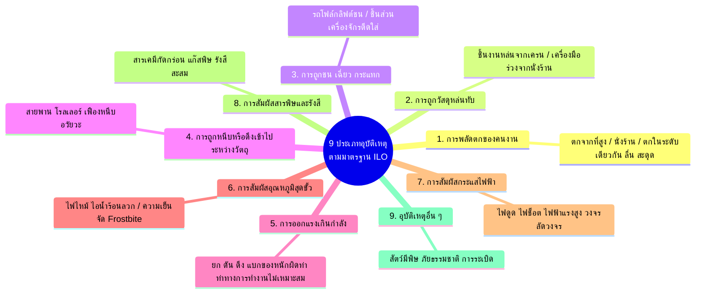

# Week 07 การจำแนกประเภทของอุบัติเหตุจากการทำงานตามมาตรฐาน ILO (Accident Types)

---

## วัตถุประสงค์การเรียนรู้ (Learning Objectives)

เมื่อศึกษาเนื้อหาในส่วนนี้แล้ว ผู้เรียนจะสามารถ
1. **ระบุและอธิบายประเภทของอุบัติเหตุทั้ง 9 กลุ่มหลัก** ตามมาตรฐานองค์การแรงงานระหว่างประเทศ (ILO)
2. **วิเคราะห์กลไกอันตราย (Hazard Mechanism)** และความเชื่อมโยงกับระดับความร้ายแรงของการบาดเจ็บในแต่ละประเภท
3. **ยกตัวอย่างสถานการณ์จริงและเรื่องเล่าเชิงประจักษ์ในหลากหลายวิชาชีพ** ทั้งในระดับทุพพลภาพชั่วคราว ทุพพลภาพถาวร และการเสียชีวิต
4. **เชื่อมโยงประเภทของอุบัติเหตุกับมาตรการป้องกันเชิงรุก (Proactive Prevention Measures)** เพื่อกำจัดหรือลดความสูญเสียได้อย่างเป็นรูปธรรม

---

## แผนผัง 9 ประเภทอุบัติเหตุตามมาตรฐาน ILO

---

## รายละเอียด 9 ประเภทอุบัติเหตุตามมาตรฐาน ILO พร้อมระดับความร้ายแรงและมาตรการป้องกัน

---

### 1. การพลัดตกของคนงาน (Falls of Persons)

การเคลื่อนที่ของร่างกายลงสู่ระดับต่ำกว่า หรือการเสียหลักล้มในระดับเดียวกัน แบ่งเป็น 2 ลักษณะ
* **ตกจากที่ต่างระดับ (Fall from height)** เช่น ตกจากนั่งร้าน บันได หลังคา ช่องเปิดบนพื้น
* **หกล้ม/ลื่น/สะดุดในระดับเดียวกัน (Fall on the same level)** เช่น ลื่นคราบน้ำมัน สะดุดสายไฟ

| ระดับความร้ายแรง     | ลักษณะการบาดเจ็บทั่วไป                                   | แนวทางป้องกันเชิงวิศวกรรม & บริหารจัดการ                                                |
| :------------------- | :------------------------------------------------------- | :-------------------------------------------------------------------------------------- |
| **ทุพพลภาพชั่วคราว** | ข้อเท้าแพลง ฟกช้ำ แผลถลอก กล้ามเนื้อฉีกขาดเล็กน้อย       | ทำพื้นกันลื่น (Anti-slip coating), ทำความสะอาดทันที (Housekeeping)                      |
| **ทุพพลภาพถาวร**     | กระดูกสันหลังหัก อัมพาตครึ่งล่าง สมองกระทบกระเทือนรุนแรง | ติดตั้งราวจับ (Handrails), ใช้บันไดที่มีฐานมั่นคง                                       |
| **การเสียชีวิต**     | กะโหลกศีรษะแตก คอหัก เลือดออกในสมองเฉียบพลัน             | ติดตั้ง Guardrail System, ตาข่ายนิรภัย (Safety Net), สวม Full Body Harness ยึด Lifeline |

#### เรื่องเล่าและกรณีศึกษาจากสถานที่ทำงานจริง

##### **ระดับทุพพลภาพชั่วคราว: พนักงานจัดเรียงสินค้าในห้างค้าปลีก (Retail Merchandiser)**  

| หัวข้อ          | รายละเอียด                                                                                                                                                                                                               |
| :-------------- | :----------------------------------------------------------------------------------------------------------------------------------------------------------------------------------------------------------------------- |
| ***เหตุการณ์*** | "กานต์" พนักงานจัดเรียงสินค้า กำลังรีบเดินเข็นรถลากสินค้าผ่านแผนกอาหารสด พื้นบริเวณนั้นมีน้ำยาทำความสะอาดตกค้างอยู่และไม่มีป้ายเตือน รองเท้าทำงานของกานต์ลื่นไถลทันที กานต์ล้มก้นกระแทกพื้นอย่างแรงและข้อเท้าซ้ายพลิกบิด |
| ***ผลกระทบ***   | ข้อเท้าซ้ายแพลงระดับ 2 และกล้ามเนื้อสะโพกฟกช้ำ แพทย์ใส่เฝือกอ่อนและสั่งหยุดงานพักฟื้น 3 สัปดาห์ กานต์ได้รับการรักษาจนหายเป็นปกติและกลับเข้าทำงานตามเดิมได้                                                               |
| ***บทเรียน***   | ต้องตั้งป้ายเตือนพื้นเปียกทุกครั้ง และกำหนดให้พนักงานสวมรองเท้าที่มีพื้นยางกันลื่นมาตรฐาน                                                                                                                                |

##### **ระดับทุพพลภาพถาวร: ช่างติดตั้งระบบโซลาร์เซลล์ (Solar Rooftop Technician)**  

| หัวข้อ          | รายละเอียด                                                                                                                                                                                                                                                                              |
| :-------------- | :-------------------------------------------------------------------------------------------------------------------------------------------------------------------------------------------------------------------------------------------------------------------------------------- |
| ***เหตุการณ์*** | "วิทูร" ช่างเทคนิควัย 28 ปี ขึ้นไปติดตั้งแผงโซลาร์บนหลังคาโรงงานสูง 6 เมตร ขณะแบกโครงอะลูมิเนียมเดินถอยหลัง วิทูรได้ก้าวเหยียบลงบน "แผ่นหลังคาโปร่งแสง (Skylight)" ที่เก่ากรอบ แผ่นสกายไลท์แตกออก ร่างของวิทูรพลัดตกร่วงกระแทกพื้นคอนกรีตด้านล่าง โดยไม่ได้เกี่ยวสายนิรภัย Lifeline ไว้ |
| ***ผลกระทบ***   | กระดูกสันหลังข้อที่ T11-T12 แตกหักอย่างรุนแรงและทับไขสันหลังขาด ส่งผลให้เป็นอัมพาตครึ่งท่อนล่าง สูญเสียความรู้สึกและการสั่งการขาทั้งสองข้างตลอดชีวิต ต้องนั่งรถเข็นและย้ายไปทำงานเอกสารแทน                                                                                              |
| ***บทเรียน***   | การทำงานบนหลังคาต้องติดตั้งตาข่ายกันตกใต้สกายไลท์ และบังคับใช้ระบบ 100% Tie-off กับ Lifeline ตลอดเวลา                                                                                                                                                                                 |

##### **ระดับการเสียชีวิต: ช่างเช็ดกระจกอาคารสูง (High-Rise Facade Cleaner)**  

| หัวข้อ          | รายละเอียด                                                                                                                                                                                                                                                                                                                                                               |
| :-------------- | :----------------------------------------------------------------------------------------------------------------------------------------------------------------------------------------------------------------------------------------------------------------------------------------------------------------------------------------------------------------------- |
| ***เหตุการณ์*** | "สมศักดิ์" และเพื่อนร่วมงาน กำลังทำความสะอาดกระจกบนกระเช้าแขวน (Gondola) บริเวณชั้น 18 ของคอนโดมิเนียมสูง ระหว่างเคลื่อนกระเช้าลง ลวดสลิงฝั่งซ้ายขาดกะทันหันเนื่องจากมีรอยสึกกร่อนและไม่เคยผ่านการตรวจสอบประจำปี กระเช้าเอียงเททันที สมศักดิ์ไม่ได้สวม Full Body Harness เกี่ยวเข้ากับเชือกช่วยชีวิตอิสระ (Independent Lifeline) ร่างจึงพลัดตกลงมาจากความสูงกว่า 50 เมตร |
| ***ผลกระทบ***   | เสียชีวิตทันทีในที่เกิดเหตุจากแรงกระแทกอย่างรุนแรง                                                                                                                                                                                                                                                                                                                       |
| ***บทเรียน***   | เชือกนิรภัยของคนงานต้องแยกอิสระจากโครงสร้างกระเช้าโดยเด็ดขาด และต้องตรวจสภาพลวดสลิงตามมาตรฐานทางวิศวกรรมก่อนใช้งานทุกวัน                                                                                                                                                                                                                                                |

---

### 2. การถูกวัสดุหล่นทับ (Struck by Falling Objects)

วัตถุ เครื่องมือ หรือชิ้นงานที่อยู่ตำแหน่งสูงกว่าหล่นลงมากระทบคนงานด้านล่างด้วยแรงโน้มถ่วง

| ระดับความร้ายแรง     | ลักษณะการบาดเจ็บทั่วไป                      | แนวทางป้องกันเชิงวิศวกรรม & บริหารจัดการ                                         |
| :------------------- | :------------------------------------------ | :------------------------------------------------------------------------------- |
| **ทุพพลภาพชั่วคราว** | หัวโน แผลฟกช้ำ กระดูกนิ้วเท้าร้าว           | สวมรองเท้าหัวเหล็กนิรภัย (Safety Shoes), ติดตั้ง Toeboard (แผ่นกันตกที่นั่งร้าน) |
| **ทุพพลภาพถาวร**     | กระดูกสันหลังหัก กะโหลกยุบ สูญเสียแขนหรือขา | ตรวจสอบอุปกรณ์ยก (Lifting Gear), กั้นเขตอันตราย (Barricade) ห้ามคนเข้าใต้แนวแขวน |
| **การเสียชีวิต**     | บดขยี้ศีรษะและลำตัว อวัยวะภายในล้มเหลว      | วางแผนการยกอย่างปลอดภัย (Lifting Plan), สวมหมวกนิรภัย (Safety Helmet) มาตรฐาน    |

#### เรื่องเล่าและกรณีศึกษาจากสถานที่ทำงานจริง

##### **ระดับทุพพลภาพชั่วคราว: ช่างซ่อมบำรุงในอู่ต่อเรือ (Shipyard Maintenance Worker)**  

| หัวข้อ          | รายละเอียด                                                                                                                                                                                                            |
| :-------------- | :-------------------------------------------------------------------------------------------------------------------------------------------------------------------------------------------------------------------- |
| ***เหตุการณ์*** | "ช้าง" กำลังยืนขันน็อตโครงสร้างด้านล่างของแท่นต่อเรือ จังหวะนั้นช่างอีกคนที่ทำงานอยู่บนโครงนั่งร้านสูง 2.5 เมตร ทำประแจปากตายขนาด 24 มม. หลุดมือ ประแจเหล็กหนัก 0.8 กก. ร่วงลงมากระแทกเข้าที่บริเวณหลังเท้าขวาของช้าง |
| ***ผลกระทบ***   | ปลายประแจกระแทกโดนส่วนรอยต่อของหัวเหล็กในรองเท้า Safety Shoes ทำให้กระดูกโคนนิ้วก้อยเท้าร้าวและมีแผลฟกช้ำ แพทย์ใส่เฝือกอ่อน พักฟื้น 4 สัปดาห์ กระดูกประสานสนิทและกลับมาเดินทำงานได้ตามปกติ                            |
| ***บทเรียน***   | ต้องผูกยึดเครื่องมือช่างด้วยสายคล้องเครื่องมือ (Tool Lanyard) ทุกครั้งเมื่อทำงานบนที่สูง และติดตั้งแผ่นกั้นขอบ (Toeboard)                                                                                             |

##### **ระดับทุพพลภาพถาวร: พนักงานคลังสินค้ากระจายอะไหล่ยานยนต์ (Automotive Warehouse Staff)**  

| หัวข้อ          | รายละเอียด                                                                                                                                                                                                                                                |
| :-------------- | :-------------------------------------------------------------------------------------------------------------------------------------------------------------------------------------------------------------------------------------------------------- |
| ***เหตุการณ์*** | "เกรียง" กำลังยืนตรวจนับบาร์โค้ดสินค้าที่ทางเดินคลังสินค้า จังหวะนั้นรถยก Forklift กำลังยกพาเลทกล่องชิ้นส่วนจานเบรกเหล็กหนัก 350 กก. ขึ้นชั้นวางระดับ 4 เมตร แต่พาเลทไม้หักกะทันหัน กล่องจานเบรกเหล็กเทกระจาดร่วงลงมาทับขาซ้ายของเกรียงที่ยืนอยู่ด้านล่าง |
| ***ผลกระทบ***   | กระดูกหน้าแข้งและกระดูกน่องแตกละเอียด หลอดเลือดแดงใหญ่ฉีกขาดและเนื้อเยื่อตาย ศัลยแพทย์จำเป็นต้องผ่าตัดตัดขาซ้ายใต้เข่าทิ้ง เกรียงต้องใส่ขาเทียมและไม่สามารถกลับมาทำงานยกของในคลังสินค้าได้อีก                                                             |
| ***บทเรียน***   | ต้องกั้นแนวรั้วเขตยกสินค้า (Exclusion Zone) ห้ามคนเดินผ่านแนวรัศมีชั้นวาง และตรวจสอบสภาพพาเลทก่อนยกทุกครั้ง                                                                                                                                               |

##### **ระดับการเสียชีวิต: คนงานก่อสร้างทางยกระดับ (Expressway Construction Worker)**  

| หัวข้อ          | รายละเอียด                                                                                                                                                                                                                                                                              |
| :-------------- | :-------------------------------------------------------------------------------------------------------------------------------------------------------------------------------------------------------------------------------------------------------------------------------------- |
| ***เหตุการณ์*** | ในไซต์งานก่อสร้างทางด่วน รถเครนขนาด 50 ตัน กำลังยกคานคอนกรีตสำเร็จรูป (Precast Segment) หนัก 12 ตัน ข้ามศีรษะกลุ่มคนงานที่กำลังผูกเหล็กด้านล่าง ระหว่างยก สลิงผ้าใบเกิดการเสียดสีกับมุมเหล็กคมของคานจนฉีกขาด คานคอนกรีตขนาดยักษ์ร่วงหล่นลงมาทับร่างของ "ประสิทธิ์" คนงานผูกเหล็กเต็มแรง |
| ***ผลกระทบ***   | เสียชีวิตทันทีจากภาวะอวัยวะภายในแหลกเหลวและกะโหลกศีรษะแตก                                                                                                                                                                                                                               |
| ***บทเรียน***   | กฎเหล็กความปลอดภัยการยกเครน "ห้ามบุคคลใดอยู่ใต้แนวแขวนยกชิ้นงานโดยเด็ดขาด" (Never walk under suspended loads) และต้องใช้อุปกรณ์กันมุมบาด (Corner Protector) หุ้มสลิง                                                                                                                    |

---

### 3. การถูกชน เฉี่ยว กระแทก โดยวัสดุ (Stepping on, Striking Against or Struck by Objects)

คนงานเดินไปชนวัตถุ หรือวัตถุเคลื่อนที่มากระแทกคนงาน (ในแนวราบหรือแนวเฉียง ที่ไม่ใช่การตกจากที่สูง)

| ระดับความร้ายแรง     | ลักษณะการบาดเจ็บทั่วไป                     | แนวทางป้องกันเชิงวิศวกรรม & บริหารจัดการ                                      |
| :------------------- | :----------------------------------------- | :---------------------------------------------------------------------------- |
| **ทุพพลภาพชั่วคราว** | หน้าแข้งฟกช้ำ นิ้วเท้าแตก แผลฉีกขาด        | ตีเส้นช่องทางเดิน (Walkway Line), จัดการ 5ส.                                  |
| **ทุพพลภาพถาวร**     | กระดูกแตกละเอียด ตาบอดจากเศษชิ้นงานกระเด็น | ติดตั้ง Safety Shield ที่เครื่อง, สวมแว่นครอบตานิรภัย (Goggles / Face Shield) |
| **การเสียชีวิต**     | อกยุบ อวัยวะภายในฉีกขาด เลือดออกในช่องท้อง | แยกเส้นทางเดินเท้าและทางรถ, ติดตั้งสัญญาณถอยหลังและไฟ Blue Spot               |

#### เรื่องเล่าและกรณีศึกษาจากสถานที่ทำงานจริง

##### **ระดับทุพพลภาพชั่วคราว:  พนักงานขนถ่ายสัมภาระลานบิน (Airport Baggage Handler)**  

| หัวข้อ          | รายละเอียด                                                                                                                                                                                                    |
| :-------------- | :------------------------------------------------------------------------------------------------------------------------------------------------------------------------------------------------------------ |
| ***เหตุการณ์*** | "มานพ" กำลังเดินลากรถเข็นสัมภาระในสนามบิน บริเวณมุมเลี้ยวอาคารเทียบเครื่องบิน รถลากจูงสัมภาระ (Tug Car) วิ่งเลี้ยวโค้งตัดมุมเข้ามาอย่างเร็ว รถพ่วงท้ายเหวี่ยงเฉี่ยวชนเข้าที่สะโพกและหัวเข่าของมานพจนล้มกระแทก |
| ***ผลกระทบ***   | กล้ามเนื้อต้นขาฟกช้ำรุนแรง แผลถลอกฉีกขาดที่เข่าเย็บ 6 เข็ม แพทย์ให้หยุดพักงาน 2 สัปดาห์ แผลหายสนิทและกลับเข้าปฏิบัติงานตามปกติ                                                                                |
| ***บทเรียน***   | ติดตั้งกระจกโค้งส่องมุมอับ (Convex Mirror) และกำหนดความเร็วจำกัดในลานบินอย่างเข้มงวด                                                                                                                          |

##### **ระดับทุพพลภาพถาวร:  ช่างเชื่อมและเจียรโลหะโครงสร้าง (Metal Fabricator)**  

| หัวข้อ          | รายละเอียด                                                                                                                                                                                                                                                                                                                      |
| :-------------- | :------------------------------------------------------------------------------------------------------------------------------------------------------------------------------------------------------------------------------------------------------------------------------------------------------------------------------ |
| ***เหตุการณ์*** | "อนันต์" กำลังใช้เครื่องเจียรมือถือ (Angle Grinder) ขัดแต่งรอยเชื่อมชิ้นงานเหล็ก อนันต์ได้ถอดการ์ดบังสะเก็ด (Safety Guard) ออกเพราะรู้สึกว่าเกะกะสายตา และสวมเพียงแว่นตาแฟชั่นธรรมดา ระหว่างที่กดใบเจียรด้วยความเร็วรอบ 11,000 RPM ใบเจียรเกิดติดขัดและแตกกระจาย เศษใบเจียรเหล็กพุ่งทะลุเลนส์แว่นเข้าเบ้าตาขวาของอนันต์อย่างแรง |
| ***ผลกระทบ***   | ลูกตาขวาแตกและเส้นประสาทตาฉีกขาด แพทย์ต้องผ่าตัดนำลูกตาออกและใส่ลูกตาแก้วเทียม อนันต์ตาบอดข้างขวาถาวร สูญเสียการมองเห็นมิติความลึก (Depth Perception) ไม่สามารถทำงานเชื่อมประกอบได้อีก                                                                                                                                          |
| ***บทเรียน***   | ห้ามถอดการ์ดป้องกันเครื่องเจียรโดยเด็ดขาด และต้องสวมหน้ากากกระบังหน้า (Face Shield) ร่วมกับแว่นครอบตานิรภัย (Safety Goggles)                                                                                                                                                                                                    |

##### **ระดับการเสียชีวิต: พนักงานควบคุมสัญญาณจราจรงานซ่อมผิวถนน (Roadwork Traffic Controller)**  

| หัวข้อ          | รายละเอียด                                                                                                                                                                                                                                                       |
| :-------------- | :--------------------------------------------------------------------------------------------------------------------------------------------------------------------------------------------------------------------------------------------------------------- |
| ***เหตุการณ์*** | "นเรศ" สวมเสื้อสะท้อนแสงยืนโบกธงให้สัญญาณบริเวณเขตก่อสร้างถนนเลนขวาในเวลากลางคืน รถบดถนนคันใหญ่กำลังถอยหลังเพื่อปรับผิวแอสฟัลต์ คนขับมองไม่เห็นนเรศเนื่องจากมีจุดบอดด้านหลัง (Blind Spot) และเสียงเครื่องจักรดังจนกลบเสียงตะโกน รถบดถอยทับร่างของนเรศจากด้านหลัง |
| ***ผลกระทบ***   | ร่างกายถูกบดอัดใต้ลูกกลิ้งเหล็ก เสียชีวิตทันทีในที่เกิดเหตุ                                                                                                                                                                                                      |
| ***บทเรียน***   | รถจักรกลหนักทุกคันต้องติดตั้งกล้องมองหลัง เสียงเตือนขณะทำงาน เซนเซอร์เตือนระยะถอย และไฟส่องสว่างรอบทิศทาง พร้อมจัดพื้นที่บัฟเฟอร์ความปลอดภัยอย่างชัดเจน                                                                                                          |

---

### 4. การถูกหนีบ ดึง หรือจับเข้าระหว่างวัตถุ (Caught in or Between Objects)

ร่างกายหรือเสื้อผ้าถูกดึงเข้าไปในจุดหนีบ (Pinch Points / Nip Points) ของชิ้นส่วนที่กำลังหมุน หรือถูกบดอัดระหว่างวัตถุสองชิ้น

| ระดับความร้ายแรง     | ลักษณะการบาดเจ็บทั่วไป                    | แนวทางป้องกันเชิงวิศวกรรม & บริหารจัดการ                                                |
| :------------------- | :---------------------------------------- | :-------------------------------------------------------------------------------------- |
| **ทุพพลภาพชั่วคราว** | นิ้วมือฟกช้ำ เล็บถอด กระดูกนิ้วมือร้าว    | ออกแบบมือจับให้พ้นระยะหนีบ, ฝึกอบรมการใช้งาน                                            |
| **ทุพพลภาพถาวร**     | มือหรือแขนถูกบดขาด สูญเสียนิ้วถาวร        | ติดตั้งฝาครอบป้องกัน (Machine Guarding), ติดตั้งสวิตช์หยุดฉุกเฉิน (Emergency Pull Cord) |
| **การเสียชีวิต**     | ลำตัวถูกหนีบอัดระหว่างแขนกลหุ่นยนต์กับเสา | ติดตั้งระบบตัดไฟ Interlock Gate, ปฏิบัติตามขั้นตอน Lockout/Tagout (LOTO)                |

#### เรื่องเล่าและกรณีศึกษาจากสถานที่ทำงานจริง

##### **ระดับทุพพลภาพชั่วคราว: พนักงานควบคุมเครื่องพิมพ์บรรจุภัณฑ์ (Packaging Press Operator)**  

| หัวข้อ          | รายละเอียด                                                                                                                                                                                                                                                               |
| :-------------- | :----------------------------------------------------------------------------------------------------------------------------------------------------------------------------------------------------------------------------------------------------------------------- |
| ***เหตุการณ์*** | "มนตรี" สังเกตเห็นเศษฝุ่นกระดาษติดอยู่ที่ลูกกลิ้งป้อนกระดาษ ขณะเครื่องกำลังเดินรอบเบา มนตรีใช้ผ้าเช็ดมือเอื้อมเข้าไปเช็ด ชายผ้าถูกลูกกลิ้งยางดูดเข้าไป ดึงปลายนิ้วชี้และนิ้วกลางมือขวาเข้าไปติดอยู่ในร่องลูกกลิ้ง มนตรีใช้มือซ้ายกระแทกปุ่ม E-Stop หยุดเครื่องได้ทันเวลา |
| ***ผลกระทบ***   | ปลายนิ้วชี้และนิ้วกลางกระดูกร้าว เล็บหลุด มีเลือดคั่งใต้เล็บ แพทย์ทำการถอดเล็บและดามนิ้ว พักฟื้น 4 สัปดาห์ เล็บงอกใหม่และกระดูกเชื่อมสนิทกลับมาทำงานได้ตามเดิม                                                                                                           |
| ***บทเรียน***   | ห้ามนำผ้าเช็ดมือหรือมือเปล่าสัมผัสชิ้นส่วนที่กำลังหมุน ต้องหยุดเครื่องจักรและตัดพลังงานก่อนทำความสะอาดเสมอ                                                                                                                                                               |

##### **ระดับทุพพลภาพถาวร: พนักงานโรงงานแปรรูปไม้ยางพารา (Wood Processing Worker)**  

| หัวข้อ          | รายละเอียด                                                                                                                                                                                                                                                         |
| :-------------- | :----------------------------------------------------------------------------------------------------------------------------------------------------------------------------------------------------------------------------------------------------------------- |
| ***เหตุการณ์*** | "สายัณห์" ทำงานอยู่ข้างสายพานลำเลียงท่อนไม้ เสื้อแขนยาวที่สวมใส่มีเชือกรัดข้อมือหลุดลุ่ย ขณะก้มลงตรวจจับแนวท่อนไม้ ปลายเชือกข้อมือถูกม้วนเข้าไปในเพลาขับสายพาน (Rotating Shaft) ที่ไม่มีฝาครอบป้องกัน แรงหมุนดึงแขนขวาของสายัณห์เข้าไปม้วนพันรอบเพลาเหล็กด้วยความเร็วสูง  |
| ***ผลกระทบ***   | แขนขวาตั้งแต่ระดับข้อศอกลงไปถูกบิดบดจนกระดูกแตกละเอียดและกล้ามเนื้อฉีกขาดรุนแรง แพทย์ต้องผ่าตัดตัดแขนขวาระดับเหนือข้อศอก สายัณห์สูญเสียแขนข้างถนัดอย่างถาวร                                                                                                       |
| ***บทเรียน***   | ต้องติดตั้ง Machine Guarding ปิดคลุมเพลาหมุนทุกจุด และห้ามสวมเสื้อผ้าหลวม ชายเสื้อรุ่ย หรือเครื่องประดับในเขตเครื่องจักร                                                                                                                                         |

##### **ระดับการเสียชีวิต: วิศวกรซ่อมบำรุงระบบหุ่นยนต์อุตสาหกรรม (Robotics Automation Engineer)**  

| หัวข้อ          | รายละเอียด                                                                                                                                                                                                                                                                                                              |
| :-------------- | :---------------------------------------------------------------------------------------------------------------------------------------------------------------------------------------------------------------------------------------------------------------------------------------------------------------------- |
| ***เหตุการณ์*** | "ธนากร" วิศวกรหนุ่ม เข้าไปในเขตกรงนิรภัยของแขนกลหุ่นยนต์เชื่อมตัวถังรถยนต์ (Robotic Arm) เพื่อตั้งค่าพิกัด Sensor โดยได้ใช้กุญแจบายพาสสวิตช์ประตูนิรภัย (Interlock Bypass) เพื่อให้เครื่องทำงานได้ขณะตรวจดู ธนากรไม่ได้ทำ Lockout/Tagout ระหว่างที่ก้มหน้าตรวจเซนเซอร์ แขนกลหุ่นยนต์เคลื่อนที่ตามโปรแกรมอัตโนมัติด้วยความเร็วสูง เหวี่ยงท่อนแขนเหล็กอัดร่างของธนากรเข้ากับเสาโครงสร้างเหล็กของอาคารอย่างจัง |
| ***ผลกระทบ***   | หน้าอกและกะโหลกศีรษะถูกบดอัดอย่างรุนแรง เสียชีวิตทันทีในที่เกิดเหตุ                                                                                                                                                                                                                                                     |
| ***บทเรียน***   | ห้ามบายพาสระบบ Safety Interlock โดยเด็ดขาด และต้องปฏิบัติตามขั้นตอน Lockout/Tagout (LOTO) ทุกครั้งก่อนเข้าสู่รัศมีการทำงานของเครื่องจักรอัตโนมัติ                                                                                                                                                                      |

---

### 5. การออกแรงเกินกำลังและท่าทางที่ไม่เหมาะสม (Overexertion & Strenuous Movements)

เกิดจากการยก ดึง ดัน แบก หาม วัตถุที่มีน้ำหนักมากเกินขีดจำกัดของร่างกาย หรือการทำงานในท่าทางที่ผิดหลักการยศาสตร์ (Ergonomics) ซ้ำซาก

| ระดับความร้ายแรง     | ลักษณะการบาดเจ็บทั่วไป                             | แนวทางป้องกันเชิงวิศวกรรม & บริหารจัดการ                       |
| :------------------- | :------------------------------------------------- | :------------------------------------------------------------- |
| **ทุพพลภาพชั่วคราว** | กล้ามเนื้อหลังอักเสบเฉียบพลัน ปวดคอบ่าไหล่         | ฝึกอบรมท่าทางการยกที่ถูกต้อง (Manual Handling), จำกัดน้ำหนักยก |
| **ทุพพลภาพถาวร**     | หมอนรองกระดูกทับเส้นประสาทเรื้อรัง (Herniated Disc) | ใช้อุปกรณ์ช่วยยก (Vacuum Lifter, Scissor Lift, รอกช่วยยก)      |
| **การเสียชีวิต**     | ภาวะกล้ามเนื้อหัวใจขาดเลือดเฉียบพลัน               | จัดเวลาพักผ่อนและดื่มน้ำ, ประเมินความพร้อมทางสุขภาพของคนงาน     |

#### เรื่องเล่าและกรณีศึกษาจากสถานที่ทำงานจริง

##### **ระดับทุพพลภาพชั่วคราว: พนักงานบริการผู้ป่วย/บุรุษพยาบาล (Hospital Patient Transporter)**  

| หัวข้อ          | รายละเอียด                                                                                                                                                                                                                                                             |
| :-------------- | :--------------------------------------------------------------------------------------------------------------------------------------------------------------------------------------------------------------------------------------------------------------------- |
| ***เหตุการณ์*** | "เอก" บุรุษพยาบาลแผนกอุบัติเหตุ ต้องรีบย้ายตัวผู้ป่วยน้ำหนัก 95 กก. จากเปลนอนขึ้นเตียงตรวจ โดยไม่ได้รอผู้ช่วยอีกคน เอกก้มหลังแล้วออกแรงดึงตัวผู้ป่วยอย่างกะทันหันในท่าบิดเอว ได้ยินเสียงดังกึกที่แผ่นหลังส่วนล่างและเกิดอาการปวดแปลบจนขยับตัวไม่ได้                 |
| ***ผลกระทบ***   | กล้ามเนื้อหลังส่วนล่างอักเสบเฉียบพลัน (Acute Lumbar Strain) แพทย์สั่งนอนพัก ทำกายภาพบำบัด ประคบร้อน และให้หยุดงาน 10 วัน อาการปวดทุเลาลงและกลับมาทำงานได้ตามปกติโดยปรับมาใช้แผ่นสไลด์ย้ายผู้ป่วย (Slide Board)                                                      |
| ***บทเรียน***   | ต้องใช้เทคนิคการยกย้ายผู้ป่วยด้วยหลักการยศาสตร์ ร่วมกับอุปกรณ์ช่วยย้าย และห้ามยกคนเดียวเมื่อผู้ป่วยมีน้ำหนักมาก                                                                                                                                                       |

##### **ระดับทุพพลภาพถาวร: พนักงานแบกหามกระสอบในโรงสีข้าว (Grain Mill Loader)**  

| หัวข้อ          | รายละเอียด                                                                                                                                                                                                                                     |
| :-------------- | :--------------------------------------------------------------------------------------------------------------------------------------------------------------------------------------------------------------------------------------------- |
| ***เหตุการณ์*** | "ลุงบุญ" ทำงานแบกกระสอบข้าวสารหนัก 50 กก. ขึ้นรถสิบล้อวันละ 300-400 กระสอบ ทำติดต่อกันมาเป็นเวลา 12 ปี ในช่วงหลังเริ่มมีอาการปวดหลังร้าวลงขา ชาตามปลายเท้า จนกระทั่งวันหนึ่งขณะแบกกระสอบขึ้นบันได ลุงบุญขาร่วงทรุดลงกับพื้นและไม่สามารถลุกขึ้นยืนได้อีก |
| ***ผลกระทบ***   | หมอนรองกระดูกสันหลังข้อ L4-L5 แตกปลิ้นกดทับเส้นประสาทไซอาติกอย่างรุนแรง (Severe Herniated Nucleus Pulposus) แม้จะผ่าตัดแล้ว แต่เส้นประสาทเสียหายถาวร ทำให้ปลายเท้าตก (Foot Drop) เดินกะเผลก สูญเสียสมรรถภาพในการทำงานหนักตลอดชีวิต        |
| ***บทเรียน***   | ยกเลิกการแบกหามด้วยแรงคน ปรับมาใช้สายพานลำเลียงกระสอบ (Conveyor) หรือรถโฟล์กลิฟต์ และจำกัดน้ำหนักยกไม่เกินเกณฑ์กฎหมาย (ชายไม่เกิน 55 กก., หญิงไม่เกิน 25 กก.)                                                                                |

##### **ระดับการเสียชีวิต: กรรมกรขนถ่ายสินค้าเทกองลานตู้สินค้า (Dockside Cargo Worker)**  

| หัวข้อ          | รายละเอียด                                                                                                                                                                                                                                                                        |
| :-------------- | :-------------------------------------------------------------------------------------------------------------------------------------------------------------------------------------------------------------------------------------------------------------------------------- |
| ***เหตุการณ์*** | "สมหมาย" คนงานวัย 52 ปี กำลังช่วยเพื่อนร่วมงานออกแรงดันและเข็นตู้คอนเทนเนอร์สินค้าขนาดเล็กที่ล้อติดขัด ท่ามกลางสภาพอากาศตอนบ่ายที่ร้อนจัด อุณหภูมิแดดพุ่งสูงถึง 41°C สมหมายออกแรงเบ่งดันอย่างสุดกำลังเป็นเวลานานจนเหงื่อท่วมตัว ทันใดนั้นสมหมายเอามือกุมหน้าอก แน่นหน้าอก หายใจไม่ออก และหมดสติล้มพับลง |
| ***ผลกระทบ***   | เกิดภาวะกล้ามเนื้อหัวใจขาดเลือดเฉียบพลัน (Acute Myocardial Infarction) ร่วมกับโรคลมแดด (Heat Stroke) ทีมกู้ชีพพยายามทำ CPR แต่ไม่สามารถกู้ชีพจรกลับมาได้ เสียชีวิตที่โรงพยาบาล                                                                                                 |
| ***บทเรียน***   | การทำงานหนักในสภาพอากาศร้อนจัดต้องจัดโปรแกรมตรวจสุขภาพคัดกรองโรคหัวใจ มีตารางพักในร่มสลับการทำงาน (Work-Rest Schedule) และจัดน้ำดื่มผสมเกลือแร่ให้เพียงพอ                                                                                                                       |

---

### 6. การสัมผัสอุณหภูมิสูงหรือต่ำสุดขั้ว (Exposure to Extreme Temperatures)

การสัมผัสกับความร้อน ไฟ เตาหลอม ไอน้ำ หรือสัมผัสความเย็นจัดในห้องเย็นจัดเก็บสินค้า

| ระดับความร้ายแรง     | ลักษณะการบาดเจ็บทั่วไป                                      | แนวทางป้องกันเชิงวิศวกรรม & บริหารจัดการ                                       |
| :------------------- | :---------------------------------------------------------- | :----------------------------------------------------------------------------- |
| **ทุพพลภาพชั่วคราว** | แผลไหม้ระดับที่ 1 และ 2 (ผิวหนังพุพอง)                      | ฉนวนหุ้มท่อความร้อน (Thermal Insulation), สวมถุงมือกันความร้อน                 |
| **ทุพพลภาพถาวร**     | แผลไหม้ระดับที่ 3 ผิวหนังเสียลึก เนื้อเยื่อตายจากความเย็น   | ใช้ระบบท่อส่งระบบปิด, ใช้อุปกรณ์ PPE ป้องกันอุณหภูมิระดับวิกฤต                 |
| **การเสียชีวิต**     | ถูกไฟคลอกทั่วตัว หรืออุณหภูมิแกนกายตกต่ำวิกฤต (Hypothermia) | ติดตั้งระบบปลดล็อกประตูจากด้านใน (Safety Escape Hatch) และปุ่มแจ้งเตือนฉุกเฉิน |

#### เรื่องเล่าและกรณีศึกษาจากสถานที่ทำงานจริง

##### **ระดับทุพพลภาพชั่วคราว: กุ๊กครัวอุตสาหกรรมในโรงแรม (Commercial Kitchen Cook)**  

| หัวข้อ          | รายละเอียด                                                                                                                                                                                                                          |
| :-------------- | :---------------------------------------------------------------------------------------------------------------------------------------------------------------------------------------------------------------------------------- |
| ***เหตุการณ์*** | "เชฟต้น" กำลังทอดไก่ในกระทะทอดลึกขนาดใหญ่ (Deep Fryer) น้ำมันร้อนจัดอุณหภูมิ 180°C ขณะหย่อนตะแกรงไก่ที่มีเกล็ดน้ำแข็งเกาะหนาลงในกระทะ น้ำแข็งสัมผัสน้ำมันร้อนเกิดการเดือดปะทุอย่างรุนแรง น้ำมันเดือดพุ่งสาดกระจายเข้าใส่ท่อนแขนและลำคอของเชฟต้น |
| ***ผลกระทบ***   | ผิวหนังบริเวณแขนและคอเกิดแผลไหม้ระดับที่ 2 (Second-degree burns) ผิวหนังพองเป็นตุ่มน้ำใส ปวดแสบปวดร้อน แพทย์ทำแผลและให้หยุดพักรักษา 3 สัปดาห์ ผิวหนังสร้างใหม่หายสนิท มีรอยด่างเล็กน้อยแต่ไม่พิการ                                |
| ***บทเรียน***   | ห้ามนำอาหารที่มีเกล็ดน้ำแข็งหนาลงทอดในน้ำมันเดือดโดยตรง ต้องสะเด็ดน้ำแข็งก่อน และสวมถุงมือหนังกันน้ำมันกระเด็น                                                                                                                      |

##### **ระดับทุพพลภาพถาวร: ช่างเทคนิคห้องปฏิบัติการสารกึ่งตัวนำ (Semiconductor Cryogenic Tech)**  

| หัวข้อ          | รายละเอียด                                                                                                                                                                                                                                         |
| :-------------- | :------------------------------------------------------------------------------------------------------------------------------------------------------------------------------------------------------------------------------------------------- |
| ***เหตุการณ์*** | "ภานุ" กำลังถ่ายเทไนโตรเจนเหลว (Liquid Nitrogen) อุณหภูมิ -196°C เข้าสู่ถังดักความเย็น วาล์วข้อต่อเกิดแตกกะทันหัน ไนโตรเจนเหลวพ่นพุ่งฉีดใส่ถุงมือผ้าธรรมดาที่ภานุสวมอยู่ ถุงมือผ้าซับน้ำไนโตรเจนเหลวแนบติดกับผิวมือซ้ายทันที                  |
| ***ผลกระทบ***   | มือซ้ายเกิดภาวะเนื้อเยื่อตายจากความเย็นจัดขั้นรุนแรง (Severe Frostbite / Cryogenic Gangrene) เซลล์กล้ามเนื้อและเส้นประสาทที่นิ้วชี้ นิ้วกลาง และนิ้วนางตายสนิท แพทย์จำเป็นต้องตัดนิ้วมือทั้ง 3 นิ้วทิ้ง ภานุสูญเสียการใช้งานของมือซ้ายอย่างถาวร |
| ***บทเรียน***   | งานสัมผัสสารความเย็นยิ่งยวดต้องใช้ถุงมือป้องกันความเย็นจัดโดยเฉพาะ (Cryogenic Gloves) และสวมกระบังหน้า Face Shield ตลอดเวลา                                                                                                                       |

##### **ระดับการเสียชีวิต: พนักงานตรวจนับสต็อกห้องเย็นอาหารทะเล (Cold Storage Inventory Clerk)**  

| หัวข้อ          | รายละเอียด                                                                                                                                                                                                                                                                        |
| :-------------- | :-------------------------------------------------------------------------------------------------------------------------------------------------------------------------------------------------------------------------------------------------------------------------------- |
| ***เหตุการณ์*** | "วิชัย" เข้าไปตรวจนับสต็อกสินค้าในห้องเย็นจัดเก็บปลาทูน่าอุณหภูมิ -28°C เพียงลำพังตอนสิ้นกะ ระหว่างทำงาน ประตูห้องเย็นถูกลมดูดปิดลง กลไกปลดล็อกนิรภัยจากด้านในชำรุดเนื่องจากมีน้ำแข็งเกาะแน่น และปุ่มสัญญาณเตือนภัยฉุกเฉิน (Man Trap Alarm) สายไฟขาดไม่ได้ยินถึงด้านนอก วิชัยติดอยู่ด้านในเป็นเวลา 8 ชั่วโมงข้ามคืน |
| ***ผลกระทบ***   | เสียชีวิตจากภาวะอุณหภูมิกายต่ำกว่าปกติขั้นวิกฤต (Severe Hypothermia) และหัวใจหยุดเต้น                                                                                                                                                                                            |
| ***บทเรียน***   | ประตูห้องเย็นต้องมีระบบฮีตเตอร์ละลายน้ำแข็งที่กลอนประตู, ต้องติดตั้งระบบกริ่งฉุกเฉินที่มีแบตเตอรี่สำรอง และห้ามเข้าไปทำงานคนเดียวโดยไม่มีระบบ Buddy System                                                                                                                       |

---

### 7. การสัมผัสกระแสไฟฟ้า (Exposure to Electric Current)

การที่กระแสไฟฟ้าไหลผ่านร่างกายมนุษย์ครบวงจร (Electrocution / Electric Shock / Arc Flash)

| ระดับความร้ายแรง     | ลักษณะการบาดเจ็บทั่วไป                                        | แนวทางป้องกันเชิงวิศวกรรม & บริหารจัดการ                                 |
| :------------------- | :------------------------------------------------------------ | :----------------------------------------------------------------------- |
| **ทุพพลภาพชั่วคราว** | ชาตามปลายประสาท กล้ามเนื้อกระตุก แผลไหม้จุดสัมผัส             | ติดตั้งเครื่องตัดไฟรั่ว (ELCB / RCD), ตรวจเช็กสายดินสม่ำเสมอ             |
| **ทุพพลภาพถาวร**     | กล้ามเนื้อและเส้นประสาทตาย แขนขาถูกตัดจากแผลไหม้ไฟฟ้า         | ทำระบบ Lockout/Tagout (LOTO), สวมชุดและถุงมือกันไฟฟ้าแรงสูง              |
| **การเสียชีวิต**     | หัวใจห้องล่างเต้นพลิ้ว (Ventricular Fibrillation) หัวใจหยุดเต้น | รักษาระยะห่างปลอดภัยจากสายไฟแรงสูง, แจ้งการไฟฟ้าย้ายหรือหุ้มฉนวนชั่วคราว |

#### เรื่องเล่าและกรณีศึกษาจากสถานที่ทำงานจริง

##### **ระดับทุพพลภาพชั่วคราว: ช่างซ่อมเครื่องใช้ไฟฟ้า (Appliance Repair Technician)**  

| หัวข้อ          | รายละเอียด                                                                                                                                                                                                               |
| :-------------- | :----------------------------------------------------------------------------------------------------------------------------------------------------------------------------------------------------------------------- |
| ***เหตุการณ์*** | "ธีระ" กำลังตรวจเช็กมอเตอร์ปั๊มน้ำในบ้านลูกค้า โดยลืมดึงปลั๊กไฟ 220V ออก ขณะที่หลังมือไปแตะโดนขั้วสายไฟที่ฉนวนกรอบแตก กระแสไฟฟ้าไหลผ่านมือขวาลงสู่เท้าที่เหยียบพื้นดินชื้น กล้ามเนื้อแขนของธีระเกร็งกระตุกอย่างแรงจนสะบัดหลุดออกมาได้ |
| ***ผลกระทบ***   | มีรอยไหม้จุดเล็กๆ ที่หลังมือขวา รู้สึกชาตามท่อนแขนและกล้ามเนื้อล้า แพทย์ตรวจคลื่นไฟฟ้าหัวใจ (EKG) พบว่าปกติ ให้นอนดูอาการ 1 คืนและพักฟื้น 3 วัน ก่อนกลับไปทำงานได้                                                      |
| ***บทเรียน***   | ต้องใช้เครื่องมือวัดแรงดันไฟฟ้า (Voltage Tester) ตรวจเช็กทุกครั้งก่อนสัมผัสอุปกรณ์ และสวมรองเท้านิรภัยที่มีคุณสมบัติเป็นฉนวนไฟฟ้า                                                                                       |

##### **ระดับทุพพลภาพถาวร: ช่างไฟฟ้าประจำโรงงานเคมี (Plant Electrician)**  

| หัวข้อ          | รายละเอียด                                                                                                                                                                                                                                                                                           |
| :-------------- | :--------------------------------------------------------------------------------------------------------------------------------------------------------------------------------------------------------------------------------------------------------------------------------------------------- |
| ***เหตุการณ์*** | "สันติ" กำลังใช้ประแจขันน็อตบัสบาร์ทองแดงภายในตู้จ่ายไฟหลัก (MDB 400V) โดยไม่ได้ตัดกระแสไฟฟ้าต้นทาง ประแจเหล็กเกิดลื่นหลุดไปพาดโดนระหว่างบัสบาร์ 2 เฟส เกิดการลัดวงจรระเบิดเป็นประกายไฟอาร์กขนาดยักษ์ (Arc Flash Explosion) อุณหภูมิสูงกว่า 5,000°C พุ่งอัดใส่ใบหน้าและมือของสันติ               |
| ***ผลกระทบ***   | แผลไหม้ระดับ 3 บริเวณใบหน้า ลำคอ และมือทั้งสองข้าง ดวงตาได้รับรังสีอัลตราไวโอเลตเข้มข้นจนกระจกตาขุ่นมัว สูญเสียการมองเห็นเกือบสมบูรณ์ นิ้วมือทั้งสองข้างงอหงิกติดกันถาวรจากพังผืดแผลไหม้ ไม่สามารถประกอบอาชีพช่างไฟฟ้าได้อีก                                                                       |
| ***บทเรียน***   | ต้องปฏิบัติตามมาตรฐาน NFPA 70E: ตัดกระแสไฟฟ้าก่อนทำงานเสมอ และสวมชุดป้องกันประกายไฟอาร์ก (Arc Flash Suit) พร้อมกระบังหน้าทนความร้อน                                                                                                                                                                  |

##### **ระดับการเสียชีวิต: ช่างติดตั้งป้ายโฆษณาโครงสร้างเหล็ก (Billboard Sign Installer)**  

| หัวข้อ          | รายละเอียด                                                                                                                                                                                                                                             |
| :-------------- | :----------------------------------------------------------------------------------------------------------------------------------------------------------------------------------------------------------------------------------------------------- |
| ***เหตุการณ์*** | "สมพร" และเพื่อนร่วมงาน 3 คน กำลังช่วยกันยกโครงเหล็กกล่องยาว 6 เมตร ขึ้นไปติดตั้งบนดาดฟ้าอาคารพาณิชย์ริมถนน ระหว่างที่ยกตั้งขึ้น ปลายท่อเหล็กแกว่งไปแตะโดนสายไฟฟ้าแรงสูง 22,000 โวลต์ (22 kV) ที่พาดผ่านหน้าร้าน เกิดเสียงระเบิดดังกึกก้อง กระแสไฟฟ้าแรงดันสูงไหลทะลุผ่านโครงเหล็กเข้าสู่ร่างของสมพรและพุ่งลงดิน |
| ***ผลกระทบ***   | หัวใจหยุดเต้นทันทีจากภาวะ Ventricular Fibrillation ร่างกายไหม้เกรียม เสียชีวิตทันทีในที่เกิดเหตุ                                                                                                                                                       |
| ***บทเรียน***   | ต้องรักษาระยะห่างปลอดภัยจากแนวสายไฟฟ้าแรงสูงอย่างน้อย 3 เมตร (MAD: Minimum Approach Distance) และประสานงานการไฟฟ้านำฉนวนครอบสายก่อนเริ่มงาน                                                                                                          |

---

### 8. การสัมผัสสารพิษ สารกัดกร่อน หรือรังสี (Contact with Harmful Substances & Radiations)

การสัมผัสทางผิวหนัง การสูดดมกลืนกินสารอันตราย หรือการได้รับรังสีไอออไนซ์

| ระดับความร้ายแรง     | ลักษณะการบาดเจ็บทั่วไป                              | แนวทางป้องกันเชิงวิศวกรรม & บริหารจัดการ                                                |
| :------------------- | :-------------------------------------------------- | :-------------------------------------------------------------------------------------- |
| **ทุพพลภาพชั่วคราว** | ผิวหนังระคายเคือง แสบตา ไอ สำลักควัน                | ติดตั้งฝักบัวฉุกเฉินและอ่างล้างตา (Emergency Shower & Eyewash)                          |
| **ทุพพลภาพถาวร**     | พังผืดในปอดจากสารพิษ มะเร็งจากการได้รับรังสี        | ติดตั้งระบบระบายอากาศเฉพาะที่ (Local Exhaust Ventilation: LEV), สวมหน้ากากกรองสารเคมี |
| **การเสียชีวิต**     | หมดสติและขาดอากาศหายใจเฉียบพลันในพื้นที่อับอากาศ     | ตรวจวัดก๊าซก่อนลงทำงาน (Gas Detector), ระบายอากาศ และขออนุญาตทำงาน (Work Permit)        |

#### เรื่องเล่าและกรณีศึกษาจากสถานที่ทำงานจริง

##### **ระดับทุพพลภาพชั่วคราว: พนักงานทำความสะอาดอาคารสำนักงาน (Office Janitor / Cleaner)**  

| หัวข้อ          | รายละเอียด                                                                                                                                                                                                                                                                |
| :-------------- | :------------------------------------------------------------------------------------------------------------------------------------------------------------------------------------------------------------------------------------------------------------------------ |
| ***เหตุการณ์*** | "ป้าแจ่ม" พนักงานทำความสะอาด ต้องการขจัดคราบฝังแน่นในห้องน้ำ จึงเทน้ำยาล้างห้องน้ำที่มีส่วนผสมของกรดไฮโดรคลอริก ผสมรวมกับน้ำยาฟอกขาวที่มีส่วนผสมของโซเดียมไฮโปคลอไรต์ลงในถังเดียวกันทันที ปฏิกิริยาเคมีปล่อย "ก๊าซคลอรีนพิษ (Chlorine Gas)" สีเขียวอมเหลืองพวยพุ่งขึ้นมา ป้าแจ่มสูดดมเข้าไปจนไออย่างรุนแรง แสบจมูก แสบตา แน่นหน้าอก หายใจไม่ออก |
| ***ผลกระทบ***   | เยื่อบุทางเดินหายใจอักเสบเฉียบพลันจากก๊าซระคายเคือง ส่งโรงพยาบาลให้ออกซิเจน พ่นยาขยายหลอดลม นอนพักสังเกตอาการ 2 วัน ปอดไม่ถูกทำลายถาวร หายดีและกลับมาทำงานได้                                                                                                            |
| ***บทเรียน***   | ห้ามผสมสารเคมีทำความสะอาดต่างชนิดกันโดยเด็ดขาด ให้อ่านฉลากความปลอดภัย (SDS) และจัดให้มีการระบายอากาศที่ดีขณะใช้น้ำยา                                                                                                                                                      |

##### **ระดับทุพพลภาพถาวร: ช่างพ่นสีในอู่ซ่อมตัวถังรถยนต์ (Automotive Spray Painter)**  

| หัวข้อ          | รายละเอียด                                                                                                                                                                                                                                                        |
| :-------------- | :---------------------------------------------------------------------------------------------------------------------------------------------------------------------------------------------------------------------------------------------------------------- |
| ***เหตุการณ์*** | "โกวิท" ช่างพ่นสีรถยนต์ ทำงานพ่นสีระบบ 2K ที่มีสารกลุ่มไอโซไซยาเนต (Isocyanates) และตัวทำละลายอินทรีย์ระเหยง่าย (VOCs) มานานกว่า 10 ปี โดยโกวิทไม่ชอบใส่หน้ากากตลับกรองสารเคมีเพราะอึดอัด จึงใช้เพียงหน้ากากอนามัยแบบผ้าธรรมดา ละอองสีและไอระเหยสะสมในปอดอย่างต่อเนื่อง  |
| ***ผลกระทบ***   | เกิดโรคหอบหืดจากการทำงานขั้นรุนแรง (Severe Occupational Asthma) ร่วมกับพังผืดในปอด สมรรถภาพปอดลดลงเหลือเพียง 40% เหนื่อยหอบตลอดเวลาแม้เดินระยะสั้น แพทย์สั่งห้ามเข้าใกล้สารเคมีตลอดชีวิต กลายเป็นผู้สูญเสียสมรรถภาพการทำงานถาวร                                 |
| ***บทเรียน***   | งานพ่นสีต้องทำในห้องพ่นสีที่มีระบบระบายอากาศม่านน้ำ (Spray Booth) และผู้ปฏิบัติงานต้องสวมหน้ากากส่งอากาศบริสุทธิ์ (Supplied Air Respirator) หรือหน้ากากตลับกรองไอสารเคมีมาตรฐาน                                                                                 |

##### **ระดับการเสียชีวิต: คนงานลอกท่อระบายน้ำเทศบาลในพื้นที่อับอากาศ (Municipal Confined Space Worker)**  

| หัวข้อ          | รายละเอียด                                                                                                                                                                                                                                                                                                                              |
| :-------------- | :-------------------------------------------------------------------------------------------------------------------------------------------------------------------------------------------------------------------------------------------------------------------------------------------------------------------------------------- |
| ***เหตุการณ์*** | "สมคิด" คนงานลอกท่อ ไต่บันไดลิงลงไปในบ่อพักน้ำเสียลึก 4 เมตร เพื่อเปิดประตูระบายน้ำ โดยไม่ได้ใช้เครื่องตรวจวัดก๊าซ (Gas Detector) และไม่มีการเป่าพัดลมระบายอากาศ ด้านล่างบ่อมี "ก๊าซไฮโดรเจนซัลไฟด์ หรือก๊าซไข่เน่า ($H_2S$)" สะสมตัวในความเข้มข้นสูงกว่า 500 ppm สมคิดสูดหายใจเข้าไปเพียง 2 ครั้ง เกิดอาการน็อกหมดสติทันที (Knockdown effect) และตกลงไปจมน้ำเสียก้นบ่อ เพื่อนร่วมงานอีก 2 คนรีบปีนลงไปช่วยโดยไม่มีอุปกรณ์ช่วยหายใจ จึงน็อกหมดสติตามกันไป |
| ***ผลกระทบ***   | เสียชีวิตทั้ง 3 รายจากภาวะขาดอากาศหายใจและพิษก๊าซไฮโดรเจนซัลไฟด์เฉียบพลัน                                                                                                                                                                                                                                                               |
| ***บทเรียน***   | กฎเหล็กพื้นที่อับอากาศ (Confined Space): "ห้ามลงโดยไม่ตรวจวัดก๊าซ 4 ชนิด ($O_2, LEL, CO, H_2S$), ต้องเป่าระบายอากาศอย่างต่อเนื่อง, สวมชุดสายรัดกู้ภัย (Rescue Harness) ต่อรอกกู้ภัยสามขา (Tripod) และห้ามลงไปช่วยเพื่อนโดยไม่มีเครื่องช่วยหายใจ SCBA"                                                                            |

---

### 9. อุบัติเหตุอื่น ๆ นอกเหนือจากกลุ่ม 1 - 8 (Other Accident Types)

เหตุการณ์ที่ไม่สามารถจัดเข้ากลุ่ม 1-8 ได้ เช่น สัตว์มีพิษ ภัยธรรมชาติ หรือการระเบิดของพลังงานสะสม

| ระดับความร้ายแรง     | ลักษณะการบาดเจ็บทั่วไป                               | แนวทางป้องกันเชิงวิศวกรรม & บริหารจัดการ                     |
| :------------------- | :--------------------------------------------------- | :----------------------------------------------------------- |
| **ทุพพลภาพชั่วคราว** | ผึ้งต่อย แตนต่อย ขณะตัดหญ้าบริเวณโรงงาน              | สำรวจพื้นที่ก่อนเริ่มงาน กำจัดรังแมลงมีพิษอย่างถูกวิธี        |
| **ทุพพลภาพถาวร**     | สูญเสียการได้ยินถาวรจากการระเบิด                     | ตรวจสอบวาล์วนิรภัย (Safety Valve) และแรงดันถังตามรอบ         |
| **การเสียชีวิต**     | ถูกงูพิษกัดในพื้นที่รก หรืออาคารถล่มจากภัยพิบัติ/ดินถล่ม | สวมรองเท้าบูทนิรภัยยาว พกเซรุ่มและอุปกรณ์สื่อสารฉุกเฉินในป่า |

#### เรื่องเล่าและกรณีศึกษาจากสถานที่ทำงานจริง

##### **ระดับทุพพลภาพชั่วคราว: คนงานดูแลสวนและตัดหญ้าโรงงาน (Landscape & Groundskeeper)**  

| หัวข้อ          | รายละเอียด                                                                                                                                                                                                              |
| :-------------- | :---------------------------------------------------------------------------------------------------------------------------------------------------------------------------------------------------------------------- |
| ***เหตุการณ์*** | "สมปอง" กำลังสะพายเครื่องตัดหญ้าเล็มหญ้าบริเวณริมรั้วโรงงาน ใบมีดตัดหญ้าไปฟันโดนพุ่มไม้ที่เป็นรังของแตนหลวง ทำให้ฝูงแตนแตกรังรุมต่อยสมปองที่บริเวณใบหน้า แขน และลำตัว รวมกว่า 8 แผล สมปองวิ่งหนีและทิ้งเครื่องตัดหญ้า |
| ***ผลกระทบ***   | ผิวหนังบวมแดง ปวดแสบปวดร้อน มีไข้ต่ำๆ ถูกนำส่งห้องพยาบาล แพทย์ฉีดยาแก้แพ้และยาแก้ปวด ให้นอนพักฟื้น 3 วัน อาการบวมยุบหายเป็นปกติ                                                                                       |
| ***บทเรียน***   | ต้องเดินสำรวจพื้นที่และพุ่มไม้เพื่อตรวจหารังแมลงมีพิษก่อนใช้เครื่องจักรตัดหญ้าทุกครั้ง                                                                                                                                 |

##### **ระดับทุพพลภาพถาวร: ช่างเทคนิคเติมลมยางรถบรรทุกเหมืองแร่ (Mining Tire Technician)**  

| หัวข้อ          | รายละเอียด                                                                                                                                                                                                                                                         |
| :-------------- | :----------------------------------------------------------------------------------------------------------------------------------------------------------------------------------------------------------------------------------------------------------------- |
| ***เหตุการณ์*** | "ดำรงค์" กำลังเติมลมยางรถดัมพ์บรรทุกแร่ขนาดยักษ์ ยางเก่ามีโครงสร้างเส้นลวดภายในชำรุด ระหว่างที่แรงดันลมพุ่งสูงถึง 120 PSI ขอบกระทะล้อเหล็ก (Lock Ring) ทนแรงดันไม่ไหว เกิดการระเบิดอย่างรุนแรง (Tire Blast) ส่งคลื่นกระแทก Shockwave และเศษเหล็กกระแทกอัดร่างของดำรงค์  |
| ***ผลกระทบ***   | แก้วหูทั้งสองข้างฉีกขาดทะลุจนสูญเสียการได้ยินถาวร (Bilateral Sensorineural Hearing Loss) และกระดูกแขนซ้ายแตกละเอียด ดำรงค์หูหนวกถาวรและสูญเสียสมรรถภาพในการทำงาน                                                                                                 |
| ***บทเรียน***   | การเติมลมยางรถบรรทุกขนาดใหญ่ต้องทำใน "กรงนิรภัยสำหรับเติมลมยาง (Tire Inflation Safety Cage)" และใช้สายเติมลมแบบควบคุมระยะไกล (Clip-on chuck with remote inflator)                                                                                               |

##### **ระดับการเสียชีวิต: ช่างสำรวจธรณีวิทยาในเขตก่อสร้างอุโมงค์ส่งน้ำ (Geological Surveyor)**  

| หัวข้อ          | รายละเอียด                                                                                                                                                                                                                                                                             |
| :-------------- | :------------------------------------------------------------------------------------------------------------------------------------------------------------------------------------------------------------------------------------------------------------------------------------- |
| ***เหตุการณ์*** | "ธวัชชัย" ช่างสำรวจภาคสนาม กำลังเดินเก็บตัวอย่างหินในพื้นที่ป่ารกชัฏแนวเขาก่อสร้างอุโมงค์ส่งน้ำ ระหว่างก้าวข้ามขอนไม้ผุ ได้เหยียบโดน "งูจงอาง" ขนาดยาว 3 เมตร ที่ซ่อนอยู่ใต้วัสดุ ธวัชชัยสวมเพียงรองเท้าผ้าใบธรรมดา งูแว้งกัดเข้าที่บริเวณน่องขวา ปล่อยพิษต่อระบบประสาท (Neurotoxin) ปริมาณมากเข้าสู่กระแสเลือด พื้นที่อยู่ห่างไกลจากโรงพยาบาลกว่า 3 ชั่วโมง |
| ***ผลกระทบ***   | พิษงูทำให้กล้ามเนื้อกระบังลมเป็นอัมพาต หยุดหายใจและหัวใจหยุดเต้น เสียชีวิตระหว่างนำส่งโรงพยาบาล                                                                                                                                                                                       |
| ***บทเรียน***   | งานสำรวจภาคสนามในพื้นที่ป่ารกต้องสวมรองเท้าบูทนิรภัยหนังข้อยาวพิเศษ สวมสนับแข้งกันเขี้ยวงู (Snake Gaiters) พกอุปกรณ์สื่อสารดาวเทียม และวางแผนเส้นทางส่งกลับสายการแพทย์ฉุกเฉิน (Medevac Plan)                                                                                       |

---

## กิจกรรมการเรียนรู้ด้วยตนเอง: แบบฝึกวิเคราะห์และจำแนกเหตุการณ์ (Matching Challenge)

อ่านสถานการณ์ต่อไปนี้ แล้วระบุว่า **จัดอยู่ในประเภทอุบัติเหตุกลุ่มใด (1-9) และประเมินระดับความร้ายแรง**:

1. *ช่างเชื่อมกำลังขัดทำความสะอาดรอยเชื่อม ใบเจียรแตกกระจายพุ่งเข้ากระแทกหน้าผากจนกะโหลกร้าว*  
   👉 **เฉลย:** **กลุ่มที่ 3 (การถูกชน เฉี่ยว กระแทก โดยวัสดุ)** — *ระดับ Permanent หรือ Temporary ขึ้นกับผลกระทบทางสมอง*
2. *พนักงานขับรถตักดิน กำลังซ่อมระบบไฮดรอลิก แล้วสายไฮดรอลิกหลุด แขนบูมตกลงมาทับขาจนต้องตัดขา*  
   👉 **เฉลย:** **กลุ่มที่ 2 (การถูกวัสดุหล่นทับ)** — *ระดับ Permanent Disablement*
3. *พนักงานคลังสินค้าเอื้อมหยิบกล่องสินค้าหนักบนชั้นวางสูง ทำให้กล้ามเนื้อหลังฉีกขาด พัก 2 สัปดาห์หายเป็นปกติ*  
   👉 **เฉลย:** **กลุ่มที่ 5 (การออกแรงเกินกำลัง)** — *ระดับ Temporary Disablement*
4. *ช่างเทคนิคยื่นมือเข้าไปหยิบกระดาษที่ติดอยู่ในเครื่องพิมพ์อุตสาหกรรมขณะลูกกลิ้งยังหมุนอยู่ นิ้วมือถูกดึงเข้าไปติด*  
   👉 **เฉลย:** **กลุ่มที่ 4 (การถูกหนีบหรือถูกจับเข้าไว้ระหว่างวัตถุ)**

---
