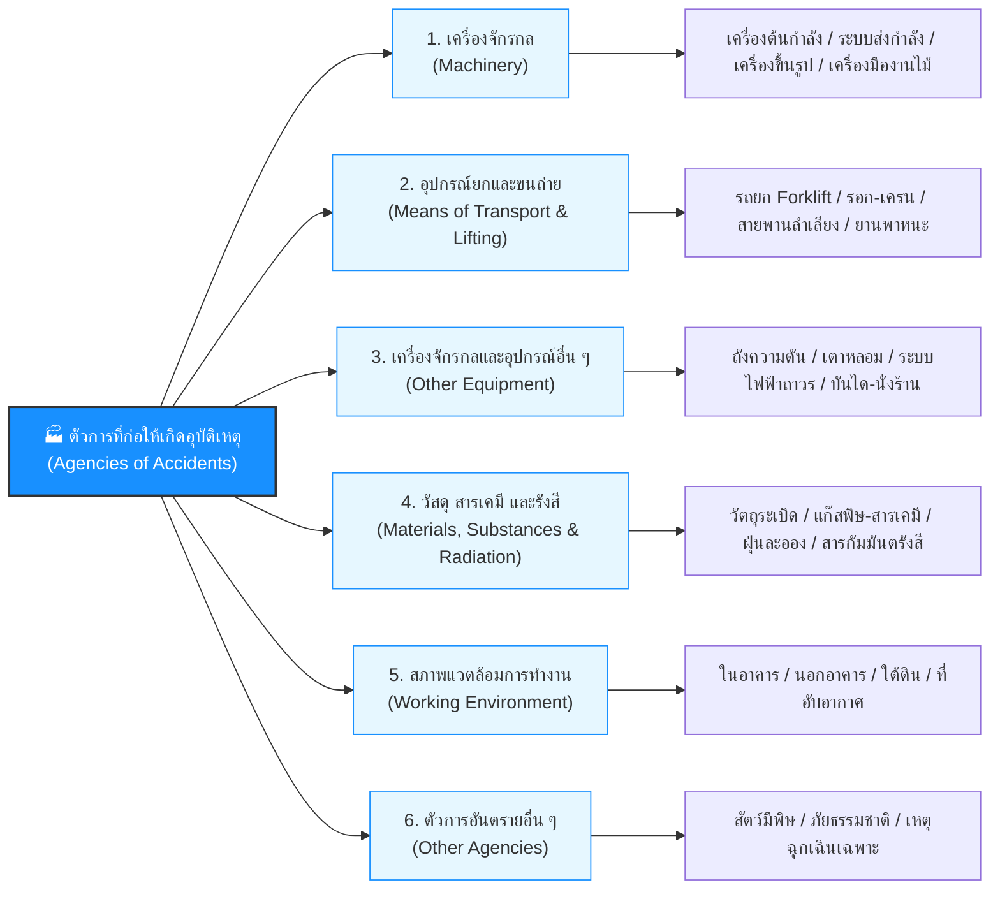

# Week 07 ตัวการและสิ่งแวดล้อมที่ก่อให้เกิดอุบัติเหตุ (Agencies of Accidents)

---

## วัตถุประสงค์การเรียนรู้ (Learning Objectives)

เมื่อศึกษาเนื้อหาในส่วนนี้แล้ว ผู้เรียนจะสามารถ
1. **เข้าใจความหมายและบทบาทของ "ตัวการก่อเหตุ" (Agency)** ในการสืบสวนและจำแนกอุบัติเหตุจากการทำงาน
2. **จำแนกหมวดหมู่ตัวการทั้ง 6 กลุ่ม** ตามมาตรฐานองค์การแรงงานระหว่างประเทศ (ILO) ได้อย่างถูกต้อง
3. **วิเคราะห์กรณีศึกษาและเรื่องเล่าจากสถานการณ์จริงในหลากหลายวิชาชีพ** ครอบคลุมทั้งระดับทุพพลภาพชั่วคราว ทุพพลภาพถาวร และการเสียชีวิต
4. **ระบุจุดอันตรายจำเพาะ (Specific Hazard Points)** ของตัวการแต่ละประเภทเพื่อกำหนดมาตรการป้องกันเชิงวิศวกรรม (เช่น การติดตั้ง Machine Guarding, การตรวจรับรองอุปกรณ์ยก, ระบบระบายอากาศ)

---

## นิยามของ "ตัวการที่ก่อให้เกิดอุบัติเหตุ" (What is an Agency?)

> [!IMPORTANT] นิยามของ Agency ในทางความปลอดภัย
> **ตัวการ (Agency)** หมายถึง *วัตถุ สาร สารเคมี เครื่องมือ เครื่องจักร อุปกรณ์ หรือสภาพแวดล้อมทางกายภาพที่เป็นต้นเหตุหรือมีส่วนเกี่ยวข้องโดยตรงในการทำให้เกิดอันตรายหรือการบาดเจ็บต่อผู้ปฏิบัติงาน*
> 
> **ประโยชน์ของการระบุ Agency:**
> * ช่วยให้วิศวกรความปลอดภัยทราบว่าต้องไป **"ควบคุมหรือปรับปรุงเครื่องมือ/สภาพแวดล้อมชิ้นใด"**
> * ช่วยนำไปสู่การกำหนดมาตรฐานการบำรุงรักษาเชิงป้องกัน (Preventive Maintenance) และการตรวจเช็กความปลอดภัยประจำวัน

---

## แผนผัง 6 หมวดหมู่ตัวการที่ก่อให้เกิดอุบัติเหตุตามมาตรฐาน ILO

---

## รายละเอียดการจำแนกตัวการทั้ง 6 หมวดหมู่ พร้อมกรณีศึกษาจริง

---

### หมวดที่ 1: เครื่องจักรกล (Machinery)

เครื่องจักรที่มีชิ้นส่วนเคลื่อนไหว หมุน หรือส่งกำลัง ซึ่งมักก่อให้เกิดอันตรายจากการหนีบ ตัด ดึง หรือกระแทก

1. **เครื่องต้นกำลังต่าง ๆ (Prime Movers):** เครื่องยนต์ดีเซล กังหันไอน้ำ (ยกเว้นมอเตอร์ไฟฟ้าเดี่ยว)
2. **อุปกรณ์ส่งถ่ายกำลังกล (Transmission Machinery):** เพลาหมุน (Shafts), มู่เล่ย์ (Pulleys), สายพาน (Belts), โซ่และเฟือง (Chains & Sprockets)
3. **เครื่องขึ้นรูปโลหะ (Metalworking Machines):** เครื่องปั๊มโลหะ (Power Press), เครื่องกลึง (Lathe), เครื่องไส, เครื่องกัด (Milling)
4. **เครื่องจักรกลงานไม้ (Woodworking Machines):** เลื่อยวงเดือน (Circular Saw), เครื่องไสไม้ (Planer), เลื่อยสายพาน
5. **เครื่องจักรกลการเกษตร (Agricultural Machines):** รถเกี่ยวข้าว, รถไถพรวนดิน, เครื่องพ่นสารเคมี
6. **เครื่องจักรกลเหมืองแร่ (Mining Machinery):** เครื่องเจาะหิน, เครื่องบดแร่
7. **เครื่องจักรกลอื่น ๆ:** เครื่องจักรบรรจุภัณฑ์, เครื่องผสมอุตสาหกรรม

> [!TIP] จุดเน้นด้านความปลอดภัย
> สำหรับเครื่องจักรกล มาตรการสำคัญที่สุดคือ **Machine Guarding (การ์ดป้องกันจุดอันตราย)** และระบบ **Safety Interlock** เพื่อไม่ให้เครื่องจักรทำงานเมื่อเปิดฝาครอบ

#### เรื่องเล่าและกรณีศึกษาจากสถานที่ทำงานจริง

##### **ระดับทุพพลภาพชั่วคราว: ช่างกลึงขึ้นรูปชิ้นส่วนยานยนต์ (Lathe Machinist)**

| หัวข้อ          | รายละเอียด                                                                                                                                                                                                                                           |
| :-------------- | :--------------------------------------------------------------------------------------------------------------------------------------------------------------------------------------------------------------------------------------------------- |
| ***เหตุการณ์*** | "ช่างก้อง" กำลังใช้เครื่องกลึงแบบ Manual ตัดแต่งผิวเพลาเหล็ก ระหว่างที่หัวจับ (Chuck) กำลังหมุนด้วยความเร็วสูง ก้องใช้แปรงปัดเศษเหล็กเข้าใกล้หัวจับ ขนแปรงถูกหัวจับเกี่ยว ดึงมือขวาของก้องเข้าไปฟาดกับแท่นมีดกลึง                                |
| ***ผลกระทบ***   | หลังมือขวาและนิ้วชี้มีแผลฉีกขาดลึก เย็บ 5 เข็ม กระดูกนิ้วมือร้าวเล็กน้อย แพทย์ใส่เฝือกดามนิ้ว พักฟื้น 3 สัปดาห์ แผลหายสนิท ขยับนิ้วได้ตามปกติและกลับมาทำงานได้                                                                                   |
| ***บทเรียน***   | ต้องหยุดเครื่องกลึงให้สนิทก่อนทำความสะอาดเศษผงโลหะทุกครั้ง และติดตั้งฝาครอบใสแบบ Interlock Guard เหนือหัวจับกลึง                                                                                                                                   |

##### **ระดับทุพพลภาพถาวร: พนักงานควบคุมเครื่องปั๊มโลหะ (Power Press Operator)**

| หัวข้อ          | รายละเอียด                                                                                                                                                                                                                                                            |
| :-------------- | :-------------------------------------------------------------------------------------------------------------------------------------------------------------------------------------------------------------------------------------------------------------------- |
| ***เหตุการณ์*** | "สมศรี" ทำงานป้อนแผ่นเหล็กเข้าเครื่องปั๊มโลหะขนาด 80 ตัน วันเกิดเหตุเซนเซอร์ม่านแสงนิรภัย (Light Curtain) เสียชำรุด หัวหน้างานสั่งให้ใช้สวิตช์เท้า (Foot Switch) ชั่วคราว ขณะสมศรีเอื้อมมือซ้ายเข้าไปจัดแผ่นเหล็ก เท้าเผลอไปเหยียบสวิตช์เท้า ใบมีดปั๊มกระแทกลงมาทันที |
| ***ผลกระทบ***   | ใบมีดปั๊มตัดผ่านปลายนิ้วชี้และนิ้วกลางมือซ้ายขาดกระเด็น ศัลยแพทย์ไม่สามารถต่อกลับได้ สมศรีสูญเสียนิ้วมือถาวร 2 นิ้ว และต้องเปลี่ยนสายงานไปทำหน้าที่ตรวจสอบเอกสาร                                                                                                  |
| ***บทเรียน***   | ห้ามปลดหรือบายพาสระบบม่านแสงนิรภัยโดยเด็ดขาด และเครื่องปั๊มโลหะต้องใช้ระบบปุ่มกดสองมือพร้อมกัน (Two-Hand Control) เพื่อบังคับให้มือทั้งสองข้างอยู่นอกเขตอันตราย                                                                                                   |

##### **ระดับการเสียชีวิต: ช่างซ่อมบำรุงโรงสีข้าวขนาดใหญ่ (Grain Elevator Maintenance Worker)**

| หัวข้อ          | รายละเอียด                                                                                                                                                                                                                                             |
| :-------------- | :----------------------------------------------------------------------------------------------------------------------------------------------------------------------------------------------------------------------------------------------------- |
| ***เหตุการณ์*** | "น้าเชิด" ขึ้นไปหยอดน้ำมันหล่อลื่นที่ตลับลูกปืนของเพลาหมุนส่งกำลังขับสายพานลำเลียง (Transmission Shaft) ความเร็ว 600 RPM ซึ่งไม่มีการ์ดครอบปิด ชายเสื้อช่างที่หลวมถูกเพลาหมุนดึงม้วนเข้าไปอย่างรวดเร็ว ร่างของน้าเชิดถูกเหวี่ยงฟาดกับโครงสร้างเหล็กและคานปูน |
| ***ผลกระทบ***   | กะโหลกศีรษะแตก คอหัก และอวัยวะภายในฉีกขาด เสียชีวิตทันทีในที่เกิดเหตุ                                                                                                                                                                                  |
| ***บทเรียน***   | เพลาหมุนและชิ้นส่วนส่งกำลังทุกชนิดต้องติดตั้ง Fixed Enclosure Guard ปิดล้อม 100% และต้องหยุดการทำงานของเครื่องจักรพร้อมทำ Lockout/Tagout ก่อนการบำรุงรักษาเสมอ                                                                                        |

---

### หมวดที่ 2: วัสดุอุปกรณ์ในการขนถ่ายและยกวัสดุ (Means of Transport & Lifting Equipment)

อุปกรณ์และยานพาหนะที่ใช้ในการเคลื่อนย้ายวัตถุหรือคนในสถานประกอบการ

1. **รถยกและเครื่องยกต่าง ๆ:** รถโฟล์กลิฟต์ (Forklift), เครนเหนือศีรษะ (Overhead Crane), รอกสลิงไฟฟ้า, รถกระเช้า (Boom Lift)
2. **รถหรือล้อที่มีรางเลื่อน:** รถไฟลำเลียงในโรงงาน, รางเลื่อนขนส่งชิ้นงาน
3. **ล้อเลื่อนอื่น ๆ ที่ไม่แล่นบนราง:** รถลากพาเลท (Hand Pallet Truck), รถเข็นของ 4 ล้อ
4. **พาหนะขนส่งทางอากาศ:** เครื่องบินลำเลียง, โดรนสำรวจภาคอุตสาหกรรม
5. **พาหนะขนส่งทางน้ำ:** เรือบรรทุกสินค้า, เรือลำเลียงแร่
6. **พาหนะขนส่งทางบกอื่น ๆ:** รถบรรทุกสิบล้อ, รถเทรลเลอร์, รถกระบะส่งของ

#### เรื่องเล่าและกรณีศึกษาจากสถานที่ทำงานจริง

##### **ระดับทุพพลภาพชั่วคราว: พนักงานคลังสินค้าใช้รถลากพาเลทมือ (Hand Pallet Truck Operator)**

| หัวข้อ          | รายละเอียด                                                                                                                                                                                                       |
| :-------------- | :--------------------------------------------------------------------------------------------------------------------------------------------------------------------------------------------------------------- |
| ***เหตุการณ์*** | "โต้ง" กำลังเดินถอยหลังลากพาเลทบรรจุกล่องน้ำผลไม้หนัก 400 กก. ลงทางลาดเอียงเล็กน้อย รถลากไหลเร็วขึ้น ล้อเหล็กของรถลากทับเข้าที่ขอบรองเท้าเซฟตี้และข้อเท้าขวาของโต้งจนสะดุดล้ม                                 |
| ***ผลกระทบ***   | ข้อเท้าขวาเคล็ดบวมและมีรอยฟกช้ำ โชคดีที่หัวเหล็กของรองเท้า Safety Shoes ช่วยป้องกันไม่ให้นิ้วเท้าถูกบด แพทย์ให้หยุดพักงานและทำกายภาพบำบัด 2 สัปดาห์ หายดีกลับมาทำงานได้                                       |
| ***บทเรียน***   | การเคลื่อนย้ายพาเลทลงทางลาดต้องเดินอยู่ด้านบนของทางลาดเสมอ (ห้ามเดินถอยหลังนำหน้ารถลาก) และใช้วิธีดันรถลากชะลอความเร็ว                                                                                          |

##### **ระดับทุพพลภาพถาวร: ผู้ช่วยช่างขับเครนในโรงงานหล่อเหล็ก (Overhead Crane Rigger)**

| หัวข้อ          | รายละเอียด                                                                                                                                                                                                                             |
| :-------------- | :------------------------------------------------------------------------------------------------------------------------------------------------------------------------------------------------------------------------------------- |
| ***เหตุการณ์*** | "วิทยา" กำลังทำหน้าที่ผูกมัดชิ้นงานเหล็กหล่อหนัก 3 ตัน ขณะที่เครนเหนือศีรษะกำลังยกชิ้นงานขึ้น ลวดสลิงเส้นหนึ่งเกิดการขาดกะทันหันเนื่องจากมีรอยสนิมกร่อนภายใน ชิ้นงานเอียงกระแทกพื้น และตะขอเครนดีดฟาดเข้าที่ข้อเข่าและหน้าแข้งขวาของวิทยา |
| ***ผลกระทบ***   | กระดูกสะบ้าหัวเข่าแตกละเอียดและเส้นเอ็นไขว้หน้าขาด ศัลยแพทย์ผ่าตัดดามโครงเหล็ก แต่ข้อเข่าสูญเสียการงอพับอย่างถาวร (Stiff Knee) เดินกะเผลก ต้องใช้ไม้เท้าตลอดชีวิต                                                                   |
| ***บทเรียน***   | ต้องตรวจสอบสภาพลวดสลิงและอุปกรณ์ช่วยยกตามแบบ ปจ.1 อย่างเคร่งครัด และคนผูกมัดต้องถอยออกจากรัศมีการยก (Drop Zone) ก่อนให้สัญญาณยก                                                                                                      |

##### **ระดับการเสียชีวิต: ช่างทาสีโครงสร้างภายนอกบนรถกระเช้า (Boom Lift Painter)**

| หัวข้อ          | รายละเอียด                                                                                                                                                                                                                                                    |
| :-------------- | :------------------------------------------------------------------------------------------------------------------------------------------------------------------------------------------------------------------------------------------------------------ |
| ***เหตุการณ์*** | "ชิดชัย" ขึ้นไปบนกระเช้ารถบูมลิฟต์ที่ยืดแขนสูง 15 เมตร เพื่อทาสีผนังอาคารโรงงาน ระหว่างนั้น รถบรรทุกสิบล้อส่งของเลี้ยวตีวงกว้างเข้ามาชนเข้าที่ตัวฐานล้อของรถบูมลิฟต์อย่างจัง แรงชนทำให้แขนบูมลิฟต์ดีดสะบัดและพลิกคว่ำ ชิดชัยไม่ได้เกี่ยวสายนิรภัยตกกระแทกพื้นคอนกรีต |
| ***ผลกระทบ***   | กะโหลกศีรษะแตก เลือดออกในสมองเฉียบพลัน เสียชีวิตทันทีในที่เกิดเหตุ                                                                                                                                                                                            |
| ***บทเรียน***   | ต้องกั้นเขตกรวยสะท้อนแสงและแผงกั้นห้ามยานพาหนะเข้าใกล้ฐานรถกระเช้าอย่างน้อย 5 เมตร และผู้ปฏิบัติงานบนกระเช้าต้องสวม Full Body Harness เกี่ยวกับจุดยึด Anchor Point ของกระเช้าตลอดเวลา                                                                     |

---

### หมวดที่ 3: เครื่องจักรกลและอุปกรณ์อื่น ๆ (Other Equipment)

อุปกรณ์ เครื่องมือประจำโรงงาน และโครงสร้างชั่วคราว

1. **ภาชนะบรรจุความดันสูง (Pressure Vessels):** หม้อน้ำไอน้ำ (Boiler), ถังบรรจุแก๊ส LPG/NGV, ถังลมอัด
2. **เตาหลอม เตาเผา เตาอบ (Furnaces, Kilns, Ovens):** เตาหลอมโลหะ, เตาอบสีอุตสาหกรรม
3. **ระบบเครื่องทำความเย็น (Refrigeration Plants):** ระบบทำความเย็นแอมโมเนียในห้องเย็น
4. **ระบบไฟฟ้าที่ติดตั้งถาวร:** ตู้สวิตช์บอร์ดหลัก (MDB), หม้อแปลงไฟฟ้า, รางเดินสายไฟ
5. **เครื่องมือไฟฟ้าต่าง ๆ (Electric Tools):** สว่านไฟฟ้า, หินเจียรมือถือ, เลื่อยวงเดือนพกพา
6. **เครื่องมือเครื่องใช้ที่ไม่ใช้ไฟฟ้า (Hand Tools):** ค้อน, ประแจ, มีดคัตเตอร์, เลื่อยมือ
7. **บันไดและล้อเลื่อนทำหน้าที่บันได:** บันไดพับอะลูมิเนียม, บันไดลิง, นั่งร้านเลื่อน
8. **โครงสร้างและนั่งร้าน (Structures & Scaffolding):** นั่งร้านเหล็กแบบท่อ, นั่งร้านเฟรม, ทางเดินลอย (Catwalk)
9. **อุปกรณ์อื่น ๆ นอกเหนือจากที่ระบุ:** ถังพักน้ำ, ไซโลเก็บวัตถุดิบ

#### เรื่องเล่าและกรณีศึกษาจากสถานที่ทำงานจริง

##### **ระดับทุพพลภาพชั่วคราว: ช่างประกอบเฟอร์นิเจอร์ไม้ (Furniture Assembler)**

| หัวข้อ          | รายละเอียด                                                                                                                                                                                                                            |
| :-------------- | :----------------------------------------------------------------------------------------------------------------------------------------------------------------------------------------------------------------------------------- |
| ***เหตุการณ์*** | "เอกชัย" ใช้สว่านไฟฟ้ามือถือขันน็อตโครงตู้ไม้ ดอกสว่านเกิดติดขัดกับตาไม้แข็ง ตัวสว่านสะบัดกลับอย่างแรงด้ามจับกระแทกข้อมือขวาของเอกชัย และดอกสว่านเฉี่ยวโดนง่ามมือ                                                                   |
| ***ผลกระทบ***   | ข้อมือเคล็ดขัดยอกและมีแผลฉีกขาดที่ง่ามมือเย็บ 3 เข็ม แพทย์ให้ใส่ผ้ารัดข้อมือและหยุดพักงาน 1 สัปดาห์ ข้อมือกลับมาใช้งานได้เป็นปกติ                                                                                                   |
| ***บทเรียน***   | ต้องตั้งค่าแรงบิด (Torque Clutch) ของสว่านไฟฟ้าให้เหมาะสมกับขนาดสกรู และจับสว่านด้วยสองมือให้มั่นคง                                                                                                                                 |

##### **ระดับทุพพลภาพถาวร: ช่างติดตั้งกระจกอาคารบนนั่งร้าน (Scaffold Glass Installer)**

| หัวข้อ          | รายละเอียด                                                                                                                                                                                                                                                             |
| :-------------- | :--------------------------------------------------------------------------------------------------------------------------------------------------------------------------------------------------------------------------------------------------------------------- |
| ***เหตุการณ์*** | "ประสิทธิ์" ยืนบนนั่งร้านเหล็กชั้นที่ 3 ความสูง 5.5 เมตร เพื่อติดตั้งกระจกบานใหญ่ แผ่นไม้ปูพื้นทางเดินนั่งร้านไม่ได้ยึดสลักล็อก เมื่อประสิทธิ์ก้าวเหยียบปลายแผ่นไม้ แผ่นไม้กระดกหลุด ประสิทธิ์ร่วงตกลงมากระแทกพื้นด้านล่างโดยหลังฟาดกับกองเหล็กข้ออ้อย            |
| ***ผลกระทบ***   | กระดูกเชิงกรานแตกหักซับซ้อนและกระดูกสันหลังข้อ L2 ยุบตัว ผ่าตัดใส่เหล็กดามถาวร ขาขวาสั้นลงกว่าขาซ้าย 2 ซม. ไม่สามารถยกของหนักหรือปีนป่ายได้ตลอดชีวิต                                                                                                                |
| ***บทเรียน***   | การติดตั้งนั่งร้านต้องได้รับการตรวจสอบและติดป้ายรับรอง (Scaffold Tag) ก่อนใช้งาน แผ่นทางเดินต้องใช้แผ่นเหล็กมาตรฐานที่มีตัวล็อก และต้องสวมใส่ Full Body Harness เกี่ยวกับ Life line                                                                                 |

##### **ระดับการเสียชีวิต: ช่างคุมหม้อน้ำไอน้ำโรงงานฟอกย้อม (Industrial Boiler Operator)**

| หัวข้อ          | รายละเอียด                                                                                                                                                                                                                                                                 |
| :-------------- | :------------------------------------------------------------------------------------------------------------------------------------------------------------------------------------------------------------------------------------------------------------------------- |
| ***เหตุการณ์*** | "ช่างประเสริฐ" กำลังเร่งความร้อนหม้อน้ำไอน้ำ (Boiler) แรงดัน 12 บาร์ เพื่อส่งไอน้ำเข้าไลน์ผลิต แต่วาล์วนิรภัย (Safety Valve) เกิดการอุดตันจากคราบตะกรันและไม่มีการทดสอบระบายประจำสัปดาห์ หม้อน้ำรับแรงดันเกินขีดจำกัดจนระเบิด คลื่นกระแทกและไอน้ำร้อนพังอาคารยุบลงมา |
| ***ผลกระทบ***   | ช่างประเสริฐถูกแรงอัดกระแทกและถูกไอน้ำร้อนลวกคลอกทั่วร่างกาย เสียชีวิตทันทีในห้องควบคุม                                                                                                                                                                                    |
| ***บทเรียน***   | ต้องทดสอบการทำงานของ Safety Valve และระบบตัดแก๊สเมื่อน้ำแห้ง (Low Water Cutoff) ทุกวัน และต้องให้วิศวกรตรวจสอบรับรองความปลอดภัยประจำปีตามกฎหมาย                                                                                                                           |

---

### หมวดที่ 4: วัสดุ สาร และรังสี (Materials, Substances & Radiation)

สารเคมี วัตถุดิบ และพลังงานรังสีที่ก่อให้เกิดอันตรายต่อสุขภาพหรือเกิดอุบัติเหตุฉับพลัน

1. **วัตถุระเบิด (Explosives):** ดินปืน, วัตถุระเบิดในงานเหมือง, ดอกไม้เพลิง
2. **ฝุ่นผง แก๊ส ของเหลว สารเคมีต่าง ๆ:** สารกัดกร่อน (กรด/ด่าง), ไอระเหยตัวทำละลาย (Solvents), แก๊สพิษ ($CO, H_2S$), ฝุ่นละอองติดไฟได้
3. **วัตถุที่แตกกระจาย ลอยไปในอากาศ (Flying Fragments):** สะเก็ดไฟเชื่อม, เศษแก้วแตก, เศษโลหะจากการกลึง
4. **รังสีและสารกัมมันตรังสี (Radiation & Radioactive Substances):** รังสีเอกซ์ (X-rays), แหล่งกำเนิดรังสีแกมมาสำหรับตรวจสอบรอยเชื่อม (NDT)
5. **สารอื่น ๆ นอกเหนือจากข้อ 1 - 4:** ปูนซีเมนต์เปียก, ยางมะตอยร้อน

#### เรื่องเล่าและกรณีศึกษาจากสถานที่ทำงานจริง

##### **ระดับทุพพลภาพชั่วคราว: ช่างเชื่อมโครงสร้างเหล็ก (Steel Structure Welder)**

| หัวข้อ          | รายละเอียด                                                                                                                                                                                                                      |
| :-------------- | :------------------------------------------------------------------------------------------------------------------------------------------------------------------------------------------------------------------------------ |
| ***เหตุการณ์*** | "ช่างเดช" กำลังเชื่อมไฟฟ้าท่าเหนือศีรษะ (Overhead Welding) สะเก็ดลูกไฟเชื่อมขนาดใหญ่กระเด็นรอดคอเสื้อแจ็กเก็ตเข้าไปในเสื้อยืดด้านใน ลูกไฟไหม้แนบติดกับเนื้อบริเวณไหปลาร้าและต้นคอ ช่างเดชสะบัดหน้ากากออกเพื่อดับไฟ        |
| ***ผลกระทบ***   | ผิวหนังบริเวณคอและหน้าอกไหม้ระดับ 2 (Second-degree burn) เป็นแผลพุพองแสบร้อน แพทย์ทำแผลและทายาปฏิชีวนะ ให้พักฟื้น 10 วัน แผลตกสะเก็ดหายดี ไม่เกิดแผลเป็นดึงรั้ง                                                              |
| ***บทเรียน***   | งานเชื่อมท่าเหนือศีรษะต้องสวมชุดหนังป้องกันสะเก็ดไฟ ปิดกระดุมคอเสื้อให้มิดชิด และสวมหมวกคลุมศีรษะและคอ (Welding Hood)                                                                                                         |

##### **ระดับทุพพลภาพถาวร: นักรังสีเทคนิคตรวจสอบรอยเชื่อม (NDT Radiography Technician)**

| หัวข้อ          | รายละเอียด                                                                                                                                                                                                                                                                    |
| :-------------- | :---------------------------------------------------------------------------------------------------------------------------------------------------------------------------------------------------------------------------------------------------------------------------- |
| ***เหตุการณ์*** | "กิตติ" กำลังใช้เครื่องฉายรังสีแกมมาบรรจุสารไอโซโทป Iridium-192 ตรวจสอบรอยเชื่อมท่อส่งก๊าซ ระหว่างเก็บแหล่งกำเนิดรังสี แคปซูลรังสีเกิดติดค้างในท่อส่ง กิตติใช้มือเปล่าจับดึงสายสลิงเพื่อปลดแคปซูลโดยไม่ใช้คีมคีบด้ามยาว มือสัมผัสรังสีแกมมาความเข้มข้นสูงเป็นเวลา 2 นาที |
| ***ผลกระทบ***   | นิ้วหัวแม่มือและนิ้วชี้ซ้ายเกิดแผลไหม้จากรังสีอย่างรุนแรง (Radiation Necrosis) เนื้อเยื่อและเส้นเลือดฝอยตายถาวร ศัลยแพทย์จำเป็นต้องตัดนิ้วหัวแม่มือและนิ้วชี้ทิ้ง กิตติสูญเสียนิ้วมือถาวร                                                                                 |
| ***บทเรียน***   | ต้องพกพาเครื่องวัดปริมาณรังสี (Survey Meter) ตลอดเวลา และปฏิบัติตามหลักความปลอดภัยทางรังสี 3 ประการอย่างเคร่งครัด: ลดเวลา (Time) เพิ่มระยะห่าง (Distance) ใช้อุปกรณ์กำบัง (Shielding)                                                                                     |

##### **ระดับการเสียชีวิต: คนงานในโรงงานผสมดินปืนพลุดอกไม้ไฟ (Fireworks Manufacturing Worker)**

| หัวข้อ          | รายละเอียด                                                                                                                                                                                                                                                              |
| :-------------- | :---------------------------------------------------------------------------------------------------------------------------------------------------------------------------------------------------------------------------------------------------------------------- |
| ***เหตุการณ์*** | "สำราญ" กำลังใช้ช้อนโลหะตักผสมดินประสิว ผงอะลูมิเนียม และสารออกซิไดซ์ในอ่างผสม ระหว่างคนเกิดการเสียดสีของช้อนโลหะทำให้เกิดประกายไฟไฟฟ้าสถิต ผงเคมีไวไฟเกิดการระเบิดอย่างฉับพลัน (Flash Fire Explosion) ลุกลามไปยังคลังจัดเก็บดินปืนด้านหลังจนโรงงานระเบิดราบคาบ |
| ***ผลกระทบ***   | แรงระเบิดและเปลวเพลิงเผาไหม้ทำลายร่างของสำราญและเพื่อนร่วมงาน เสียชีวิตทันทีในที่เกิดเหตุ                                                                                                                                                                               |
| ***บทเรียน***   | การผสมสารเคมีไวไฟและวัตถุระเบิดต้องใช้อุปกรณ์ที่ทำจากวัสดุที่ไม่เกิดประกายไฟ (Non-Sparking Tools: เช่น ไม้ ทองเหลือง หรือทองแดงผสมเบริลเลียม) และต้องติดตั้งระบบสายดินระบายไฟฟ้าสถิต (Grounding & Bonding)                                                        |

---

### หมวดที่ 5: สภาพแวดล้อมในการทำงาน (Working Environment)

สภาพแวดล้อมทางกายภาพที่ส่งผลให้เกิดอุบัติเหตุ เช่น แสงสว่างไม่เพียงพอ พื้นผิวชำรุด หรือพื้นที่จำกัด

1. **ภายนอกอาคารโรงงาน (Outdoor Environment):** ลานกองสินค้า, ถนนภายในโรงงาน, สภาพอากาศฝนตกพายุ
2. **ภายในอาคารโรงงาน (Indoor Environment):** พื้นทางเดินเปียกลื่น, บันไดทางขึ้น-ลง, บริเวณที่มีแสงสว่างไม่เพียงพอ, ที่ทำงานที่มีเสียงดังสะสม
3. **ใต้ดินและพื้นที่อับอากาศ (Underground & Confined Spaces):** อุโมงค์ขุดเจาะ, ท่อระบายน้ำใต้ดิน, ถังเก็บใต้ดิน

#### เรื่องเล่าและกรณีศึกษาจากสถานที่ทำงานจริง

##### **ระดับทุพพลภาพชั่วคราว: พนักงานตรวจสอบลานกองตู้คอนเทนเนอร์ (Yard Tally Clerk)**

| หัวข้อ          | รายละเอียด                                                                                                                                                                                                                 |
| :-------------- | :------------------------------------------------------------------------------------------------------------------------------------------------------------------------------------------------------------------------- |
| ***เหตุการณ์*** | "วีระ" กำลังเดินจดเบอร์รหัสตู้สินค้าในลานกองคอนกลางแจ้งช่วงพลบค่ำ บริเวณนั้นหลอดไฟส่องสว่างชำรุด วีระก้าวเหยียบขอบฝาท่อระบายน้ำที่ชำรุดแตกหัก ทำให้ขาขวาตกลงไปในร่องท่อและเสียหลักล้มกระแทก                              |
| ***ผลกระทบ***   | หน้าแข้งขวาครูดกับขอบปูนเกิดแผลฉีกขาดเย็บ 8 เข็ม และข้อเท้าขวาแพลง แพทย์ให้หยุดพักฟื้น 2 สัปดาห์ แผลสมานดี กลับมาเดินตรวจงานได้ตามปกติ                                                                                  |
| ***บทเรียน***   | ต้องซ่อมบำรุงระบบแสงสว่างในลานกองสินค้าให้มีความสว่างไม่น้อยกว่า 100 Lux ตามกฎหมาย และตรวจซ่อมฝาท่อระบายน้ำที่ชำรุดทันที                                                                                                 |

##### **ระดับทุพพลภาพถาวร: คนงานเจาะอุโมงค์เหมืองแร่ใต้ดิน (Underground Tunnel Miner)**

| หัวข้อ          | รายละเอียด                                                                                                                                                                                                                                                |
| :-------------- | :-------------------------------------------------------------------------------------------------------------------------------------------------------------------------------------------------------------------------------------------------------- |
| ***เหตุการณ์*** | "สมปอง" กำลังใช้เครื่องเจาะหินในอุโมงค์เหมืองแร่ใต้ดินความลึก 80 เมตร เพดานหินชั้นบนที่ไม่ได้ติดตั้งสลักยึดหิน (Rock Bolts) และตาข่ายเหล็ก เกิดการแตกร้าวจากแรงสั่นสะเทือน ก้อนหินขนาดใหญ่หนัก 250 กก. ร่วงลงมากระแทกแผ่นหลังและสะโพกของสมปองเต็มแรง |
| ***ผลกระทบ***   | กระดูกสันหลังส่วนเอวข้อ L1-L2 หักยุบและกดทับเส้นประสาทไขสันหลัง ส่งผลให้ขาทั้งสองข้างเป็นอัมพาต สูญเสียการควบคุมระบบขับถ่ายถาวร ต้องใช้ชีวิตบนรถเข็นตลอดชีพ                                                                                            |
| ***บทเรียน***   | งานขุดเจาะใต้ดินต้องทำการค้ำยันเพดานอุโมงค์ด้วยระบบ Rock Bolting และพ่นคอนกรีต Shotcrete ทันทีหลังการระเบิดหรือขุดเจาะ พร้อมตรวจวัดการเคลื่อนตัวของชั้นหินอย่างต่อเนื่อง                                                                              |

##### **ระดับการเสียชีวิต: ช่างทำความสะอาดถังหมักแอลกอฮอล์ในที่อับอากาศ (Fermentation Tank Cleaner)**

| หัวข้อ          | รายละเอียด                                                                                                                                                                                                                                                        |
| :-------------- | :---------------------------------------------------------------------------------------------------------------------------------------------------------------------------------------------------------------------------------------------------------------- |
| ***เหตุการณ์*** | "บุญช่วย" ปีนบันไดลงไปในถังหมักเอทานอลสแตนเลสขนาด 50,000 ลิตร เพื่อล้างกากหมัก โดยไม่มีการตรวจวัดก๊าซและไม่มีการระบายอากาศ ภายในถังมีก๊าซคาร์บอนไดออกไซด์ ($CO_2$) สะสมอยู่หนาแน่นและออกซิเจนต่ำกว่า 10% บุญช่วยสูดหายใจ 2 ครั้งก็หมดสติและล้มคว่ำก้นถัง |
| ***ผลกระทบ***   | ขาดออกซิเจนไปเลี้ยงสมอง เสียชีวิตภายใน 4 นาที ก่อนที่ทีมกู้ภัยจะลงไปนำร่างขึ้นมาได้                                                                                                                                                                              |
| ***บทเรียน***   | งานในที่อับอากาศต้องปฏิบัติตามกฎหมาย: ตรวจวัดออกซิเจน (ต้องอยู่ระหว่าง 19.5% - 23.5%), เป่าระบายอากาศด้วยพัดลมโบลเวอร์ตลอดเวลาการทำงาน, มีผู้เฝ้าปากทางเข้า และต้องมีใบอนุญาตทำงาน (Confined Space Entry Permit)                                             |

---

### หมวดที่ 6: ตัวการอันตรายอื่น ๆ (Other Agencies)

ตัวการที่ไม่สามารถจัดเข้ากลุ่ม 1-5 ได้อย่างชัดเจน

1. **สัตว์มีอันตรายต่าง ๆ:** ผึ้ง, ต่อ, แตน, งูพิษ, สุนัขจรจัดในเขตก่อสร้าง
2. **ตัวการอื่น ๆ นอกเหนือจากที่ระบุไว้:** เหตุการณ์ความไม่สงบ, ฝูงชนตื่นตระหนก, ภัยพิบัติทางธรรมชาติ

#### เรื่องเล่าและกรณีศึกษาจากสถานที่ทำงานจริง

##### **ระดับทุพพลภาพชั่วคราว: ช่างพาดสายเคเบิลสื่อสารบนเสาไฟฟ้า (Telecom Lineman)**

| หัวข้อ          | รายละเอียด                                                                                                                                                                                                               |
| :-------------- | :----------------------------------------------------------------------------------------------------------------------------------------------------------------------------------------------------------------------- |
| ***เหตุการณ์*** | "ช่างชัย" กำลังปีนบันไดขึ้นไปพาดสายไฟเบอร์ออปติกบนเสาไฟฟ้าข้างทาง มือไปปัดโดนกิ่งไม้แห้งที่เป็นรังของ "แตนต่อย" ฝูงแตนแตกรังรุมต่อยช่างชัยที่บริเวณใบหน้าและแขนรวม 6 จุด ช่างชัยรีบไต่บันไดลงมาและวิ่งหนีเข้าไปในรถ |
| ***ผลกระทบ***   | ใบหน้าและแขนบวมแดง ปวดแสบปวดร้อน มีไข้ต่ำๆ ถูกส่งตัวไปโรงพยาบาล แพทย์ฉีดยาแก้แพ้และยาแก้ปวด พักดูอาการ 1 คืน อาการบวมยุบหายเป็นปกติใน 3 วัน                                                                            |
| ***บทเรียน***   | ช่างปีนเสาไฟฟ้าต้องสังเกตตรวจตราสิ่งแปลกปลอมและรังแมลงมีพิษตามพุ่มไม้และหัวเสาก่อนปีนขึ้นไปทุกครั้ง                                                                                                                     |

##### **ระดับทุพพลภาพถาวร: ช่างสำรวจแนวท่อก๊าซธรรมชาติในป่าชายเลน (Pipeline Surveyor)**

| หัวข้อ          | รายละเอียด                                                                                                                                                                                                                                                  |
| :-------------- | :---------------------------------------------------------------------------------------------------------------------------------------------------------------------------------------------------------------------------------------------------------- |
| ***เหตุการณ์*** | "อนุภาพ" ช่างสำรวจภาคสนาม กำลังเดินฝ่าดงโกงกางเพื่อวางหมุดแนวท่อก๊าซ ได้พบกับ "งูเห่าพ่นพิษสยาม" ตัวงูแผ่แม่เบี้ยและพ่นพิษใส่ใบหน้าของอนุภาพในระยะ 1 เมตร ละอองพิษเข้าตาทั้งสองข้าง อนุภาพไม่ได้สวมแว่นตานิรภัยและไม่มีน้ำสะอาดล้างตาในทันที         |
| ***ผลกระทบ***   | พิษงูกัดกร่อนกระจกตาและทำให้เกิดการอักเสบติดเชื้อรุนแรง แม้จะได้รับการรักษาที่โรงพยาบาล แต่กระจกตาข้างขวาขุ่นเป็นฝ้าขาวถาวร ส่งผลให้ตาขวาบอดสนิท และตาซ้ายมองเห็นลดลงเหลือ 60% สูญเสียสมรรถภาพในการทำงานสำรวจภาคสนาม |
| ***บทเรียน***   | การทำงานสำรวจในพื้นที่ป่ารกหรือแหล่งที่อยู่อาศัยของสัตว์มีพิษ ต้องสวมแว่นครอบตานิรภัยแบบปิดมิดชิด (Sealed Safety Goggles) และพกพาน้ำยาล้างตาพกพาฉุกเฉิน (Portable Eyewash Bottle) ติดตัวเสมอ                                                            |

##### **ระดับการเสียชีวิต: พนักงานเฝ้าแคมป์ที่พักคนงานก่อสร้างริมเนินเขา (Camp Site Caretaker)**

| หัวข้อ          | รายละเอียด                                                                                                                                                                                                                                                   |
| :-------------- | :----------------------------------------------------------------------------------------------------------------------------------------------------------------------------------------------------------------------------------------------------------- |
| ***เหตุการณ์*** | "สมพร" นอนพักอยู่ในบ้านพักคนงานชั่วคราวริมไหล่เขาโครงการก่อสร้างเขื่อน ระหว่างคืนที่มีพายุฝนตกหนักสะสม ดินอุ้มน้ำจนเกิดเหตุ "ดินและหินโคลนถล่มฉับพลัน (Landslide)" ไหลทะลักกวาดทับอาคารบ้านพักคนงานพังทลายลงสู่ลำห้วย                                    |
| ***ผลกระทบ***   | ร่างกายถูกดินโคลนและซากอาคารทับถม ขาดอากาศหายใจ เสียชีวิตในที่เกิดเหตุ                                                                                                                                                                                       |
| ***บทเรียน***   | การตั้งแคมป์ที่พักคนงานก่อสร้างต้องผ่านการประเมินความเสี่ยงทางธรณีพิบัติภัย (Geohazard Risk Assessment) และห้ามตั้งแคมป์ในแนวร่องน้ำหรือใต้แนวไหล่เขาลาดชันที่มีความเสี่ยงต่อดินถล่ม พร้อมติดตั้งระบบเตือนภัยปริมาณน้ำฝนสะสม                             |

---

## กิจกรรมการเรียนรู้ด้วยตนเอง: ฝึกจับคู่ตัวการกับอุบัติเหตุ (Agency Identification)

จงระบุ **หมวดหมู่ตัวการ (Agency Category)** ที่เกี่ยวข้องกับเหตุการณ์ต่อไปนี้:

| สถานการณ์ | หมวดหมู่ตัวการ (Agency) | คำอธิบายจุดควบคุม |
| :--- | :--- | :--- |
| 1. คนงานเหยียบเศษตะปูที่โผล่จากแผ่นไม้บนพื้นทางเดินโรงงาน | **หมวด 4: วัสดุ สาร และรังสี (เศษวัสดุ)** ร่วมกับ **หมวด 5: สภาพแวดล้อม** | การเก็บกวาดเศษวัสดุและสวมรองเท้า Safety เสริมแผ่นเหล็ก |
| 2. สายพานขับมอเตอร์เครื่องบดพลาสติกไม่มีฝาครอบหนีบมือช่าง | **หมวด 1: เครื่องจักรกล (อุปกรณ์ส่งถ่ายกำลังกล)** | ติดตั้ง Fixed Guard ครอบสายพานและมู่เล่ย์ |
| 3. สว่านไฟฟ้าเกิดไฟฟ้ารั่วดูดช่างขณะเจาะผนัง | **หมวด 3: เครื่องจักรกลและอุปกรณ์อื่น (เครื่องมือไฟฟ้า)** | ตรวจสอบฉนวนสายไฟและใช้เครื่องมือแบบฉนวน 2 ชั้น (Double Insulated) |
| 4. เครนลวดสลิงขาดขณะยกชิ้นส่วนเหล็ก | **หมวด 2: วัสดุอุปกรณ์ในการขนถ่ายและยกวัสดุ** | ตรวจสอบสภาพลวดสลิงประจำวันและตรวจรับรองตามแบบ ปจ.1 |

---
