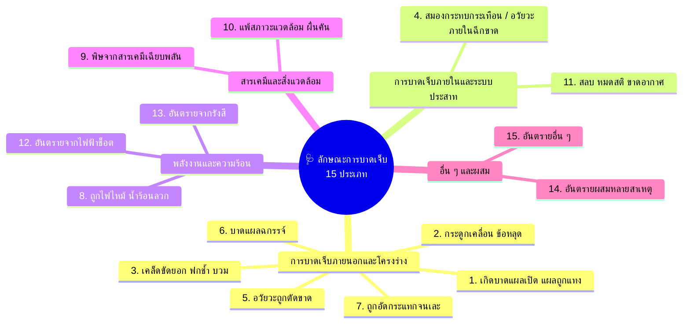

# Week 07: ลักษณะการบาดเจ็บจากอุบัติเหตุจากการทำงาน (Nature of Injury)

---

## 🎯 วัตถุประสงค์การเรียนรู้ประจำส่วนนี้ (Learning Objectives)

เมื่อศึกษาเนื้อหาในส่วนนี้แล้ว ผู้เรียนจะสามารถ:
1. **เข้าใจความหมายของ "ลักษณะการบาดเจ็บ" (Nature of Injury)** และความแตกต่างจากกลไกการเกิดอุบัติเหตุ
2. **จำแนกลักษณะการบาดเจ็บทั้ง 15 ประเภท** ตามมาตรฐานสากลขององค์การแรงงานระหว่างประเทศ (ILO)
3. **ประเมินความรุนแรงเบื้องต้นและระบุแนวทางการปฐมพยาบาล/การบันทึกสถิติ** ทางอาชีวอนามัยได้อย่างถูกต้อง

---

## 💡 นิยามของ "ลักษณะการบาดเจ็บ" (What is Nature of Injury?)

> [!IMPORTANT] นิยามความหมาย
> **ลักษณะการบาดเจ็บ (Nature of Injury)** หมายถึง *ลักษณะทางกายภาพ พยาธิสภาพ หรือการเปลี่ยนแปลงทางการแพทย์ที่เกิดขึ้นกับร่างกายของผู้ประสบอุบัติเหตุ* (เช่น เป็นแผลฉีกขาด, กระดูกหัก, อวัยวะขาด, แผลไหม้ หรือหมดสติ)
> 
> * **ข้อสังเกต:** แตกต่างจาก "ประเภทอุบัติเหตุ (Type)" ตรงที่ Type บอกว่า *เกิดเหตุอย่างไร* (เช่น ตกจากที่สูง) ส่วน Nature of Injury บอกว่า *ร่างกายได้รับผลกระทบอย่างไร* (เช่น กระดูกเชิงกรานหัก)

---

## 📖 รายละเอียดลักษณะการบาดเจ็บ 15 ประเภทตามมาตรฐานสากล

---

### 1. เกิดบาดแผล (Open Wounds, Cuts & Punctures) 🩹
* **คำอธิบาย:** มีการฉีกขาดของผิวหนังหรือเนื้อเยื่อภายนอก เช่น แผลบาด (Incision), แผลฉีกขาด (Laceration), แผลถูกทิ่มแทง (Puncture)
* **ตัวอย่าง:** มีดคัตเตอร์บาดมือ, เศษแก้วบาดแขน, เหยียบตะปูแทงทะลุฝ่าเท้า
* **การจัดการ:** ห้ามเลือด ทำความสะอาดแผล ฉีดวัคซีนป้องกันบาดทะยัก

### 2. กระดูกเคลื่อน / ข้อหลุด (Dislocations) 🦴
* **คำอธิบาย:** หัวกระดูกหลุดออกจากเบ้าข้อต่อ ทำให้ขยับไม่ได้และเจ็บปวดรุนแรง
* **ตัวอย่าง:** ข้อไหล่หลุดจากการถูกกระชาก, ข้อมือเคลื่อนจากการลื่นล้มมือยันพื้น
* **การจัดการ:** ดามให้อยู่นิ่ง ห้ามดัดดึงข้อต่อเอง นำส่งแพทย์ทันที

### 3. เคล็ดขัดยอก ฟกช้ำ บวม (Sprains, Strains & Contusions) 🤕
* **คำอธิบาย:** การบาดเจ็บของเส้นเอ็น (Sprain), กล้ามเนื้อ (Strain), หรือการมีเลือดคั่งใต้ผิวหนังโดยไม่มีแผลเปิด (Contusion)
* **ตัวอย่าง:** ข้อเท้าแพลงจากการก้าวพลาด, กล้ามเนื้อหลังเคล็ดจากการยกของหนัก, หน้าแข้งฟกช้ำจากการชนพาเลท
* **การจัดการ:** หลักการ **R.I.C.E.** (Rest, Ice, Compression, Elevation)

### 4. การกระทบกระเทือนและได้รับบาดเจ็บภายใน (Concussions & Internal Injuries) 🧠🫁
* **คำอธิบาย:** การกระทบกระเทือนของสมองหรือความเสียหายต่ออวัยวะภายในช่องอก/ช่องท้อง (เช่น ตับ ม้าม ปอด ฉีกขาด เลือดออกภายใน)
* **ตัวอย่าง:** ศีรษะกระแทกพื้นหมดสติชั่วขณะ, พวงมาลัยรถกระแทกหน้าอกจนซี่โครงทิ่มปอด
* **การจัดการ:** เฝ้าระวังสัญญาณชีพอย่างใกล้ชิดและนำส่งโรงพยาบาลฉุกเฉิน

### 5. อวัยวะถูกตัดหรือเฉือนออกไป (Traumatic Amputations) ✂️🖐️
* **คำอธิบาย:** การสูญเสียชิ้นส่วนอวัยวะหรือรยางค์ออกจากร่างกายโดยสมบูรณ์จากแรงกล
* **ตัวอย่าง:** นิ้วมือขาดจากเครื่องปั๊มโลหะ, แขนขาดจากเครื่องบดผสม
* **การจัดการ:** ห้ามเลือดที่ตอแผล เก็บชิ้นส่วนที่ขาดใส่ถุงพลาสติกสะอาดปิดสนิท แล้วแช่ในกระติกน้ำแข็ง (ห้ามให้ชิ้นส่วนสัมผัสน้ำแข็งโดยตรง)

### 6. บาดแผลฉกรรจ์ (Severe / Complicated Wounds) 🩸
* **คำอธิบาย:** แผลเปิดขนาดใหญ่ ลึก และมีการทำลายของเนื้อเยื่อ เส้นเลือด เส้นประสาท หรือมีสิ่งแปลกปลอมฝังลึก
* **ตัวอย่าง:** แผลถูกใบเลื่อยวงเดือนกรีดลึกถึงกระดูกหน้าแข้ง

### 7. ถูกอัดกระแทกจนเละ (Crushing Injuries) 🚜💥
* **คำอธิบาย:** อวัยวะหรือร่างกายถูกแรงกดอัดมหาศาลทำให้กระดูกแตกละเอียด กล้ามเนื้อและเส้นเลือดถูกทำลายอย่างกว้างขวาง
* **ตัวอย่าง:** ขาถูกล้อรถยกทับบดขยี้, ลำตัวถูกผนังคอนกรีตล้มทับ
* **ข้อพึงระวัง:** เสี่ยงต่อภาวะ *Crush Syndrome* และไตวายเฉียบพลันจากสารไมโอโกลบินในกล้ามเนื้อรั่วเข้ากระแสเลือด

### 8. ถูกไฟไหม้ น้ำร้อนลวก (Burns & Scalds) 🔥☕
* **คำอธิบาย:** เนื้อเยื่อถูกทำลายด้วยความร้อน เปลวไฟ ไอน้ำ หรือของเหลวร้อนจัด แบ่งเป็นระดับ 1, 2 และ 3
* **ตัวอย่าง:** ถูกน้ำมันร้อนลวกขณะทอดอาหารอุตสาหกรรม, ไฟคลอกจากแก๊สรั่ว

### 9. ถูกสารพิษอย่างแรง (Acute Systemic Poisoning) 🧪☠️
* **คำอธิบาย:** ได้รับสารพิษเข้าสู่ร่างกายอย่างรวดเร็ว ส่งผลต่อระบบการทำงานทั่วร่างกาย เช่น ระบบประสาท หรือระบบไหลเวียนโลหิต
* **ตัวอย่าง:** สูดดมก๊าซไซยาไนด์, สัมผัสยาฆ่าแมลงเข้มข้นทางผิวหนัง

### 10. แพ้สภาวะแวดล้อมในที่ทำงาน (Occupational Allergies & Dermatoses) 🌿🤧
* **คำอธิบาย:** ปฏิกิริยาภูมิแพ้ทางผิวหนัง (ผื่นคัน ผิวหนังอักเสบ) หรือทางเดินหายใจ (หอบหืดจากการทำงาน) ที่เกิดจากการสัมผัสสารก่อภูมิแพ้ซ้ำๆ
* **ตัวอย่าง:** ผื่นแพ้สัมผัสน้ำมันหล่อเย็น (Coolant), โรคหอบหืดจากฝุ่นแป้งหรือยางพารา

### 11. สลบ หมดสติ / ภาวะขาดอากาศ (Asphyxiation & Unconsciousness) 😵‍💫💨
* **คำอธิบาย:** ภาวะสมองขาดออกซิเจนเนื่องจากอากาศในพื้นที่ทำงานมีก๊าซออกซิเจนต่ำกว่า 19.5% หรือมีก๊าซแทนที่ออกซิเจน (เช่น $N_2, CO_2$)
* **ตัวอย่าง:** หมดสติขณะลงไปในถังเก็บสารเคมีหรือบ่อลึก

### 12. อันตรายจากกระแสไฟฟ้า (Effects of Electric Currents) ⚡
* **คำอธิบาย:** รอยไหม้จากทางเข้า-ออกของกระแสไฟฟ้า (Electrical Burns) และอาการเกร็งกระตุกของกล้ามเนื้อหรือหัวใจเต้นผิดจังหวะ

### 13. อันตรายจากกัมมันตภาพรังสี (Effects of Radiations) ☢️
* **คำอธิบาย:** อาการเจ็บป่วยเฉียบพลันจากรังสี (Acute Radiation Syndrome) ผิวหนังไหม้จากรังสี หรือเม็ดเลือดขาวลดลง

### 14. อันตรายผสมกันหลายสาเหตุ (Multiple Injuries of Different Nature) 🌪️
* **คำอธิบาย:** ผู้บาดเจ็บได้รับอันตรายหลายลักษณะพร้อมกัน เช่น ถูกไฟไหม้ร่วมกับกระดูกหักและแผลฉีกขาดจากเหตุระเบิด

### 15. อันตรายอื่น ๆ ที่มิได้ระบุไว้ (Other & Unspecified Injuries) ❓
* **คำอธิบาย:** อาการบาดเจ็บที่ไม่ตรงกับ 14 หมวดหมู่ข้างต้น เช่น โรคเจ็บป่วยจากความกดอากาศ (Decompression Sickness ในงานประดาน้ำ)

---

## 🎯 แบบฝึกทบทวน: การระบุลักษณะการบาดเจ็บ (Nature of Injury Quiz)

จงเลือกลักษณะการบาดเจ็บที่ถูกต้องที่สุดสำหรับแต่ละข้อ:

1. *ช่างเคาะพ่นสีสูดดมไอระเหยทินเนอร์เข้มข้นในห้องอบสีจนเป็นลมล้มพับไป*  
   👉 **เฉลย:** **ประเภทที่ 11: สลบ หมดสติ / ภาวะขาดอากาศ (Unconsciousness/Asphyxiation)**
2. *คนงานทำชิ้นงานเหล็กหนัก 30 กก. หลุดมือกระแทกหลังเท้า เกิดอาการบวมม่วงคล้ำ แต่ไม่มีบาดแผลฉีกขาดและกระดูกไม่หัก*  
   👉 **เฉลย:** **ประเภทที่ 3: เคล็ดขัดยอก ฟกช้ำ บวม (Contusion)**
3. *พนักงานห้องปฏิบัติการถูกกรดกำมะถันเข้มข้นหกใส่แขน ทำให้ผิวหนังไหม้เกรียมเป็นตุ่มน้ำพอง*  
   👉 **เฉลย:** **ประเภทที่ 8: ถูกไฟไหม้ / แผลไหม้จากสารเคมี (Chemical Burns)**

---