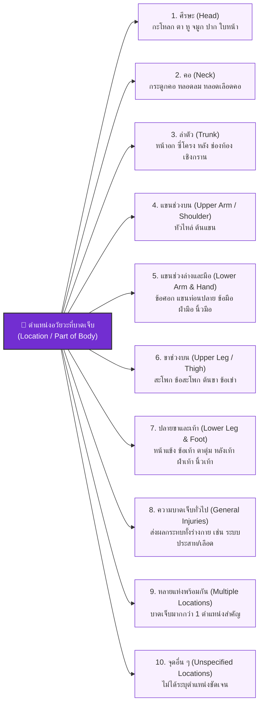

# Week 07: ตำแหน่งอวัยวะที่ได้รับบาดเจ็บและการประยุกต์ใช้เพื่อการป้องกัน (Location of Injury)

---

## 🎯 วัตถุประสงค์การเรียนรู้ประจำส่วนนี้ (Learning Objectives)

เมื่อศึกษาเนื้อหาในส่วนนี้แล้ว ผู้เรียนจะสามารถ:
1. **ระบุและจำแนกตำแหน่งอวัยวะที่ได้รับบาดเจ็บทั้ง 10 กลุ่ม** ตามมาตรฐานสากลขององค์การแรงงานระหว่างประเทศ (ILO)
2. **จับคู่อวัยวะส่วนที่มีความเสี่ยงกับการเลือกใช้อุปกรณ์คุ้มครองความปลอดภัยส่วนบุคคล (PPE Matrix)** และมาตรการทางวิศวกรรมที่เหมาะสม
3. **บูรณาการองค์ประกอบ 5 มิติของการจำแนกอุบัติเหตุ (5-Dimension Accident Coding Framework)** เพื่อถอดรหัสและวิเคราะห์รายงานอุบัติเหตุได้อย่างเป็นระบบ

---

## 🧭 แผนผังจำแนกตำแหน่งอวัยวะที่ได้รับบาดเจ็บ (10 กลุ่มตามมาตรฐาน ILO)

---

## 📖 รายละเอียด 10 ตำแหน่งร่างกายและการเชื่อมโยงกับการป้องกัน (PPE Matrix)

| หมวดหมู่อวัยวะ | อวัยวะย่อยในกลุ่ม | อันตรายที่พบบ่อยในงานอุตสาหกรรม | อุปกรณ์ป้องกัน PPE ที่เกี่ยวข้อง |
| :--- | :--- | :--- | :--- |
| **1. ศีรษะ (Head)** | กะโหลกศีรษะ, สมอง, ดวงตา, หู, ใบหน้า, ฟัน | ของหล่นใส่, เศษวัสดุกระเด็นเข้าตา, เสียงดังเกิน 85 dBA, สารเคมีกระเด็น | • หมวกนิรภัย (Safety Helmet) • แว่นตานิรภัย / แว่นครอบตา (Safety Goggles) • กระบังหน้า (Face Shield) • ที่อุดหู/ครอบหู (Earplugs/Earmuffs) |
| **2. คอ (Neck)** | กระดูกสันหลังส่วนคอ, หลอดลม, คอหอย | การสะบัดกระแทกอย่างแรง (Whiplash), สะเก็ดไฟเชื่อมกระเด็นใส่คอ | • ผ้ากันสะเก็ดไฟเชื่อมคลุมคอ • การ์ดป้องกันคอในงานพิเศษ |
| **3. ลำตัว (Trunk)** | ทรวงอก, ซี่โครง, หลังส่วนบน/ล่าง, ช่องท้อง, เชิงกราน | ของหนักทับหน้าอก, การยกของหนักจนปวดหลัง (Ergonomic strain), ถูกกระแทก | • เข็มขัดพยุงหลัง (Back Support) • เสื้อเกราะป้องกันแรงกระแทก • ชุด Full Body Harness กันตก |
| **4. แขนช่วงบน (Upper Limbs)** | หัวไหล่, ข้อต่อหัวไหล่, ต้นแขน | ข้อไหล่หลุดจากการดึงรั้ง, แผลไหม้ที่ต้นแขน | • ปลอกแขนกันความร้อน/กันบาด (Kevlar Sleeves) • สนับไหล่ |
| **5. แขนช่วงล่างและมือ (Lower Limbs/Hands)** | ข้อศอก, ปลายแขน, ข้อมือ, ฝ่ามือ, นิ้วมือ *(ตำแหน่งที่พบบ่อยที่สุด)* | มีดบาด, จุดหนีบเครื่องจักร, สารเคมีกัดกร่อน, ไฟฟ้าช็อต | • ถุงมือกันบาด (Cut-resistant Gloves) • ถุงมือยางกันสารเคมี (Nitrile/Neoprene) • ถุงมือกันไฟฟ้าแรงสูง |
| **6. ขาช่วงบน (Upper Legs)** | สะโพก, ข้อสะโพก, ต้นขา, ข้อเข่า | ข้อเข่าเสื่อมจากการคุกเข่าทำงาน, ชิ้นงานกระแทกต้นขา | • สนับเข่า (Knee Pads) • กางเกงหนังกันสะเก็ดไฟ |
| **7. ปลายขาและเท้า (Lower Legs & Feet)** | หน้าแข้ง, ข้อเท้า, ตาตุ่ม, หลังเท้า, ฝ่าเท้า, นิ้วเท้า | ตะปูแทงทะลุฝ่าเท้า, วัตถุหนักหล่นทับเท้า, สารเคมีหกใส่เท้า | • รองเท้าหัวเหล็กนิรภัย (Safety Shoes) • รองเท้าพื้นเสริมแผ่นเหล็กกันทะลุ • รองเท้าบูทยางกันสารเคมี |
| **8. ความบาดเจ็บทั่วไป (General)** | ระบบไหลเวียนโลหิต, ระบบประสาทส่วนกลาง, ทางเดินหายใจ | โรคลมแดด (Heat Stroke), ภาวะอุณหภูมิกายต่ำ (Hypothermia), พิษสารเคมีทั่วตัว | • ชุดปรับอากาศ (Cooling Vest) • ชุดคลุมป้องกันสารเคมีทั้งตัว (Chemical Hazmat Suit) |
| **9. หลายแห่งพร้อมกัน (Multiple)** | เช่น บาดเจ็บที่ศีรษะร่วมกับกระดูกแขนและขาหัก | ตกจากที่สูง, รถชน, หม้อน้ำระเบิด | • บูรณาการ PPE ทุกจุดร่วมกับมาตรการทางวิศวกรรมขั้นสูง |
| **10. จุดอื่น ๆ (Unspecified)** | ไม่สามารถระบุได้ชัดเจน | เหตุการณ์ที่มีข้อมูลไม่สมบูรณ์ | • ต้องทำการสอบสวนเพิ่มเติม (Re-investigate) |

---

## 🏆 กิจกรรมรวบยอดประจำสัปดาห์ที่ 7: การถอดรหัสอุบัติเหตุ 5 มิติ (Accident Coding Challenge)

> [!IMPORTANT] กรอบการวิเคราะห์ 5 มิติ (5-Dimension Coding Framework)
> เมื่อเกิดอุบัติเหตุ เจ้าหน้าที่ความปลอดภัยระดับวิชาชีพ (จป.วิชาชีพ) และวิศวกรความปลอดภัย ต้องสามารถจำแนกเหตุการณ์ให้ครบทั้ง 5 มิติได้ดังนี้:
> 1. **Severity:** ระดับความร้ายแรง (Fatal / Permanent / Temporary)
> 2. **Type:** ประเภทของอุบัติเหตุ (1 ใน 9 กลุ่ม)
> 3. **Agency:** ตัวการที่ก่อให้เกิดอุบัติเหตุ (1 ใน 6 หมวด)
> 4. **Nature:** ลักษณะการบาดเจ็บ (1 ใน 15 ประเภท)
> 5. **Location:** ตำแหน่งอวัยวะที่บาดเจ็บ (1 ใน 10 จุด)

---

### 📝 ตัวอย่างการวิเคราะห์เคสจริง 3 กรณี (Comprehensive Case Studies)

#### 📌 กรณีที่ 1: อุบัติเหตุในงานตัดพับโลหะแผ่น
* **เหตุการณ์:** นายอนุชา พนักงานฝ่ายผลิต กำลังป้อนแผ่นสังกะสีเข้าเครื่องปั๊มตัดโลหะ (Power Press) ระหว่างนั้นเท้าเผลอไปเหยียบแป้นสวิตช์เท้า (Foot Switch) ขณะที่มือซ้ายยังอยู่ในแนวกดของใบมีด ใบมีดตัดผ่านนิ้วชี้และนิ้วกลางซ้ายขาดกระเด็น แพทย์ไม่สามารถต่อกลับได้ นายอนุชาต้องพักรักษาตัว 45 วัน และย้ายไปทำงานอื่น
* **การถอดรหัส 5 มิติ:**
  * **1. Severity:** `Permanent Partial Disablement` (ทุพพลภาพถาวรบางส่วน จากการเสียนิ้วมือถาวร)
  * **2. Type:** `กลุ่มที่ 4: การถูกหนีบหรือจับเข้าระหว่างวัตถุ` (Caught in/between)
  * **3. Agency:** `หมวดที่ 1: เครื่องจักรกล (เครื่องขึ้นรูปโลหะ - Power Press)`
  * **4. Nature:** `ประเภทที่ 5: อวัยวะถูกตัดหรือเฉือนออกไป` (Traumatic Amputation)
  * **5. Location:** `กลุ่มที่ 5: แขนช่วงล่างและมือ (นิ้วมือซ้าย)`
  * 

---

#### 📌 กรณีที่ 2: อุบัติเหตุในงานบำรุงรักษาโรงกลั่นน้ำมัน
* **เหตุการณ์:** นายเกรียงไกร ช่างท่อ เข้าไปเปลี่ยนปะเก็นวาล์วท่อไอน้ำแรงดันสูง แต่วาล์วตัดแยกระบบชำรุด ทำให้ไอน้ำร้อนอุณหภูมิ 180°C พุ่งฉีดเข้าใส่บริเวณลำตัวและต้นแขนขวา เกิดแผลพุพองอย่างรุนแรง (Second-degree burns) แพทย์ให้หยุดงานรักษาตัว 3 สัปดาห์ และแผลหายสนิทกลับมาทำงานเดิมได้
* **การถอดรหัส 5 มิติ:**
  * **1. Severity:** `Temporary Disablement` (ทุพพลภาพชั่วคราว รักษาหายเป็นปกติ)
  * **2. Type:** `กลุ่มที่ 6: การสัมผัสอุณหภูมิสูงหรือต่ำสุดขั้ว` (Exposure to extreme temperature)
  * **3. Agency:** `หมวดที่ 3: เครื่องจักรกลและอุปกรณ์อื่น (ท่อไอน้ำ/ภาชนะความดัน)` ร่วมกับ `หมวด 4 (ไอน้ำร้อน)`
  * **4. Nature:** `ประเภทที่ 8: ถูกไฟไหม้ / แผลไหม้จากความร้อน` (Scalds & Burns)
  * **5. Location:** `กลุ่มที่ 9: หลายแห่งพร้อมกัน (ลำตัวและแขนช่วงบน)`

---

#### 📌 กรณีที่ 3: อุบัติเหตุในคลังสินค้าโลจิสติกส์
* **เหตุการณ์:** นายสมศักดิ์ กำลังเดินตรวจสอบสต็อกสินค้าในช่องทางเดิน รถยก Forklift เลี้ยวตัดมุมอับด้วยความเร็ว คนขับมองไม่เห็นจึงชนเข้าที่สะโพกและขาขวาของนายสมศักดิ์อย่างจัง ส่งผลให้กระดูกต้นขาขวาหักแบบปิด แพทย์ผ่าตัดดามเหล็กและให้พักฟื้น 4 เดือน สามารถกลับมาเดินและทำงานเดิมได้ตามปกติ
* **การถอดรหัส 5 มิติ:**
  * **1. Severity:** `Temporary Disablement` (ทุพพลภาพชั่วคราว)
  * **2. Type:** `กลุ่มที่ 3: การถูกชน เฉี่ยว กระแทก โดยวัตถุ` (Struck by moving object)
  * **3. Agency:** `หมวดที่ 2: วัสดุอุปกรณ์ในการขนถ่ายและยกวัสดุ (รถยก Forklift)`
  * **4. Nature:** `ประเภทที่ 1: บาดแผล/กระดูกหัก (Fracture/Injury)`
  * **5. Location:** `กลุ่มที่ 6: ขาช่วงบน (สะโพกและต้นขาขวา)`

---

## 📌 สรุปบทเรียนประจำสัปดาห์ที่ 7 (Key Takeaways)

1. **การจำแนกอุบัติเหตุตามมาตรฐาน ILO** เป็นเครื่องมือสากลในการแปลง "เหตุการณ์ความสูญเสีย" ให้เป็น "ข้อมูลเชิงสถิติที่มีโครงสร้างชัดเจน"
2. **มิติทั้ง 5 (Severity, Type, Agency, Nature, Location)** ทำหน้าที่เป็นจิ๊กซอว์ที่สมบูรณ์ในการสืบสวนหาสาเหตุรากเหง้า (RCA) และการออกแบบมาตรการป้องกันเชิงรุก (Hierarchy of Controls)
3. การระบุตำแหน่งอวัยวะ (Location) และลักษณะการบาดเจ็บ (Nature) ช่วยให้วิศวกรสามารถเลือกใช้ **วิศวกรรมความปลอดภัยและการออกแบบอุปกรณ์ป้องกัน PPE** ได้อย่างตรงจุดและมีประสิทธิภาพสูงสุด

---