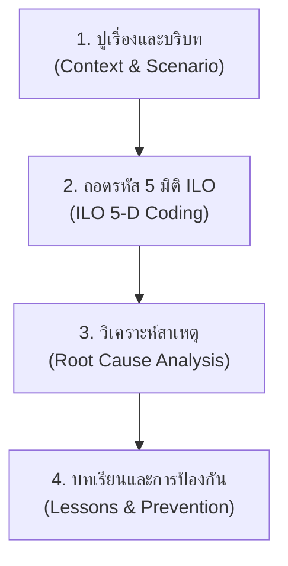

# Week 07 กิจกรรม "ผิดเป็นครู" (Learning from Incidents)

---

## วัตถุประสงค์ของกิจกรรม (Activity Objectives)

1. **ประยุกต์ใช้กรอบแนวคิดการจำแนกอุบัติเหตุตามมาตรฐาน ILO 5 มิติ** กับเหตุการณ์จริงในชีวิตประจำวันหรือการทำงาน
2. **ฝึกทักษะการถอดบทเรียน (Root Cause & Lessons Learned)** เพื่อเปลี่ยนความผิดพลาดและความสูญเสียให้เป็นมาตรการป้องกันเชิงรุก
3. **พัฒนาทักษะการสื่อสารและการเล่าเรื่อง (Storytelling & Communication Skills)** ทางด้านวิศวกรรมความปลอดภัยต่อที่สาธารณะ

---

## คำชี้แจงและกติกาการนำเสนอหน้าชั้นเรียน (Instructions & Guidelines)

ให้นักศึกษาแต่ละคนเตรียมเรื่องเล่าประสบการณ์อุบัติเหตุจริง **1 เหตุการณ์** เพื่อออกมานำเสนอและร่วมแลกเปลี่ยนบทเรียนหน้าชั้นเรียน:

### 1. แหล่งที่มาของเรื่องเล่า
* ประสบการณ์ตรงของตนเอง (จากการทำงาน, การฝึกงาน, การทำแล็ป, หรือชีวิตประจำวัน)
* ประสบการณ์ของคนใกล้ชิด (ครอบครัว, เพื่อน, เพื่อนร่วมงาน)
* *ข้อพึงระวัง:* **หากเป็นกรณีที่มีผู้เสียชีวิต (Fatal) ต้องเป็นเรื่องของบุคคลอื่นหรือคนใกล้ชิดเท่านั้น (ห้ามยกตัวอย่างตนเอง)**

### 2. เวลาในการนำเสนอ
* คนละ **3 - 5 นาที** (นำเสนอ 3 นาที + ตอบข้อซักถาม/แลกเปลี่ยนกับเพื่อนและอาจารย์ 1-2 นาที)

---

## โครงสร้าง 4 ส่วนในการเล่าเรื่อง (Storytelling Framework)

เพื่อให้เรื่องเล่ากระชับ เห็นภาพชัดเจน และถูกต้องตามหลักวิชาการ ให้นักศึกษาจัดลำดับการเล่าตาม 4 ส่วนนี้:

### 1. ปูเรื่องและบริบท (Context & Scenario)
* ใครทำอะไร ที่ไหน เมื่อไหร่ สภาพแวดล้อมตอนนั้นเป็นอย่างไร และเกิดเหตุการณ์ไม่คาดคิดขึ้นได้อย่างไร

### 2. ถอดรหัสตามมาตรฐานสากล ILO 5 มิติ (ILO 5-Dimension Classification)
* **มิติที่ 1 - ระดับความร้ายแรง (Severity):** *Fatal (เสียชีวิต) / Permanent (ทุพพลภาพถาวร) / Temporary (ทุพพลภาพชั่วคราว) / Near Miss (เกือบเกิดเหตุ)*
* **มิติที่ 2 - ประเภทอุบัติเหตุ (Type):** *ตรงกับกลุ่มใดใน 9 กลุ่มของ ILO (เช่น พลัดตก, ถูกหนีบ, วัตถุหล่นทับ ฯลฯ)*
* **มิติที่ 3 - ตัวการก่อเหตุ (Agency):** *ตรงกับหมวดใดใน 6 หมวด (เช่น เครื่องจักรกล, อุปกรณ์ยก, สารเคมี, สภาพแวดล้อม ฯลฯ)*
* **มิติที่ 4 - ลักษณะการบาดเจ็บ (Nature of Injury):** *ตรงกับประเภทใดใน 15 ลักษณะ (เช่น แผลเปิด, กระดูกเคลื่อน, ไฟไหม้, ฟกช้ำ ฯลฯ)*
* **มิติที่ 5 - ตำแหน่งอวัยวะที่บาดเจ็บ (Location):** *ตรงกับส่วนใดใน 10 จุดของร่างกาย (เช่น ศีรษะ, แขนล่าง/มือ, ขาล่าง/เท้า ฯลฯ)*

### 3. วิเคราะห์สาเหตุที่ทำให้เกิดเหตุ (Causal Analysis)
* มี **Unsafe Act (การกระทำที่ไม่ปลอดภัย)** อะไรบ้าง? (เช่น ความรีบร้อน, ไม่ใส่อุปกรณ์ PPE, ลัดขั้นตอน)
* มี **Unsafe Condition (สภาพการณ์ที่ไม่ปลอดภัย)** อะไรบ้าง? (เช่น เครื่องจักรไม่มีการ์ด, พื้นเปียกลื่น, แสงสว่างไม่พอ)

### 4. ถอดบทเรียนและมาตรการป้องกันเชิงรุก (Lessons Learned & Solutions)
* หากย้อนเวลากลับไปได้ จะใช้ **ลำดับชั้นการควบคุม (Hierarchy of Controls)** หรือมาตรการทางวิศวกรรม/การบริหารจัดการอย่างไร เพื่อไม่ให้เกิดเหตุการณ์นี้ขึ้นอีก

**การแก้ไขรูปภาพ ใช้ web app นี้**

https://app.diagrams.net/

**หรือติดตั้ง Drawio ในเครื่องคอมพิวเตอร์**

https://github.com/jgraph/drawio-desktop/releases/tag/ 

เลือกรุ่นที่ต้องการติดตั้ง (โดยปกติจะเลือกรุ่นล่าสุด)

---

## แบบฟอร์มเตรียมตัวก่อนนำเสนอ (Student Preparation Canvas)

*(นักศึกษาสามารถจดบันทึกประเด็นสำคัญลงในตารางนี้เพื่อใช้ประกอบการพูดหน้าชั้น)*

| หัวข้อการเล่า | บันทึกประเด็นของตนเอง |
| :--- | :--- |
| **1. ชื่อเรื่อง / เหตุการณ์** | *(เช่น ประแจหลุดมือเฉียดหัวเพื่อนในแล็ปช็อป / มอเตอร์ไซค์ส่งของลื่นคราบน้ำมัน)* |
| **2. บริบทและผู้ประสบเหตุ** | *(ใคร / สถานที่ / หน้าที่งานที่กำลังทำขณะเกิดเหตุ)* |
| **3. มิติที่ 1: Severity** | `[ ] Fatal` `[ ] Permanent` `[ ] Temporary` `[ ] Near Miss` |
| **4. มิติที่ 2: Type (1 ใน 9)** | |
| **5. มิติที่ 3: Agency (1 ใน 6)** | |
| **6. มิติที่ 4: Nature (1 ใน 15)** | |
| **7. มิติที่ 5: Location (1 ใน 10)** | |
| **8. สาเหตุ Unsafe Act & Condition** | |
| **9. บทเรียนและการป้องกัน (Prevention)** | |

---

## เกณฑ์การประเมินผลการนำเสนอ (Assessment Scoring Rubric - เต็ม 10 คะแนน)

| เกณฑ์การประเมิน | ดีเยี่ยม (ระดับ 4) 4 คะแนน | ดี (ระดับ 3) 3 คะแนน | พอใช้ (ระดับ 2) 2 คะแนน | ต้องปรับปรุง (ระดับ 1) 1 คะแนน |
| :--- | :--- | :--- | :--- | :--- |
| **1. ความถูกต้องในการจำแนกตามมาตรฐาน ILO 5 มิติ (4 คะแนน)** | จำแนกครบถ้วนทั้ง 5 มิติ (Severity, Type, Agency, Nature, Location) ได้ถูกต้องแม่นยำ 100% ตามมาตรฐานสากล | จำแนกครบทั้ง 5 มิติ มีจุดคลาดเคลื่อนเล็กน้อย 1 มิติ แต่เข้าใจภาพรวมถูกต้อง | ระบุไม่ครบทั้ง 5 มิติ (ขาด 1-2 มิติ) หรือจำแนกคลาดเคลื่อน 2 มิติ | ระบุไม่ครบและจำแนกคลาดเคลื่อนมากกว่า 3 มิติขึ้นไป |

---

| เกณฑ์การประเมิน | ดีเยี่ยม (ระดับ 4) 3 คะแนน | ดี (ระดับ 3) 2.25 คะแนน | พอใช้ (ระดับ 2) 1.5 คะแนน | ต้องปรับปรุง (ระดับ 1) 0.75 คะแนน |
| :--- | :--- | :--- | :--- | :--- |
| **2. การวิเคราะห์สาเหตุและถอดบทเรียนเชิงป้องกัน (3 คะแนน)** | วิเคราะห์ Unsafe Act / Condition ได้ลึกซึ้ง และเสนอมาตรการป้องกันเชิงรุกตามหลักวิศวกรรมความปลอดภัยได้อย่างเป็นรูปธรรม | ระบุสาเหตุได้ชัดเจน และเสนอแนวทางป้องกันได้สมเหตุสมผล | ระบุสาเหตุได้ แต่แนวทางป้องกันเป็นเพียงนามธรรม (เช่น "คราวหน้าต้องระวัง") | ระบุสาเหตุไม่ตรงประเด็น และไม่มีการเสนอแนวทางป้องกันที่ชัดเจน |

---

| เกณฑ์การประเมิน | ดีเยี่ยม (ระดับ 4) 2 คะแนน | ดี (ระดับ 3) 1.5 คะแนน | พอใช้ (ระดับ 2) 1 คะแนน | ต้องปรับปรุง (ระดับ 1) 0.5 คะแนน |
| :--- | :--- | :--- | :--- | :--- |
| **3. ทักษะการสื่อสารและการเล่าเรื่อง (2 คะแนน)** | เล่าเรื่องได้น่าติดตาม เห็นภาพชัดเจน ภาษามีชีวิตชีวา มีความเป็นธรรมชาติ และดึงดูดผู้ฟังได้ดีเยี่ยม | เล่าเรื่องเข้าใจง่าย มีลำดับขั้นตอนชัดเจน สื่อสารได้ดี | เล่าเรื่องวกวนเล็กน้อย หรืออ่านตามโพยเป็นส่วนใหญ่ | เล่าเรื่องไม่ต่อเนื่อง ขาดความชัดเจน ผู้ฟังจับใจความยาก |

---

| เกณฑ์การประเมิน | ดีเยี่ยม (ระดับ 4) 1 คะแนน | ดี (ระดับ 3) 0.75 คะแนน | พอใช้ (ระดับ 2) 0.5 คะแนน | ต้องปรับปรุง (ระดับ 1) 0.25 คะแนน |
| :--- | :--- | :--- | :--- | :--- |
| **4. การบริหารเวลาและการตอบคำถาม (1 คะแนน)** | นำเสนอจบภายในเวลา 3-5 นาทีอย่างแม่นยำ และตอบคำถาม/แลกเปลี่ยนความคิดเห็นได้ชัดเจนตรงประเด็น | ใช้เวลาเกินหรือขาดเล็กน้อย (± 1 นาที) ตอบคำถามได้ดี | ใช้เวลาเกินหรือขาดมาก (± 2 นาที) ตอบคำถามได้บางส่วน | บริหารเวลาได้ไม่ดี และไม่สามารถตอบคำถามได้ |

---

### ตารางสรุปการรวมคะแนน

| รายการประเมิน | คะแนนเต็ม | คะแนนที่ได้ |
| :--- | :---: | :---: |
| 1. ความถูกต้องในการจำแนกตามมาตรฐาน ILO 5 มิติ | 4 | |
| 2. การวิเคราะห์สาเหตุและถอดบทเรียนเชิงป้องกัน | 3 | |
| 3. ทักษะการสื่อสารและการเล่าเรื่อง (Storytelling) | 2 | |
| 4. การบริหารเวลาและการตอบคำถาม (Time & Q&A) | 1 | |
| **คะแนนรวมสุทธิ** | **10** | |

---
1. ปูเรื่องและบริบท (Context & Scenario)
ใคร: ตัวฉันเอง
ทำอะไร: ยกดัมเบลเล่นๆ ชั่วคราว โดยไม่ได้สวมรองเท้าหรืออุปกรณ์ป้องกันใดๆ
ที่ไหน: ภายในห้องพักหอพักของเพื่อน (ซึ่งจัดวางเฟอร์นิเจอร์เป็นมุมๆ มีเตียงนอน ตู้เสื้อผ้า และห้องน้ำ)
เมื่อไหร่: เมื่อเดือนที่แล้ว
สภาพแวดล้อม: เป็นพื้นที่ห้องนอนในหอพัก มีมุมวางตู้ เตียงนอน และห้องน้ำ สภาพพื้นที่ไม่ได้ออกแบบมาเพื่อเป็นพื้นที่ออกกำลังกายโดยเฉพาะ
เหตุการณ์ไม่คาดคิด: เนื่องจากฉันตั้งใจแค่จะยกเล่นๆ ไม่ได้ตั้งใจออกกำลังกายอย่างจริงจัง ทำให้ขาดความระมัดระวังและจับดัมเบลไม่แน่นพอ ขณะกำลังยกอยู่นั้น ดัมเบลเกิดหลุดมือ/พลัดตกจากมือลงมากระแทกใส่บริเวณปลายขาและเท้าอย่างจัง ส่งผลให้เกิดอาการฟกช้ำ บวม และเคล็ดขัดยอก จนต้องหยุดพักและจำกัดการเคลื่อนไหวชั่วคราว
2. ถอดรหัสตามมาตรฐานสากล ILO 5 มิติ (ILO 5-Dimension Classification)
มิติที่ 1 - ระดับความรุนแรง (Severity):
ทุพพลภาพชั่วคราว (Temporary Disability) — บาดเจ็บจนไม่สามารถเดินหรือใช้งานเท้าได้ตามปกติชั่วคราว ต้องพักฟื้น แต่ไม่มีความพิการถาวร
มิติที่ 2 - ประเภทอุบัติเหตุ (Type):
วัตถุหล่นทับ (Falling Objects) — ดัมเบลร่วงหล่นจากมือลงมากระแทกใส่เท้า
มิติที่ 3 - ตัวการก่อเหตุ (Agency):
อุปกรณ์ยกและขนถ่าย (Lifting and Conveying Equipment) — ดัมเบล/อุปกรณ์ยกน้ำหนัก
มิติที่ 4 - ลักษณะการบาดเจ็บ (Nature of Injury):
เคล็ดขัดยอก ฟกช้ำ บวม (Sprains, Strains, Contusions and Swelling) — บริเวณเนื้อเยื่อและกล้ามเนื้อหลังเท้า/ปลายขาฟกช้ำและบวมจากการถูกของแข็งตกกระทบ
มิติที่ 5 - ตำแหน่งอวัยวะที่บาดเจ็บ (Location):
ปลายขาและเท้า (Lower Leg and Foot) — บริเวณปลายขา หลังเท้า และนิ้วเท้าที่รับแรงกระแทกจากดัมเบล
3. วิเคราะห์สาเหตุที่ทำให้เกิดเหตุ (Causal Analysis)
Unsafe Act (การกระทำที่ไม่ปลอดภัย):
ความประมาท/ทัศนคติ: คิดว่าจะยกแค่ "เล่นๆ" ไม่ได้จริงจัง ทำให้ขาดความจดจ่อและการจับยึดที่มั่นคง
การไม่สวมใส่อุปกรณ์ป้องกัน: ไม่ได้สวมรองเท้าผ้าใบหรือรองเท้านิรภัย ขณะจับต้องอุปกรณ์ยกน้ำหนัก
ท่ายกไม่ถูกต้อง: การจับดัมเบลหลวมเกินไปหรือไม่ได้เซ็ตท่าทางให้ปลอดภัยก่อนยก
Unsafe Condition (สภาพการณ์ที่ไม่ปลอดภัย):
พื้นที่ไม่เหมาะสม: ใช้งานอุปกรณ์ยกน้ำหนักในห้องนอนหอพัก ซึ่งมีเฟอร์นิเจอร์วางเป็นมุมๆ และไม่มีแผ่นยางกันกระแทกรองพื้น
ผิวสัมผัส/เหงื่อ: มืออาจจะลื่นหรือไม่มีอุปกรณ์เพิ่มการยึดเกาะ (เช่น ถุงมือออกกำลังกาย)
4. ถอดบทเรียนและมาตรการป้องกันเชิงรุก (Lessons Learned & Solutions)
(ประยุกต์ใช้ตามลำดับชั้นการควบคุม - Hierarchy of Controls)
การควบคุมทางวิศวกรรม/ปรับปรุงพื้นที่ (Engineering Controls):
หากต้องออกกำลังกายหรือใช้อุปกรณ์ยกน้ำหนักในห้อง ควรจัดพื้นที่ให้โล่ง และวางแผ่นยางรองเล่นเวท (Rubber Mat) เพื่อช่วยซับแรงกระแทกหากอุปกรณ์หลุดมือ
มาตรการทางบริหารจัดการและพฤติกรรม (Administrative Controls):
ปรับ Mindset: ไม่ว่าจะยกน้ำหนัก "เล่นๆ" หรือจริงจัง ต้องมีความตั้งใจและโฟกัสกับอุปกรณ์ตรงหน้าทุกครั้ง เพื่อป้องกันอุบัติเหตุพลัดหลุดมือ
ตรวจสอบความพร้อม: เช็ดทำความสะอาดดัมเบลและมือไม่ให้ลื่นก่อนยกทุกครั้ง
อุปกรณ์ป้องกันภัยส่วนบุคคล (PPE):
สวมรองเท้ากีฬา/รองเท้าผ้าใบเสมอ เมื่อต้องเล่นหรือเคลื่อนย้ายอุปกรณ์ยกน้ำหนัก แม้จะเป็นการยกชั่วคราวในห้องพัก เพื่อช่วยลดแรงกระแทกหากวัตถุร่วงหล่นใส่เท้า
