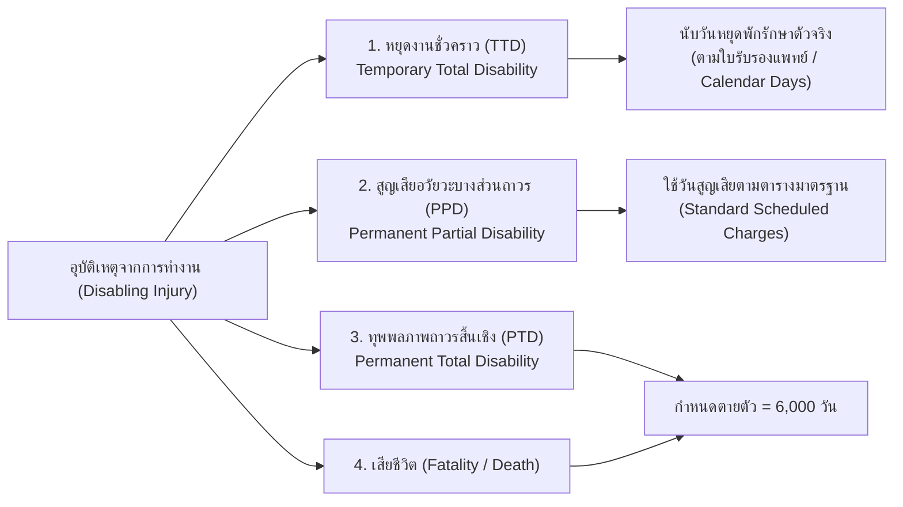
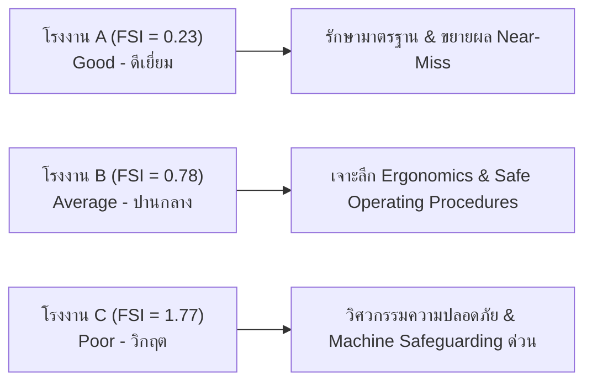

# การคำนวณอัตราการเกิดอุบัติเหตุจากการทำงาน (Workplace Accident Rate Calculation)

---

## 1. ทำไมต้องคำนวณอัตราการเกิดอุบัติเหตุ

ในการบริหารจัดการความปลอดภัย อาชีวอนามัย และสภาพแวดล้อมในการทำงาน (OH&S) การนำ "จำนวนครั้งที่เกิดอุบัติเหตุ" มาเปรียบเทียบกันตรง ๆ ระหว่างสถานประกอบกิจการไม่สามารถสะท้อนระดับความปลอดภัยที่แท้จริงได้ เนื่องจากเหตุผบต่อไปนี้
1. **จำนวนพนักงานไม่เท่ากัน** 
   ในโรงงานขนาดใหญ่ที่มีลูกจ้าง 1,000 คน ย่อมมีโอกาสเกิดอุบัติเหตุตามสถิติมากกว่าโรงงานขนาดเล็กที่มีลูกจ้าง 50 คน
2. **ชั่วโมงการทำงานไม่เท่ากัน** 
   แต่ละโรงงานมีจำนวนกะทำงาน การทำล่วงเวลา (OT) และวันหยุดประจำสัปดาห์ที่แตกต่างกัน

ดังนั้น จึงจำเป็นต้องแปลงข้อมูลให้เป็น **"อัตราส่วนมาตรฐานสากล (Normalized Standard Rate)"** ต่อฐานเวลาการทำงานเดียวกัน เพื่อให้สามารถเปรียบเทียบผลการดำเนินงานด้านความปลอดภัยระหว่างแผนก โรงงาน หรืออุตสาหกรรมประเภทเดียวกันได้

---

## 2. มาตรฐานการวัดสถิติอุบัติเหตุจากการทำงาน

ตามมาตรฐานสากล **ANSI Z16.1** (*American National Standard Method of Recording and Measuring Work Injury Experience*) และมาตรฐานของ **OSHA / กรมสวัสดิการและคุ้มครองแรงงาน / กองทุนเงินทดแทน** ได้กำหนดเกณฑ์มาตรฐานไว้ดังนี้

- ใช้ฐานเวลาการทำงานเท่ากับ **1,000,000 ชั่วโมง-คนงาน (1 Million Employee-Hours / Man-Hours)**
- **ที่มาของฐาน 1,000,000 ชั่วโมง** เทียบเท่ากับเวลาทำงานของคนงาน **500 คน** ทำงานตลอดทั้งปีโดยเฉลี่ย
  
	- 1 ปีมี 365 หรือ 366 วัน คิดเป็น $365 / 7 = 52.14$  สัปดาห์ เมื่อหักวันหยุดตามปฏิทิน จะเหลือประมาณ 50 สัปดาห์เต็ม
	- ในแต่ละวัน จะทำงานเป็นเวลา 8 ชั่วโมงโดยเฉลี่ย ดังนั้นคิดเป็น
  $$\text{ฐานเวลา} = 500 \text{ คน} \times 50 \text{ สัปดาห์} \times 40 \text{ ชั่วโมง/สัปดาห์} = 1,000,000 \text{ man-hours}$$
- ดัชนีชี้วัดหลักมี 2 ตัวชี้วัด ได้แก่
  1. **อัตราความถี่ของการประสบอันตราย (Frequency Rate - FR หรือ DIFR)**
  2. **อัตราความรุนแรงของการประสบอันตราย (Severity Rate - SR หรือ DISR)**

---

## 3. อัตราความถี่ของการเกิดอุบัติเหตุ (Frequency Rate $F$ หรือ DIFR)

วัด **"ความบ่อยครั้ง"** ของอุบัติเหตุที่ทำให้สูญเสียเวลาทำงาน (Disabling Injury Frequency Rate DIFR) ต่อการทำงาน 1,000,000 ชั่วโมง-คน

### 3.1 สูตรการคำนวณ

$$F = \frac{N \times 1,000,000}{m \cdot h}$$

**เมื่อ**
- $F$ (Frequency Rate) = อัตราความถี่ของอุบัติเหตุ (ครั้งต่อ 1,000,000 ชั่วโมง-คน) ดังนั้นในสมการหาค่า $F$ จึงต้องคูณด้วย  $1,000,000$
- $N$ = จำนวนครั้งของอุบัติเหตุที่ทำให้สูญเสียเวลาทำงาน (Number of disabling injuries)
- $m \cdot h$ (Man-Hours) = จำนวนชั่วโมง-คนงานที่ทำงานจริงทั้งหมดในช่วงเวลาที่ประเมิน

---

### ตัวอย่างที่ 1 การคำนวณอัตราความถี่ของอุบัติเหตุ

โรงงานแห่งหนึ่งมีการลงบันทึกเวลาการทำงานและสถิติอุบัติเหตุในรอบ 1 ปี ดังนี้

| รายการ                                | จำนวน | หน่วย       |
| :------------------------------------ | :---: | :---------- |
| จำนวนคนงานทั้งหมด                     |  500  | คน          |
| เวลาทำงานต่อปี                        |  50   | สัปดาห์     |
| จำนวนวันทำงานต่อสัปดาห์               |   6   | วัน         |
| จำนวนวันทำงานต่อปี ($50 \times 6$)    |  300  | วัน         |
| เวลาทำงานปกติ                         |   8   | ชั่วโมง/วัน |
| อัตราการขาดงานเนื่องจากเจ็บป่วย/ลากิจ |   5   | %           |
| จำนวนอุบัติเหตุที่เกิดขึ้นในรอบปี     |  60   | ครั้ง       |

**โจทย์** จงคำนวณหาอัตราความถี่ของการเกิดอุบัติเหตุ ($F$)

#### วิธีทำ

**ขั้นที่ 1 คำนวณหาจำนวนชั่วโมง-คนงานทั้งหมดตามแผน (Total Scheduled Man-Hours)**
$$m \cdot h_{\text{scheduled}} = 500 \text{ คน} \times 300 \text{ วัน} \times 8 \frac{\text{ชั่วโมง}}{\text{วัน}} = 1,200,000 \text{ man}\cdot\text{hours}$$

**ขั้นที่ 2 หักลบเวลาที่คนงานขาดงาน 5% เพื่อหาชั่วโมงทำงานจริง (Actual Man-Hours)**
$$m \cdot h_{\text{actual}} = 1,200,000 \times \left(\frac{100 - 5}{100}\right) = 1,200,000 \times 0.95 = 1,140,000 \text{ man}\cdot\text{hours}$$

**ขั้นที่ 3 คำนวณอัตราความถี่ ($F$)**
$$F = \frac{N \times 1,000,000}{m \cdot h_{\text{actual}}} = \frac{60 \times 1,000,000}{1,140,000} \approx 52.63 \text{ ครั้ง/ล้านชั่วโมง-คน}$$

> **ผลลัพธ์** อัตราความถี่ของการเกิดอุบัติเหตุเท่ากับ **52.63 ครั้งต่อ 1,000,000 ชั่วโมง-คนงาน**

---

## 4. อัตราความรุนแรงของอุบัติเหตุ (Severity Rate $S$ หรือ DISR)

การวัดเฉพาะ "ความถี่ ($F$)" เพียงอย่างเดียวไม่เพียงพอ เพราะอุบัติเหตุที่นิ้วมีดบาดหยุดงาน 1 วัน กับอุบัติเหตุเครื่องปั๊มทับมือขาด ไม่ควรมีน้ำหนักเท่ากัน จึงต้องมีการประเมิน **"ความหนักเบาหรือความเสียหาย"** ผ่านจำนวนวันที่สูญเสียไปจากการทำงาน

### 4.1 สูตรการคำนวณ

$$S = \frac{DL \times 1,000,000}{m \cdot h}$$

**เมื่อ**
- $S$ (Severity Rate) = อัตราความรุนแรงของอุบัติเหตุ (วันต่อ 1,000,000 ชั่วโมง-คน)
- $DL$ (Days Lost) = **จำนวนวันทำงานที่สูญเสียไปทั้งหมด** (Total Days Lost / Days Charged)
- $m \cdot h$ (Man-Hours) = จำนวนชั่วโมง-คนงานที่ทำงานจริงทั้งหมด

---

## 5. ที่มาและหลักเกณฑ์การกำหนดค่า $DL$ (Days Lost จำนวนวันทำงานที่สูญเสีย)

> **หัวใจสำคัญ** ค่า $DL$ ไม่ได้เกิดจากการนับวันหยุดงานจริงเพียงอย่างเดียว แต่มีหลักเกณฑ์ตามมาตรฐานสากล (**ANSI Z16.1**) และมาตรฐานความปลอดภัยทางอาชีวอนามัย โดยจำแนกตามประเภทของการสูญเสียสมรรถภาพ (Disability Classification) ออกเป็น 4 ระดับ ดังนี้

---

### 5.1 ประเภทที่ 1 การสูญเสียสมรรถภาพชั่วคราว (Temporary Total Disability - TTD)
คือ กรณีที่ลูกจ้างบาดเจ็บและไม่สามารถกลับมาปฏิบัติงานในหน้าที่เดิมได้ในกะถัดไป แต่สามารถรักษาจนหายเป็นปกติ 100% โดยไม่สูญเสียอวัยวะหรือสมรรถภาพถาวร

- **เกณฑ์การนับวันสูญเสีย ($DL$ จริง)**
  1. **ไม่นับวันที่เกิดอุบัติเหตุ** 
     วันเกิดเหตุถือเป็นวันที่ทำงานไปแล้ว
  2. **เริ่มนับตั้งแต่วันถัดไป** 
     นับตั้งแต่วันแรกที่ลูกจ้างไม่สามารถมาทำงานได้ ไปจนถึงวันก่อนหน้าที่แพทย์วินิจฉัยว่าสามารถกลับมาปฏิบัติงานได้ตามปกติ
  3. **นับรวมวันหยุดตามปฏิทิน (Calendar Days)** 
     ตามมาตรฐานสากล ANSI Z16.1 ให้นับรวมวันหยุดประจำสัปดาห์ วันหยุดนักขัตฤกษ์ หรือวันที่โรงงานหยุดทำการด้วย เนื่องจากสภาพร่างกายของลูกจ้างยังคงอยู่ในภาวะทุพพลภาพ ไม่สามารถทำงานได้จริง

---

### 5.2 ประเภทที่ 2 กรณีเสียชีวิต (Fatality / Death) และทุพพลภาพถาวรสิ้นเชิง (PTD)
- **ทุพพลภาพถาวรสิ้นเชิง (Permanent Total Disability - PTD)** 
  หมายถึง การบาดเจ็บรุนแรงจนไม่สามารถประกอบอาชีพใดๆ ได้ตลอดชีวิต เช่น ตาบอดทั้งสองข้าง แขนขาดทั้งสองข้าง หรือสมองได้รับการกระทบกระเทือนถาวร
- **ปัญหาในการคำนวณ** 
  หากผู้ประสบเหตุเสียชีวิตหรือพิการตลอดชีวิต จำนวนวันที่ขาดงานจริงจะกลายเป็น **"อนันต์ ($\infty$)"** ทำให้ไม่สามารถนำมาคำนวณทางสถิติเปรียบเทียบได้

#### เจาะลึก ที่มาของตัวเลข "6,000 วัน"
มาตรฐาน **ANSI Z16.1** และสถิติของ **US Bureau of Labor Statistics (BLS)** ได้กำหนดค่าปรับมาตรฐาน (Standard Scheduled Charge) สำหรับกรณีเสียชีวิตและทุพพลภาพถาวรสิ้นเชิงไว้ที่ **6,000 วัน** โดยมีสมมติฐานทางคณิตศาสตร์และเศรษฐศาสตร์แรงงาน ดังนี้

1. **อายุการทำงานที่คาดหวัง (Working Life Expectancy)**
   - ในเชิงประชากรศาสตร์แรงงาน วัยทำงานที่ประสบอุบัติเหตุร้ายแรงมีอายุเฉลี่ยประมาณ 40–45 ปี
   - คาดหมายว่าคนงานจะมีอายุการทำงานที่เหลืออยู่จนถึงวัยเกษียณ (อายุ 60–65 ปี) อีกเฉลี่ย **20 ปี**
1. **จำนวนวันทำงานเฉลี่ยต่อปี**
   - สมมติฐานให้ทำงานปีละประมาณ **300 วัน** (คิดจาก 50 สัปดาห์ $\times$ 6 วัน/สัปดาห์)
1. **การคำนวณวันสูญเสียทางเศรษฐกิจ**
   $$\text{วันสูญเสียมาตรฐาน (DL)} = 20 \text{ ปี} \times 300 \text{ วัน/ปี} = 6,000 \text{ วัน}$$

>**กฎเกณฑ์** เมื่อมีผู้เสียชีวิตหรือทุพพลภาพถาวรสิ้นเชิง 1 คน **ให้คิดค่า $DL = 6,000 \text{ วันทันที}$** โดยไม่ต้องคำนึงถึงอายุจริงหรืออายุงานที่เหลือของผู้ประสบเหตุ เพื่อให้เป็นเกณฑ์มาตรฐานเปรียบเทียบเดียวกัน (Standardized Weight)

---

### 5.3 ประเภทที่ 3 การสูญเสียสมรรถภาพถาวรบางส่วน (Permanent Partial Disability - PPD)
คือ กรณีที่รักษาหายแล้ว แต่อวัยวะบางส่วนถูกตัดขาด หรือสูญเสียการใช้งานไปตลอดชีวิต (เช่น นิ้วขาด, ตาบอด 1 ข้าง, หูหนวก) 

ตามมาตรฐาน **ANSI Z16.1** จะไม่นับวันนอนโรงพยาบาลจริง แต่จะกำหนด **ตารางชาร์จวันสูญเสียตามสัดส่วนความสำคัญของอวัยวะ (Scheduled Days Charged)** ดังนี้

| ลักษณะการสูญเสียอวัยวะ / สมรรถภาพ                             | จำนวนวันสูญเสียมาตรฐาน ($DL$) |
| :------------------------------------------------------------ | :---------------------------: |
| **เสียชีวิต (Death) หรือ ทุพพลภาพถาวรสิ้นเชิง (PTD)**         |         **6,000 วัน**         |
| แขนขาดระดับเหนือข้อศอก (Arm above elbow)                      |         **4,500 วัน**         |
| แขนขาดระดับข้อศอกหรือต่ำกว่า / ข้อมือ (Arm at or below elbow) |         **3,600 วัน**         |
| มือขาด (Hand at wrist)                                        |         **3,000 วัน**         |
| ขาขาดระดับเหนือเข่า (Leg above knee)                          |         **4,500 วัน**         |
| ขาขาดระดับเข่าหรือต่ำกว่า / ข้อเท้า (Leg at or below knee)    |         **3,000 วัน**         |
| เท้าขาด (Foot at ankle)                                       |         **2,400 วัน**         |
| ตาบอด 1 ข้าง (Loss of sight, one eye)                         |         **1,800 วัน**         |
| ตาบอดทั้ง 2 ข้าง (Loss of sight, both eyes)                   |  **6,000 วัน (จัดเป็น PTD)**  |
| หูหนวก 1 ข้าง (Loss of hearing, one ear)                      |          **600 วัน**          |
| หูหนวกทั้ง 2 ข้าง (Loss of hearing, both ears)                |         **3,000 วัน**         |
| นิ้วหัวแม่มือขาด (Thumb) ระดับข้อโคนนิ้ว                      |          **900 วัน**          |
| นิ้วหัวแม่มือขาด ระดับข้อนอก                                  |          **600 วัน**          |
| นิ้วชี้ขาด (Index finger) ระดับโคนนิ้ว                        |          **400 วัน**          |
| นิ้วกลางขาด (Middle finger) ระดับโคนนิ้ว                      |          **300 วัน**          |
| นิ้วนางขาด (Ring finger) ระดับโคนนิ้ว                         |          **240 วัน**          |
| นิ้วก้อยขาด (Little finger) ระดับโคนนิ้ว                      |          **200 วัน**          |
| นิ้วหัวแม่เท้าขาด (Great toe)                                 |       **300 - 600 วัน**       |

---

### 5.4 กฎการคิดคำนวณวันสูญเสียรวม (Rules for Calculating Total $DL$)

1. **กรณีบาดเจ็บชั่วคราวอย่างเดียว** 
   ใช้จำนวนวันที่แพทย์สั่งหยุดพักรักษาตัวจริง
2. **กรณีสูญเสียอวัยวะถาวร (PPD) ที่มีวันพักฟื้นร่วมด้วย**
   - ตามมาตรฐาน ANSI Z16.1 **ให้ใช้ค่าวันตามตาราง PPD** (เพราะค่าตามตารางได้รวมชดเชยการสูญเสียทางเศรษฐกิจทั้งชีวิตไว้แล้ว ซึ่งมักจะสูงกว่าวันหยุดจริง) เว้นแต่วันพักรักษาตัวจริงจะสูงกว่าตาราง ให้ใช้ค่าที่มากกว่า
3. **กรณีบาดเจ็บหลายส่วนในคนเดียวกัน** 
   ให้นำวันชาร์จของแต่ละอวัยวะมารวมกัน แต่ผลรวมสูงสุด **ต้องไม่เกิน 6,000 วันต่อคน**

---

## 6. ตัวอย่างการคำนวณค่าความรุนแรง ($S$)

### ตัวอย่างที่ 2 กรณีมีเฉพาะวันหยุดงานชั่วคราว (TTD)

โรงงานแห่งหนึ่ง (จากตัวอย่างที่ 1) มีข้อมูลการทำงานและอุบัติเหตุดังนี้
- จำนวนชั่วโมงทำงานจริง ($m \cdot h_{\text{actual}}$) = **1,140,000 ชั่วโมง-คน**
- เกิดอุบัติเหตุขึ้น **60 ครั้ง** (จากตัวอย่างที่ 1)
- มีจำนวนวันหยุดรักษาตัวรวม ($DL$) = **1,720 วัน**

**โจทย์** จงคำนวณหาค่าความร้ายแรงของอุบัติเหตุ ($S$)

#### วิธีทำ
$$S = \frac{DL \times 1,000,000}{m \cdot h_{\text{actual}}}$$
$$S = \frac{1,720 \times 1,000,000}{1,140,000} = 1,508.77 \approx 1,508.8 \text{ วัน/ล้านชั่วโมง-คน}$$

> **ผลลัพธ์ ** ค่าความรุนแรงของอุบัติเหตุเท่ากับ **1,508.8 วันต่อ 1,000,000 ชั่วโมง-คนงาน**

---

### การแปลความหมายของค่า $S = 1,508.8$ วันต่อล้านชั่วโมง-คนงาน

ตัวเลข 1,508.8 วันต่อ 1,000,000 ชั่วโมง-คนงาน หมายความว่าอย่างไรในทางปฏิบัติ?

1. **ทอนเป็นสัดส่วนย่อย**
   $$1,508.8 \text{ วันต่อ } 1,000,000 \text{ ชั่วโมง-คน} \approx 1.509 \text{ วันต่อ } 1,000 \text{ ชั่วโมง-คน}$$
2. **เทียบกับเวลาเดินนาฬิกาจริงในโรงงาน**
   - โรงงานนี้มีคนงาน 500 คน
   - เวลาทำงานรวม 1,000 ชั่วโมง-คน จะเกิดขึ้นในเวลาจริงทางนาฬิกา
     $$\frac{1,000 \text{ ชั่วโมง-คน}}{500 \text{ คน}} = 2 \text{ ชั่วโมงนาฬิกา}$$
3. **ความหมายเชิงรูปธรรม**
   - โดยเฉลี่ยแล้ว **ทุกๆ 2 ชั่วโมงที่โรงงานเดินเครื่อง จะเกิดอุบัติเหตุที่ทำให้สูญเสียวันทำงานประมาณ 1.5 วัน**
   - *(หมายเหตุ ในชีวิตจริง อุบัติเหตุไม่ได้เกิดขึ้นสม่ำเสมอทุก 2 ชั่วโมง แต่ค่า $S$ เป็นตัวชี้วัดเฉลี่ยที่สะท้อนถึงผลกระทบเชิงสะสมตลอดทั้งปี)*

---

### ตัวอย่างที่ 3 กรณีมีผู้เสียชีวิตร่วมด้วย (Fatality + TTD)

จากโรงงานเดิมในตัวอย่างที่ 2 มีข้อมูลเพิ่มเติมว่า
- มีอุบัติเหตุเกิดขึ้นรวม 60 ครั้ง
- มีการบาดเจ็บทั่วไปที่มีวันสูญเสียเวลาพักฟื้น 1,720 วัน
- **และมีคนงานเสียชีวิตจากอุบัติเหตุ 1 ราย**

**โจทย์** จงคำนวณหาค่าความร้ายแรงของอุบัติเหตุรวม ($S$)

#### วิธีทำ

**ขั้นที่ 1 คำนวณจำนวนวันสูญเสียรวม ($DL_{\text{total}}$)**

| ลำดับ | รายการ | จำนวนวัน ($DL$) |
| :---: | :--- | :---: |
| 1 | วันสูญเสียจากการพักรักษาตัว (TTD จากตัวอย่างที่ 2) | 1,720 วัน |
| 2 | วันสูญเสียตามเกณฑ์มาตรฐานกรณีเสียชีวิต 1 ราย (Standard Charge) | 6,000 วัน |
| **รวม** | **จำนวนวันทำงานที่สูญเสียทั้งหมด ($DL_{\text{total}}$)** | **7,720 วัน** |

**ขั้นที่ 2 คำนวณค่าความรุนแรงของอุบัติเหตุ ($S$)**
$$S = \frac{DL_{\text{total}} \times 1,000,000}{m \cdot h_{\text{actual}}}$$
$$S = \frac{7,720 \times 1,000,000}{1,140,000} \approx 6,771.93 \text{ วัน/ล้านชั่วโมง-คน}$$

> **ผลลัพธ์** เมื่อรวมผลกระทบจากการเสียชีวิต 1 ราย ค่าความรุนแรงของอุบัติเหตุพุ่งสูงขึ้นเป็น **6,771.93 วันต่อ 1,000,000 ชั่วโมง-คนงาน** (เพิ่มขึ้นจากเดิมกว่า 4.5 เท่า)

---

## 7. ดัชนีชี้วัดประกอบเพิ่มเติม (Supplementary Safety Metrics)

นอกจากค่า $F$ และ $S$ แล้ว ในงานสถิติความปลอดภัยยังมีอีก 2 ตัวชี้วัดสำคัญที่นำ $F$ และ $S$ มาวิเคราะห์ร่วมกัน

### 7.1 อัตราวันสูญเสียเฉลี่ยต่ออุบัติเหตุหนึ่งครั้ง (Average Days Lost -- ADL)
บอกว่าอุบัติเหตุแต่ละครั้งที่เกิดขึ้น **มีความรุนแรงเฉลี่ยมากน้อยเพียงใด**

$$ADL = \frac{DL}{N} = \frac{S}{F}$$

**ตัวอย่างจากกรณีโรงงานเดิม**
- **กรณีคิดเฉพาะการบาดเจ็บทั่วไป (ตัวอย่างที่ 2)**
  $$ADL = \frac{1,720 \text{ วัน}}{60 \text{ ครั้ง}} \approx 28.67 \text{ วัน/ครั้ง}$$
  *(หรือคิดจาก $\frac{S}{F} = \frac{1,508.77}{52.63} \approx 28.67 \text{ วัน/ครั้ง}$ ได้ค่าเท่ากันอย่างสมบูรณ์)*
- **กรณีรวมผู้เสียชีวิต 1 ราย (ตัวอย่างที่ 3, เกิดอุบัติเหตุ 60 ครั้ง)**
  $$ADL = \frac{7,720 \text{ วัน}}{60 \text{ ครั้ง}} \approx 128.67 \text{ วัน/ครั้ง}$$

---

### 7.2 ดัชนีความถี่และความรุนแรง (Frequency-Severity Indicator -- FSI)
นำทั้งความถี่ ($F$) และความรุนแรง ($S$) มารวมเป็นดัชนีภาพรวมเดี่ยวเพื่อใช้เปรียบเทียบระดับความเสี่ยงของโรงงาน

$$FSI = \sqrt{\frac{F \times S}{1,000}}$$

**เกณฑ์การแปลผลดัชนี FSI**
- $FSI < 0.5$  ระดับความปลอดภัยดีเยี่ยม (Good)
- $0.5 \le FSI \le 1.0$  ระดับความปลอดภัยปานกลาง (Average)
- $FSI > 1.0$  ระดับความปลอดภัยไม่น่าพอใจ ต้องปรับปรุงมาตรการเร่งด่วน (Poor / Action Required)

---

## 8. สรุปภาพรวมสูตรการคำนวณ (Summary Reference Table)

| ดัชนีชี้วัด | ตัวย่อสากล | สูตรคำนวณ | หน่วย |
| :--- | :---: | :---: | :--- |
| **ความถี่ของอุบัติเหตุ** | $F$ / DIFR | $\dfrac{N \times 10^6}{m \cdot h}$ | ครั้ง / 1,000,000 man-hours |
| **ความรุนแรงของอุบัติเหตุ** | $S$ / DISR | $\dfrac{DL \times 10^6}{m \cdot h}$ | วัน / 1,000,000 man-hours |
| **วันสูญเสียเฉลี่ยต่อครั้ง** | $ADL$ | $\dfrac{DL}{N} = \dfrac{S}{F}$ | วัน / ครั้ง |
| **ดัชนีรวมความถี่-ความรุนแรง** | $FSI$ | $\sqrt{\dfrac{F \times S}{1,000}}$ | ดัชนีตัวเลขไร้หน่วย |
| **เกณฑ์วันสูญเสียเสียชีวิต/PTD** | Standard DL | **6,000** วัน/คน | $20 \text{ ปี} \times 300 \text{ วัน/ปี}$ (ANSI Z16.1) |

---

## 9. กรณีศึกษาเปรียบเทียบสถิติความปลอดภัย 3 โรงงาน (Comparative Case Study)

กลุ่มบริษัทอุตสาหกรรมแห่งหนึ่งต้องการประเมินและจัดลำดับผลการดำเนินงานด้านความปลอดภัยของโรงงานในเครือ 3 แห่ง เพื่อจัดสรรงบประมาณและกำหนดมาตรการปรับปรุง โดยมีบันทึกสถิติการทำงานและอุบัติเหตุในรอบ 1 ปี ดังนี้

### 9.1 ข้อมูลการทำงานและอุบัติเหตุของทั้ง 3 โรงงาน

| รายการ | โรงงาน A (ประกอบอิเล็กทรอนิกส์) | โรงงาน B (ชิ้นส่วนยานยนต์) | โรงงาน C (แปรรูปโลหะ) |
| :--- | :---: | :---: | :---: |
| จำนวนคนงาน (คน) | 600 | 500 | 400 |
| เวลาทำงานต่อปี (สัปดาห์) | 50 | 50 | 50 |
| วันทำงานต่อสัปดาห์ (วัน) | 5 | 6 | 6 |
| วันทำงานต่อปี (วัน) | 250 | 300 | 300 |
| เวลาทำงานปกติ (ชั่วโมง/วัน) | 8 | 8 | 8 |
| อัตราการขาดงาน (%) | 4% | 5% | 6% |
| จำนวนครั้งอุบัติเหตุ: $N$ (ครั้ง) | 4 | 10 | 16 |
| จำนวนวันสูญเสียรวม: $DL$ (วัน) | 18 | 80 | 160 |

---

### 9.2 การคำนวณสถิติความปลอดภัยของแต่ละโรงงาน

#### 1. โรงงาน A (ประกอบชิ้นส่วนอิเล็กทรอนิกส์)

**ขั้นที่ 1 คำนวณชั่วโมงทำงานจริง ($m \cdot h_{\text{actual}}$)**
$$m \cdot h_{\text{scheduled}} = 600 \text{ คน} \times 250 \text{ วัน} \times 8 \text{ ชม./วัน} = 1,200,000 \text{ ชั่วโมง-คน}$$
$$m \cdot h_{\text{actual}} = 1,200,000 \times (1 - 0.04) = 1,152,000 \text{ ชั่วโมง-คน}$$

**ขั้นที่ 2 คำนวณความถี่ ($F$) และความรุนแรง ($S$)**
$$F_A = \frac{4 \times 1,000,000}{1,152,000} \approx 3.47 \text{ ครั้ง/ล้านชั่วโมง-คน}$$
$$S_A = \frac{18 \times 1,000,000}{1,152,000} \approx 15.63 \text{ วัน/ล้านชั่วโมง-คน}$$

**ขั้นที่ 3 คำนวณ $ADL$ และ $FSI$**
$$ADL_A = \frac{18 \text{ วัน}}{4 \text{ ครั้ง}} = 4.50 \text{ วัน/ครั้ง}$$
$$FSI_A = \sqrt{\frac{F_A \times S_A}{1,000}} = \sqrt{\frac{3.47 \times 15.63}{1,000}} = \sqrt{0.0542} \approx 0.23$$

> **การแปลผลโรงงาน A** ค่า $FSI = 0.23 < 0.5$ $\rightarrow$ **ระดับดีเยี่ยม (Good)**

---

#### 2. โรงงาน B (ผลิตชิ้นส่วนยานยนต์)

**ขั้นที่ 1 คำนวณชั่วโมงทำงานจริง ($m \cdot h_{\text{actual}}$)**
$$m \cdot h_{\text{scheduled}} = 500 \text{ คน} \times 300 \text{ วัน} \times 8 \text{ ชม./วัน} = 1,200,000 \text{ ชั่วโมง-คน}$$
$$m \cdot h_{\text{actual}} = 1,200,000 \times (1 - 0.05) = 1,140,000 \text{ ชั่วโมง-คน}$$

**ขั้นที่ 2 คำนวณความถี่ ($F$) และความรุนแรง ($S$)**
$$F_B = \frac{10 \times 1,000,000}{1,140,000} \approx 8.77 \text{ ครั้ง/ล้านชั่วโมง-คน}$$
$$S_B = \frac{80 \times 1,000,000}{1,140,000} \approx 70.18 \text{ วัน/ล้านชั่วโมง-คน}$$

**ขั้นที่ 3 คำนวณ $ADL$ และ $FSI$**
$$ADL_B = \frac{80 \text{ วัน}}{10 \text{ ครั้ง}} = 8.00 \text{ วัน/ครั้ง}$$
$$FSI_B = \sqrt{\frac{F_B \times S_B}{1,000}} = \sqrt{\frac{8.77 \times 70.18}{1,000}} = \sqrt{0.6155} \approx 0.78$$

> **การแปลผลโรงงาน B** ค่า $FSI = 0.78$ ($0.5 \le FSI \le 1.0$) $\rightarrow$ **ระดับปานกลาง (Average)**

---

#### 3. โรงงาน C (แปรรูปและขึ้นรูปโลหะ)

**ขั้นที่ 1 คำนวณชั่วโมงทำงานจริง ($m \cdot h_{\text{actual}}$)**
$$m \cdot h_{\text{scheduled}} = 400 \text{ คน} \times 300 \text{ วัน} \times 8 \text{ ชม./วัน} = 960,000 \text{ ชั่วโมง-คน}$$
$$m \cdot h_{\text{actual}} = 960,000 \times (1 - 0.06) = 902,400 \text{ ชั่วโมง-คน}$$

**ขั้นที่ 2 คำนวณความถี่ ($F$) และความรุนแรง ($S$)**
$$F_C = \frac{16 \times 1,000,000}{902,400} \approx 17.73 \text{ ครั้ง/ล้านชั่วโมง-คน}$$
$$S_C = \frac{160 \times 1,000,000}{902,400} \approx 177.31 \text{ วัน/ล้านชั่วโมง-คน}$$

**ขั้นที่ 3 คำนวณ $ADL$ และ $FSI$**
$$ADL_C = \frac{160 \text{ วัน}}{16 \text{ ครั้ง}} = 10.00 \text{ วัน/ครั้ง}$$
$$FSI_C = \sqrt{\frac{F_C \times S_C}{1,000}} = \sqrt{\frac{17.73 \times 177.31}{1,000}} = \sqrt{3.1437} \approx 1.77$$

> **การแปลผลโรงงาน C** ค่า $FSI = 1.77 > 1.0$ $\rightarrow$ **ระดับไม่น่าพอใจ / ต้องปรับปรุงเร่งด่วน (Poor / Action Required)**

---

### 9.3 ตารางสรุปเปรียบเทียบผลการดำเนินงาน (Benchmark Summary Table)

| ดัชนีชี้วัด                        | โรงงาน A (อิเล็กทรอนิกส์) | โรงงาน B (ชิ้นส่วนยานยนต์) |      โรงงาน C (แปรรูปโลหะ)      | เกณฑ์มาตรฐานสากล       |
| :--------------------------------- | :-----------------------: | :------------------------: | :-----------------------------: | :--------------------- |
| **ชั่วโมงทำงานจริง ($m \cdot h$)** |         1,152,000         |         1,140,000          |             902,400             | -                      |
| **จำนวนอุบัติเหตุ ($N$)**          |          4 ครั้ง          |          10 ครั้ง          |            16 ครั้ง             | ยิ่งน้อยยิ่งดี         |
| **วันทำงานที่สูญเสีย ($DL$)**      |          18 วัน           |           80 วัน           |             160 วัน             | ยิ่งน้อยยิ่งดี         |
| **อัตราความถี่ ($F$)**             |         **3.47**          |          **8.77**          |            **17.73**            | ครั้ง / ล้านชั่วโมง-คน |
| **อัตราความรุนแรง ($S$)**          |         **15.63**         |         **70.18**          |           **177.31**            | วัน / ล้านชั่วโมง-คน   |
| **วันสูญเสียเฉลี่ย ($ADL$)**       |    **4.50 วัน/ครั้ง**     |     **8.00 วัน/ครั้ง**     |       **10.00 วัน/ครั้ง**       | สะท้อนความหนักของเคส   |
| **ดัชนีรวม $FSI$**                 |         **0.23**          |          **0.78**          |            **1.77**             | เกณฑ์ $0.5$ และ $1.0$  |
| **ระดับผลประเมิน (Rating)**        |    **Good (ดีเยี่ยม)**    |   **Average (ปานกลาง)**    | **Poor (ต้องปรับปรุงเร่งด่วน)** | -                      |
|                                    |                           |                            |                                 |                        |

---

### 9.4 บทวิเคราะห์และข้อเสนอแนะเชิงบริหาร (Executive Summary & Action Plans)

1. **โรงงาน A (ระดับดีเยี่ยม -- Good: $FSI = 0.23$)**
   - **การวิเคราะห์** 
     มีอัตราการเกิดอุบัติเหตุต่ำมาก ($F = 3.47$) และเมื่อเกิดเหตุแล้วลูกจ้างหยุดงานเฉลี่ยเพียง 4.5 วัน ($ADL = 4.50$) สะท้อนว่าสภาพแวดล้อมการทำงานมีความเสี่ยงทางกายภาพต่ำ และระบบควบคุมความปลอดภัยเบื้องต้นทำงานได้ดี
   - **มาตรการที่แนะนำ** 
     รักษามาตรฐานเดิมไว้ มุ่งเน้นการรายงานเหตุการณ์เกือบเกิดอุบัติเหตุ (Near-Miss Reporting) และนำแนวทาง Zero Accident Campaign (กิจกรรม KYT) มาส่งเสริมอย่างต่อเนื่อง

2. **โรงงาน B (ระดับปานกลาง -- Average: $FSI = 0.78$):**
   - **การวิเคราะห์** 
     ดัชนีตกอยู่ในช่วงเฝ้าระวัง ($0.5 \le FSI \le 1.0$) โดยความถี่ ($F = 8.77$) และความรุนแรง ($S = 70.18$) เริ่มสูงขึ้นอย่างมีนัยสำคัญ บาดเจ็บเฉลี่ยหยุดงานครั้งละ 8 วัน ซึ่งมักเกิดจากการยกของหนัก อาการบาดเจ็บทางระบบกล้ามเนื้อและกระดูก (Ergonomics) หรือการสัมผัสกับชิ้นงานขอบคม
   - **มาตรการที่แนะนำ** 
     ทำ Job Safety Analysis (JSA) ในจุดปฏิบัติงานที่มีการเคลื่อนย้ายชิ้นส่วน ทบทวนการสวมใส่อุปกรณ์คุ้มครองความปลอดภัยส่วนบุคคล (PPE) และปรับปรุงสถานีงานตามหลักการยศาสตร์

3. **โรงงาน C (ระดับไม่น่าพอใจ -- Poor: $FSI = 1.77$):**
   - **การวิเคราะห์** 
     สถานการณ์อยู่ในระดับวิกฤต ($FSI > 1.0$) เนื่องจากทั้งอัตราความถี่ ($F = 17.73$) และอัตราความรุนแรง ($S = 177.31$) สูงกว่าโรงงาน A มากกว่า 5–10 เท่าตัว วันสูญเสียเฉลี่ยสูงถึง 10 วันต่อครั้ง ชี้ชัดว่ามีจุดอันตรายรุนแรง (Major Hazard) เช่น เครื่องจักรตัด/ปั๊มโลหะที่ไม่มีการ์ดป้องกัน หรือขาดระบบล็อกตัดพลังงาน (Lockout/Tagout: LOTO)
   - **มาตรการเร่งด่วน**
     1. **Engineering Controls:** ตรวจสอบและติดตั้ง Machine Guarding และเซนเซอร์ม่านแสงนิรภัย (Safety Light Curtains) ที่เครื่องปั๊มและตัดโลหะทุกเครื่องทันที
     2. **LOTO System:** บังคับใช้ขั้นตอนการตัดแยกพลังงานก่อนการซ่อมบำรุงอย่างเข้มงวด 100%
     3. **Safety Audit:** ตั้งคณะกรรมการตรวจสอบความปลอดภัยเข้าตรวจสอบโรงงาน C ทุกสัปดาห์จนกว่าค่า $FSI$ จะลดลงมาอยู่ในเกณฑ์ยอมรับได้

