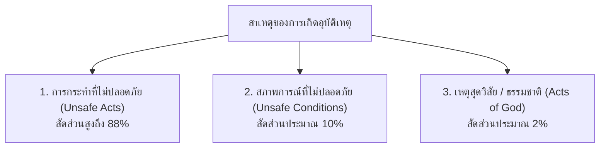
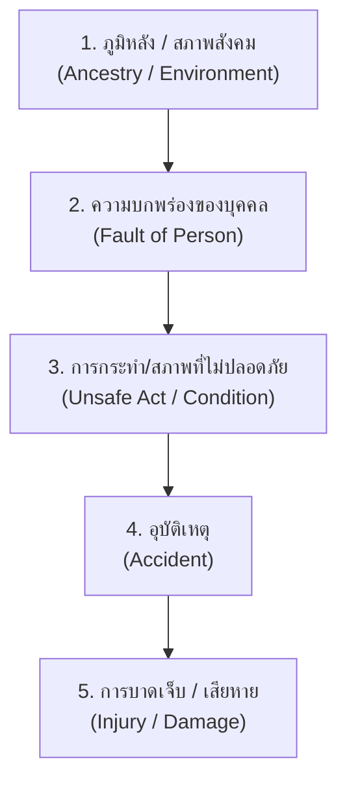
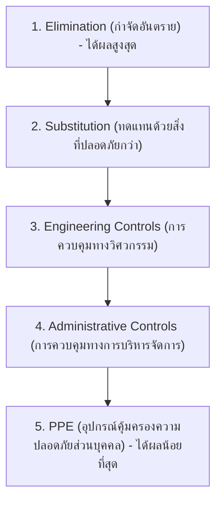

# การป้องกันอุบัติเหตุจากการทำงาน (Workplace Accident Prevention)

---

## 1. ความสำคัญของการป้องกันอุบัติเหตุ

อุบัติเหตุจากการทำงานไม่ใช่เรื่องของ "คราวเคราะห์" หรือ "โชคชะตา" แต่เป็นผลลัพธ์ที่เกิดขึ้นจากปัจจัยที่สามารถชี้บ่ง คาดการณ์ และป้องกันได้ล่วงหน้าเสมอ 

การป้องกันอุบัติเหตุอย่างเป็นระบบจึงมีวัตถุประสงค์หลัก 3 ด้าน
1. **ด้านมนุษยธรรม (Humanitarian)** 
   ปกป้องชีวิต สุขภาพ และคุณภาพชีวิตของลูกจ้างและครอบครัว
2. **ด้านกฎหมาย (Legal Compliance)** 
   ปฏิบัติตาม พ.ร.บ. ความปลอดภัย อาชีวอนามัย และสภาพแวดล้อมในการทำงาน พ.ศ. 2554 และมาตรฐานสากล
3. **ด้านเศรษฐศาสตร์ (Economic Impact)** 
   ป้องกันความสูญเสียทั้งทางตรง (ค่ารักษาพยาบาล เงินทดแทน ค่าซ่อมเครื่องจักร) และทางอ้อม (เวลาการผลิตที่สูญเปล่า เสียภาพลักษณ์ ค่าฝึกอบรมพนักงานใหม่)

---

## 2. การจำแนกสาเหตุของอุบัติเหตุ (Classification of Accident Causes)

ตามหลักการสากลทางอาชีวอนามัยและความปลอดภัย อุบัติเหตุแบ่งตามสาเหตุหลักได้ 2 ประการใหญ่ (และ 1 ปัจจัยธรรมชาติ)

### 2.1 การกระทำที่ไม่ปลอดภัย (Unsafe Acts) -- สัดส่วนประมาณ 88%
เกิดจากพฤติกรรม ทัศนคติ หรือความบกพร่องของตัวบุคคล เช่น
- การไม่สวมใส่อุปกรณ์คุ้มครองความปลอดภัยส่วนบุคคล (PPE)
- การถอดอุปกรณ์การ์ดป้องกัน (Machine Guard) ออกจากเครื่องจักร
- การทำงานด้วยความเร็วเกินกำหนดหรือเร่งรีบเพื่อเอาผลงาน
- การหยอกล้อ ล้อเล่น หรือขาดสมาธิขณะปฏิบัติงาน
- การใช้เครื่องมือผิดประเภทหรือผิดวิธี
- การซ่อมบำรุงเครื่องจักรโดยไม่ตัดกระแสไฟฟ้า (ไม่ทำ Lockout/Tagout "**LOTO**")

### 2.2 สภาพการณ์ที่ไม่ปลอดภัย (Unsafe Conditions) -- สัดส่วนประมาณ 10%
เกิดจากสภาพแวดล้อม เครื่องจักร เครื่องมือ หรือสถานที่ทำงานที่มีอันตรายแฝงอยู่ เช่น
- เครื่องจักรไม่มีที่ครอบป้องกันจุดหมุน จุดตัด หรือจุดหนีบ
- อุปกรณ์ไฟฟ้าชำรุด สายไฟฉีกขาด หรือไม่มีสายดิน
- พื้นโรงงานลื่น มีคราบน้ำมัน หรือมีสิ่งกีดขวางทางเดิน
- แสงสว่างไม่เพียงพอ หรือมีเสียงดังเกินมาตรฐาน
- การระบายอากาศไม่ดี มีสารเคมี ไอระเหย หรือฝุ่นละอองสะสม
- โครงสร้างอาคาร บันได หรือนั่งร้านไม่มั่นคงแข็งแรง

### 2.3 เหตุสุดวิสัยทางธรรมชาติ (Acts of God) -- สัดส่วนประมาณ 2%
เหตุการณ์ที่ไม่สามารถควบคุมหรือคาดการณ์ได้ล่วงหน้า เช่น ฟ้าผ่า พายุ แผ่นดินไหว หรือน้ำท่วมฉับพลัน

---

## 3. สาเหตุเชิงลึกที่ทำให้คนงานประสบอุบัติเหตุ (Root Causes & Human Factors)

แม้จะแบ่งเป็น Unsafe Act และ Unsafe Condition แต่เบื้องหลังการกระทำที่ไม่ปลอดภัยของคนงาน มักมีปัจจัยผลักดันที่ซับซ้อนทั้งด้านความรู้ กายภาพ จิตใจ สังคม และระบบบริหารจัดการ ดังนี้

### 3.1 ความรู้เท่าไม่ถึงการณ์ (Lack of Knowledge & Training)
- **ไม่เคยศึกษาในหลักสูตรความปลอดภัย** 
  ขาดพื้นฐานความเข้าใจเรื่องอันตรายและวิธีควบคุม
- **ขาดการอบรมเฉพาะทาง** 
  เช่น เข้าทำงานกับเครื่องจักร สารเคมี หรือพื้นที่อับอากาศโดยไม่ผ่านการอบรมขั้นตอนปฏิบัติงานมาตรฐาน (Standard Operating Procedure SOP)
- **ไม่ตระหนักถึงพิษภัยแฝง** 
  ไม่ทราบว่าสารเคมีหรือฝุ่นละอองบางชนิดส่งผลกระทบระยะยาวต่อสุขภาพ

### 3.2 สภาพแวดล้อมในการทำงานที่เลวร้าย (Adverse Physical & Mental Environment)
- **สภาพแวดล้อมทางกายภาพ** 
  ทำงานท่ามกลางความร้อนจัด เสียงดัง กลิ่นฉุน หรือแสงสว่างไม่พอ ทำให้เกิดความเครียด ประสาทสัมผัสเสื่อมถอย และสมองล้าตอบสนองช้า
- **สภาพแวดล้อมทางจิตสังคม** 
  ขัดแย้งกับเพื่อนร่วมงาน ไม่ลงรอยกับหัวหน้างาน บรรยากาศการทำงานตึงเครียด ถูกกดดันเรื่องยอดผลผลิต ทำให้ขาดสมาธิและใจลอย

### 3.3 การเดินทางและทำเลที่ตั้งไม่เหมาะสม (Fatigue & Commuting Burden)
- **ความเหนื่อยล้าจากการเดินทาง** 
  ที่พักอาศัยอยู่ห่างไกล ต้องใช้เวลาเดินทางไป-กลับหลายชั่วโมง พักผ่อนไม่เพียงพอ
- **ภาวะทุพโภชนาการ** 
  รีบเร่งจนไม่ได้รับประทานอาหารเช้า ส่งผลให้ระดับน้ำตาลในเลือดต่ำ เกิดอาการวิงเวียน อ่อนเพลีย หมดแรงระหว่างทำงานกะเช้า

### 3.4 สภาพเศรษฐกิจบีบรัดและการเร่งรีบ (Economic Pressures & Time Rushing)
- **การจ่ายค่าตอบแทนตามชิ้นงาน (Piece Rate)** 
  จูงใจให้คนงานทำงานแข่งกับเวลา เพื่อให้ได้จำนวนชิ้นงานสูงสุด
- **ละเลยอุปกรณ์เซฟตี้** 
  คนงานเลือกที่จะไม่สวมใส่ PPE เพราะคิดว่าทำให้ทำงานช้าลง รุ่มร่าม อึดอัด
- **ปลดระบบความปลอดภัยออก** 
  ปลด Interlock Switch หรือถอดการ์ดครอบเครื่องจักรออกเพื่อป้อนชิ้นงานได้เร็วขึ้น

### 3.5 การปกครองและการบังคับบัญชาที่บกพร่อง (Defective Supervision & Leadership)
- **ความขัดแย้งในองค์กร** 
  มีการแบ่งฝักแบ่งฝ่ายระหว่างผู้บริหารกับคนงาน เกิดการต่อต้านเงียบ
- **การสั่งการที่เข้มงวดหรือใช้อำนาจเกินไป** 
  บั่นทอนขวัญกำลังใจ คนงานทำงานด้วยความหวาดกลัว ขาดความคิดริเริ่มในการปรับปรุงความปลอดภัย
- **หัวหน้างานย่อหย่อน** 
  ปล่อยปละละเลยไม่ตรวจเตือนเมื่อเห็นพฤติกรรมเสี่ยง ทำให้คนงานเข้าใจผิดว่า "ทำได้ ไม่เป็นไร"
- **การกลั่นแกล้ง (Sabotage)** 
  คนงานจงใจละเลยการบำรุงรักษาเพื่อกลั่นแกล้งฝ่ายบริหาร แต่อาจส่งผลให้เพื่อนร่วมงานได้รับบาดเจ็บแทน

### 3.6 ความประมาท ชะล่าใจ และความเคยชิน (Overconfidence & Complacency)
- **ความชะล่าใจจากประสบการณ์** 
  ทำงานมานาน 5–10 ปี ไม่เคยเกิดอุบัติเหตุ จึงมั่นใจในฝีมือตัวเองเกินไปและเริ่มละเลยขั้นตอนความปลอดภัย
- **พฤติกรรมนิยมความเสี่ยง (Risk-Taking Behavior)** 
  ยอมเสี่ยงอันตรายเพื่อแลกกับความสะดวกสบายหรือความรวดเร็วในการทำงานเพียงเล็กน้อย

### 3.7 ความจำเจและซ้ำซากในการทำงาน (Monotony & Boredom)
- **ภาวะทำงานอัตโนมัติ (Autopilot Effect)** 
  งานที่ทำซ้ำ ๆ รูปแบบเดิมทั้งวัน ทำให้สติไม่อยู่กับเนื้อกับตัว เมื่อมีสิ่งแปลกปลอมหรือเครื่องจักรขัดข้อง จะไม่มีปฏิกิริยาป้องกันตัวทันท่วงที
- **ความเบื่อหน่ายในงานประจำ** 
  คนงานที่ชอบความท้าทายแต่ต้องทำงานซ้ำซาก จะหาทางลัดหรือใช้วิธีการแปลกใหม่ที่ไม่ตรงตามคู่มือเพื่อคลายความเบื่อ

### 3.8 สภาพความพร้อมทางร่างกายและสุขภาพ (Physical Fitness & Health Limitations)
- **ปัญหาสุขภาพส่วนบุคคล** 
  การเจ็บป่วยเรื้อรัง การรับประทานยาที่มีฤทธิ์กดประสาทหรือทำให้ง่วงซึม
- **การดื่มสุราหรือสารเสพติด** 
  เมาค้างหรือใช้สารกระตุ้น ทำให้การตัดสินใจและการประสานงานของกล้ามเนื้อผิดพลาด

---

## 4. ทฤษฎีการเกิดอุบัติเหตุที่สำคัญ (Classic Accident Theories)

### 4.1 ทฤษฎีลูกโดมิโนของไฮนริช (Heinrich's Domino Theory)
เอช. ดับเบิลยู. ไฮนริช (H.W. Heinrich) เสนอว่าอุบัติเหตุและการบาดเจ็บเกิดขึ้นจากการล้มต่อเนื่องกันของปัจจัย 5 ประการเปรียบเสมือนตัวโดมิโน 5 ตัวที่วางเรียงกัน

>  **หัวใจของการป้องกันอุบัติเหตุ** 
>  ไฮนริชชี้ให้เห็นว่า หากเราสามารถ **"ดึงโดมิโนตัวที่ 3 (Unsafe Act / Unsafe Condition) ออกไปได้"** โดมิโนตัวที่ 4 (อุบัติเหตุ) และ 5 (การบาดเจ็บ) จะไม่มีทางล้มลงมาได้เลย

---

### 4.2 ทฤษฎีพีระมิดอุบัติเหตุ (The Safety Triangle / Pyramid)
ไฮนริชได้ศึกษาอัตราส่วนการเกิดอุบัติเหตุจากเคสจริงในโรงงานอุตสาหกรรมนับแสนเคส และพบอัตราส่วนทางสถิติ **1 : 29 : 300**

ใน 300  ครั้ง ของเหตุการณ์เกือบเกิด   (Near-Miss / No Injury)
จะมี 29  ครั้ง ที่เป็นการบาดเจ็บเล็กน้อย   (Minor Injury / First Aid)
และมี 1  ครั้ง ที่เป็นการบาดเจ็บรุนแรง  (Major / Fatal Injury)

- **หลักคิดสำคัญ** ใต้ฐานของการเสียชีวิตหรือบาดเจ็บรุนแรง 1 ครั้ง จะมีเหตุการณ์เกือบเกิดอุบัติเหตุ (Near-Miss) ซ่อนอยู่ถึง 300 ครั้งเสมอ
- **แนวทางปฏิบัติ** หากต้องการกำจัดการบาดเจ็บรุนแรง ต้องไม่รอให้เกิดเหตุก่อน แต่ต้องมุ่งเน้นจัดการลด **Near-Miss** และ **Unsafe Acts** ที่ฐานล่างสุดอย่างจริงจัง

---

## 5. หลักการป้องกันอุบัติเหตุ (Principles of Accident Prevention)

### 5.1 หลักการ 3E (The 3 Es of Safety)
การป้องกันอุบัติเหตุที่มีประสิทธิภาพต้องบูรณาการ 3 องค์ประกอบหลักเข้าด้วยกัน

1. **Engineering (วิศวกรรมศาสตร์)**
   - ออกแบบเครื่องจักร โรงงาน และกระบวนการผลิตให้ปลอดภัยตามหลักสรีรศาสตร์และวิศวกรรม
   - ติดตั้งการ์ดป้องกัน (Machine Guarding) ระบบตัดไฟอัตโนมัติ และเซนเซอร์ม่านแสง
   - บำรุงรักษาเชิงป้องกัน (Preventive Maintenance) เพื่อไม่ให้อุปกรณ์ชำรุด
2. **Education (การศึกษาและฝึกอบรม)**
   - อบรมปฐมนิเทศความปลอดภัยแก่พนักงานใหม่ทุกคน
   - ฝึกอบรมขั้นตอนการทำงานที่ปลอดภัย (Safe Operating Procedures)
   - ปลูกฝังจิตสำนึกความปลอดภัย (Safety Awareness) และการหยั่งรู้อันตราย
3. **Enforcement (การบังคับใช้กฎระเบียบ)**
   - กำหนดกฎระเบียบและมาตรฐานความปลอดภัยของสถานประกอบการให้ชัดเจน
   - มีระบบตรวจประเมินอย่างจริงจังและสม่ำเสมอ
   - มีระบบชมเชย/ให้รางวัลแก่ผู้ปฏิบัติตาม และมีบทลงโทษที่ยุติธรรมสำหรับผู้ฝ่าฝืน

---

### 5.2 ลำดับขั้นการควบคุมอันตราย (Hierarchy of Controls)
ในการแก้ไขปัญหาอันตราย ให้เลือกใช้มาตรการตามลำดับความมีประสิทธิภาพสูงสุดลงไปต่ำสุด (เรียนไปแล้วในสัปดาห์ก่อน)

| ลำดับขั้น | มาตรการ                                    | ตัวอย่างการใช้งานจริง                                                   |
| :-------: | :----------------------------------------- | :---------------------------------------------------------------------- |
|   **1**   | **Elimination** (กำจัด)                    | ยกเลิกกระบวนการทำงานที่มีความร้อนสูง / เลิกใช้สารเคมีก่อมะเร็ง          |
|   **2**   | **Substitution** (ทดแทน)                   | เปลี่ยนไปใช้สารทำความสะอาดสูตรน้ำแทนสารตัวทำละลายอินทรีย์ไวไฟ           |
|   **3**   | **Engineering Controls** (วิศวกรรม)        | ติดตั้งเครื่องดูดระบายอากาศเฉพาะที่ (Local Exhaust) / การ์ดครอบใบเลื่อย |
|   **4**   | **Administrative Controls** (บริหารจัดการ) | ทำป้ายเตือน / หมุนเวียนงานลดชั่วโมงการสัมผัสเสียง / อบรมขั้นตอน SOP     |
|   **5**   | **PPE** (อุปกรณ์ปกป้องส่วนบุคคล)           | สวมหมวกนิรภัย แว่นตานิรภัย หน้ากากกรองสารเคมี รองเท้าหัวเหล็ก           |

>  **ข้อพึงระวัง** PPE เป็นด่านป้องกันสุดท้าย (Last Line of Defense) ไม่ได้ช่วยกำจัดอันตรายที่ต้นเหตุ จึงไม่ควรนำมาใช้เป็นมาตรการแรกเพียงอย่างเดียว

---

## 6. กิจกรรมส่งเสริมความปลอดภัยเชิงปฏิบัติการในโรงงาน (Workplace Safety Programs)

เพื่อเปลี่ยนนโยบายความปลอดภัยให้เกิดผลจริงในระดับปฏิบัติการ โรงงานนิยมดำเนินกิจกรรมความปลอดภัยต่อไปนี้

1. **กิจกรรม 5ส (5S for Safety)**
   - **สะสาง (Seiri) & สะดวก (Seiton)** กำจัดสิ่งของที่ไม่จำเป็น ขจัดสิ่งกีดขวางทางเดิน จัดเก็บเครื่องมือเป็นหมวดหมู่ ลดอุบัติเหตุสะดุดหกล้ม
   - **สะอาด (Seiso)** เช็ดล้างคราบน้ำมันและสิ่งสกปรก ทำให้พบเห็นรอยรั่วซึมหรือความผิดปกติของเครื่องจักรได้ทันที
   - **สุขลักษณะ (Seiketsu) & สร้างนิสัย (Shitsuke)** รักษาสภาพแวดล้อมที่ดีและปฏิบัติตามระเบียบวินัยอย่างสม่ำเสมอ
2. **กิจกรรม KYT (Kiken Yochi Training -- การหยั่งรู้อันตราย)**
   - กิจกรรมฝึกให้ลูกจ้างร่วมกันชี้นิ้วและส่งเสียงเตือนตนเองก่อนเริ่มงาน เช่น *"สายพานมีการ์ดพร้อมใช้งาน... โอเคนะ!"*
   - ช่วยกระตุ้นสติและความพร้อม ป้องกันความเหม่อลอยและความเคยชิน
3. **กิจกรรม Safety Talk / Toolbox Talk (คุยความปลอดภัย 5 นาทีก่อนเริ่มงาน)**
   - หัวหน้างานรวมแถวลูกจ้าง 5–10 นาทีก่อนเข้ากะ เพื่อชี้แจงจุดเสี่ยงของงานในวันนั้น ตรวจความพร้อมของร่างกาย และตรวจความพร้อมของ PPE
4. **ระบบรายงานเหตุการณ์เกือบเกิดอุบัติเหตุ (Near-Miss Incident Reporting)**
   - สนับสนุนให้พนักงานแจ้งเหตุการณ์ที่ *"เกือบชน เกือบหล่น เกือบหนีบ"* โดยไม่มีการลงโทษ เพื่อนำข้อมูลมาแก้ไขปรับปรุงก่อนจะกลายเป็นอุบัติเหตุจริง
5. **การตรวจความปลอดภัย (Safety Inspection & Safety Patrol)**
   - คณะกรรมการความปลอดภัย (คปอ.) และ จป. เดินสำรวจพื้นที่ปฏิบัติงานจริงเป็นประจำทุกเดือน เพื่อค้นหาสภาพการณ์และการกระทำที่ไม่ปลอดภัยเชิงรุก

---

## 7. สรุปภาพรวม (Key Summary)

- อุบัติเหตุจากการทำงานมีสาเหตุหลัก 2 ประการคือ **การกระทำที่ไม่ปลอดภัย (88%)** และ **สภาพการณ์ที่ไม่ปลอดภัย (10%)**
- เบื้องหลังพฤติกรรมเสี่ยงของคนงานเกิดจากปัจจัยร่วมหลายด้าน เช่น ความไม่รู้ ความเครียด ความเร่งรีบ ความเคยชิน และระบบการบังคับบัญชา
- ตามทฤษฎีโดมิโนของไฮนริช หากเรา **ดึงโดมิโน "การกระทำ/สภาพที่ไม่ปลอดภัย" ออก** อุบัติเหตุจะไม่เกิดขึ้น
- การควบคุมอันตรายต้องยึด **หลัก 3E** และ **ลำดับขั้นการควบคุม (Hierarchy of Controls)** โดยให้ความสำคัญกับการกำจัดอันตรายและมาตรการทางวิศวกรรมก่อนการพึ่งพา PPE
