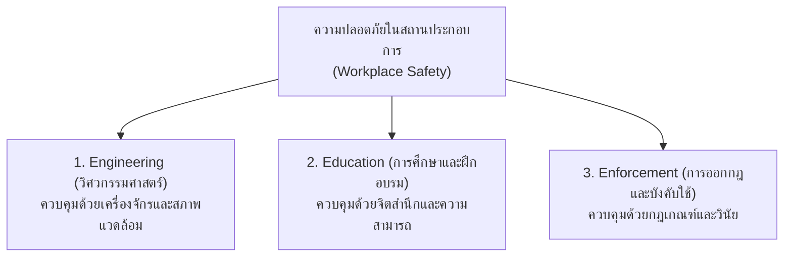

# หลักการ 3E ในการป้องกันอุบัติเหตุ (The 3 Es of Safety)

---

## 1. บทนำและความสำคัญของหลักการ 3E

หลักการ **3E** เป็นหนึ่งในกรอบแนวคิดพื้นฐานคลาสสิกที่ได้รับการยอมรับและนำมาใช้ในงานวิศวกรรมความปลอดภัยและอาชีวอนามัยทั่วโลก พัฒนาขึ้นโดยสถาบันความปลอดภัยแห่งชาติสหรัฐอเมริกา (National Safety Council - NSC) เพื่อใช้เป็นกลยุทธ์หลักในการลดและกำจัดอุบัติเหตุในภาคอุตสาหกรรม

หลักการนี้เปรียบเสมือน **"สามเหลี่ยมแห่งความปลอดภัย (Safety Triangle)"** หรือเสาค้ำยัน 3 ด้านที่ต้องดำเนินการควบคู่กันอย่างสมดุล หากขาดด้านใดด้านหนึ่ง ระบบการจัดการความปลอดภัยจะไม่สามารถบรรลุเป้าหมายอุบัติเหตุเป็นศูนย์ (Zero Accident) ได้

---

## 2. โครงสร้างสามเหลี่ยมแห่งความปลอดภัย (The 3E Safety Model)




จากโครงสร้างสามเหลี่ยม สามารถแบ่งมิติการควบคุมออกเป็น 3 ระดับ:
1. **Engineering:** มุ่งเน้นการควบคุม **ฮาร์ดแวร์และกายภาพ (Physical & Hardware)** เพื่อให้สภาพแวดล้อมมีความปลอดภัยโดยเนื้อแท้
2. **Education:** มุ่งเน้นการควบคุม **จิตใจและพฤติกรรม (Heartware & Competency)** เพื่อให้คนทำงานมีความรู้ ทักษะ และจิตสำนึกระวังภัย
3. **Enforcement:** มุ่งเน้นการควบคุม **กฎเกณฑ์และระบบบริหาร (Software & Governance)** เพื่อสร้างกรอบระเบียบวินัยและแรงขับเคลื่อนภายนอก

---

## 3. รายละเอียดหลักการ 3E แต่ละด้าน

### 3.1 ด้านที่ 1 Engineering (วิศวกรรมศาสตร์)

> **นิยาม** 
> การประยุกต์ใช้ความรู้และหลักการทางวิศวกรรมในการคำนวณ ออกแบบ ปรับปรุง และติดตั้งระบบความปลอดภัย เพื่อให้เครื่องจักร เครื่องมือ และสภาพแวดล้อมในการทำงานมีความปลอดภัยสูงสุดตั้งแต่ต้นทาง (Inherent Safety)

**แนวทางปฏิบัติการทางวิศวกรรม**
1. **การออกแบบเครื่องจักรที่ปลอดภัย (Inherently Safer Design)**
   - ออกแบบและเลือกใช้วัสดุ อุปกรณ์ ชิ้นส่วนที่มีค่าความปลอดภัย (Safety Factor) สูงตามมาตรฐาน
   - ออกแบบระบบป้องกันความผิดพลาด (Poka-Yoke / Foolproof) เพื่อป้องกันไม่ให้คนงานทำงานผิดวิธี
2. **การติดตั้งเครื่องป้องกันอันตราย (Machine Safeguarding)**
   - ติดตั้งฝาครอบ/การ์ดป้องกันส่วนที่หมุน เคลื่อนไหว ตัด หรือหนีบ (Pulleys, Gears, Shafts, Blades)
   - ติดตั้งอุปกรณ์ตัดการทำงานอัตโนมัติ เช่น ม่านแสงนิรภัย (Safety Light Curtains), สวิตช์นิรภัยสองมือ (Two-Hand Control), และปุ่มหยุดฉุกเฉิน (Emergency Stop: E-Stop)
   - ติดตั้งระบบล็อกตัดพลังงาน (Lockout / Tagout: LOTO) สำหรับงานซ่อมบำรุง
3. **การออกแบบและจัดวางผังโรงงาน (Plant Layout & Ergonomics)**
   - กำหนดเส้นทางสัญจรของคนเดินและรถโฟล์คลิฟต์แยกออกจากกันอย่างชัดเจน
   - จัดวางตำแหน่งสถานีงานตามหลักการยศาสตร์ (Ergonomics) เพื่อลดความเมื่อยล้าและท่าทางการทำงานที่เสี่ยงต่อการบาดเจ็บ
4. **การควบคุมสภาพแวดล้อมในการทำงาน (Environmental Controls)**
   - ออกแบบระบบระบายอากาศทั่วไปและการดูดควัน/ไอระเหยเฉพาะจุด (Local Exhaust Ventilation)
   - ควบคุมระดับเสียง ความสั่นสะเทือน อุณหภูมิ และระดับความเข้มของแสงสว่างให้ได้มาตรฐานตามกฎหมาย

---

### 3.2 ด้านที่ 2 Education (การศึกษาและฝึกอบรม)

>**นิยาม** 
>กระบวนการถ่ายทอดความรู้ เสริมสร้างทักษะการทำงานที่ถูกต้อง และปลูกฝังจิตสำนึกความปลอดภัยให้แก่ลูกจ้าง หัวหน้างาน และผู้บริหาร เพื่อให้ทุกคนตระหนักถึงอันตรายและรู้วิธีปกป้องตนเองและผู้อื่น

**แนวทางปฏิบัติการด้านการศึกษาและฝึกอบรม**
1. **การปฐมนิเทศความปลอดภัย (Safety Induction)**
   - อบรมชี้แจงกฎระเบียบ ข้อพึงระวัง และสัญลักษณ์เตือนภัยแก่พนักงานใหม่ ผู้รับเหมา และผู้มาติดต่อ ก่อนเข้าพื้นที่ปฏิบัติงานจริง
2. **การอบรมขั้นตอนการทำงานที่ปลอดภัย (Standard Operating Procedures: SOP)**
   - สอนขั้นตอนการทำงานทีละสเต็ปอย่างถูกต้อง (How-to)
   - อธิบายเหตุผลว่าทำไมต้องทำตามขั้นตอนนี้ และหากละเลยจะเกิดอันตรายอย่างไร
3. **การฝึกฝนทักษะการหยั่งรู้ระวังอันตราย (KYT & Safety Awareness)**
   - ฝึกให้คนงานสามารถชี้บ่งจุดอันตราย (Hazard Identification) ในพื้นที่ทำงานได้ด้วยตนเอง
   - ปลูกฝังการส่งเสียงเตือนและชี้นิ้วตรวจสอบสภาพความปลอดภัยก่อนเริ่มเดินเครื่องจักร
4. **การฝึกซ้อมสถานการณ์ฉุกเฉิน (Emergency Drills)**
   - การฝึกซ้อมดับเพลิงและการอพยพหนีไฟประจำปี
   - การปฐมพยาบาลเบื้องต้นและการกู้ชีพขั้นพื้นฐาน (First Aid & CPR)

---

### 3.3 ด้านที่ 3 Enforcement (การออกกฎระเบียบและการบังคับใช้)

>**นิยาม** 
>การกำหนดนโยบาย กฎระเบียบ ข้อบังคับ และขั้นตอนปฏิบัติงานด้านความปลอดภัยให้เป็นมาตรฐานเดียวกัน พร้อมทั้งมีระบบกำกับดูแล ตรวจสอบ และบังคับใช้อย่างจริงจัง เสมอภาค และเป็นธรรม

**แนวทางปฏิบัติการด้านการบังคับใช้**
1. **การกำหนดกฎระเบียบและคู่มือความปลอดภัยที่เป็นลายลักษณ์อักษร**
   - ประกาศกฎความปลอดภัยทั่วไปของโรงงาน (General Safety Rules)
   - กำหนดมาตรฐานการสวมใส่อุปกรณ์คุ้มครองความปลอดภัยส่วนบุคคล (PPE Matrix) ในแต่ละพื้นที่
1. **การตรวจประเมินความปลอดภัยอย่างสม่ำเสมอ (Safety Audit & Patrol)**
   - การเดินตรวจความปลอดภัยประจำสัปดาห์โดยหัวหน้างาน และประจำเดือนโดยคณะกรรมการ คปอ.
   - บันทึกและแจ้งเตือนพฤติกรรมเสี่ยง (Unsafe Act) เพื่อให้ปรับปรุงแก้ไขทันที
1. **มาตรการเสริมแรงทางบวกและทางลบ (Reward & Disciplinary Actions)**
   - **การเสริมแรงทางบวก (Positive Reinforcement):** มอบรางวัล คำชมเชย หรือโล่ประกาศเกียรติคุณแก่พนักงานหรือแผนกที่มีสถิติความปลอดภัยดีเยี่ยม (Zero Accident Award)
   - **การเสริมแรงทางลบ (Disciplinary System):** มีขั้นตอนการตักเตือนและลงโทษที่ชัดเจน ยุติธรรม และโปร่งใส (เตือนด้วยวาจา $\rightarrow$ เตือนเป็นลายลักษณ์อักษร $\rightarrow$ พักงาน $\rightarrow$ เลิกจ้าง) เมื่อมีผู้จงใจฝ่าฝืนกฎความปลอดภัย

---

## 4. ความสัมพันธ์และการทำงานสอดประสานกัน (The Synergy of 3E)

หลักการ 3E จะไม่สามารถทำงานได้อย่างมีประสิทธิภาพหากดำเนินการเพียงด้านใดด้านหนึ่งโดยลำพัง

```
                  ┌────────────────────────────────────────┐
                  │          ความล้มเหลวเมื่อขาด 3E            │
                  └────────────────────────────────────────┘
  [มีแต่ Engineering]  ──> คนงานไม่เข้าใจ ไม่เห็นคุณค่า จึงถอดการ์ดป้องกันออก
  [มีแต่ Education]    ──> คนงานรู้ว่าอันตราย แต่เครื่องจักรไม่มีการ์ด จึงพลาดบาดเจ็บ
  [มีแต่ Enforcement]  ──> คนงานทำตามเพราะกลัวถูกลงโทษ เมื่อลับตาหัวหน้าก็กลับมาทำพฤติกรรมเสี่ยง
```

| ปัจจัย 3E       | หน้าที่หลัก                                | สิ่งที่เกิดขึ้นหากทำได้ดี                    | ผลกระทบหากขาดปัจจัยนี้                                |
| :-------------- | :----------------------------------------- | :------------------------------------------- | :---------------------------------------------------- |
| **Engineering** | กำจัดความเสี่ยงที่ตัวเครื่องจักรและสถานที่ | สภาพแวดล้อมปลอดภัยโดยเนื้อแท้                | สภาพการณ์ไม่ปลอดภัย (Unsafe Condition) สะสมทั่วโรงงาน |
| **Education**   | สร้างความเข้าใจและจิตสำนึก                 | พนักงานทำงานถูกต้อง ป้องกันตนเองได้          | คนงานทำผิดวิธี ไม่รู้วิธีเอาตัวรอด ถอดเซฟตี้ออก       |
| **Enforcement** | กำกับวินัยและมาตรฐานการปฏิบัติ             | กฎระเบียบมีความศักดิ์สิทธิ์ ปฏิบัติต่อเนื่อง | กฎระเบียบเป็นเพียงเสือกระดาษ คนงานละเลยและชะล่าใจ     |

---

## 5. สรุปภาพรวม

- **Engineering** ช่วยให้ **"ทำงานได้อย่างปลอดภัย"** (Safe Place / Safe Machine)
- **Education** ช่วยให้ **"ทำงานเป็นและคิดอย่างปลอดภัย"** (Safe Person / Safe Method)
- **Enforcement** ช่วยให้ **"ทำงานอย่างปลอดภัยตลอดเวลา"** (Safe Habit / Safety Discipline)

การบูรณาการหลักการ 3E อย่างจริงจังและต่อเนื่องเป็นรากฐานสำคัญในการสร้าง **วัฒนธรรมความปลอดภัยเชิงรุก (Proactive Safety Culture)** ที่ช่วยป้องกันอุบัติเหตุได้อย่างยั่งยืน
