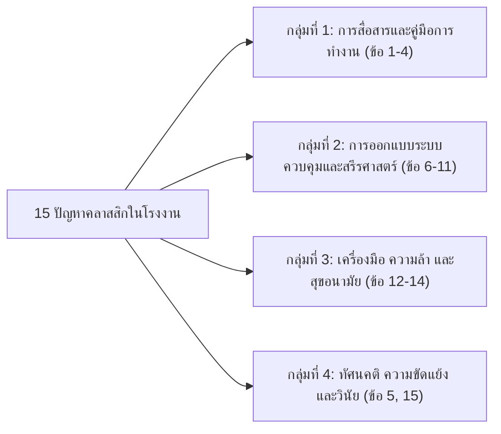

# รูปแบบแนวทางปฏิบัติเพื่อป้องกันอุบัติเหตุ (Accident Prevention Action Patterns)

---

## 1. บทนำและโครงสร้างแนวคิด (Framework Concept)

ในการบริหารจัดการความปลอดภัยในโรงงานอุตสาหกรรม เมื่อเกิดปัญหาหรือตรวจพบความเสี่ยงขึ้น การแก้ไขปัญหาให้ตรงจุดและยั่งยืนจำเป็นต้องอาศัยการประสานงานร่วมกันระหว่าง 2 บุคลากรหลักที่มีบทบาทหน้าที่เสริมรับกันเสมอ)

1. **วิศวกรหรือผู้ออกแบบโรงงาน (Engineer ตัวย่อ E)**
   - ดูแลด้าน **Hardware, System Design & Ergonomics**
   - มีหน้าที่แก้ไขที่ต้นตอทางกายภาพ ออกแบบเครื่องจักร ปรับปรุงผังงาน ติดตั้งระบบควบคุมอัตโนมัติ และเขียนคู่มือมาตรฐาน
1. **หัวหน้างานหรือหัวหน้าคนงาน (Supervisor) ตัวย่อ S)**
   - ดูแลด้าน **People, Process & Frontline Monitoring**
   - มีหน้าที่ควบคุมดูแลหน้างาน สื่อสาร ถ่ายทอดความรู้ ตรวจสอบความพร้อมของพนักงาน และบังคับใช้ระเบียบวินัย

แนวทางในเอกสารนี้จัดทำในลักษณะ **"สูตรสำเร็จหรือแบบแผนในการแก้ไขปัญหา (Action Pattern Matrix)"** ครอบคลุม 15 ปัญหาคลาสสิกที่พบบ่อยในโรงงานอุตสาหกรรม โดยใช้สัญลักษณ์
- **(เลขข้อ)**  ปัญหาหรือสาเหตุของอุบัติเหตุ
- **(เลขข้อ-E)**  แนวทางดำเนินการโดย **วิศวกร (Engineer)**
- **(เลขข้อ-S)**  แนวทางดำเนินการโดย **หัวหน้างาน (Supervisor)**

---

## 2. แผนภาพจัดกลุ่มปัญหา 15 รูปแบบ (Problem Taxonomy)

---

## 3. รายละเอียดแบบแผนการแก้ปัญหา 15 กรณีศึกษา (Action Patterns 1 - 15)

### กลุ่มที่ 1 ปัญหาด้านการสื่อสาร วิธีการทำงาน และคู่มือ (ปัญหา 1 - 4)

---

#### ปัญหาที่ (1) มีการปรับปรุงวิธีการทำงานขึ้นใหม่ แต่คนงานยังไม่ทราบการเปลี่ยนแปลง

| รหัส | ผู้รับผิดชอบ | มาตรการแก้ไขและแนวทางปฏิบัติ |
| :---: | :--- | :--- |
| **(1)** | **สภาพปัญหา** | มีการปรับปรุงขั้นตอนหรือวิธีการทำงานขึ้นใหม่ แต่ข้อมูลไปไม่ถึงผู้ปฏิบัติงาน ทำให้คนงานยังคงใช้วิธีเดิมที่อาจขัดกับระบบใหม่จนเกิดอันตราย |
| **(1-E)** | **Engineer** | จัดเตรียมเอกสารการเปลี่ยนแปลง (Management of Change: MOC) ออกแบบโปรแกรมการอบรม สื่อการสอน และปรับปรุงขั้นตอน SOP ให้พร้อมข้อมูลอย่างสมบูรณ์ |
| **(1-S)** | **Supervisor** | จัดอบรมชี้แจงแก่คนงานก่อนเริ่มงาน ทดสอบและประเมินผลจนมั่นใจว่าคนงานมีความรู้ความสามารถตามมาตรฐานใหม่ และพร้อมทำงานได้อย่างปลอดภัย |

---

#### ปัญหาที่ (2) คนงานทำตามคู่มืออย่างเคร่งครัด แต่รายละเอียดในคู่มือคลาดเคลื่อน

| รหัส | ผู้รับผิดชอบ | มาตรการแก้ไขและแนวทางปฏิบัติ |
| :---: | :--- | :--- |
| **(2)** | **สภาพปัญหา** | คนงานมีวินัยปฏิบัติตามคู่มืออย่างเคร่งครัด แต่เนื้อหาหรือรายละเอียดในคู่มือพิมพ์ผิดพลาด คลาดเคลื่อน นำมาสู่ความผิดพลาดและอุบัติเหตุ |
| **(2-E)** | **Engineer** | ทบทวนความถูกต้องของคู่มือเทียบกับสเปกเครื่องจักรและสภาพจริงหน้างาน ดำเนินการแก้ไขเนื้อหา และเรียกเก็บคู่มือฉบับเก่าที่ผิดพลาดออกทั้งหมด |
| **(2-S)** | **Supervisor** | ตรวจสอบเอกสารคู่มือที่ใช้งานหน้างานว่ามีข้อมูลถูกต้อง ตรงกับฉบับล่าสุด และหากพบจุดน่าสงสัยให้หยุดงานและแจ้งวิศวกรเพื่อยืนยันความถูกต้องทันที |

---

#### ปัญหาที่ (3) คนงานบกพร่องหรือละเลยต่อการปฏิบัติตามวิธีการทำงานที่ถูกต้อง

| รหัส | ผู้รับผิดชอบ | มาตรการแก้ไขและแนวทางปฏิบัติ |
| :---: | :--- | :--- |
| **(3)** | **สภาพปัญหา** | คนงานทราบขั้นตอนที่ถูกต้อง แต่เกิดความมักง่าย ละเลยขั้นตอนความปลอดภัย หรือหาทางลัดเพื่อความสะดวกสบายส่วนตัว |
| **(3-E)** | **Engineer** | ปรับปรุงระบบการทำงานให้กระชับ ทำได้ง่ายขึ้น ลดขั้นตอนที่ซ้ำซ้อน รุ่มร่าม และออกแบบระบบป้องกันความผิดพลาด (Poka-Yoke) เพื่อบังคับให้ต้องทำตามขั้นตอน |
| **(3-S)** | **Supervisor** | สาธิตและอธิบายย้ำถึงผลเสียของการละเลยขั้นตอน สอดส่องตรวจตราหน้างานอย่างใกล้ชิด ตักเตือนเมื่อพบพฤติกรรมเสี่ยง และนำข้อบกพร่องแจ้งวิศวกรเพื่อปรับปรุง |

---

#### ปัญหาที่ (4) คนงานไม่เข้าใจวิธีการทำงานที่ถูกต้อง

| รหัส | ผู้รับผิดชอบ | มาตรการแก้ไขและแนวทางปฏิบัติ |
| :---: | :--- | :--- |
| **(4)** | **สภาพปัญหา** | วิธีการทำงานซับซ้อน หรือคู่มือใช้ศัพท์เทคนิคทางวิชาการที่ยากเกินไป ทำให้คนงานอ่านแล้วไม่เข้าใจ หรือเข้าใจผิด |
| **(4-E)** | **Engineer** | ปรับปรุงคู่มือให้อ่านเข้าใจง่ายขึ้น ใช้ภาษาที่กระชับ นำรูปภาพ แผนภาพสี หรือการสอนงานแบบแผ่นเดียว (One Point Lesson: OPL) มาใช้แทนข้อความยาวๆ |
| **(4-S)** | **Supervisor** | จัดสอนงานแบบตัวต่อตัว (On-the-Job Training: OJT) ให้คนงานทวนคำสั่ง ซักซ้อมทำความเข้าใจ และทดลองปฏิบัติจริงให้ดูก่อนปล่อยให้ทำงานตามลำพัง |

---

### กลุ่มที่ 2 ปัญหาด้านทัศนคติ ความขัดแย้ง และจิตสำนึก (ปัญหา 5, 15)

---

#### ปัญหาที่ (5) คนงานไม่สนใจต่ออุบัติเหตุหรืออันตราย

| รหัส | ผู้รับผิดชอบ | มาตรการแก้ไขและแนวทางปฏิบัติ |
| :---: | :--- | :--- |
| **(5)** | **สภาพปัญหา** | คนงานขาดจิตสำนึกความปลอดภัย มองว่าอุบัติเหตุเป็นเรื่องไกลตัว หรือคิดว่าตนเองเก่งพอที่จะไม่เกิดอุบัติเหตุ |
| **(5-E)** | **Engineer** | รวบรวมสถิติและข้อมูลอุบัติเหตุในอดีต จัดทำสื่อการเรียนรู้ นิทรรศการ หรือกรณีศึกษาอุบัติเหตุจริงที่แสดงผลกระทบความสูญเสียต่อชีวิตและทรัพย์สิน |
| **(5-S)** | **Supervisor** | จัดกิจกรรม Safety Talk ก่อนเริ่มงานทุกเช้า ส่งเสริมกิจกรรมหยั่งรู้ระวังอันตราย (KYT) และให้คนงานมีส่วนร่วมในการทำโปสเตอร์และชี้บ่งจุดอันตรายในแผนก |

---

#### ปัญหาที่ (15) อุบัติเหตุมาจากการแกล้งกันหรือความขัดแย้ง (Sabotage & Horseplay)

| รหัส | ผู้รับผิดชอบ | มาตรการแก้ไขและแนวทางปฏิบัติ |
| :---: | :--- | :--- |
| **(5)** | **สภาพปัญหา** | เกิดการหยอกล้อเล่นกันในเวลาทำงาน (Horseplay) หรือมีความขัดแย้ง แตกแยก ชิงชังกัน จนนำไปสู่การจงใจกลั่นแกล้งทำให้เกิดอุบัติเหตุ |
| **(15-E)** | **Engineer** | สืบสวนร่วมกับฝ่ายบุคคลเพื่อวิเคราะห์สาเหตุความขัดแย้ง ปรับผังการทำงานหรือสับเปลี่ยนโยกย้ายตำแหน่งงาน เพื่อแยกคู่กรณีออกจากพื้นที่เสี่ยง |
| **(15-S)** | **Supervisor** | สอดส่องพฤติกรรมอย่างใกล้ชิด ห้ามปรามการเล่นหยอกล้อในพื้นที่อันตรายโดยเด็ดขาด รายงานปัญหาความขัดแย้งต่อผู้บริหาร และจัดกิจกรรมสร้างความสัมพันธ์ในทีม |

---

### กลุ่มที่ 3) ปัญหาด้านการออกแบบระบบควบคุม สวิตช์ และสรีรศาสตร์ (ปัญหา 6 - 11)

---

#### ปัญหาที่ (6) เกิดอุบัติเหตุเนื่องจากคนงานไปเดินเครื่องจักรโดยบังเอิญ

| รหัส | ผู้รับผิดชอบ | มาตรการแก้ไขและแนวทางปฏิบัติ |
| :---: | :--- | :--- |
| **(6)** | **สภาพปัญหา** | สวิตช์หรือปุ่มกดเดินเครื่องอยู่ในตำแหน่งที่เปิดโล่ง ทำให้ร่างกาย ชิ้นงาน หรืออุปกรณ์อื่นไปสัมผัสหรือชนโดนจนเครื่องจักรทำงานโดยไม่ตั้งใจ |
| **(6-E)** | **Engineer** | ติดตั้งฝาครอบป้องกันปุ่มกด (Switch Shroud), ย้ายตำแหน่งปุ่มเดินเครื่องให้อยู่ในจุดที่ปลอดภัย, หรือติดตั้งระบบกุญแจล็อกตัดพลังงาน (Lockout/Tagout: LOTO) |
| **(6-S)** | **Supervisor** | สอดส่องดูแลและควบคุมมิให้คนงานถอดฝาครอบป้องกันออก บังคับใช้ระบบล็อกกุญแจ LOTO และตรวจสอบป้ายเตือนขณะที่มีการปรับแต่งหรือซ่อมแซมเครื่อง |

---

#### ปัญหาที่ (7) กระบวนการทำงานไม่เหมาะสม ทำให้ต้องด่วนตัดสินใจฉุกละหุก

| รหัส | ผู้รับผิดชอบ | มาตรการแก้ไขและแนวทางปฏิบัติ |
| :---: | :--- | :--- |
| **(7)** | **สภาพปัญหา** | จังหวะการผลิตบีบคั้น หรือกระบวนการซับซ้อนเกินไป บังคับให้คนงานต้องตัดสินใจแก้ไขปัญหาเฉพาะหน้าอย่างฉับพลัน ทำให้เกิดความผิดพลาดสูง |
| **(7-E)** | **Engineer** | ปรับสมดุลสายการผลิต (Line Balancing) ติดตั้งระบบตัดการทำงานอัตโนมัติเมื่อเกิดความผิดปกติ เพื่อลดภาระการตัดสินใจแบบฉุกละหุกของคนงาน |
| **(7-S)** | **Supervisor** | ฝึกอบรมแนวทางการตอบสนองต่อเหตุฉุกเฉิน (Decision Tree / Action Plan) ให้คนงานรู้ล่วงหน้าอย่างแม่นยำว่าเมื่อเกิดสิ่งผิดปกติขึ้นต้องกดหยุดเครื่องทันที |

---

#### ปัญหาที่ (8) เกิดอุบัติเหตุจากการควบคุมผิดจุด หรือต่อวงจร/ระบบท่อผิด

| รหัส | ผู้รับผิดชอบ | มาตรการแก้ไขและแนวทางปฏิบัติ |
| :---: | :--- | :--- |
| **(8)** | **สภาพปัญหา** | วาล์ว คัตเอาท์ หรือท่อส่งของไหลมีลักษณะคล้ายคลึงกัน ทำให้คนงานพลั้งเผลอเปิด-ปิดผิดจุด หรือต่อสายเชื่อมโยงระบบผิดประเภทจนเกิดระเบิด/สารเคมีรั่ว |
| **(8-E)** | **Engineer** | ปรับปรุงระบบสีท่อและป้ายชี้บ่งสารเคมี (Pipe Color Coding) ตามมาตรฐาน ออกแบบมือหมุนวาล์วหรือข้อต่อให้มีรูปร่างและขนาดที่แตกต่างกันเฉพาะตัว (Poka-Yoke) |
| **(8-S)** | **Supervisor** | อบรมพนักงานให้จดจำรหัสสีและตำแหน่งวาล์วอย่างถูกต้อง ควบคุมมิให้คนงานไปดัดแปลงข้อต่อท่อเอง และให้มีการตรวจเช็กคู่ขนาน (Cross-Check) ก่อนเปิดวาล์ว |

---

#### ปัญหาที่ (9) ความผิดพลาดในการทำงาน เนื่องจากการอ่านมาตราวัดที่หน้าปัดผิดพลาด

| รหัส | ผู้รับผิดชอบ | มาตรการแก้ไขและแนวทางปฏิบัติ |
| :---: | :--- | :--- |
| **(9)** | **สภาพปัญหา** | หน้าปัดเกจวัดมีขนาดเล็ก สเกลอ่านยาก แสงสะท้อน หรือจัดวางรวมกันแออัด ทำให้คนงานอ่านค่าความดัน/อุณหภูมิผิดพลาดจนปล่อยให้เครื่องจักรโอเวอร์ฮีต |
| **(9-E)** | **Engineer** | ออกแบบจัดวางเกจวัดให้แยกอิสระ อ่านง่าย ทำแถบสีเขียว (ปกติ) สีเหลือง (เตือน) สีแดง (อันตราย) บนหน้าปัด หรือเปลี่ยนไปใช้จอแสดงผลดิจิทัลตัวเลขขนาดใหญ่ |
| **(9-S)** | **Supervisor** | ตรวจเช็กทำความสะอาดกระจกหน้าปัดมิเตอร์อยู่เสมอ ไม่ให้มีฝุ่นหรือคราบน้ำมันบดบัง สอนเทคนิคการมองหน้าปัดตรงระนาบเพื่อป้องกันมุมมองคลาดเคลื่อน (Parallax Error) |

---

#### ปัญหาที่ (10) เกิดอุบัติเหตุเพราะคนงานกดปุ่มสวิตช์ควบคุมผิดพลาด

| รหัส | ผู้รับผิดชอบ | มาตรการแก้ไขและแนวทางปฏิบัติ |
| :---: | :--- | :--- |
| **(10)** | **สภาพปัญหา** | ปุ่มสวิตช์สั่งงานต่าง ๆ (เช่น ปุ่มเดินเครื่อง, ปุ่มถอยหลัง, ปุ่มหยุด) มีขนาดและสีสันเหมือนกัน วางเรียงติดกันมากเกินไป ทำให้คนงานกดผิดปุ่ม |
| **(10-E)** | **Engineer** | ปรับเปลี่ยนตำแหน่งและรูปแบบสวิตช์สำคัญให้เด่นชัด แยกปุ่มฉุกเฉิน (E-Stop สีแดงหัวเห็ด) ออกต่างหาก เปลี่ยนรูปแบบสวิตช์สำคัญเป็นแบบก้านโยกหรือลูกบิด |
| **(10-S)** | **Supervisor** | กวดขันให้คนงานสังเกตปุ่มก่อนกด จัดหาป้ายเตือน "ห้ามแตะต้อง" หรือ "กำลังซ่อม" ไปแขวนล็อกไว้ที่แผงควบคุมในขณะที่กำลังมีคนทำงานอยู่ |

---

#### ปัญหาที่ (11) เกิดอุบัติเหตุเพราะการสับสวิตช์ควบคุมกระทำผิดขั้นตอน

| รหัส | ผู้รับผิดชอบ | มาตรการแก้ไขและแนวทางปฏิบัติ |
| :---: | :--- | :--- |
| **(11)** | **สภาพปัญหา** | ระบบจำเป็นต้องเปิดสวิตช์ตามลำดับขั้นตอน (Sequence) เช่น เปิดพัดลมระบายอากาศก่อนเปิดเตาเผา แต่คนงานสับสวิตช์ข้ามขั้นตอนจนเกิดการระเบิด |
| **(11-E)** | **Engineer** | ออกแบบจัดวางแผงสวิตช์ใหม่เรียงตามลำดับการใช้งาน (ซ้ายไปขวา หรือบนลงล่าง) และออกแบบวงจรตัดวงจรอัตโนมัติ (Interlock Circuit) ป้องกันการเปิดข้ามสเต็ป |
| **(11-S)** | **Supervisor** | ติดตั้งป้ายระบุหมายเลขลำดับ (1, 2, 3...) กำกับที่สวิตช์ ติดตั้งไฟแสดงสถานะ (Pilot Lamp) ให้ชัดเจน และกำหนดให้เฉพาะพนักงานที่ได้รับมอบหมายเป็นผู้ควบคุม |

---

### กลุ่มที่ 4) ปัญหาด้านเครื่องมือ ความเหนื่อยล้า และสุขอนามัย (ปัญหา 12 - 14)

---

#### ปัญหาที่ (12) เครื่องมือชำรุดเร็วมาก และสูญหายบ่อยครั้ง

| รหัส | ผู้รับผิดชอบ | มาตรการแก้ไขและแนวทางปฏิบัติ |
| :---: | :--- | :--- |
| **(12)** | **สภาพปัญหา** | ประแจและเครื่องมือช่างชำรุด แตกหัก หรือสึกหรออย่างรวดเร็วผิดปกติ และมักสูญหาย ทำให้เกิดความล่าช้าและเกิดอุบัติเหตุเครื่องมือหลุดกระเด็น |
| **(12-E)** | **Engineer** | วิเคราะห์สาเหตุการชำรุด (เช่น ขาดค้อน คนงานจึงเอาประแจไปทุบแทน) จัดหาเครื่องมือที่เหมาะสมและมีคุณภาพให้เพียงพอ ออกแบบตู้เก็บแบบ Shadow Board |
| **(12-S)** | **Supervisor** | จัดระบบการเบิกจ่ายเครื่องมือประจำตัว มีสมุดลงชื่อรับผิดชอบ ตรวจเช็กสภาพเครื่องมือก่อนและหลังเลิกงาน และอบรมวิธีใช้เครื่องมืออย่างถูกประเภท |

---

#### ปัญหาที่ (13) คนงานประสบอุบัติเหตุเพราะเกิดความเหนื่อยล้าในการทำงาน (Fatigue)

| รหัส | ผู้รับผิดชอบ | มาตรการแก้ไขและแนวทางปฏิบัติ |
| :---: | :--- | :--- |
| **(13)** | **สภาพปัญหา** | ทำงานติดต่อกันเป็นเวลานานหลายชั่วโมง ขาดช่วงพัก หรือทำงานล่วงเวลา (OT) ติดต่อกันหลายวัน ทำให้กล้ามเนื้ออ่อนล้า สายตาพร่ามัว และสมองสั่งการช้า |
| **(13-E)** | **Engineer** | จัดระบบตารางการทำงาน-การพัก (Work-Rest Schedule) ตามหลักสรีรศาสตร์ ปรับปรุงสภาพแวดล้อมเพื่อลดความร้อนและเสียงดังที่บั่นทอนกำลังกาย |
| **(13-S)** | **Supervisor** | จัดระบบการหมุนเวียนงาน (Job Rotation) สลับสับเปลี่ยนระหว่างงานหนักกับงานเบา และตรวจดูความพร้อมของลูกจ้าง หากพบว่าเหนื่อยล้ามากต้องให้พักทันที |

---

#### ปัญหาที่ (14) คนงานลาป่วยบ่อย หรือมีท่าทางเหมือนคนเพิ่งฟื้นไข้

| รหัส | ผู้รับผิดชอบ | มาตรการแก้ไขและแนวทางปฏิบัติ |
| :---: | :--- | :--- |
| **(14)** | **สภาพปัญหา** | มีสถิติคนงานลาป่วยสูง หรือคนงานมาทำงานด้วยสภาพร่างกายอ่อนแอ ซีดเซียว เซื่องซึม ส่งผลให้เกิดอุบัติเหตุจากการควบคุมเครื่องจักรได้ง่าย |
| **(14-E)** | **Engineer** | วิเคราะห์สถิติการเจ็บป่วยแยกตามแผนก สภาพแวดล้อม เพศ วัย เพื่อสืบสวนหาโรคจากการทำงาน (Occupational Disease) เช่น การสูดดมสารระเหย หรือมลพิษสะสม |
| **(14-S)** | **Supervisor** | สังเกตสุขภาพคนงานก่อนเริ่มงานทุกวัน หากพบผู้ที่มีอาการป่วยหนัก ไม่อนุญาตให้ปฏิบัติงานกับเครื่องจักรเสี่ยง และประสานงานส่งต่อห้องพยาบาลทันที |

---

## 4. สรุปเปรียบเทียบมิติการทำงาน) วิศวกร (E) vs หัวหน้างาน (S)

| มิติการเปรียบเทียบ | วิศวกร / ผู้ออกแบบโรงงาน (Engineer) E) | หัวหน้างาน / หัวหน้าคนงาน (Supervisor) S) |
| :--- | :--- | :--- |
| **ขอบเขตหน้าที่** | **Hardware & Systems)** มุ่งเน้นการออกแบบ ปรับปรุงเครื่องจักร ผังงาน ระบบควบคุม และสรีรศาสตร์ | **People & Execution)** มุ่งเน้นการควบคุมคนงาน กำกับกระบวนการ สื่อสาร ฝึกอบรม และติดตามผล |
| **ลักษณะการแก้ปัญหา** | **ป้องกันที่ต้นเหตุทางกายภาพ)** ปรับเครื่องจักร ทำ Interlock ติดตั้ง Poka-Yoke ปรับปรุงคู่มือ | **ป้องกันที่พฤติกรรมหน้างาน)** สอนงาน สาธิต ตรวจสอบความเข้าใจ สอดส่องวินัย และสร้างขวัญกำลังใจ |
| **เครื่องมือหลัก** | การคำนวณวิศวกรรม, CAD, LOTO, Sensor, SOP, Machine Guarding, MOC | Toolbox Talk, KYT, OJT, Safety Patrol, Cross-Check, JSA, การประเมินผล |
| **เป้าหมายสูงสุด** | เครื่องจักรและสภาพแวดล้อมมีความปลอดภัยโดยเนื้อแท้ (**Safe Hardware**) | คนงานปฏิบัติงานด้วยจิตสำนึกและพฤติกรรมที่ปลอดภัย (**Safe Behavior**) |

> **บทสรุป)** ความปลอดภัยในโรงงานจะเกิดขึ้นได้อย่างสมบูรณ์ ต้องอาศัย **"วิศวกรที่ออกแบบระบบให้ผิดพลาดยาก"** ทำงานควบคู่กับ **"หัวหน้างานที่สร้างทีมงานให้ปฏิบัติอย่างถูกต้องสม่ำเสมอ"**
