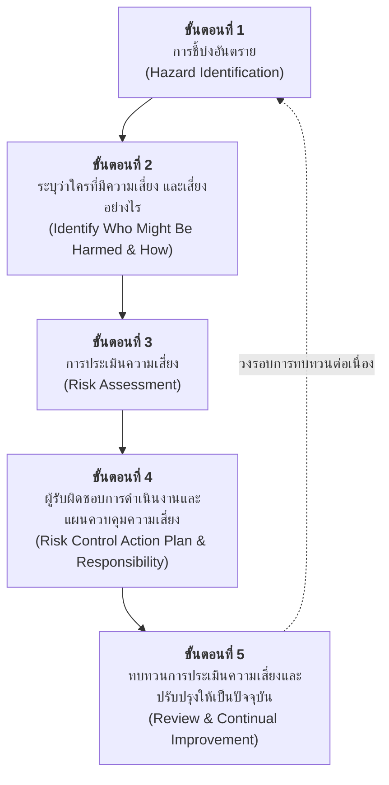
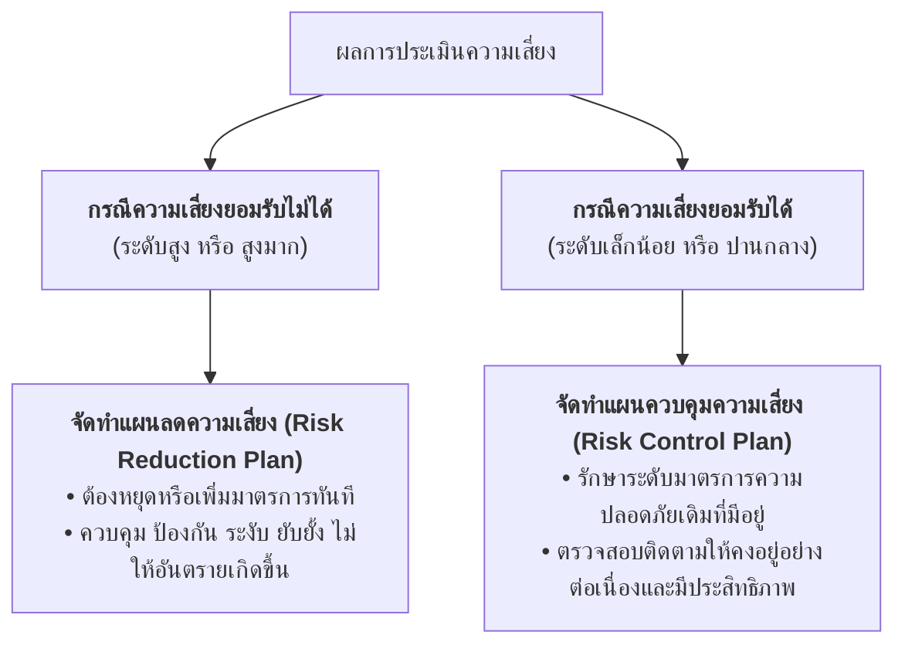
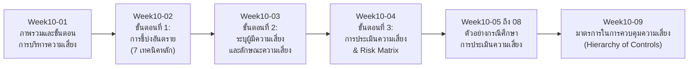

# 10 การบริหารความเสี่ยงในการทำงาน (Occupational Safety and Health Risk Management)

---

## บทนำ (Introduction)

การบริหารความเสี่ยงด้านความปลอดภัย อาชีวอนามัย และสภาพแวดล้อมในการทำงาน เป็นหัวใจสำคัญของการป้องกันอุบัติเหตุและโรคจากการทำงานเชิงรุก (Proactive Approach) ในสถานประกอบกิจการ โดยเปลี่ยนจากการแก้ปัญหาหลังเกิดเหตุ (Reactive) มาเป็นการค้นหาอันตราย วิเคราะห์โอกาสและความรุนแรงเพื่อประเมินความเสี่ยง และกำหนดมาตรการควบคุมป้องกันก่อนที่จะเกิดความสูญเสียต่อชีวิต สุขภาพ และทรัพย์สิน

---

## 10.1 ขั้นตอนหลักในการบริหารความเสี่ยง (Risk Management Process)

กระบวนการบริหารจัดการความเสี่ยงอย่างเป็นระบบ ประกอบด้วย 5 ขั้นตอนสำคัญ ดังนี้

1. **การชี้บ่งอันตราย (Hazard Identification)** 
   ค้นหาและแจกแจงอันตรายที่มีอยู่ทั้งหมดในสถานประกอบกิจการ
2. **ระบุว่าใครที่มีความเสี่ยงและเสี่ยงอย่างไร (Identify Who Might Be Harmed and How)** 
   จำแนกกลุ่มบุคคลที่อาจได้รับผลกระทบจากอันตรายนั้น ๆ
3. **การประเมินความเสี่ยง (Risk Assessment)** 
   วิเคราะห์ความน่าจะเป็น (โอกาสเกิด) ร่วมกับความรุนแรงของผลกระทบ เพื่อจัดระดับความเสี่ยง
4. **ผู้รับผิดชอบการดำเนินงานประเมินและควบคุมความเสี่ยง (Risk Control Action Plan & Responsibility)** 
   กำหนดมาตรการแก้ไข ควบคุม พร้อมผู้รับผิดชอบและกรอบระยะเวลาที่ชัดเจน
5. **ทบทวนการประเมินความเสี่ยงและปรับให้เป็นปัจจุบัน (Review & Update)** 
   ติดตามประเมินผล และทบทวนเมื่อมีการเปลี่ยนแปลงสภาพงานหรือตามรอบระยะเวลา

---

### 10.1.1 ข้อกำหนดทั่วไป (General Requirements)

- **ความแตกต่างของแต่ละสถานประกอบกิจการ:** สถานประกอบกิจการแต่ละแห่งมีลักษณะการดำเนินงาน สภาพแวดล้อม และอันตรายที่แตกต่างกัน การนำระบบจัดการความเสี่ยงไปใช้จึงต้องสอดคล้องกับบริบทเฉพาะขององค์กร
- **การจัดการความเสี่ยงที่ครอบคลุม:** สถานประกอบกิจการต้องดำเนินการจัดการความเสี่ยงให้ครอบคลุมทุกลักษณะอันตรายที่จะเกิดขึ้นกับผู้ปฏิบัติงานและบุคคลที่เกี่ยวข้อง ได้แก่
	1. การชี้บ่งอันตราย (Hazard Identification)
	2. การประเมินความเสี่ยง (Risk Assessment)
	3. การจัดทำแผนจัดการความเสี่ยง (Risk Management Planning)
	4. การติดตามแผนความเสี่ยงและปรับปรุงให้เป็นปัจจุบัน (Monitoring, Review & Updating)

---

## 10.2 การชี้บ่งอันตราย (Hazard Identification)

> **การชี้บ่งอันตราย** หมายถึง กระบวนการค้นหา คัดแยก และแจกแจงองค์ประกอบของสิ่งที่เป็นอันตราย แหล่งกำเนิดอันตราย หรือสภาพการณ์ที่อาจทำให้เกิดอุบัติเหตุ การบาดเจ็บ การเจ็บป่วย หรือความเสียหายต่อทรัพย์สินและสิ่งแวดล้อม

นายจ้างมีหน้าที่ต้องเลือกใช้วิธีการชี้บ่งอันตรายที่เหมาะสม มีประสิทธิภาพ และครอบคลุมทุกมิติของการทำงาน

### 1) ขอบเขตที่ต้องดำเนินการชี้บ่งอันตรายให้ครอบคลุม

การชี้บ่งอันตรายต้องพิจารณาให้ครอบคลุมทั้ง 5 องค์ประกอบพื้นฐานในสถานประกอบกิจการ

| องค์ประกอบ                               | รายละเอียดและตัวอย่าง                                                                                |
| :--------------------------------------- | :--------------------------------------------------------------------------------------------------- |
| **งาน (Tasks)**                          | งานประจำ (Routine Work), งานไม่ประจำ (Non-routine Work), งานซ่อมบำรุง, งานฉุกเฉิน                    |
| **กิจกรรม (Activities)**                 | กิจกรรมย่อยในแต่ละขั้นตอน เช่น  การยกเคลื่อนย้าย, การทำความสะอาด, การขับขี่, การทดสอบระบบ         |
| **กระบวนการ (Processes)**                | ลำดับขั้นตอนการผลิต, กระบวนการขนส่ง, การจัดเก็บสินค้า, ระบบควบคุมการทำงาน                            |
| **วัสดุอุปกรณ์ (Materials & Equipment)** | เครื่องจักร, เครื่องมือกล, เครื่องมือมือถือ, สารเคมีอันตราย, ชิ้นงาน, วัตถุดิบ                       |
| **สภาพพื้นที่ (Workplace Environment)**  | สภาพแวดล้อมทางกายภาพ, แสงสว่าง, เสียงดัง, ความร้อน, ฝุ่นละออง, ทางเดิน, บันได, นั่งร้าน, ที่อับอากาศ |

---

### 2) กลุ่มบุคคลที่ต้องให้ความคุ้มครองความปลอดภัยและอาชีวอนามัย

การประเมินอันตรายและความเสี่ยงต้องคำนึงถึงบุคคลทุกกลุ่มที่มีโอกาสสัมผัสหรือได้รับผลกระทบจากอันตรายในสถานประกอบกิจการ

1. **ลูกจ้าง (Employees)** 
   พนักงานประจำ, ลูกจ้างชั่วคราว, ลูกจ้างรายวัน, พนักงานฝึกหัด
2. **ผู้รับเหมา (Contractors)** 
   พนักงานรับเหมาค่าแรง, ช่างซ่อมบำรุงภายนอก, พนักงานทำความสะอาด, เจ้าหน้าที่รักษาความปลอดภัย, ผู้ให้บริการอาหาร
3. **บุคคลภายนอก (Third Parties / Public)** 
   พนักงานส่งพัสดุ/สินค้า, ผู้สัญจรผ่านพื้นที่, ชุมชนและประชาชนโดยรอบ
4. **ผู้เยี่ยมชม (Visitors)** 
   ลูกค้า, ผู้ตรวจสอบ (Auditors), คณะศึกษาดูงาน, หน่วยงานราชการที่เข้ามาตรวจประเมิน

---

## 10.3 การประเมินความเสี่ยง (Risk Assessment)

### 1) นิยามสำคัญ

- **ความเสี่ยง (Risk)** 
  ระดับของอันตรายที่บ่งบอกว่าผลลัพธ์จากอันตรายนั้นเป็นสิ่งที่ **"ยอมรับได้"** หรือ **"ยอมรับไม่ได้"**
- **การประเมินความเสี่ยง (Risk Assessment)** 
  กระบวนการจัดระดับความเสี่ยงของอันตรายอย่างเป็นรูปธรรม โดยพิจารณาจากความสัมพันธ์ระหว่าง:
	1. **โอกาสที่จะเกิดความสูญเสีย (Likelihood / Probability)**
	2. **ผลของความรุนแรงจากความสูญเสีย (Severity / Consequence)**

$$\text{ค่าระดับความเสี่ยง (Risk Level)} = \text{โอกาสที่จะเกิดความสูญเสีย (L)} \times \text{ระดับความรุนแรงจากความสูญเสีย (S)}$$

---

### 2) การจำแนกและการตัดสินใจต่อระดับความเสี่ยง

การประเมินความเสี่ยงเป็นหน้าที่รับผิดชอบของนายจ้างและคณะทำงาน โดยนำองค์ประกอบของแต่ละอันตรายมาคำนวณและเทียบกับเกณฑ์ยอมรับความเสี่ยง เพื่อแบ่งประเภทและวางแผนจัดการดังต่อไปนี้

| ระดับความเสี่ยง                                     | การแปลผล                                      | แนวทางการจัดการ                                                                                                                                                                  |
| :-------------------------------------------------- | :-------------------------------------------- | :------------------------------------------------------------------------------------------------------------------------------------------------------------------------------- |
| **ความเสี่ยงยอมรับไม่ได้** *(Unacceptable Risk)* | ความเสี่ยงระดับ **สูง** หรือ **สูงมาก**       | • ต้องจัดทำ **"แผนลดความเสี่ยง" (Risk Reduction Plan)** โดยด่วน • เพิ่มมาตรการที่สามารถ ควบคุม ป้องกัน ระงับ หรือยับยั้งองค์ประกอบของอันตรายนั้นให้ลดลงมาสู่ระดับที่ยอมรับได้ |
| **ความเสี่ยงยอมรับได้** *(Acceptable Risk)*      | ความเสี่ยงระดับ **เล็กน้อย** หรือ **ปานกลาง** | • ต้องจัดทำ **"แผนควบคุมความเสี่ยง" (Risk Control Plan)** • ควบคุมและบำรุงรักษามาตรการที่มีอยู่เดิมให้คงประสิทธิภาพอย่างต่อเนื่อง ไม่ให้ความเสี่ยงยกระดับขึ้น                 |

---

## 10.4 การดำเนินการจัดการความเสี่ยงในองค์กร (Risk Management Implementation)

การขับเคลื่อนการบริหารจัดการความเสี่ยงให้ประสบผลสำเร็จอย่างยั่งยืน ต้องอาศัย 4 องค์ประกอบสำคัญ 

1. **จัดตั้งคณะทำงานจัดการความเสี่ยง (Risk Assessment Team)**
   ควรเป็นทีมสหวิชาชีพที่ประกอบด้วยตัวแทนจากหลายฝ่าย ได้แก่ 
   - ผู้บริหารระดับสูง / ผู้แทนฝ่ายบริหาร (Management Representative)
   - เจ้าหน้าที่ความปลอดภัยในการทำงาน (จป.วิชาชีพ / เทคนิค / เทคนิคขั้นสูง)
   - วิศวกร และ ช่างเทคนิค
   - หัวหน้างานประจำพื้นที่ (Supervisors)
   - ตัวแทนผู้ปฏิบัติงานหน้างาน (Operators) ที่มีความคุ้นเคยกับลักษณะงานจริง

1. **จัดทำระเบียบปฏิบัติการ (Standard Operating Procedure  SOP)**
   กำหนดขั้นตอนการปฏิบัติงานที่เป็นลายลักษณ์อักษร เพื่อให้คณะทำงานและผู้บริหารยึดถือปฏิบัติอย่างเป็นมาตรฐานเดียวกัน ครอบคลุม
   - ขั้นตอนการชี้บ่งอันตราย
   - วิธีการและเกณฑ์การประเมินความเสี่ยง
   - การจัดทำและอนุมัติแผนจัดการความเสี่ยง

1. **กำหนดหน้าที่และความรับผิดชอบ (Roles and Responsibilities)**
   มอบหมายบทบาทหน้าที่อย่างชัดเจน ครอบคลุมทุกสายงานและทุกกระบวนการของสถานประกอบกิจการ

2. **ควบคุมดูแลให้เป็นไปตามแผน (Monitoring and Review)**
   - ทบทวนการชี้บ่งอันตราย การประเมินความเสี่ยง และแผนจัดการความเสี่ยงตามรอบระยะเวลาที่กำหนด (อย่างน้อยปีละ 1 ครั้ง หรือเมื่อมีการเปลี่ยนแปลง)
   - เปิดโอกาสให้ **ผู้รับเหมาและลูกจ้าง** มีส่วนร่วมในการชี้บ่งอันตรายและเสนอแนะมาตรการ
   - สื่อสารความเสี่ยง มาตรการควบคุม และแผนปฏิบัติการไปยังลูกจ้าง ผู้เกี่ยวข้อง และผู้มีส่วนได้เสียอย่างทั่วถึง

---

## 10.5 ขั้นตอนและผังการปฏิบัติงานการจัดการความเสี่ยง (Risk Management Workflow)

แผนภาพกระบวนการและตารางแสดงขั้นตอนการปฏิบัติงาน ผู้รับผิดชอบ และเอกสารที่เกี่ยวข้องตามแนวปฏิบัติมาตรฐาน

### ตารางสรุปขั้นตอนการปฏิบัติงานตามผังกระบวนการ

| ลำดับ | ขั้นตอนการปฏิบัติ                                                                                                                                                                                                                                                                        | ผู้รับผิดชอบหลัก                                                                             | เอกสาร / เครื่องมือที่เกี่ยวข้อง                                        |
| :---: | :--------------------------------------------------------------------------------------------------------------------------------------------------------------------------------------------------------------------------------------------------------------------------------------- | :------------------------------------------------------------------------------------------- | :---------------------------------------------------------------------- |
| **1** | **รวบรวมข้อมูลพื้นฐาน** • กฎหมายและมาตรฐานความปลอดภัยที่เกี่ยวข้อง • งานและกิจกรรมทั้งหมดในองค์กร • กระบวนการที่อาจเกิดเหตุการณ์ร้ายแรง • กระบวนการที่มีการควบคุมสั่งการเกี่ยวเนื่อง • กระบวนการที่มีการกำหนดค่าควบคุมต้นแบบ • สิ่ง/อุปกรณ์ที่ต้องวิเคราะห์ความล้มเหลว | • จป.หลัก (วิชาชีพ/เทคนิค/เทคนิคขั้นสูง) • ฝ่ายบุคคล (HR) *(กรณีไม่มี จป.หลัก)*           | ทะเบียนกฎหมาย, ผังกระบวนการผลิต, รายการเครื่องจักร, คู่มือการปฏิบัติงาน |
| **2** | **ชี้บ่งอันตรายด้วยวิธีที่เหมาะสม** เลือกใช้เทคนิคที่สอดคล้องกับลักษณะงาน (เช่น Checklist, JSA, FMEA, FTA, ETA, HAZOP, What-If)                                                                                                                                                       | **คณะทำงาน** ประกอบด้วย-  • จป.หลัก • หัวหน้างาน • ช่าง / วิศวกร • ผู้ปฏิบัติงาน | แบบฟอร์มการชี้บ่งอันตรายของแต่ละวิธี                                    |
| **3** | **ทำการประเมินความเสี่ยง** พิจารณาค่าโอกาสที่จะเกิดความสูญเสีย (Likelihood) และค่าระดับความรุนแรง (Severity) เพื่อจัดทำ Risk Matrix                                                                                                                                                   | คณะทำงานประเมินความเสี่ยง                                                                    | แบบฟอร์มตารางประเมินความเสี่ยง (Risk Assessment Matrix Form)            |
| **4** | **จัดทำแผนจัดการความเสี่ยง** กำหนดมาตรการควบคุมตามลำดับขั้นการควบคุมอันตราย (Hierarchy of Controls) สำหรับความเสี่ยงที่ยอมรับไม่ได้และยอมรับได้                                                                                                                                       | • จป.บริหาร • เจ้าของพื้นที่ (Area Owner)                                                 | เอกสารแผนงานความปลอดภัย และงบประมาณ                                     |
| **5** | **ดำเนินการตามแผนจัดการความเสี่ยง** ลงมือปฏิบัติตามมาตรการ เช่น ติดตั้งอุปกรณ์วิศวกรรม จัดอบรม ปรับปรุงคู่มือ จัดหา PPE                                                                                                                                                               | • จป.บริหาร • เจ้าของพื้นที่ (Area Owner)                                                 | บันทึกการดำเนินงาน, รายงานการปรับปรุง                                   |
| **6** | **ประเมินผลแผนจัดการความเสี่ยง** ติดตามตรวจสอบว่ามาตรการที่นำมาใช้สามารถลดระดับความเสี่ยงลงมาสู่ระดับที่ยอมรับได้จริงหรือไม่                                                                                                                                                          | จป.หลัก                                                                                      | รายงานผลการตรวจติดตามและประเมินประสิทธิผลมาตรการ                        |
| **7** | **ทำการทบทวนความเสี่ยงตามช่วงเวลาที่กำหนด** ทบทวนตามรอบประจำปี หรือเมื่อมีอุบัติเหตุ หรือเมื่อมีการปรับเปลี่ยนกระบวนการ/เครื่องจักรใหม่                                                                                                                                               | คณะทำงานประเมินความเสี่ยง                                                                    | บันทึกการประชุมทบทวนการจัดการความเสี่ยง                                 |

> **หมายเหตุ "จป.หลัก"** หมายถึง เจ้าหน้าที่ความปลอดภัยในการทำงานระดับเทคนิค ระดับเทคนิคขั้นสูง หรือระดับวิชาชีพ ตามที่กฎหมายกำหนด

---

## 10.6 แผนผังเนื้อหาการเรียนรู้ในสัปดาห์ที่ 10 (Weekly Roadmap)

เพื่อทำความเข้าใจในรายละเอียดเชิงลึกของแต่ละขั้นตอน สามารถศึกษาเนื้อหาตามลำดับเอกสารได้ดังนี้ 

- **[Week10-02 ขั้นตอนที่ 1 การชี้บ่งอันตราย](file:///d:/GitHubRepos/__ENGEDU/OHS_2569/Week-10/Week10-02_Step_1.md):** ศึกษาเทคนิคการชี้บ่งอันตราย เช่น Checklist, JSA, FMEA, FTA, ETA, HAZOP และ What-If
- **[Week10-03 ขั้นตอนที่ 2 การระบุผู้ที่มีความเสี่ยงและระดับความเสี่ยง](file:///d:/GitHubRepos/__ENGEDU/OHS_2569/Week-10/Week10-03_Step_2.md):** การจำแนกกลุ่มบุคคลและวิเคราะห์ความเสี่ยงรายบุคคล
- **[Week10-04 ขั้นตอนที่ 3 การประเมินความเสี่ยง](file:///d:/GitHubRepos/__ENGEDU/OHS_2569/Week-10/Week10-04_Step_3.md):** เกณฑ์การให้คะแนนโอกาส ความรุนแรง และการใช้ตารางเมทริกซ์ความเสี่ยง
- **[Week10-05 ตัวอย่างกรณีศึกษาการประเมินความเสี่ยง (ล้อหินเจียรหลุด)](file:///d:/GitHubRepos/__ENGEDU/OHS_2569/Week-10/Week10-05_Step_3_Ex_1.md)**
- **[Week10-09 มาตรการในการควบคุมความเสี่ยง](file:///d:/GitHubRepos/__ENGEDU/OHS_2569/Week-10/Week10-09.md):** ลำดับขั้นการควบคุมความเสี่ยง 6 ลำดับ (Hierarchy of Controls) และการเฝ้าระวังด้านอาชีวอนามัย
