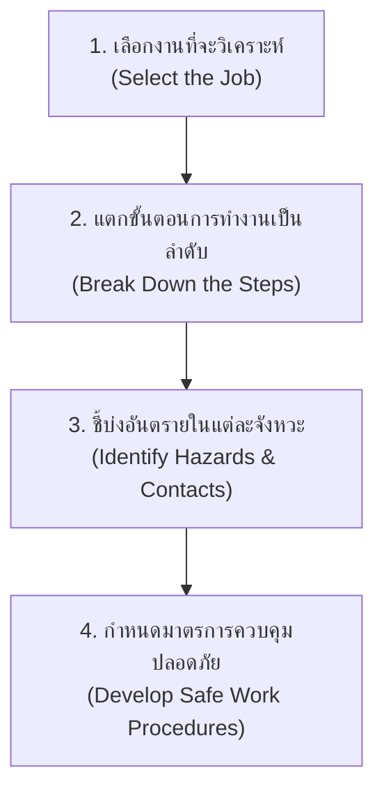
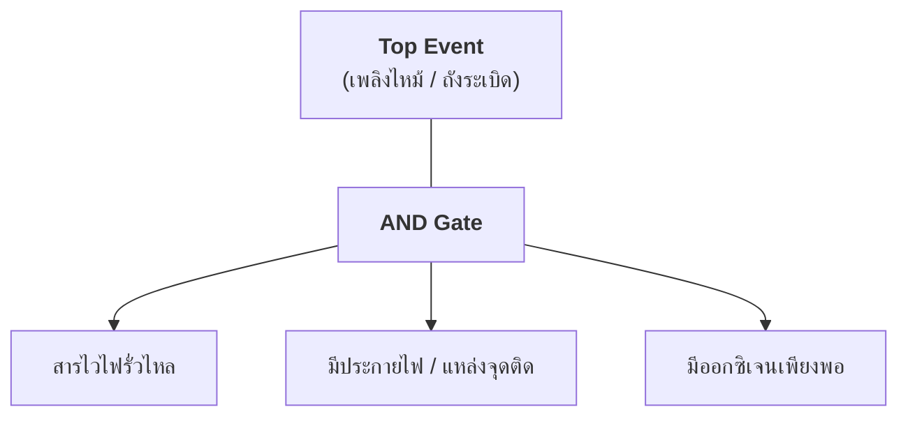
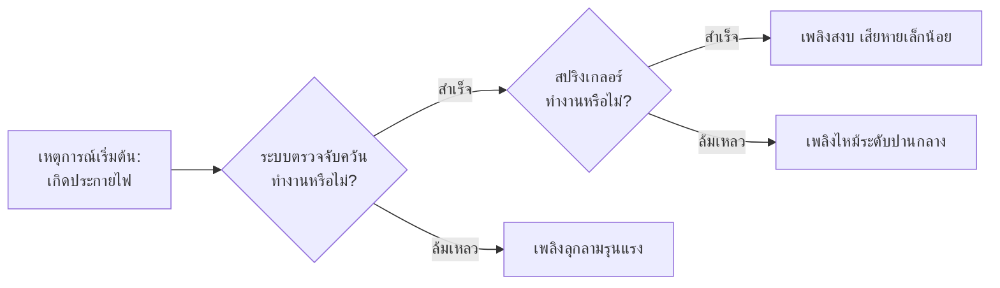

# การชี้บ่งอันตราย (Hazard Identification)
## ขั้นตอนที่ 1 การชี้บ่งอันตรายด้านความปลอดภัย อาชีวอนามัย และสภาพแวดล้อมในการทำงาน

---

## 1. บทนำและแนวคิดพื้นฐาน

การชี้บ่งอันตรายถือเป็น **"ก้าวแรกที่สำคัญที่สุด"** ในกระบวนการบริหารจัดการความเสี่ยง เพราะหากองค์กรไม่สามารถมองเห็น ค้นหา หรือระบุอันตรายที่มีอยู่ได้อย่างครบถ้วน อันตรายที่ตกหล่นไปเหล่านั้นก็จะไม่ถูกนำไปประเมินความเสี่ยงและไม่มีมาตรการควบคุมป้องกัน ซึ่งอาจกลายเป็นสาเหตุของอุบัติเหตุร้ายแรงหรือโรคจากการทำงานในอนาคต

ตามแนวปฏิบัติและคู่มือการจัดการความเสี่ยงด้านความปลอดภัย อาชีวอนามัย และสภาพแวดล้อมในการทำงาน ได้กำหนดแนวทางการปฏิบัติในการชี้บ่งอันตรายขั้นพื้นฐานไว้ **7 วิธีหลัก** ดังนี้

---

## 2. สรุปแนวทางการปฏิบัติและประโยชน์ของ 7 วิธีการชี้บ่งอันตราย

| ลำดับที่ | แนวทาง / เครื่องมือ | ประโยชน์และการนำไปใช้ |
| :---: | :--- | :--- |
| **1** | **Checklist** (แบบสำรวจ / แบบตรวจสอบ) | มีประสิทธิภาพสำหรับใช้ในการชี้บ่งว่าสถานประกอบกิจการได้บริหาร จัดการ และดำเนินการเป็นไปตาม**กฎหมายและมาตรฐานความปลอดภัย**อย่างถูกต้องครบถ้วนหรือไม่ |
| **2** | **Job Safety Analysis (JSA)** (การวิเคราะห์ความปลอดภัยในงาน) | มีประสิทธิภาพสำหรับใช้ในการชี้บ่งด้วยการวิเคราะห์ว่าใน**แต่ละจังหวะของการทำงาน** คนทำงานจะสัมผัสกับสิ่งอันตรายอะไร จนทำให้บาดเจ็บ เสียชีวิต หรือทรัพย์สินเสียหายหรือไม่ |
| **3** | **Failure Mode and Effect Analysis (FMEA)** (การวิเคราะห์ลักษณะข้อบกพร่องและผลกระทบ) | มีประสิทธิภาพสำหรับใช้ในการชี้บ่งด้วยการวิเคราะห์ว่า**แต่ละอุปกรณ์ แต่ละสิ่ง แต่ละเรื่อง** จะมีลักษณะของความล้มเหลวอย่างไรบ้าง ผลของความล้มเหลว และสาเหตุที่ทำให้ล้มเหลว |
| **4** | **Fault Tree Analysis (FTA)** (การวิเคราะห์แผนภูมิต้นไม้ความผิดพลาด) | มีประสิทธิภาพสำหรับใช้ในการชี้บ่งด้วยการวิเคราะห์ถอยหลังว่า**เหตุการณ์ร้ายแรงที่กำหนดขึ้น (Top Event)** จะเกิดขึ้นได้ด้วยสาเหตุใดบ้าง โดยใช้หลักตรรกะ |
| **5** | **Event Tree Analysis (ETA)** (การวิเคราะห์แผนภูมิต้นไม้เหตุการณ์) | มีประสิทธิภาพสำหรับใช้ในการชี้บ่งด้วยการวิเคราะห์ว่า กระบวนการที่ออกแบบไว้ให้มีหน้าที่**ควบคุมสั่งการเกี่ยวเนื่อง** ว่าจะมีสาเหตุใดที่ทำให้ความเกี่ยวเนื่องขั้นตอนใดทำงานไม่สำเร็จ |
| **6** | **Hazard and Operability Studies (HAZOP)** (การศึกษาอันตรายและความสามารถในการปฏิบัติการ) | มีประสิทธิภาพสำหรับใช้ในการชี้บ่งด้วยการศึกษาว่า**ถ้าเกิดการเบี่ยงเบนไปจากค่าควบคุมต้นแบบ** (Design Intent) จะเกิดผลกระทบอะไรขึ้น และเกิดจากสาเหตุใด |
| **7** | **What-If Analysis** (การวิเคราะห์แบบ "ถ้าหากว่า...") | ใช้ในการระดมสมองและ**จัดทำทะเบียนคำถามเชิงสมมุติฐาน** เพื่อส่งต่อให้วิธีชี้บ่งอันตรายอื่นที่เหมาะสมนำไปวิเคราะห์ในรายละเอียดต่อไป |

---

## 3. รายละเอียดเชิงลึกของแต่ละเทคนิคการชี้บ่งอันตราย

### 3.1 วิธีที่ 1: Checklist (แบบสำรวจและตรวจสอบตามกฎหมาย/มาตรฐาน)

**Checklist** เป็นเครื่องมือชี้บ่งอันตรายที่ได้จากการสังเคราะห์ข้อกำหนดตามกฎหมายความปลอดภัย อาชีวอนามัย และมาตรฐานทางวิศวกรรมที่บังคับใช้กับสถานประกอบกิจการ

- **หน้าที่ของ จป.หลัก และผู้เกี่ยวข้อง**
  1. รวบรวมกฎหมายและมาตรฐานที่เกี่ยวข้องกับองค์กร (เช่น กฎกระทรวงว่าด้วยเครื่องจักร ปั้นจั่น หม้อน้ำ, งานก่อสร้าง, สารเคมีอันตราย, ไฟฟ้า ฯลฯ)
  2. จัดทำตารางข้อกำหนด พร้อมระบุแหล่งที่มา
  3. ตรวจสอบสภาพจริงในหน้างาน และบันทึกผลลงในตาราง
     - **ใช่ (Yes)** 
       ปฏิบัติถูกต้อง ครบถ้วนตามมาตรฐานแล้ว
     - **ไม่ใช่ (No)** 
       ยังไม่ปฏิบัติ หรือปฏิบัติไม่ครบถ้วน (ถือเป็นสภาพอันตรายที่ต้องแก้ไข)
     - **ไม่เกี่ยวข้อง (N/A)** 
       สถานประกอบการไม่มีกิจกรรมหรืออุปกรณ์นั้น
  4. กรณีทำเครื่องหมายในช่อง **"ไม่ใช่"** ต้องมอบหมายผู้รับผิดชอบ (จป.หลัก, ผู้ชำนาญการ, หัวหน้างาน) พร้อมกำหนดระยะเวลาแก้ไขให้ชัดเจน

---

### 3.2 วิธีที่ 2: Job Safety Analysis - JSA (การวิเคราะห์ความปลอดภัยในงาน)

**JSA** เป็นเทคนิคการวิเคราะห์ความปลอดภัยในระดับขั้นตอนการทำงาน (Task/Job Level) นิยมใช้โดยหัวหน้างานร่วมกับผู้ปฏิบัติงาน เพื่อค้นหาอันตรายในแต่ละจังหวะการเคลื่อนไหวของการทำงาน

- **4 ขั้นตอนหลักในการจัดทำ JSA**
  1. **เลือกงานที่จะวิเคราะห์ (Select the Job)** 
     คัดเลือกงานที่มีสถิติอุบัติเหตุสูง งานอันตราย งานที่มีขั้นตอนซับซ้อน หรืองานที่กำลังจะเริ่มทำใหม่
  2. **แตกขั้นตอนการทำงาน (Break Down the Job)** 
     แบ่งงานออกเป็นขั้นตอนย่อยตามลำดับเวลา (โดยทั่วไปไม่ควรเกิน 10-15 ขั้นตอน)
  3. **ชี้บ่งอันตรายในแต่ละขั้นตอน (Identify Potential Hazards)** 
     พิจารณาว่าในจังหวะการทำงาน ผู้ปฏิบัติงานอาจสัมผัสกับอันตรายในลักษณะใด
  4. **กำหนดมาตรการแก้ไขและป้องกัน (Develop Preventive Measures)** 
     กำหนดวิธีปฏิบัติงานที่ปลอดภัย มาตรการวิศวกรรม หรืออุปกรณ์คุ้มครองความปลอดภัยส่วนบุคคล

#### ลักษณะอันตรายและกลไกการบาดเจ็บที่พบบ่อยในการทำ JSA
- **กระแทก / ชน (Struck By / Struck Against)** 
  ชิ้นงานหลุดกระเด็น, รถยกชน, ชนโครงสร้าง
- **หนีบ / บีบ / อัด / ทับ (Caught In / On / Between)** 
  จุดหมุนเครื่องจักร, ล้อสายพาน, วัสดุล้มทับ
- **บาด / ตัด / เฉือน / ฉีก (Cut / Sever / Puncture)** 
  ใบเลื่อย, เศษแก้ว, คมโลหะ
- **ทิ่ม / แทง / เจาะ (Pierce / Puncture)** 
  ตะปู, เข็ม, ลวดสลิง
- **ตก / ล้ม (Fall to Below / Fall on Same Level)** 
  ตกจากที่สูง, ลื่นสะดุดพื้นราบ
- **สัมผัสสิ่งอันตราย (Contact With)** 
  ไฟฟ้าช็อต, ความร้อน/ไฟลวก, สารเคมีกัดกร่อน

---

### 3.3 วิธีที่ 3: Failure Mode and Effect Analysis - FMEA (การวิเคราะห์ลักษณะข้อบกพร่องและผลกระทบ)

**FMEA** มุ่งเน้นการวิเคราะห์ความน่าเชื่อถือและความปลอดภัยของ **"เครื่องจักร อุปกรณ์ และระบบวิศวกรรม"**

- **กรอบการวิเคราะห์ 3 มิติสำคัญ**
  1. **ลักษณะความล้มเหลว (Failure Mode)** 
     อุปกรณ์นั้นจะชำรุด เสียหาย หรือล้มเหลวในลักษณะใดได้บ้าง? (เช่น แตก, หัก, รั่ว, ตัน, ไฟฟ้าลัดวงจร, เซ็นเซอร์ไม่ส่งสัญญาณ)
  2. **ผลกระทบของความล้มเหลว (Failure Effect)** 
     เมื่อเกิดความล้มเหลวนั้นแล้ว จะส่งผลกระทบต่อเนื่องต่อระบบ คน และสิ่งแวดล้อมอย่างไร? (เช่น ก๊าซพิษรั่วไหล, เครื่องจักรโอเวอร์ฮีท, ระบบตัดไฟฉุกเฉินไม่ทำงาน)
  3. **สาเหตุของความล้มเหลว (Failure Cause)** 
     ความล้มเหลวนั้นเกิดจากอะไร? (เช่น ความล้าของวัสดุ, ขาดการหล่อลื่น, การกัดกร่อน, ติดตั้งผิดพลาด)

---

### 3.4 วิธีที่ 4: Fault Tree Analysis - FTA (การวิเคราะห์แผนภูมิต้นไม้ความผิดพลาด)

**FTA** เป็นเทคนิคการวิเคราะห์เชิงตรรกะแบบ **บนลงล่าง (Top-Down / Deductive Approach)** 

- **หลักการทำงาน**
  - กำหนด **เหตุการณ์ร้ายแรงสูงสุด (Top Event)** ที่ไม่ต้องการให้เกิดขึ้นไว้ด้านบนสุด (เช่น เกิดเพลิงไหม้ถังเก็บน้ำมัน, หม้อน้ำระเบิด)
  - วิเคราะห์ถอยหลังลงมาทีละชั้น เพื่อหาเหตุการณ์ร่วมและสาเหตุรากเหง้า (Basic Events)
  - เชื่อมโยงความสัมพันธ์ของเหตุการณ์ด้วยสัญลักษณ์ทางตรรกะ (Logic Gates)
    - **AND Gate:** เหตุการณ์ขั้นบนจะเกิดได้ ก็ต่อเมื่อเหตุการณ์ย่อยด้านล่าง **ต้องเกิดขึ้นพร้อมกันทั้งหมด**
    - **OR Gate:** เหตุการณ์ขั้นบนจะเกิดได้ หากมีเหตุการณ์ย่อยด้านล่าง **เพียงเหตุการณ์ใดเหตุการณ์หนึ่งเกิดขึ้น**

---

### 3.5 วิธีที่ 5: Event Tree Analysis - ETA (การวิเคราะห์แผนภูมิต้นไม้ของเหตุการณ์)

**ETA** เป็นเทคนิคการวิเคราะห์แบบ **เหตุไปหาผล (Bottom-Up / Inductive Approach)** โดยมุ่งเน้นไปที่ระบบสั่งการเกี่ยวเนื่องหรือระบบป้องกันตามลำดับชั้น

- **หลักการทำงาน**
  - เริ่มต้นจาก **เหตุการณ์ตั้งต้น (Initiating Event)** เช่น เกิดไฟไหม้ หรือปั๊มสูบน้ำดับเพลิงหยุดทำงาน
  - พิจารณาว่าระบบป้องกันหรือการตอบสนองต่อเหตุฉุกเฉินในขั้นตอนถัดมา ทำงาน **สำเร็จ (Success)** หรือ **ล้มเหลว (Failure)**
  - เส้นทางของการวิเคราะห์จะแตกแขนงเป็นกิ่งก้าน (Tree) จนนำไปสู่ผลลัพธ์สุดท้าย (Consequences) ที่แตกต่างกัน จากเบาไปหาหนัก

---

### 3.6 วิธีที่ 6: Hazard and Operability Studies - HAZOP (การศึกษาอันตรายและความสามารถในการปฏิบัติการ)

**HAZOP** เป็นเทคนิคการวิเคราะห์เชิงลึกที่ใช้ในอุตสาหกรรมกระบวนการผลิต (Process Industries) เช่น ปิโตรเคมี โรงกลั่น และสารเคมี

- **หลักการทำงาน**
  - ทีมงานผู้เชี่ยวชาญจะวิเคราะห์แต่ละจุดของระบบ (Nodes) โดยตรวจสอบตัวแปรกระบวนการ (Parameters)
  - นำ **คำช่วยชี้นำ (Guide Words)** มาจับคู่กับ **ตัวแปรกระบวนการ (Process Parameters)** เพื่อค้นหาความเบี่ยงเบน (Deviation) จากสภาวะปกติที่ออกแบบไว้

$$\text{คำช่วยชี้นำ (Guide Words)} + \text{ตัวแปรควบคุม (Parameters)} = \text{ความเบี่ยงเบน (Deviation)}$$

| คำช่วยชี้นำ (Guide Words) | ตัวอย่างตัวแปร (Parameters) | ความเบี่ยงเบน (Deviation) | ตัวอย่างสาเหตุที่อาจเกิดขึ้น |
| :--- | :--- | :--- | :--- |
| **No / None** (ไม่มี) | Flow (การไหล) | No Flow (ไม่มีการไหล) | วาล์วปิดตาย, ท่ออุดตัน, ปั๊มชำรุด |
| **More** (มากกว่า) | Pressure (ความดัน) | High Pressure (ความดันสูงเกิน) | วาล์วระบายแรงดันขัดข้อง, ปฏิกิริยาร้อนเกิน |
| **Less** (น้อยกว่า) | Temperature (อุณหภูมิ) | Low Temperature (อุณหภูมิต่ำเกิน) | ระบบทำความร้อนดับ, สารเกิดการแข็งตัว |
| **Reverse** (ย้อนกลับ) | Flow (การไหล) | Reverse Flow (การไหลย้อนกลับ) | เช็ควาล์ว (Check Valve) รั่ว |
| **As Well As** (มีส่วนอื่นปน) | Composition (ส่วนประกอบ) | Contamination (มีสิ่งแปลกปลอม) | น้ำรั่วซึมผสมในสารเคมี, สารตัวทำละลายปนเปื้อน |

---

### 3.7 วิธีที่ 7: What-If Analysis (การวิเคราะห์แบบ "ถ้าหากว่า...")

**What-If Analysis** เป็นวิธีระดมความคิดเห็นอย่างอิสระ (Brainstorming) ของทีมงานที่มีประสบการณ์ในการทำงานร่วมกัน

- **แนวทางการปฏิบัติ**
  - ทีมงานร่วมกันตั้งคำถามเชิงสมมุติฐานที่ขึ้นต้นด้วยคำว่า **"จะเกิดอะไรขึ้น ถ้าหากว่า... (What if...?)"**
  - เช่น: *"จะเกิดอะไรขึ้น ถ้าหากไฟฟ้าดับขณะกำลังกวนสารเคมี?"*, *"จะเกิดอะไรขึ้น ถ้าพนักงานเปิดวาล์วผิดตัว?"*
  - นำข้อคิดเห็นและทะเบียนคำถามที่ได้ไปประเมินว่ามีมาตรการป้องกันรองรับไว้แล้วหรือไม่ หากยังไม่มีหรือเป็นประเด็นที่มีความซับซ้อนสูง จะส่งต่อไปวิเคราะห์ต่อด้วยเทคนิคอื่น เช่น HAZOP หรือ FMEA

---

## 4. แนวทางการเลือกใช้วิธีชี้บ่งอันตรายที่เหมาะสม (Selection Criteria)

สถานประกอบกิจการไม่จำเป็นต้องใช้ทุกวิธีกับทุกงาน แต่ควรเลือกใช้ให้เหมาะสมกับลักษณะของงานและระดับความเสี่ยง ดังนี้

| ลักษณะงาน / กิจกรรม | วิธีชี้บ่งอันตรายที่เหมาะสม | เหตุผลในการเลือก |
| :--- | :---: | :--- |
| • งานที่ต้องปฏิบัติตามกฎหมายและมาตรฐานโรงงานทั่วไป | **Checklist** | ตรวจสอบความสอดคล้องทางกฎหมายได้รวดเร็วและครอบคลุม |
| • งานประจำ งานผลิต งานซ่อมบำรุง งานช่าง | **JSA** | เห็นจังหวะการทำงานและการเคลื่อนไหวของคนชัดเจน |
| • เครื่องจักรกล อุปกรณ์ไฟฟ้า ระบบความปลอดภัย | **FMEA** | ป้องกันความล้มเหลวของชิ้นส่วนและเครื่องมือก่อนเกิดเหตุ |
| • กระบวนการผลิตทางเคมี ท่อส่งน้ำมัน ก๊าซ | **HAZOP** | ตรวจจับการเบี่ยงเบนของความดัน อุณหภูมิ และการไหล |
| • โรงงานที่มีความเสี่ยงต่ออุบัติภัยร้ายแรง (Major Hazard) | **FTA / ETA** | วิเคราะห์สาเหตุรากเหง้าและลำดับเหตุการณ์ฉุกเฉิน |
| • การเริ่มโครงการใหม่ หรือการปรับเปลี่ยนกระบวนการ | **What-If** | ระดมความคิดเห็นเบื้องต้นเพื่อค้นหาจุดบกพร่องที่คาดไม่ถึง |

---

## 5. การส่งต่อผลลัพธ์สู่ขั้นตอนถัดไป

เมื่อดำเนินการชี้บ่งอันตรายครบถ้วนแล้ว ผลลัพธ์ที่ได้คือ **"ทะเบียนอันตราย" (Hazard Register)** ซึ่งจะถูกนำไปใช้ต่อใน

1. **[Week10-03 ขั้นตอนที่ 2: การระบุผู้ที่มีความเสี่ยงและระดับความเสี่ยง](file:///d:/GitHubRepos/__ENGEDU/OHS_2569/Week-10/Week10-03_Step_2.md):** ระบุว่าอันตรายที่ชี้บ่งได้นั้นส่งผลกระทบต่อใครบ้าง (ลูกจ้าง, ผู้รับเหมา, บุคคลภายนอก, ผู้เยี่ยมชม)
2. **[Week10-04 ขั้นตอนที่ 3: การประเมินความเสี่ยง (Risk Assessment)](file:///d:/GitHubRepos/__ENGEDU/OHS_2569/Week-10/Week10-04_Step_3.md):** นำอันตรายมาให้คะแนนโอกาส (L) และความรุนแรง (S) เพื่อจัดระดับความเสี่ยงในตารางเมทริกซ์ต่อไป
