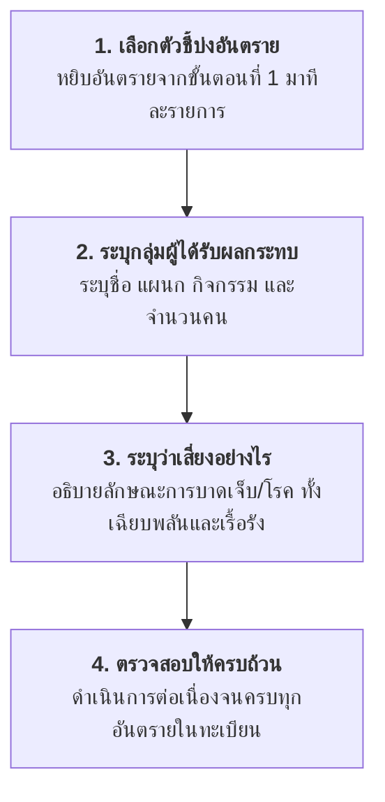

# การบริหารความเสี่ยงในการทำงาน
## ขั้นตอนที่ 2 การระบุผู้ที่มีความเสี่ยงและระดับความเสี่ยง (Identify Who Might Be Harmed and How)

---

## 1. บทนำและความสำคัญ

หลังจากเสร็จสิ้นขั้นตอนที่ 1 ในการชี้บ่งว่า "มีอันตรายอะไรบ้างอยู่ในสถานที่ทำงาน" แล้ว ขั้นตอนถัดมาที่มีความสำคัญอย่างยิ่งคือ **"การระบุว่าอันตรายนั้นจะส่งผลกระทบต่อใครบ้าง และจะทำให้พวกเขาได้รับอันตรายอย่างไร"**

การระบุผู้ที่มีความเสี่ยงอย่างชัดเจนจะช่วยให้
- ทราบกลุ่มเป้าหมายที่แท้จริงในการกำหนดมาตรการควบคุมความปลอดภัย
- สามารถออกแบบมาตรการป้องกันที่ตรงกับลักษณะการทำงานและระดับการสัมผัส (Exposure)
- ให้ความคุ้มครองครอบคลุมทุกกลุ่มบุคคล ไม่จำกัดเฉพาะพนักงานประจำเท่านั้น
- ช่วยในการจัดลำดับความสำคัญตามจำนวนผู้สัมผัสและความรุนแรงของผลกระทบ

---

## 2. ใครบ้างที่มีความเสี่ยงจากการปฏิบัติงาน

ในสถานประกอบกิจการ บุคคลที่อาจได้รับผลกระทบจากอันตรายไม่ได้มีเฉพาะลูกจ้างประจำ แต่ครอบคลุมถึง 4 กลุ่มบุคคลหลัก และกลุ่มเปราะบางพิเศษ ดังนี้

| กลุ่มที่ | ประเภทบุคคล                              | คำอธิบายและตัวอย่าง                                                                                                                                                                   |
| :------: | :--------------------------------------- | :------------------------------------------------------------------------------------------------------------------------------------------------------------------------------------ |
|  **1**   | **ลูกจ้าง (Employees)**                  | • พนักงานประจำ (บรรจุ) • ลูกจ้างรายวัน / ลูกจ้างชั่วคราว • ลูกจ้างเข้าทำงานใหม่ (ซึ่งมีความเสี่ยงสูงเนื่องจากยังขาดทักษะและความคุ้นเคย)                                         |
|  **2**   | **ผู้รับเหมา (Contractors)**             | • พนักงานทำความสะอาด สังกัดบริษัทผู้รับเหมาบริการ • พนักงานรักษาความปลอดภัย (รปภ.) • ผู้รับเหมางานซ่อมบำรุงและติดตั้งเครื่องจักร • ผู้ค้าและพนักงานในโรงอาหาร                |
|  **3**   | **บุคคลภายนอก (Third Parties / Public)** | • พนักงานขับรถส่งสินค้า / ขนส่งวัตถุดิบ • บุคคลที่สัญจรไปมาตามเส้นทางหรือบริเวณใกล้เคียงสถานประกอบการ • ชุมชนและประชาชนรอบข้าง (กรณีเกิดสารเคมีรั่วไหล เพลิงไหม้ หรือมลพิษ)     |
|  **4**   | **ผู้เยี่ยมชม (Visitors)**               | • คณะครูและนักเรียน/นักศึกษาที่เข้ามาทัศนศึกษาหรือศึกษาดูงาน • ลูกค้าและตัวแทนจำหน่ายที่เข้าอบรม/เยี่ยมชมกระบวนการผลิต • ผู้ตรวจประเมิน (Auditors) และเจ้าหน้าที่หน่วยงานราชการ |

---

### กลุ่มเปราะบางพิเศษที่ต้องคำนึงถึงเป็นพิเศษ (Vulnerable Groups)

นอกจาก 4 กลุ่มข้างต้นแล้ว คณะทำงานประเมินความเสี่ยงต้องให้ความใส่ใจต่อผู้ปฏิบัติงานที่มีข้อจำกัดเฉพาะตัว ได้แก่

- **ลูกจ้างเข้าทำงานใหม่และนักศึกษาฝึกงาน** 
  มักมีอัตราการประสบอุบัติเหตุสูงเนื่องจากยังขาดประสบการณ์ ความชำนาญ และการรับรู้ถึงอันตรายแฝง
- **สตรีมีครรภ์และมารดาให้นมบุตร** 
  มีความไวรับต่อสารเคมีอันตรายที่อาจส่งผลกระทบต่อพัฒนาการของทารกในครรภ์ รวมถึงข้อจำกัดในการยกเคลื่อนย้ายของหนักและงานที่ต้องยืนเป็นเวลานาน
- **คนพิการหรือผู้มีข้อจำกัดทางกายภาพ** 
  อาจต้องการสิ่งอำนวยความสะดวกเฉพาะ และต้องการแผนอพยพหนีไฟฉุกเฉินที่มีผู้ช่วยเหลือประกบเป็นพิเศษ
- **แรงงานต่างด้าว** 
  อาจมีอุปสรรคด้านภาษาและการสื่อสาร ทำให้ไม่เข้าใจป้ายเตือน เอกสารความปลอดภัย หรือคู่มือปฏิบัติงาน

---

## 3. ขั้นตอนการระบุความเสี่ยงอย่างเป็นระบบ

การระบุผู้มีความเสี่ยงและลักษณะความเสี่ยง มีลำดับการปฏิบัติตามแนวทางมาตรฐาน 4 ขั้นตอน ดังนี้

1. **หยิบตัวชี้บ่งอันตรายมา 1 ตัวชี้**
   นำรายการอันตรายที่ได้จากการชี้บ่งในขั้นตอนที่ 1 (เช่น จาก Checklist, JSA, FMEA ฯลฯ) ขึ้นมาพิจารณาทีละหัวข้อ

2. **ระบุว่าตัวชี้นั้นส่งผลต่อใครบ้าง**
   - ระบุชื่อ ตำแหน่งงาน ส่วนงาน หรือลักษณะกิจกรรมของกลุ่มบุคคลที่ต้องสัมผัสอันตราย
   - **ระบุจำนวนบุคคลในแต่ละกลุ่ม (ถ้าเป็นไปได้)** 
     เพื่อช่วยให้เห็นขนาดของปัญหาและความเร่งด่วนในการป้องกัน

3. **ระบุว่าผู้นั้นมีความเสี่ยงอย่างไร**
   - อธิบายกลไกที่อันตรายจะเข้าสู่ร่างกายหรือก่อให้เกิดความเสียหาย (เช่น สูดดม สัมผัสทางผิวหนัง ถูกหนีบ ตกจากที่สูง)
   - ระบุผลกระทบต่อสุขภาพทั้ง **ระยะสั้น (เฉียบพลัน)** เช่น แสบตา ระคายเคือง บาดแผลกระแทก และ **ระยะยาว (เรื้อรัง)** เช่น โรคปอด หูตึง มะเร็ง

4. **ทยอยทำทีละข้อจนครบ**
   ดำเนินการตามขั้นตอนที่ 1 - 3 ซ้ำกับทุกอันตรายที่มีการตรวจพบในสถานประกอบกิจการ

---

## 4. ตัวอย่างแบบฟอร์มและกรณีศึกษา

แบบฟอร์มการบันทึกข้อมูลขั้นตอนที่ 2 และการเชื่อมโยงกับขั้นตอนอื่น ๆ ในกระบวนการจัดการความเสี่ยง

### ตารางถอดรหัสตัวอย่าง: กรณีศึกษา "การสัมผัสฝุ่นไม้"

| ขั้นตอนที่ 1 อะไรที่เป็นอันตราย | ขั้นตอนที่ 2 ใครที่มีความเสี่ยง และเสี่ยงอย่างไร | ขั้นตอนที่ 3 มาตรการควบคุมที่มีอยู่แล้ว (ถ้ามี) | ขั้นตอนที่ 3 มาตรการควบคุมที่ต้องเพิ่ม | ขั้นตอนที่ 4 ชื่อผู้รับผิดชอบ | ขั้นตอนที่ 4 กำหนดเสร็จตามแผน | ขั้นตอนที่ 4 เสร็จจริง |
| :--- | :--- | :--- | :--- | :--- | :--- | :--- |
| **การสัมผัสฝุ่นไม้** | **ใครมีความเสี่ยง:** • ลูกจ้างทุกคนในโรงงาน (35 คน) • โดยเฉพาะลูกจ้างที่ปฏิบัติงานกับเครื่องตัดไม้ (15 คน) ซึ่งเป็นกลุ่มเสี่ยงสูง  **เสี่ยงอย่างไร:** • เสี่ยงต่อการเป็นโรคปอด เช่น โรคหอบหืดจากการหายใจสูดดมฝุ่นไม้สะสม • ฝุ่นไม้บางชนิดมีสารก่อมะเร็ง มีโอกาสก่อให้เกิดมะเร็งโพรงจมูกและระบบทางเดินหายใจ | *(นำไปประเมินในขั้นตอนที่ 3)* | *(กำหนดมาตรการเพิ่มเติมในขั้นตอนที่ 3)* | *(ระบุในขั้นตอนที่ 4)* | *(ระบุในขั้นตอนที่ 4)* | *(ระบุในขั้นตอนที่ 4)* |

#### สาระสำคัญที่ได้จากกรณีศึกษาตัวอย่าง
1. **การแยกแยะความต่างของระดับการสัมผัส:** แม้ลูกจ้างทุกคน (35 คน) จะอยู่ในพื้นที่ที่มีฝุ่นไม้ แต่พนักงานประจำเครื่องตัดไม้ (15 คน) มีระดับการสัมผัสใกล้ชิดและเข้มข้นกว่า จึงต้องจัดให้เป็น **"กลุ่มเสี่ยงสูง"** ที่ต้องการมาตรการควบคุมทางวิศวกรรมเฉพาะจุด (Local Exhaust Ventilation) และหน้ากากกรองอนุภาคที่เหมาะสม
2. **การระบุผลกระทบต่อสุขภาพที่ชัดเจน:** ระบุทั้งอาการทางเดินหายใจเบื้องต้น (หอบหืด) และโรคร้ายแรงระยะยาว (มะเร็งโพรงจมูก) ซึ่งจะส่งผลโดยตรงต่อการให้คะแนนค่าความรุนแรง (Severity) ในขั้นตอนการประเมินความเสี่ยงถัดไป

---

## 5. การส่งต่อผลลัพธ์สู่ขั้นตอนถัดไป

เมื่อระบุกลุ่มผู้มีความเสี่ยงและลักษณะของความสูญเสียครบถ้วนแล้ว ข้อมูลทั้งหมดจะถูกส่งต่อไปยัง:

- **[Week10-04 ขั้นตอนที่ 3: การประเมินความเสี่ยง (Risk Assessment)](file:///d:/GitHubRepos/__ENGEDU/OHS_2569/Week-10/Week10-04_Step_3.md)** เพื่อนำข้อมูลลักษณะความเสี่ยงและมาตรการที่มีอยู่เดิม ไปพิจารณาให้คะแนนค่าโอกาสที่จะเกิด (Likelihood) และค่าระดับความรุนแรง (Severity) เพื่อคำนวณระดับความเสี่ยงในตาราง Risk Matrix ต่อไป
