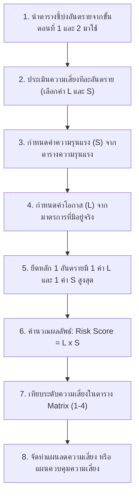

# การบริหารความเสี่ยงในการทำงาน
## ขั้นตอนที่ 3 การประเมินความเสี่ยง (Risk Assessment)

---

## 1. บทนำและหลักการประเมินความเสี่ยง

การประเมินความเสี่ยงเป็นกระบวนการเปรียบเทียบและจัดระดับของอันตรายอย่างเป็นรูปธรรม เพื่อให้ทราบว่าอันตรายใดเป็น **ความเสี่ยงที่ยอมรับได้** หรือ **ความเสี่ยงที่ยอมรับไม่ได้** ทำให้นายจ้างและคณะทำงานสามารถจัดลำดับความสำคัญและจัดสรรทรัพยากรไปใช้ในการควบคุมป้องกันได้อย่างคุ้มค่าและตรงจุดที่สุด

ความเสี่ยงคำนวณจากความสัมพันธ์ระหว่าง **โอกาสที่จะเกิดความสูญเสีย** และ **ผลของความรุนแรงจากความสูญเสีย** ดังสูตร:

$$\text{ค่าระดับความเสี่ยง (Risk Level)} = \text{โอกาสที่จะเกิดความสูญเสีย (Likelihood)} \times \text{ค่าความรุนแรงจากความสูญเสีย (Severity)}$$

---

## 2. ขั้นตอนการดำเนินการประเมินความเสี่ยง 8 ขั้นตอน

1. นำตารางที่ผ่านการชี้บ่งอันตรายและระบุผู้มีความเสี่ยงในวิธีต่าง ๆ มาทำการประเมินความเสี่ยง
2. ประเมินความเสี่ยงทีละอันตราย โดยพิจารณาเลือกตัวเลข 2 ตัวแรก คือ ค่าโอกาสที่จะเกิด (L) และค่าความรุนแรงที่จะเกิด (S)
3. ค่าความรุนแรง (S) พิจารณาเลือกจากตารางค่าความรุนแรง (การบาดเจ็บและความเสียหายต่อทรัพย์สิน)
4. ค่าโอกาสที่จะเกิด (L) พิจารณาเลือกจากตารางค่าโอกาสที่จะเกิดเชิงมาตรการ หรือตารางเชิงสถิติ
5. **หนึ่งอันตรายมีค่าโอกาสที่จะเกิดเพียงหนึ่งค่า และค่าความรุนแรงเพียงหนึ่งค่า** กรณีเกิดความสูญเสียทั้งต่อคนและทรัพย์สิน ให้เลือกใช้ค่าความรุนแรงที่สูงที่สุดเพียงค่าเดียว
6. นำค่าโอกาสคูณกับค่าความรุนแรง ($L \times S$) แล้วนำผลลัพธ์ที่ได้ไปเทียบค่าระดับความเสี่ยงในตาราง Matrix
7. จะได้ระดับความเสี่ยง 4 ระดับ (สูงมาก, สูง, ปานกลาง, เล็กน้อย) พร้อมผลการตัดสินใจว่า **"ยอมรับได้"** หรือ **"ยอมรับไม่ได้"**
8. นำผลระดับความเสี่ยงที่ได้ไปจัดทำแผนจัดการความเสี่ยง (แผนลดความเสี่ยง หรือ แผนควบคุมความเสี่ยง) ต่อไป

---

## 3. การประเมินค่าโอกาสที่จะเกิดความสูญเสีย (Likelihood : L)

### 1) ตารางเกณฑ์ระดับโอกาสที่จะเกิดความสูญเสีย

| ระดับ | โอกาสที่จะเกิดความสูญเสีย | คำอธิบายมาตรการหรือแผนงานที่ลงมือปฏิบัติแล้ว |
| :---: | :--- | :--- |
| **1** | **มีโอกาสในการเกิดยาก** | • มีการออกแบบ ติดตั้ง ตรวจสอบ ซ่อมแซม บำรุงรักษาเชิงป้องกันเป็นประจำ (Preventive Maintenance : PM) • มีการเตือนอย่างชัดเจน (โดยป้าย สัญญาณ ข้อความ ฯลฯ) • มีแผนลดความเสี่ยงหรือแผนควบคุมความเสี่ยงรองรับ |
| **2** | **มีโอกาสในการเกิดน้อย** | • มีการเตือน (โดยป้าย สัญญาณ ข้อความ ฯลฯ) • มีแผนลดความเสี่ยงหรือแผนควบคุมความเสี่ยงรองรับ *(แต่ยังขาดระบบการบำรุงรักษาเชิงป้องกัน PM)* |
| **3** | **มีโอกาสในการเกิดปานกลาง** | • มีแผนลดความเสี่ยงหรือแผนควบคุมความเสี่ยง *(แต่ไม่มีการเตือน และไม่มีระบบบำรุงรักษา PM)* |
| **4** | **มีโอกาสในการเกิดสูง** | • **ไม่มีมาตรการใด ๆ เลย** |

---

### 2) เกณฑ์การพิจารณาโอกาสที่จะเกิดตามมาตรการที่มีอยู่จริง

| ระดับโอกาส (L) | แผนลด / แผนควบคุมความเสี่ยง | ป้ายเตือน / สัญญาณเตือน | การบำรุงรักษา (PM) |
| :---: | :---: | :---: | :---: |
| **1** (เกิดยาก) | **YES** | **YES** | **YES** |
| **2** (เกิดน้อย) | **YES** | **YES** | **NO** |
| **3** (เกิดปานกลาง) | **YES** | **NO** | **NO** |
| **4** (เกิดสูง) | **NO** | **NO** | **NO** |

---

## 4. การประเมินค่าระดับความรุนแรง (Severity : S)

ระดับความรุนแรงพิจารณาจากผลกระทบสูงสุดที่อาจเกิดขึ้น ทั้งทางด้านการบาดเจ็บ/สุขภาพของบุคคล และความเสียหายเชิงมูลค่าทรัพย์สิน

| ระดับ | ผลกระทบต่อบุคคล (การบาดเจ็บ / สุขภาพ) | ความเสียหายต่อทรัพย์สิน (เชิงมูลค่า) |
| :---: | :--- | :--- |
| **1** | ปฐมพยาบาลในที่เกิดเหตุ (ไม่ต้องหยุดงาน หรือหยุดงานไม่เกินเกณฑ์) | เล็กน้อย (ตามเกณฑ์มูลค่าที่องค์กรกำหนด) |
| **2** | ได้รับบาดเจ็บและต้องเข้ารับการรักษาจากสถานพยาบาล / โรงพยาบาล | ปานกลาง (ตามเกณฑ์มูลค่าที่องค์กรกำหนด) |
| **3** | สูญเสียอวัยวะ สมรรถภาพร่างกายลดลง (ไม่สามารถรักษาให้กลับคืนเป็นปกติได้) | สูง (ตามเกณฑ์มูลค่าที่องค์กรกำหนด) |
| **4** | ทุพพลภาพถาวร หรือ เสียชีวิต | สูงมาก (ตามเกณฑ์มูลค่าที่องค์กรกำหนด) |

> **ข้อสังเกต** หากอันตรายนั้นก่อให้เกิดผลกระทบทั้งต่อบุคคลและทรัพย์สินพร้อมกัน ให้พิจารณาเลือกใช้ระดับความรุนแรงที่สูงที่สุดเพียงค่าเดียวในการคำนวณ

---

## 5. ตารางเมทริกซ์ระดับความเสี่ยง (Risk Assessment Matrix 4x4)

การนำค่าโอกาส (L: 1-4) คูณกับค่าความรุนแรง (S: 1-4) จะได้ผลลัพธ์คะแนนความเสี่ยงตั้งแต่ 1 ถึง 16 ซึ่งนำมาเทียบในตาราง Risk Matrix ดังนี้

### ตาราง Risk Matrix และการจับคู่ระดับคะแนน

| โอกาสเกิด (L) \ ความรุนแรง (S) | เล็กน้อย (1) | ปานกลาง (2) | มาก (3) | มากที่สุด (4) |
| :--- | :---: | :---: | :---: | :---: |
| **มากที่สุด (4)** | **ปานกลาง (4)** *(ยอมรับได้)* | **สูง (8)** *(ยอมรับไม่ได้)* | **สูงมาก (12)** *(ยอมรับไม่ได้)* | **สูงมาก (16)** *(ยอมรับไม่ได้)* |
| **มาก (3)** | **ปานกลาง (3)** *(ยอมรับได้)* | **ปานกลาง (6)** *(ยอมรับได้)* | **สูง (9)** *(ยอมรับไม่ได้)* | **สูงมาก (12)** *(ยอมรับไม่ได้)* |
| **ปานกลาง (2)** | **เล็กน้อย (2)** *(ยอมรับได้)* | **ปานกลาง (4)** *(ยอมรับได้)* | **ปานกลาง (6)** *(ยอมรับได้)* | **สูง (8)** *(ยอมรับไม่ได้)* |
| **เล็กน้อย (1)** | **เล็กน้อย (1)** *(ยอมรับได้)* | **เล็กน้อย (2)** *(ยอมรับได้)* | **ปานกลาง (3)** *(ยอมรับได้)* | **ปานกลาง (4)** *(ยอมรับได้)* |

---

## 6. การจัดระดับความเสี่ยงและแนวทางการจัดการ

การตัดสินใจและการกำหนดแนวทางปฏิบัติตามระดับความเสี่ยง 4 ระดับ:

| ผลคูณคะแนน ($L \times S$) | ระดับความเสี่ยง | การตัดสินใจ | แนวทางการจัดการและมาตรการที่ต้องดำเนินการ |
| :---: | :---: | :---: | :--- |
| **12, 16** | **สูงมาก (4)** | **ยอมรับไม่ได้** | **ต้องหยุดดำเนินการทันที** และเพิ่มมาตรการเพื่อลดความเสี่ยง โดยต้องจัดทำทั้ง **"แผนลดความเสี่ยง"** และ **"แผนควบคุมความเสี่ยง"** |
| **8, 9** | **สูง (3)** | **ยอมรับไม่ได้** | **ไม่ต้องหยุดการทำงาน แต่ต้องเพิ่มมาตรการ** เพื่อลดความเสี่ยง โดยจัดทำทั้ง **"แผนลดความเสี่ยง"** และ **"แผนควบคุมความเสี่ยง"** |
| **3, 4, 6** | **ปานกลาง (2)** | **ยอมรับได้** | **ไม่ต้องเพิ่มมาตรการ** แต่ต้องจัดทำ **"แผนควบคุมความเสี่ยง"** เพื่อรักษามาตรการที่มีอยู่ให้คงประสิทธิภาพอย่างต่อเนื่อง |
| **1, 2** | **เล็กน้อย (1)** | **ยอมรับได้** | **ไม่ต้องเพิ่มมาตรการ** และไม่จำเป็นต้องจัดทำแผนควบคุมความเสี่ยง (ให้ปฏิบัติตามมาตรฐานการทำงานตามปกติ) |

---

## 7. กรณีศึกษาตัวอย่าง การประเมินความเสี่ยงจากเหตุการณ์ "ล้อหินเจียรหลุด"

ตัวอย่างขั้นตอนการประเมินความเสี่ยงของเครื่องเจียรแบบตั้งโต๊ะหรือมือถือ เมื่อเกิดเหตุการณ์ล้อหินเจียรหลุดขณะทำงาน

### ลำดับขั้นตอนการประเมิน:

1. **พิจารณาค่าโอกาส (Likelihood)**
   ตรวจสอบช่อง "มาตรการที่มีอยู่" พบว่า **"ไม่มีมาตรการใด ๆ เลย"** ดังนั้นค่าโอกาสจึงเป็นระดับสูงสุด คือ **"4"** ระบุลงในช่องโอกาส
   

   
   

2. **พิจารณาค่าความรุนแรง (Severity)**
   ตรวจสอบช่อง "ผลที่จะเกิด" พบว่าผู้ปฏิบัติงานได้รับบาดเจ็บจนต้อง **"ไปโรงพยาบาล"** ดังนั้นค่าความรุนแรงจึงตรงกับระดับ **"2"** ระบุลงในช่องความรุนแรง
   

   
   

3. **คำนวณผลลัพธ์คะแนนความเสี่ยง**
   นำค่าโอกาส **"4"** คูณกับค่าความรุนแรง **"2"** ($4 \times 2 = 8$) ระบุเลข **"8"** ลงในช่องผลลัพธ์
   

   
   

   
   

   
   

4. **เทียบค่าระดับความเสี่ยงในตาราง Matrix**
   นำคะแนนผลลัพธ์ **"8"** (จากแถวโอกาส 4 และคอลัมน์ความรุนแรง 2) ไปเทียบในตาราง Matrix พบว่าตกอยู่ในช่องสีส้ม ได้ระดับความเสี่ยงเท่ากับ **"3"** 
   - แปลผลได้ว่า: เป็นความเสี่ยง **"ยอมรับไม่ได้"** มีระดับความเสี่ยง **"สูง"**
   - ข้อกำหนดในการปฏิบัติ: **ไม่ต้องหยุดงาน แต่ต้องเพิ่มมาตรการเพื่อลดความเสี่ยงทันที**
   

   
   

---

## 8. แหล่งเรียนรู้กรณีศึกษาเพิ่มเติมในขั้นตอนที่ 3

สามารถศึกษาตัวอย่างกรณีศึกษาเชิงลึกและการคำนวณเปรียบเทียบเมื่อมีการปรับปรุงมาตรการ ได้จากเอกสารดังต่อไปนี้:

- **[Week10-05 ตัวอย่างที่ 1: การประเมินความเสี่ยงเหตุการณ์ "ล้อหินเจียรหลุด" (ก่อนมีมาตรการ)](file:///d:/GitHubRepos/__ENGEDU/OHS_2569/Week-10/Week10-05_Step_3_Ex_1.md)**
- **[Week10-06_Step_3_Ex_2 ตัวอย่างที่ 2: การประเมินความเสี่ยงเหตุการณ์ "ล้อหินเจียรแตก" (กรณีมีระบบ PM แล้ว)](file:///d:/GitHubRepos/__ENGEDU/OHS_2569/Week-10/Week10-06_Step_3_Ex_2.md)**
- **[Week10-07_Step_3_Ex_3 ตัวอย่างที่ 3: การเพิ่มมาตรการควบคุม/ป้องกันเหตุการณ์ "ล้อหินเจียรหลุด" และการคำนวณคะแนนความเสี่ยงใหม่](file:///d:/GitHubRepos/__ENGEDU/OHS_2569/Week-10/Week10-07_Step_3_Ex_3.md)**
- **[Week10-08_Step_3_Ex_4 ตัวอย่างที่ 4: การเพิ่มมาตรการควบคุมเหตุการณ์ "ล้อหินเจียรแตก" (วิเคราะห์กรณีความเสี่ยงเล็กน้อย)](file:///d:/GitHubRepos/__ENGEDU/OHS_2569/Week-10/Week10-08_Step_3_Ex_4.md)**
- **[Week10-09 มาตรการในการควบคุมความเสี่ยง (Hierarchy of Controls)](file:///d:/GitHubRepos/__ENGEDU/OHS_2569/Week-10/Week10-09.md)**
