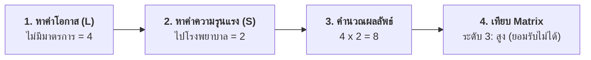

# กรณีศึกษาที่ 1: การประเมินความเสี่ยงจากเหตุการณ์ "ล้อหินเจียรหลุด" (ก่อนมีมาตรการ)
## ขั้นตอนที่ 3 การประเมินความเสี่ยง (Risk Assessment - Case Study 1)

---

## 1. ข้อมูลพื้นฐานของงานและอันตราย

ตัวอย่างการประเมินความเสี่ยงของเครื่องจักรโดยประยุกต์ใช้แบบฟอร์มการวิเคราะห์ข้อบกพร่องและผลกระทบ (FMEA Form) ในงานช่างขึ้นรูป:

- **พื้นที่ / เครื่องจักร / ขั้นตอนงาน:** เครื่องเจียรเหล็ก
- **ส่วนงาน:** งานขึ้นรูป
- **ผู้วิเคราะห์:** ช่างชูชีพ
- **อุปกรณ์ / ชิ้นส่วน:** Lock Nut ของล้อหินเจียร
- **ลักษณะความล้มเหลว:** Lock Nut หลุด
- **สาเหตุความล้มเหลว:** ขาดการตรวจสอบก่อนใช้งาน และพนักงานเปลี่ยนล้อหินเจียรประกอบไม่แน่น
- **ผลที่จะเกิดขึ้น:** ล้อหินเจียรหลุดกระเด็นใส่ผู้ปฏิบัติงาน ทำให้ได้รับบาดเจ็บ
- **มาตรการควบคุมป้องกันที่มีอยู่เดิม:** **ไม่มี**

---

## 2. ขั้นตอนการประเมินความเสี่ยงทีละขั้น

### ขั้นตอนที่ 1: การพิจารณาค่าโอกาสที่จะเกิด (Likelihood : L)
- ตรวจสอบช่อง **"มาตรการควบคุมป้องกันที่มีอยู่"** พบว่า **"ไม่มี"**
- ดังนั้น ค่าโอกาสจึงเป็นระดับสูงสุด คือ **"4"** (มีโอกาสในการเกิดสูง) ระบุลงในช่อง **"โอกาส"**

---

### ขั้นตอนที่ 2: การพิจารณาค่าระดับความรุนแรง (Severity : S)
- ตรวจสอบช่อง **"ผลที่จะเกิด"** พบว่าผู้ปฏิบัติงานได้รับบาดเจ็บจนต้อง **"ไปโรงพยาบาล"**
- เมื่อเทียบกับเกณฑ์ความรุนแรง จึงมีค่าความรุนแรงเท่ากับระดับ **"2"** ระบุลงในช่อง **"ความรุนแรง"**

---

### ขั้นตอนที่ 3: การคำนวณผลลัพธ์คะแนนความเสี่ยง (Risk Score)
- นำค่าโอกาส **"4"** คูณกับค่าความรุนแรง **"2"**
$$\text{ผลลัพธ์คะแนนความเสี่ยง} = 4 \times 2 = 8$$
- ระบุตัวเลข **"8"** ลงในช่อง **"ผลลัพธ์"**

---

### ขั้นตอนที่ 4: การเทียบค่าระดับความเสี่ยงในตาราง Matrix
- นำผลลัพธ์คะแนน **"8"** (แถวโอกาส 4 และคอลัมน์ความรุนแรง 2) ไปเทียบในตาราง Risk Matrix

- ผลการเทียบในตาราง Matrix ได้ระดับคะแนนความเสี่ยงเท่ากับ **"3"** ระบุลงในช่อง **"ความเสี่ยง"**

---

## 3. สรุปผลการประเมินความเสี่ยงและแนวทางปฏิบัติ

| รายการประเมิน | ผลการประเมิน | การแปลผลและความหมาย |
| :--- | :---: | :--- |
| **ค่าโอกาสเกิด (L)** | **4** | มีโอกาสในการเกิดสูง (เนื่องจากไม่มีมาตรการควบคุมใด ๆ) |
| **ค่าความรุนแรง (S)** | **2** | ปานกลาง (บาดเจ็บต้องเข้ารับการรักษาที่สถานพยาบาล/โรงพยาบาล) |
| **ผลลัพธ์คะแนน ($L \times S$)** | **8** | คะแนนความเสี่ยงรวม |
| **ระดับความเสี่ยงใน Matrix** | **3** | ระดับ **"สูง"** |
| **การตัดสินใจ** | **ยอมรับไม่ได้** | **ไม่ต้องหยุดการทำงาน แต่ต้องเร่งเพิ่มมาตรการลดความเสี่ยงโดยด่วน** |

> **ข้อกำหนดการปฏิบัติงาน:** เนื่องจากอันตรายนี้มีความเสี่ยงระดับสูง (ยอมรับไม่ได้) องค์กรจึงต้องจัดทำ **"แผนลดความเสี่ยง"** ควบคู่ไปกับ **"แผนควบคุมความเสี่ยง"** โดยสามารถศึกษาขั้นตอนการเพิ่มมาตรการต่อได้ใน [กรณีศึกษาที่ 3 (Week10-07)](file:///d:/GitHubRepos/__ENGEDU/OHS_2569/Week-10/Week10-07_Step_3_Ex_3.md)
