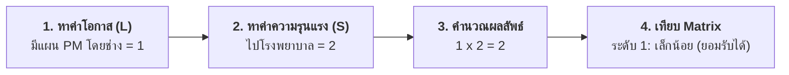

# กรณีศึกษาที่ 2: การประเมินความเสี่ยงจากเหตุการณ์ "ล้อหินเจียรแตก" (กรณีมีระบบ PM แล้ว)
## ขั้นตอนที่ 3 การประเมินความเสี่ยง (Risk Assessment - Case Study 2)

---

## 1. ข้อมูลพื้นฐานของงานและอันตราย

ตัวอย่างการประเมินความเสี่ยงของเครื่องจักรในกรณีที่มี **มาตรการบำรุงรักษาเชิงป้องกัน (Preventive Maintenance : PM)** อยู่แล้วในระบบ:

- **พื้นที่ / เครื่องจักร / ขั้นตอนงาน:** เครื่องเจียรเหล็ก
- **ส่วนงาน:** งานขึ้นรูป
- **ผู้วิเคราะห์:** ช่างชูชีพ (วันที่วิเคราะห์ 8 ส.ค. 62)
- **อุปกรณ์ / ชิ้นส่วน:** Lock Nut ของล้อหินเจียร
- **ลักษณะความล้มเหลว:** ล้อหินเจียรแตก
- **สาเหตุความล้มเหลว:** Lock Nut เสื่อมสภาพ
- **ผลที่จะเกิดขึ้น:** ชิ้นส่วนล้อหินเจียรกระเด็นใส่ผู้ปฏิบัติงาน ทำให้ได้รับบาดเจ็บ
- **มาตรการควบคุมป้องกันที่มีอยู่เดิม:** **มีแผน PM ไม่ให้ Lock Nut เสื่อมสภาพโดยช่าง**

---

## 2. ขั้นตอนการประเมินความเสี่ยงทีละขั้น

### ขั้นตอนที่ 1: การพิจารณาค่าโอกาสที่จะเกิด (Likelihood : L)
- ตรวจสอบช่อง **"มาตรการควบคุมป้องกันที่มีอยู่"** พบว่า **"มีแผน PM ไม่ให้ Lock Nut เสื่อมสภาพโดยช่าง"**
- เนื่องจากมีระบบการบำรุงรักษาเชิงป้องกันอย่างสม่ำเสมอ โอกาสในการเกิดความล้มเหลวจึงลดลงอย่างมาก ค่าโอกาสจึงถูกปรับลดลงจากค่าสูงสุด (4) เหลือเพียง **"1"** (มีโอกาสในการเกิดยาก) ระบุเลข **"1"** ลงในช่อง **"โอกาส"**

---

### ขั้นตอนที่ 2: การพิจารณาค่าระดับความรุนแรง (Severity : S)
- ตรวจสอบช่อง **"ผลที่จะเกิด"** หากเกิดเหตุการณ์ล้อหินเจียรแตกกระเด็น ผู้ปฏิบัติงานอาจได้รับบาดเจ็บจนต้อง **"ไปโรงพยาบาล"**
- เมื่อเทียบกับเกณฑ์ความรุนแรง ค่าความรุนแรงจึงตรงกับระดับ **"2"** ระบุเลข **"2"** ลงในช่อง **"ความรุนแรง"**

---

### ขั้นตอนที่ 3: การคำนวณผลลัพธ์คะแนนความเสี่ยง (Risk Score)
- นำค่าโอกาส **"1"** คูณกับค่าความรุนแรง **"2"**
$$\text{ผลลัพธ์คะแนนความเสี่ยง} = 1 \times 2 = 2$$
- ระบุตัวเลข **"2"** ลงในช่อง **"ผลลัพธ์"**

---

### ขั้นตอนที่ 4: การเทียบค่าระดับความเสี่ยงในตาราง Matrix
- นำผลลัพธ์คะแนน **"2"** (แถวโอกาส 1 และคอลัมน์ความรุนแรง 2) ไปเทียบในตาราง Risk Matrix

- ผลการเทียบในตาราง Matrix ตกอยู่ในช่องสีเขียว ได้ระดับคะแนนความเสี่ยงเท่ากับ **"1"** ระบุลงในช่อง **"ความเสี่ยง"**

---

## 3. สรุปผลการประเมินความเสี่ยงและแนวทางปฏิบัติ

| รายการประเมิน | ผลการประเมิน | การแปลผลและความหมาย |
| :--- | :---: | :--- |
| **ค่าโอกาสเกิด (L)** | **1** | มีโอกาสในการเกิดยาก (มีระบบการตรวจเช็คและบำรุงรักษา PM สม่ำเสมอ) |
| **ค่าความรุนแรง (S)** | **2** | ปานกลาง (บาดเจ็บต้องเข้ารับการรักษาที่สถานพยาบาล) |
| **ผลลัพธ์คะแนน ($L \times S$)** | **2** | คะแนนความเสี่ยงรวม |
| **ระดับความเสี่ยงใน Matrix** | **1** | ระดับ **"เล็กน้อย"** |
| **การตัดสินใจ** | **ยอมรับได้** | **ไม่ต้องเพิ่มมาตรการใหม่ และไม่จำเป็นต้องจัดทำแผนควบคุมความเสี่ยง** |

> **ข้อสังเกต:** กรณีนี้แสดงให้เห็นว่าการมี **มาตรการบำรุงรักษาเชิงป้องกัน (PM)** ที่มีประสิทธิภาพ สามารถควบคุมและลดระดับความเสี่ยงให้อยู่ในระดับเล็กน้อยที่องค์กรยอมรับได้ โดยสามารถศึกษาหลักการตัดสินใจต่อใน [กรณีศึกษาที่ 4 (Week10-08)](file:///d:/GitHubRepos/__ENGEDU/OHS_2569/Week-10/Week10-08_Step_3_Ex_4.md)
