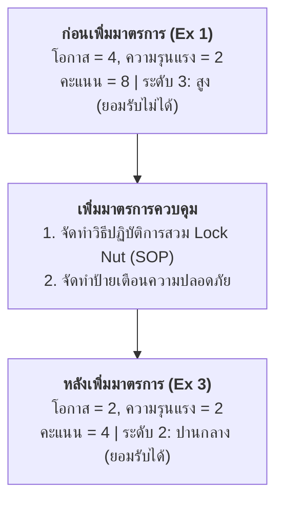

# กรณีศึกษาที่ 3: การเพิ่มมาตรการเพื่อควบคุมและลดความเสี่ยงในเหตุการณ์ "ล้อหินเจียรหลุด"
## ขั้นตอนที่ 3 และ 4 การลดความเสี่ยงและการประเมินซ้ำ (Risk Reduction & Re-assessment)

---

## 1. ที่มาและปัญหา (Problem Statement)

จากผลการประเมินความเสี่ยงใน **[กรณีศึกษาที่ 1](file:///d:/GitHubRepos/__ENGEDU/OHS_2569/Week-10/Week10-05_Step_3_Ex_1.md)** พบว่าอันตรายจากเหตุการณ์ **"Lock Nut ของล้อหินเจียรหลุด"** มีผลลัพธ์คะแนนความเสี่ยงเท่ากับ **8** และจัดอยู่ใน **ระดับความเสี่ยง 3 (สูง)** ซึ่งเป็น **"ความเสี่ยงที่ยอมรับไม่ได้"**

ตามข้อกำหนดของระบบบริหารความเสี่ยง:
- องค์กรไม่จำเป็นต้องสั่งหยุดงานทันที แต่ **ต้องกำหนดมาตรการเพิ่มเติมเพื่อลดระดับความเสี่ยงให้อยู่ในเกณฑ์ที่ยอมรับได้**
- ต้องทำการประเมินความเสี่ยงซ้ำ (Re-assessment) เพื่อพิสูจน์ว่ามาตรการที่กำหนดขึ้นใหม่สามารถลดระดับความเสี่ยงลงมาได้จริง

---

## 2. การกำหนดมาตรการเพิ่มเติมและการประเมินความเสี่ยงซ้ำ

### ขั้นตอนที่ 1: การกำหนดมาตรการเพิ่ม และคำนวณค่าโอกาสใหม่
- กำหนดมาตรการที่ต้องทำเพิ่มเพื่อแก้ไขที่สาเหตุความล้มเหลว:
  1. **จัดทำวิธีปฏิบัติการสวม Lock Nut ให้แน่นไม่หลุด (Safe Work Procedure / SOP):** ช่วยลดโอกาสเกิดอันตรายลง (-1)
  2. **จัดทำป้ายเตือนความปลอดภัยในการตรวจสอบก่อนใช้งาน:** ช่วยเตือนสติผู้ปฏิบัติงาน (-1)
- ระบุรายละเอียดมาตรการลงในช่อง **"มาตรการที่ควรทำเพิ่ม"**
- คำนวณค่าโอกาสใหม่: $4 - 1 - 1 = 2$ 
- ระบุเลข **"2"** ลงในช่อง **"โอกาส"** ด้านหลังเลข 4 เดิม

---

### ขั้นตอนที่ 2: การพิจารณาค่าระดับความรุนแรง (Severity : S)
- เนื่องจากมาตรการที่เพิ่มขึ้นเป็นมาตรการลดโอกาสเกิด (Preventive Measures) ไม่ได้ลดพลังงานจลน์หรือความเร็วรอบของเครื่องจักร หากเกิดหลุดขึ้นมาจริง ผลลัพธ์ยังคงบาดเจ็บส่งโรงพยาบาลเท่าเดิม
- ดังนั้น ค่าความรุนแรงจึงคงที่เท่ากับ **"2"** ระบุเลข **"2"** ลงในช่อง **"ความรุนแรง"** ด้านหลังเลข 2 เดิม

---

### ขั้นตอนที่ 3: การคำนวณผลลัพธ์คะแนนความเสี่ยงใหม่
- นำค่าโอกาสใหม่ **"2"** คูณกับค่าความรุนแรง **"2"**
$$\text{ผลลัพธ์คะแนนความเสี่ยงใหม่} = 2 \times 2 = 4$$
- ระบุเลข **"4"** ลงในช่อง **"ผลลัพธ์"** ด้านหลังเลข 8 เดิม

---

### ขั้นตอนที่ 4: การเทียบค่าระดับความเสี่ยงใหม่ในตาราง Matrix
- นำคะแนนผลลัพธ์ใหม่ **"4"** (แถวโอกาส 2 และคอลัมน์ความรุนแรง 2) ไปเทียบในตาราง Matrix

- ผลการเทียบในตาราง Matrix ตกอยู่ในช่องสีเหลือง ได้ระดับความเสี่ยงเท่ากับ **"2"** ระบุเลข **"2"** ลงในช่อง **"ความเสี่ยง"** ด้านหลังเลข 3 เดิม
- แปลผลได้ว่า: ความเสี่ยงอยู่ในระดับ **"ยอมรับได้"** ระดับความเสี่ยง **"ปานกลาง"**

---

## 3. ตารางเปรียบเทียบก่อนและหลังการเพิ่มมาตรการ (FMEA Comparison)

| หัวข้อ | ก่อนเพิ่มมาตรการ (Ex 1) | หลังเพิ่มมาตรการ (Ex 3) | ผลการเปลี่ยนแปลง |
| :--- | :---: | :---: | :--- |
| **มาตรการควบคุม** | ไม่มี | SOP วิธีขันแน่น + ป้ายเตือน | ควบคุมและลดสาเหตุรากเหง้า |
| **ค่าโอกาส (L)** | **4** | **2** | ลดลง 2 ระดับ |
| **ค่าความรุนแรง (S)** | **2** | **2** | คงเดิม (บาดเจ็บระดับไป รพ.) |
| **ผลลัพธ์คะแนน ($L \times S$)** | **8** | **4** | ลดลงจาก 8 เหลือ 4 (ลดลง 50%) |
| **ระดับความเสี่ยงใน Matrix** | **3 (สูง)** | **2 (ปานกลาง)** | ลดระดับความเสี่ยงสำเร็จ |
| **ผลการตัดสินใจ** | **ยอมรับไม่ได้** | **ยอมรับได้** | สามารถปฏิบัติงานได้ภายใต้แผนควบคุม |

---

## 4. สรุปบทเรียนสำคัญ

1. **การลดความเสี่ยงสำเร็จอย่างเป็นรูปธรรม:** การเพิ่มมาตรการควบคุมที่มีประสิทธิภาพ (ขั้นตอนการทำงานที่ปลอดภัย และการเตือน) สามารถลดค่าโอกาสเกิดลงได้อย่างชัดเจน เปลี่ยนสถานะความเสี่ยงจาก "ยอมรับไม่ได้" มาเป็น "ยอมรับได้"
2. **การจัดทำแผนควบคุมความเสี่ยงต่อเนื่อง:** แม้ความเสี่ยงจะลดลงมาอยู่ในระดับปานกลาง (ยอมรับได้) แล้ว องค์กรยังคงต้อง **"จัดทำแผนควบคุมความเสี่ยง"** เพื่อตรวจสอบ กำกับดูแล และรักษาให้ผู้ปฏิบัติงานปฏิบัติตามขั้นตอน SOP และดูแลป้ายเตือนให้อยู่ในสภาพสมบูรณ์เสมอ
