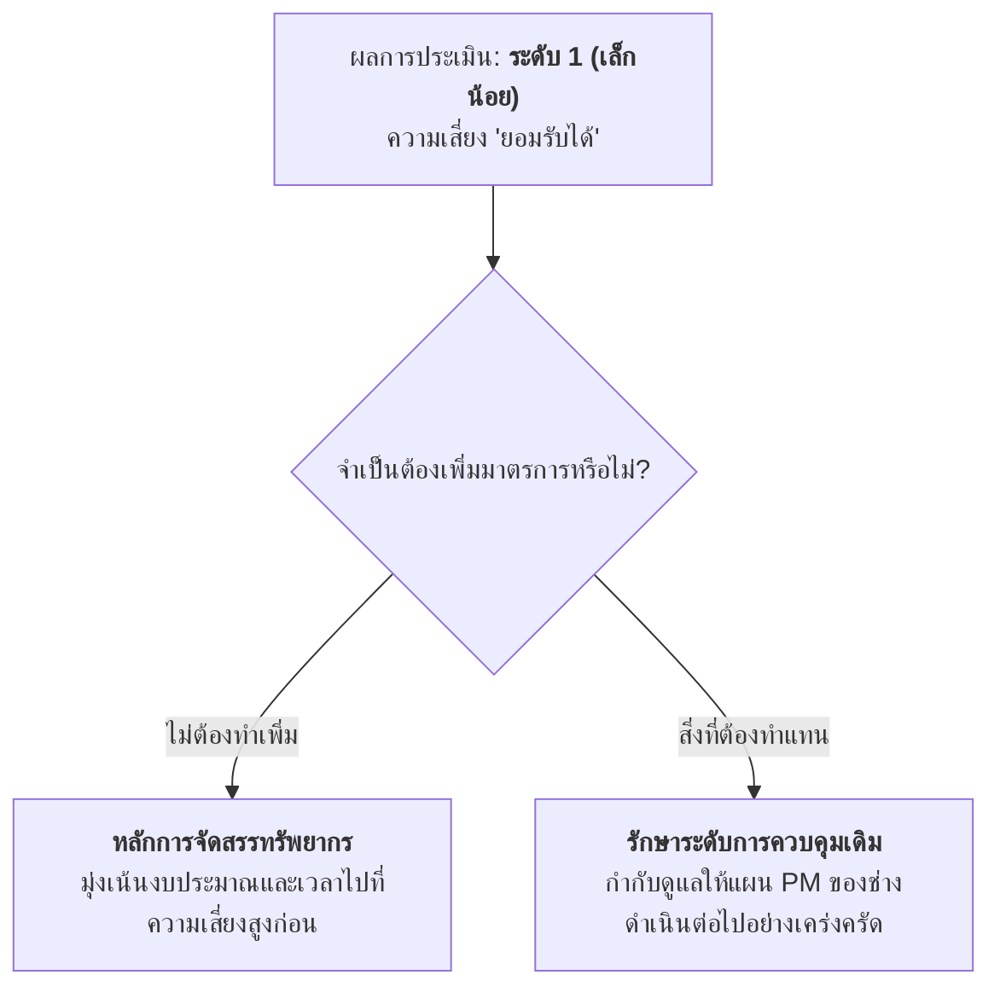

# กรณีศึกษาที่ 4: การพิจารณาความจำเป็นในการเพิ่มมาตรการในเหตุการณ์ "ล้อหินเจียรแตก"
## หลักการตัดสินใจต่อความเสี่ยงที่ยอมรับได้ (Decision Making on Acceptable Risk)

---

## 1. บทนำและที่มา (Context)

จากผลการประเมินความเสี่ยงใน **[กรณีศึกษาที่ 2](file:///d:/GitHubRepos/__ENGEDU/OHS_2569/Week-10/Week10-06_Step_3_Ex_2.md)** ในเหตุการณ์ **"ล้อหินเจียรแตก"** เนื่องจากมีระบบการบำรุงรักษาเชิงป้องกัน (PM) โดยช่างประจำอย่างต่อเนื่อง ทำให้ได้ผลการประเมินดังนี้:
- ค่าโอกาสที่จะเกิด (L) = **1** (เกิดยาก)
- ค่าความรุนแรง (S) = **2** (ปานกลาง - บาดเจ็บไปโรงพยาบาล)
- ผลลัพธ์คะแนนความเสี่ยง = $1 \times 2 =$ **2**
- เทียบในตาราง Matrix ได้ระดับความเสี่ยงเท่ากับ **"1"** แปลผลได้ว่า **"ความเสี่ยงยอมรับได้"** ระดับ **"เล็กน้อย"**

---

## 2. หลักการสำคัญ: "ถ้ามีความเสี่ยงเล็กน้อย ยอมรับได้ ก็ยังไม่ต้องทำมาตรการเพิ่ม"

> **กฎการตัดสินใจ:** ในกรณีที่ความเสี่ยงตกอยู่ในระดับ **"เล็กน้อย (1) ซึ่งยอมรับได้"** สถานประกอบกิจการ **ยังไม่มีความจำเป็นต้องเพิ่มมาตรการควบคุมใหม่** และไม่จำเป็นต้องจัดทำแผนงานลดความเสี่ยง

### เหตุผลเชิงบริหารจัดการและความคุ้มค่า:
1. **การบริหารทรัพยากรอย่างคุ้มค่า (Resource Optimization):** งบประมาณ กำลังคน และเวลาขององค์กรมีจำกัด ควรนำไปทุ่มเทให้กับการแก้ไขความเสี่ยงในระดับ **"สูงมาก (4)"** และ **"สูง (3)"** ซึ่งมีความเร่งด่วนและอันตรายต่อชีวิตมากกว่า
2. **มาตรการเดิมมีประสิทธิผลเพียงพอแล้ว (Adequate Existing Controls):** ระบบการบำรุงรักษาเชิงป้องกัน (PM) สามารถตัดตอนสาเหตุรากเหง้าของความเสื่อมสภาพได้อย่างมีประสิทธิภาพ การเพิ่มมาตรการซ้ำซ้อนโดยไม่จำเป็นอาจทำให้ขั้นตอนการทำงานยุ่งยากและสิ้นเปลืองค่าใช้จ่าย

---

## 3. สิ่งที่สถานประกอบการต้องดำเนินการต่อ (Actions Required)

แม้ว่าจะ **"ไม่ต้องเพิ่มมาตรการใหม่"** แต่องค์กรต้องไม่ละเลยสิ่งสำคัญต่อไปนี้:

1. **ควบคุมและรักษาระดับมาตรการเดิมให้อยู่ในเกณฑ์มาตรฐาน:** ต้องตรวจสอบและกำกับดูแลให้ช่างทำการบำรุงรักษา PM ตามรอบเวลาอย่างสม่ำเสมอ หากละเลยจนแผน PM ขาดช่วง ค่าโอกาสจะดีดกลับไปเป็นระดับสูงสุด (4) ทันที
2. **การเฝ้าระวังและติดตามผล (Monitoring):** จัดเก็บสถิติและข้อมูลการชำรุด หากในอนาคตพบความถี่ของการแตกหักเพิ่มขึ้น ต้องนำอันตรายนี้กลับมาประเมินความเสี่ยงใหม่
3. **ปฏิบัติตามมาตรฐานการทำงานปกติ:** ให้ผู้ปฏิบัติงานสวมใส่อุปกรณ์คุ้มครองความปลอดภัยส่วนบุคคล (แว่นตานิรภัย/กระบังหน้า) ตามระเบียบความปลอดภัยพื้นฐานของโรงงาน

---

## 4. ตารางเปรียบเทียบการตัดสินใจ: กรณีศึกษาที่ 3 เทียบกับ กรณีศึกษาที่ 4

| หัวข้อเปรียบเทียบ | กรณีศึกษาที่ 3 (ล้อหินเจียรหลุด) | กรณีศึกษาที่ 4 (ล้อหินเจียรแตก) |
| :--- | :---: | :---: |
| **ระดับความเสี่ยงเริ่มต้น** | ระดับ **3 (สูง - ยอมรับไม่ได้)** | ระดับ **1 (เล็กน้อย - ยอมรับได้)** |
| **ความจำเป็นในการเพิ่มมาตรการ** | **จำเป็นต้องเพิ่มมาตรการทันที** | **ยังไม่ต้องทำมาตรการเพิ่ม** |
| **มาตรการที่ดำเนินการ** | ออกแบบ SOP ขันแน่น + ติดป้ายเตือน | รักษาระบบบำรุงรักษา PM เดิมให้ต่อเนื่อง |
| **แผนงานที่ต้องจัดทำ** | แผนลดความเสี่ยง + แผนควบคุมความเสี่ยง | ไม่จำเป็นต้องทำแผนลดความเสี่ยง |
| **ผลลัพธ์หลังการจัดการ** | ความเสี่ยงลดลงสู่ระดับ 2 (ยอมรับได้) | รักษาระดับความเสี่ยงไว้ที่ระดับ 1 (เล็กน้อย) |

---

## 5. การศึกษาต่อยอดในหัวข้อถัดไป

เมื่อผ่านขั้นตอนการประเมินความเสี่ยงและการตัดสินใจแล้ว สำหรับอันตรายที่มีความเสี่ยงสูงและจำเป็นต้องกำหนดมาตรการเพิ่มเติม สามารถศึกษาหลักการคัดเลือกมาตรการควบคุมความเสี่ยงตามลำดับขั้นมาตรฐานสากล ได้ที่:

- **[Week10-09 มาตรการในการควบคุมความเสี่ยง (Hierarchy of Controls)](file:///d:/GitHubRepos/__ENGEDU/OHS_2569/Week-10/Week10-09.md):** ศึกษาหลักการ 6 ลำดับขั้น ตั้งแต่การขจัดอันตราย วิศวกรรมควบคุม การบริหารจัดการ ไปจนถึงการจัดหาอุปกรณ์คุ้มครองความปลอดภัยส่วนบุคคล (PPE)
