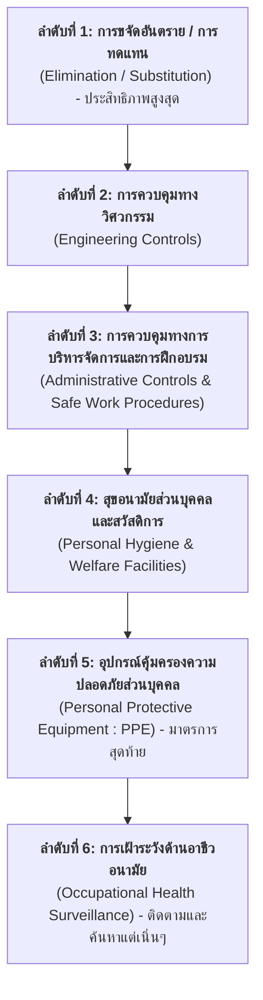

# มาตรการในการควบคุมความเสี่ยง (Hierarchy of Risk Controls)
## ลำดับขั้นการควบคุมความเสี่ยง 6 ลำดับ และการเฝ้าระวังด้านอาชีวอนามัย

---

## 1. บทนำและแนวคิดลำดับขั้นการควบคุม (Hierarchy of Controls)

เมื่อการประเมินความเสี่ยงในขั้นตอนที่ 3 บ่งชี้ว่าอันตรายใดเป็น **"ความเสี่ยงที่ยอมรับไม่ได้" (ระดับสูง หรือ สูงมาก)** สถานประกอบกิจการจะต้องกำหนดมาตรการควบคุมความเสี่ยงเพิ่มเติมอย่างเป็นระบบ เพื่อลดระดับความเสี่ยงให้อยู่ในเกณฑ์ที่ยอมรับได้

การคัดเลือกมาตรการควบคุมความปลอดภัยจะต้องยึดถือ **"ลำดับขั้นการควบคุมความเสี่ยง" (Hierarchy of Controls)** โดยพิจารณาเรียงลำดับจากมาตรการที่มีประสิทธิภาพสูงสุดลงไปหามาตรการที่มีประสิทธิภาพต่ำสุด หากใช้มาตรการลำดับต้นแล้วสามารถลดความเสี่ยงลงมาอยู่ในระดับที่ยอมรับได้ ก็ไม่จำเป็นต้องดำเนินการในขั้นถัดไป

---

### ตัวอย่าง การประเมินความเสี่ยงของอันตราย “ล้อหินเจียแตก”

สิ่งที่ทำให้ความเสี่ยงสูงคือ การไม่มีมาตรการใด ๆ มาลดและควบคุมความเสี่ยง 

## 2. ลำดับขั้นของมาตรการควบคุมความเสี่ยงทั้ง 6 ระดับ

### ลำดับที่ 1 การขจัดอันตราย หรือการทดแทนด้วยสิ่งที่มีอันตรายน้อยกว่า (Elimination & Substitution)
เป็นมาตรการที่มีประสิทธิภาพสูงที่สุด เพราะเป็นการตัดต้นเหตุของอันตรายออกไปจากกระบวนการทำงานอย่างถาวร หรือเปลี่ยนไปใช้สิ่งอื่นที่มีความเป็นอันตรายต่ำกว่า

- **ตัวอย่างการปฏิบัติงาน**
  - การทำเกษตรอินทรีย์ เพื่อลดหรือเลิกการใช้สารเคมีกำจัดศัตรูพืช
  - การคัดเลือกใช้สารเคมีหรือสารกำจัดศัตรูพืชที่มีความเป็นพิษต่ำกว่า
  - การใช้สีที่ใช้น้ำเป็นตัวทำละลาย (Water-based Paint) ทดแทนสีที่ใช้สารทำละลายอินทรีย์ (Solvent-based Paint) เพื่อลดไอระเหยและอันตรายจากสารไวไฟ
  - การใช้เครื่องมือกลที่ขับเคลื่อนด้วยลม (Pneumatic Tools) แทนเครื่องมือไฟฟ้า (Electrical Tools) ในบริเวณที่มีไอระเหยของสารไวไฟ เพื่อป้องกันประกายไฟ

> **หลักการปฏิบัติ** 
> เมื่อนำมาตรการลำดับที่ 1 มาใช้แล้ว และผลการประเมินชี้ว่าระดับความเสี่ยงลดลงมาอยู่ในเกณฑ์ที่ยอมรับได้ ก็ไม่มีความจำเป็นต้องทำขั้นตอนถัดไป

---

### ลำดับที่ 2 การใช้อุปกรณ์ เครื่องมือ เทคโนโลยี หรือระบบควบคุมทางวิศวกรรม (Engineering Controls)
เป็นการออกแบบ ปรับปรุง หรือติดตั้งอุปกรณ์ทางวิศวกรรมเพื่อกั้น แยก หรือปิดคลุมอันตราย ไม่ให้สัมผัสกับตัวผู้ปฏิบัติงาน

- **ตัวอย่างการปฏิบัติงาน**
  - การติดตั้งฝาครอบหรือการ์ดป้องกันจุดอันตรายของเครื่องจักร (Machine Guarding)
  - การติดตั้งที่ปิดครอบกันเสียง (Soundproof Enclosure) เพื่อลดระดับความดังของเสียงจากเครื่องจักร
  - การติดตั้งราวกันตก (Guardrails) และตาข่ายนิรภัยรอบพื้นที่การทำงานบนที่สูง
  - การใช้อุปกรณ์ทุ่นแรงที่มีล้อ รถยก หรือรถเข็น เพื่อช่วยในการเคลื่อนย้ายของหนักตามหลักการยศาสตร์
  - การติดตั้งระบบระบายอากาศเฉพาะที่ (Local Exhaust Ventilation : LEV) เพื่อดูดจับฝุ่นและไอระเหยสารเคมี ณ แหล่งกำเนิด
  - การจัดให้มีระบบแสงสว่างที่เหมาะสมและเพียงพอต่อการปฏิบัติงาน

---

### ลำดับที่ 3: การกำหนดวิธีการปฏิบัติงานที่ปลอดภัย การจัดรูปแบบการทำงาน การให้ข้อมูลความรู้และการฝึกอบรม (Administrative Controls)
เป็นการบริหารจัดการพฤติกรรม ระบบการทำงาน และเวลาในการสัมผัสอันตรายของคนทำงาน

- **ตัวอย่างการปฏิบัติงาน**
  - จัดทำขั้นตอน วิธีการปฏิบัติงาน และข้อแนะนำเกี่ยวกับการปฏิบัติงานอย่างปลอดภัย (Safe Operating Procedure : SOP) ที่เป็นลายลักษณ์อักษรสำหรับลูกจ้าง หัวหน้างาน และผู้บริหาร
  - จัดทำคู่มือสอนงาน (Job Instruction Sheet) ให้มีความชัดเจน เข้าใจง่าย
  - จัดการฝึกอบรมความปลอดภัยและอาชีวอนามัยให้แก่ลูกจ้างอย่างสม่ำเสมอ ทั้งก่อนเริ่มงานและตามรอบประจำปี
  - จัดการฝึกอบรมพิเศษสำหรับงานที่มีความเสี่ยงสูง เช่น งานในที่อับอากาศ, งานบนที่สูง, งานเกี่ยวกับสารเคมีอันตราย, งานตัดเชื่อม
  - การสลับสับเปลี่ยนหน้าที่การทำงาน (Job Rotation) เพื่อจำกัดระยะเวลาในการสัมผัสสิ่งแวดล้อมที่เป็นอันตราย (เช่น ความร้อน เสียงดัง ฝุ่น)

---

### ลำดับที่ 4 สุขอนามัยส่วนบุคคลและสวัสดิการ (Personal Hygiene and Welfare)
เป็นการจัดเตรียมสุขอนามัยและสิ่งอำนวยความสะดวก เพื่อตัดวงจรการปนเปื้อนหรือการสะสมสารพิษเข้าสู่ร่างกาย

- **ตัวอย่างการปฏิบัติงาน**
  - จัดเตรียมอ่างล้างมือพร้อมสบู่ และห้องสุขาที่สะอาดพร้อมกระดาษชำระในบริเวณสถานที่ทำงาน
  - จัดตู้เก็บเสื้อผ้าสำหรับเสื้อผ้าที่เปื้อนสารเคมีแยกต่างหากจากเสื้อผ้าปกติ โดยไม่อนุญาตให้นำเสื้อผ้าที่เปื้อนสารเคมีกลับไปซักที่บ้าน
  - จัดให้มีชุดปฐมพยาบาล ห้องพยาบาล และจัดฝึกอบรมการปฐมพยาบาลเบื้องต้น (First Aid) และ CPR ให้แก่ลูกจ้าง
  - จัดเตรียมน้ำดื่มที่สะอาด ได้มาตรฐานสุขอนามัย และเพียงพอต่อผู้ปฏิบัติงานในสถานที่ทำงาน

---

### ลำดับที่ 5 อุปกรณ์คุ้มครองความปลอดภัยส่วนบุคคล (Personal Protective Equipment  PPE)
เป็นการสวมใส่อุปกรณ์เพื่อสร้างเกราะป้องกันระหว่างตัวบุคคลกับอันตราย แบ่งตามการปกป้องร่างกาย 8 ส่วนสำคัญ

1. **อุปกรณ์ปกป้องศีรษะ (Head Protection)** 
   หมวกนิรภัย (Safety Helmet)
2. **อุปกรณ์ปกป้องดวงตาและใบหน้า (Eye & Face Protection)** 
   แว่นตานิรภัย (Safety Glasses), กระบังหน้านิรภัย (Face Shield)
3. **อุปกรณ์ลดเสียง (Hearing Protection)** 
   ปลั๊กอุดหูลดเสียง (Earplugs), ที่ครอบหูลดเสียง (Earmuffs)
4. **อุปกรณ์ปกป้องระบบทางเดินหายใจ (Respiratory Protection)** 
   หน้ากากกรองฝุ่น, หน้ากากกรองไอระเหยสารเคมี, SCBA
5. **อุปกรณ์ปกป้องลำตัว (Body Protection)** 
   ชุดกันสารเคมี, เสื้อสะท้อนแสง, ชุดกันประกายไฟ
6. **อุปกรณ์ปกป้องมือและแขน (Hand & Arm Protection)** 
   ถุงมือหนัง, ถุงมือยางกันสารเคมี, ถุงมือกันบาด
7. **อุปกรณ์ปกป้องขาและเท้า (Foot & Leg Protection)** 
   รองเท้าหัวเหล็กนิรภัย (Safety Shoes), สนับแข้ง
8. **อุปกรณ์ป้องกันความร้อนและความเย็น (Thermal Protection)** 
   ถุงมือและชุดฉนวนกันความร้อน/ความเย็นจัด

#### ข้อพิจารณาสำคัญในการใช้อุปกรณ์ PPE
- **เป็นมาตรการลำดับสุดท้าย (Last Line of Defense)** 
  ต้องพิจารณาใช้มาตรการลำดับที่ 1-4 ก่อนเสมอ และนำ PPE มาใช้เสริมเมื่อมาตรการอื่นยังไม่สามารถลดความเสี่ยงลงมาสู่ระดับที่ยอมรับได้
- **ความคุ้มค่าในระยะยาว** 
  การลงทุนในระบบควบคุมทางวิศวกรรม (ลำดับที่ 2) มีประสิทธิผลที่ยั่งยืนและประหยัดกว่าการจัดซื้อ PPE แจกจ่ายให้แก่ลูกจ้างจำนวนมากตลอดเวลา
- **ขอบเขตการคุ้มครอง** 
  วิศวกรรมควบคุมจะคุ้มครองดูแลทุกคนที่อยู่ในพื้นที่ ส่วน PPE จะคุ้มครองเฉพาะบุคคลที่สวมใส่อย่างถูกต้องเท่านั้น
- **การมีส่วนร่วมของลูกจ้าง** 
  ต้องเปิดโอกาสให้ลูกจ้างมีส่วนร่วมในการทดลองและคัดเลือก PPE เพราะผู้ปฏิบัติงานมีความรู้ ประสบการณ์ และความคุ้นเคยกับความคล่องตัวในการทำงานจริง

---

### ลำดับที่ 6 การเฝ้าระวังด้านอาชีวอนามัย (Occupational Health Surveillance)
เป็นการติดตามตรวจสอบสุขภาพของผู้ปฏิบัติงานอย่างเป็นระบบ เพื่อประเมินประสิทธิผลของมาตรการควบคุม และค้นหาอาการผิดปกติหรือโรคจากการทำงานตั้งแต่ระยะเริ่มต้น (Early Detection) ก่อนที่จะเกิดความเสียหายถาวร

- **ผู้ดำเนินการ** 
  ต้องดำเนินการโดยบุคลากรที่มีความเชี่ยวชาญเฉพาะด้าน เช่น แพทย์อาชีวเวชศาสตร์ หรือพยาบาลอาชีวอนามัย
- **ความสำคัญ** 
  ลูกจ้างแต่ละคนมีภูมิคุ้มกันและสภาพร่างกายที่แตกต่างกัน บางคนอาจแสดงอาการในทันที ขณะที่บางคนอาจสะสมสารพิษและแสดงอาการเจ็บป่วยในระยะยาว

#### ตารางจับคู่ต้นเหตุอันตรายกับโรคจากการทำงานที่ต้องเฝ้าระวัง

| ต้นเหตุของอันตราย                           | อันตรายและโรคที่อาจได้รับ                                                       |
| :------------------------------------------ | :------------------------------------------------------------------------------ |
| **ฝุ่นละออง (Dusts)**                       | โรคหอบหืดจากการทำงาน, โรคปอดเรื้อรัง, โรคปอดฝุ่นหิน (Silicosis), โรคปอดฝุ่นฝ้าย |
| **สารเคมีอินทรีย์ / สารทำละลาย (Solvents)** | โรคผิวหนังอักเสบจากการทำงาน, พิษต่อตับและไต                                     |
| **สารกำจัดศัตรูพืช (Pesticides)**           | ความเป็นพิษต่อระบบประสาท, ระบบสืบพันธุ์, อาการกล้ามเนื้อกระตุก                  |
| **เสียงดังจากเครื่องจักร (Noise)**          | การสูญเสียการได้ยินชั่วคราวและถาวร (หูตึง, หูหนวกจากการทำงาน)                   |

#### รูปแบบการตรวจและเฝ้าระวังด้านอาชีวอนามัย

| วิธีการตรวจเฝ้าระวัง                         | สิ่งที่ทำการตรวจและเฝ้าระวัง                                                                |
| :------------------------------------------- | :------------------------------------------------------------------------------------------ |
| **การตรวจทางชีวภาพ (Biological Monitoring)** | เจาะเลือดหรือตรวจปัสสาวะ เพื่อตรวจหาสารเคมีหรือเมแทบอไลต์ของสารพิษในร่างกาย                 |
| **การตรวจร่างกายเบื้องต้นโดยผู้รับผิดชอบ**   | หัวหน้างานหรือ จป. ที่ผ่านการอบรม ตรวจดูลักษณะผิวหนัง มือ หรือผื่นคันของลูกจ้าง             |
| **การตรวจสมรรถภาพการได้ยิน (Audiometry)**    | ตรวจวัดการได้ยินประจำปีสำหรับลูกจ้างที่ทำงานในบริเวณที่มีเสียงดังเกินมาตรฐาน                |
| **การตรวจสมรรถภาพปอด (Spirometry)**          | ตรวจวัดปริมาตรและความจุปอด สำหรับลูกจ้างที่สัมผัสฝุ่น ก๊าซพิษ หรือไอระเหย                   |
| **การตรวจหาสาเหตุการลาป่วยบ่อย**             | ตรวจสอบสถิติการลาป่วยซ้ำซ้อน เพื่อประสานแพทย์ในการวินิจฉัยว่าเกี่ยวเนื่องกับการทำงานหรือไม่ |

---

## 3. กรณีศึกษาตัวอย่าง การวางแผนมาตรการควบคุมความเสี่ยง (กรณี "การสัมผัสฝุ่นไม้")

ตัวอย่างการนำหลักการ Hierarchy of Controls มาประยุกต์ใช้เพื่อแก้ไขอันตรายจากการสัมผัสฝุ่นไม้ในโรงงานแปรรูปไม้

### 1) การสำรวจมาตรการควบคุมเดิมที่มีอยู่แล้ว
จากการสำรวจในแบบฟอร์มขั้นตอนที่ 3 พบว่าโรงงานมีเพียงมาตรการระดับพื้นฐาน
- มีการกวาดฝุ่นไม้เป็นประจำ (มาตรการปฏิบัติงานทั่วไป)
- มีอ่างล้างมือและฝักบัวอาบน้ำ (มาตรการสุขอนามัยส่วนบุคคล - ลำดับที่ 4)
- มีที่ปิดปากปิดจมูกกันฝุ่นและเปลี่ยนสม่ำเสมอ (อุปกรณ์ PPE - ลำดับที่ 5)

---

### 2) การกำหนดมาตรการควบคุมที่ต้องทำเพิ่มอย่างเป็นระบบ
เมื่อประเมินแล้วพบว่ามาตรการเดิมยังไม่เพียงพอที่จะป้องกันโรคปอดและมะเร็งโพรงจมูกในกลุ่มลูกจ้างหน้าเครื่องตัดไม้ จึงกำหนดมาตรการเพิ่มเติมตามลำดับขั้น

| มาตรการที่ต้องทำเพิ่ม | สอดคล้องกับมาตรการลำดับที่ | วัตถุประสงค์และประสิทธิผล |
| :--- | :---: | :--- |
| **1. จัดให้มีระบบระบายอากาศเฉพาะที่ (Local Exhaust Ventilation  LEV)** ติดตั้งครอบเครื่องจักรทุกเครื่องที่ปล่อยฝุ่น | **ลำดับที่ 2** (วิศวกรรมควบคุม) | ดูดจับฝุ่นไม้ ณ แหล่งกำเนิดก่อนฟุ้งกระจายสู่บรรยากาศในโรงงาน ปกป้องคนทำงานทุกคนในพื้นที่ |
| **2. ห้ามกวาดฝุ่นไม้ที่แห้ง** ให้ใช้เครื่องดูดฝุ่นอุตสาหกรรมแทน หรือฉีดพรมน้ำให้เปียกก่อนกวาด | **ลำดับที่ 3** (วิธีปฏิบัติงานที่ปลอดภัย) | ป้องกันไม่ให้ฝุ่นไม้ขนาดเล็กฟุ้งกระจายกลับขึ้นสู่อากาศในระหว่างทำความสะอาด |
| **3. จัดฝึกอบรมลูกจ้างที่ปฏิบัติงานกับเครื่องตัดไม้** ให้มีความรู้ในการใช้และบำรุงรักษาอุปกรณ์ดูดฝุ่น | **ลำดับที่ 3** (การฝึกอบรม) | สร้างความตระหนักและทักษะในการใช้งานระบบวิศวกรรมควบคุมอย่างถูกต้องและยั่งยืน |

---

## 4. สรุปภาพรวมการบริหารความเสี่ยง

การบริหารความเสี่ยงด้านความปลอดภัย อาชีวอนามัย และสภาพแวดล้อมในการทำงาน จะสัมฤทธิผลได้ต้องขับเคลื่อนอย่างครบวงจร
1. **[Week10-02 ชี้บ่งอันตราย](file:///d:/GitHubRepos/__ENGEDU/OHS_2569/Week-10/Week10-02_Step_1.md)** มองเห็นอันตรายอย่างครอบคลุมรอบด้าน
2. **[Week10-03 ระบุผู้มีความเสี่ยง](file:///d:/GitHubRepos/__ENGEDU/OHS_2569/Week-10/Week10-03_Step_2.md)** รู้ว่าใครเสี่ยงและเสี่ยงอย่างไร เพื่อกำหนดเป้าหมายได้ตรงจุด
3. **[Week10-04 ประเมินความเสี่ยง](file:///d:/GitHubRepos/__ENGEDU/OHS_2569/Week-10/Week10-04_Step_3.md)** ตัดสินใจด้วยตัวเลขระดับความเสี่ยงผ่าน Risk Matrix
4. **[Week10-09 ควบคุมความเสี่ยง](file:///d:/GitHubRepos/__ENGEDU/OHS_2569/Week-10/Week10-09.md)** เลือกใช้มาตรการตามลำดับขั้น Hierarchy of Controls เพื่อขจัดและลดความเสี่ยงอย่างยั่งยืน

