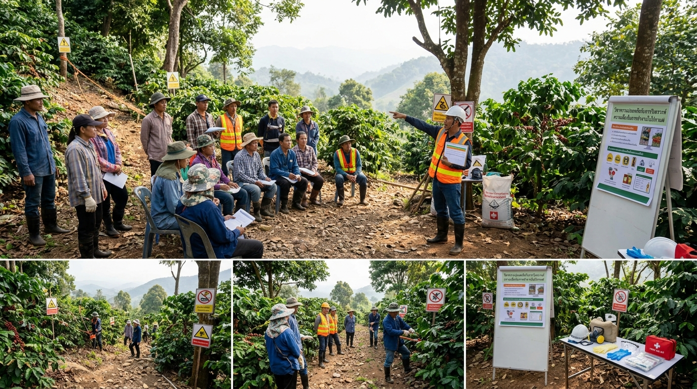
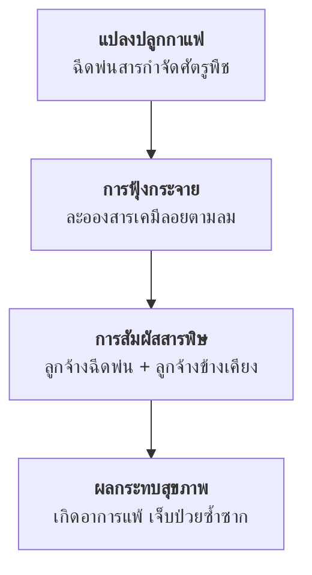
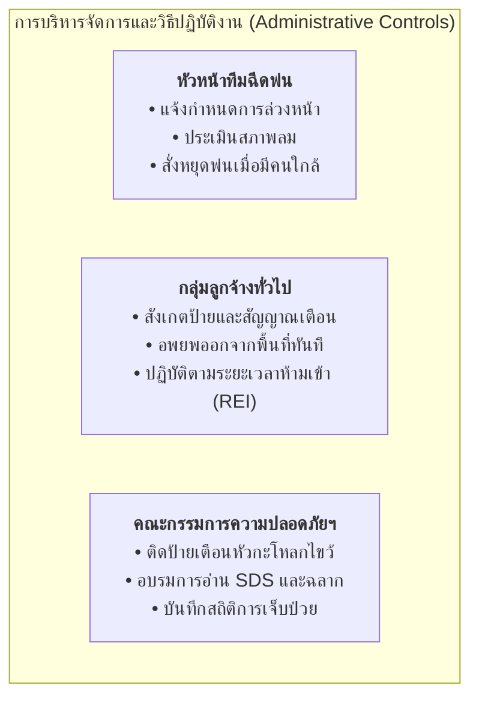

# กรณีศึกษา: การประเมินและควบคุมความเสี่ยงตามลำดับขั้น
## การฉีดพ่นสารกำจัดศัตรูพืชในแปลงปลูกต้นกาแฟ (Coffee Plantation Pesticide Risk Control)

---

## 1. สถานการณ์สมมติและสภาพปัญหา (Scenario Background)

ในการดำเนินงานของ **แปลงปลูกต้นกาแฟ** นายจ้างพบปัญหาด้านอาชีวอนามัยและความปลอดภัยจากการปฏิบัติงานฉีดพ่นสารเคมีกำจัดศัตรูพืช โดยมีรายละเอียดเหตุการณ์และสภาพแวดล้อมการทำงานดังนี้

**ปัญหาที่พบ** 

ลูกจ้างต้องสัมผัสกับสารเคมีอันตรายอย่างต่อเนื่องในระหว่างการฉีดพ่น และมีอุบัติการณ์ลูกจ้างเกิดอาการแพ้สารพิษ ผื่นคัน คลื่นไส้ และเวียนศีรษะเกิดขึ้นบ่อยครั้ง

**ความจำเป็นในการปรับปรุง** 

นายจ้างและคณะกรรมการความปลอดภัยฯ จึงจำเป็นต้องดำเนินการประเมินความเสี่ยงตามกระบวนการ 5 ขั้นตอน เพื่อจัดทำมาตรการปรับปรุงสภาพการทำงานด้านความปลอดภัยและอาชีวอนามัยอย่างเร่งด่วน

---

## 2. การดำเนินกระบวนการประเมินความเสี่ยง (Risk Assessment Steps)

### ขั้นตอนที่ 1 การชี้บ่งอันตราย (Hazard Identification)

อันตรายที่เกิดขึ้นในพื้นที่ปฏิบัติงานเกิดจาก 2 ลักษณะสำคัญ
1. **อันตรายขณะฉีดพ่น** 

   การใช้เครื่องฉีดพ่นสารเคมีแบบสะพายหลัง ทำให้เกิดละอองฝอยของสารเคมี (Chemical Mist/Aerosol) ฟุ้งกระจายในบรรยากาศตามทิศทางลม
2. **อันตรายตกค้างหลังการฉีดพ่น** 

   สารเคมีที่ตกค้างบนใบ กิ่ง และดิน ยังคงปล่อยไอระเหยหรือปนเปื้อนผิวสัมผัส หากลูกจ้างเข้าไปทำงานตัดแต่งกิ่ง ดายหญ้า หรือเก็บเกี่ยวผลผลิตทันทีโดยไม่ทิ้งระยะเวลาปลอดภัย

---

### ขั้นตอนที่ 2 ระบุว่าใครเป็นผู้ที่มีความเสี่ยง และเสี่ยงอย่างไร (Who might be harmed and how)

#### 1) ข้อมูลกลุ่มผู้สัมผัสความเสี่ยง (Demographics)

ลูกจ้างที่ทำงานในแปลงปลูกกาแฟมีจำนวนรวมทั้งสิ้น **28 คน** แบ่งออกเป็น

**ลูกจ้างผู้ใหญ่** 

หญิง 10 คน และ ชาย 8 คน (รวม 18 คน)

**ลูกจ้างเยาวชน (อายุต่ำกว่า 18 ปี)** 

เด็กหญิง 6 คน และ เด็กชาย 4 คน (รวม 10 คน)

> [!WARNING]
> **ข้อพิจารณาพิเศษสำหรับกลุ่มเปราะบาง (Vulnerable Group)**
> มีแรงงานเยาวชนอายุต่ำกว่า 18 ปีมากถึง 10 คน ซึ่งร่างกายและระบบประสาทอยู่ระหว่างการเจริญเติบโต ความไวต่อสารพิษจึงสูงกว่าผู้ใหญ่ และตามกฎหมายคุ้มครองแรงงานมีข้อกำหนดเข้มงวดเกี่ยวกับการห้ามเยาวชนทำงานที่สัมผัสสารเคมีอันตรายโดยตรง

#### 2) ลักษณะและเส้นทางการสัมผัสความเสี่ยง (Exposure Routes)

**1. กลุ่มผู้ฉีดพ่นสารเคมีโดยตรง**  สัมผัสละอองสารเคมีผ่านทางเดินหายใจและการซึมผ่านผิวหนังระหว่างผสมและฉีดพ่น

**2. กลุ่มลูกจ้างที่ปฏิบัติงานอื่นในแปลง** 
เสี่ยงต่อการสูดดมละอองสารเคมีที่พัดตามลม (Drift) หรือสัมผัสต้นกาแฟที่มีสารพิษตกค้างจากการกลับเข้าพื้นที่ก่อนกำหนด

**3. การปนเปื้อนสู่ระบบทางเดินอาหาร** 
การรับประทานอาหาร น้ำดื่ม หรือสูบบุหรี่โดยไม่ล้างมือและเปลี่ยนชุดทำงาน

---
### ขั้นตอนที่ 3 การประเมินความเสี่ยงและการพิจารณามาตรการ (Risk Evaluation & Controls)

#### ขั้นตอนที่ 3ก พิจารณามาตรการควบคุมความเสี่ยงที่มีอยู่ในปัจจุบัน (Existing Controls)
จากการสำรวจสภาพการทำงานจริง พบจุดบกพร่องของมาตรการเดิมดังนี้

**พื้นที่การทำงานทับซ้อน** ลูกจ้างกลุ่มฉีดพ่นและกลุ่มทำงานบำรุงรักษาอื่น ๆ ปฏิบัติงานในแปลงเดียวกันหรือแปลงข้างเคียงพร้อมกัน

**ละอองพัดพาตามลม** ทิศทางลมพัดละอองสารเคมีไปยังกลุ่มคนที่ไม่ได้สวมใส่อุปกรณ์ป้องกัน

**ขาดการสื่อสารเตือนภัย** ไม่มีการแจ้งเตือนลูกจ้างทั้งหมดล่วงหน้าในวันและเวลาที่จะมีแผนการฉีดพ่น

**ไม่กำหนดระยะเวลาปลอดภัยในการกลับเข้าพื้นที่ (Re-entry Interval : REI)** ไม่มีการกำหนดระยะเวลาห้ามเข้าแปลงตามคำแนะนำบนฉลากสารเคมี ลูกจ้างจึงเดินกลับเข้าพื้นที่ทันทีหลังฉีดพ่นเสร็จ

**สรุปผลการประเมินขั้นต้น** สภาพการทำงานเดิมไม่มีมาตรการควบคุมความปลอดภัยที่มีประสิทธิผล ทำให้ระดับความเสี่ยงตกอยู่ในเกณฑ์ **"สูง / ยอมรับไม่ได้"** ส่งผลให้ลูกจ้างเจ็บป่วยอย่างต่อเนื่อง

**หมายเหตุ** ขั้นตอนนี้ใช้ตารางเมตริกซ์ในการแระเมินความเสี่ยงเป็นเครื่องมือในการวิเคราะห์

#### ขั้นตอนที่ 3ข: พิจารณากำหนดมาตรการควบคุมความเสี่ยงที่ต้องทำเพิ่ม (Additional Controls)
สถานประกอบกิจการต้องนำหลักการ **ลำดับขั้นการควบคุมความเสี่ยง 6 ระดับ (Hierarchy of Controls)** ตาม [Week10-09](file:///d:/GitHubRepos/__ENGEDU/OHS_2569/Week-10/Week10-09.md) มาวิเคราะห์ความเป็นไปได้ในการปฏิบัติ

---

## 3. การวิเคราะห์มาตรการควบคุมความเสี่ยง 6 ลำดับขั้น (Hierarchy of Controls Analysis)

แบบฟอร์มการวิเคราะห์ความเป็นไปได้และข้อจำกัดในการกำหนดมาตรการควบคุมความเสี่ยง:

### ตารางสรุปผลการวิเคราะห์มาตรการควบคุมความเสี่ยงทั้ง 6 ระดับ

| ลำดับขั้นมาตรการ                                                                 | มาตรการควบคุมที่เสนอ                                                                                                                                                                                                  | สถานะความเป็นไปได้ | รายละเอียดการปฏิบัติ / เหตุผลความจำเป็น                                                                                                                                                   |
| :------------------------------------------------------------------------------- | :-------------------------------------------------------------------------------------------------------------------------------------------------------------------------------------------------------------------- | :----------------: | :---------------------------------------------------------------------------------------------------------------------------------------------------------------------------------------- |
| **ลำดับที่ 1: การขจัดอันตราย / ทดแทน** *(Elimination & Substitution)*            | • ยกเลิกการใช้สารเคมีกำจัดศัตรูพืช • เปลี่ยนมาใช้เกษตรอินทรีย์ 100%                                                                                                                                                |    **ทำไม่ได้**    | ในทางปฏิบัติยังเป็นไปได้ยากเนื่องจากผลผลิตจะเสียหายรวดเร็วและต้นทุนสูง นายจ้างจึงจำเป็นต้องใช้สารเคมีอยู่ แต่เลือกชนิดที่มีความเป็นพิษต่ำที่สุด                                           |
| **ลำดับที่ 2: ระบบวิศวกรรมและเทคโนโลยี** *(Engineering Controls)*                | • ตรวจสอบและบำรุงรักษาเครื่องพ่นสารเคมี • เลือกพ่นในช่วงที่ไม่มีลมหรือลมอ่อน • ศึกษาการนำอากาศยานไร้คนขับ (โดรนเพื่อการเกษตร) มาช่วยพ่น                                                                         |     **ทำได้**      | • ซ่อมบำรุงหัวฉีดและข้อต่อป้องกันการรั่วซึม • ลดการฟุ้งกระจายของละอองสารเคมี • ใช้โดรนเพื่อลดการนำคนเข้าไปเดินลุยในดงต้นกาแฟ                                                        |
| **ลำดับที่ 3: การบริหารจัดการและวิธีปฏิบัติงาน** *(Administrative Controls)*     | • จัดทำขั้นตอนปฏิบัติงานที่ปลอดภัย (SOP) • กำหนดบทบาทหัวหน้าทีมและลูกจ้างชัดเจน • แจ้งเตือนล่วงหน้าเป็นลายลักษณ์อักษร • ติดป้ายเตือนหัวกะโหลกไขว้และวันห้ามเข้า • จัดฝึกอบรมพิเศษเรื่องฉลากสารเคมีและ REI |     **ทำได้**      | • หัวหน้าทีมฉีดพ่นต้องแจ้งกำหนดการล่วงหน้า • สั่งหยุดฉีดทันทีเมื่อมีคนอื่นเข้ามาใกล้ • ปฏิบัติตามระยะเวลาห้ามเข้าแปลง (REI) อย่างเคร่งครัด • บันทึกสถิติการเจ็บป่วยลงสมุดทะเบียน |
| **ลำดับที่ 4: สุขอนามัยส่วนบุคคลและสวัสดิการ** *(Personal Hygiene & Welfare)*    | • จัดสร้างห้องอาบน้ำและอ่างล้างมือสะอาด • จัดตู้ล็อกเกอร์แยกเสื้อผ้าเปื้อนสารเคมี • จัดที่พักผ่อนและรับประทานอาหารเหนือลม                                                                                       |     **ทำได้**      | • ช่วยตัดวงจรการสะสมสารพิษเข้าสู่ร่างกาย • ป้องกันการนำเสื้อผ้าเปื้อนเคมีกลับไปซักที่บ้าน • วางผังจุดพักผ่อนให้มีแนวกำบังต้นไม้ป้องกันละอองสารเคมี                                  |
| **ลำดับที่ 5: อุปกรณ์คุ้มครองความปลอดภัยส่วนบุคคล** *(PPE)*                      | • จัดเตรียม PPE ป้องกันสารเคมีครบชุดให้ผู้ฉีดพ่น • ห้ามคนอื่นเข้าพื้นที่เพื่อลดการใช้ PPE โดยไม่จำเป็น                                                                                                             |     **ทำได้**      | • ผู้พ่นยาต้องสวมหน้ากากกรองไอระเหย/สารเคมี ถุงมือยางสังเคราะห์ ชุดคลุม และแว่นตานิรภัย • การกั้นเขตช่วยลดค่าใช้จ่ายในการแจก PPE ให้ทุกคน                                              |
| **ลำดับที่ 6: การเฝ้าระวังด้านอาชีวอนามัย** *(Occupational Health Surveillance)* | • ตรวจสุขภาพตามปัจจัยเสี่ยงสำหรับผู้สัมผัสเคมี • ตรวจระดับเอนไซม์โคลีนเอสเตอเรสในเลือด • เฝ้าระวังพิเศษในแรงงานเด็กอายุต่ำกว่า 18 ปี                                                                            |     **ทำได้**      | • ค้นหาการดูดซึมสารเคมีในร่างกายตั้งแต่ระยะแรกเริ่ม • ปกป้องสุขภาพแรงงานเยาวชนจากการเจ็บป่วยเรื้อรัง • ประเมินประสิทธิผลของมาตรการควบคุมทั้งหมด                                     |

---

## 4. รายละเอียดแนวทางการปฏิบัติการควบคุมความเสี่ยง

### มาตรการลำดับที่ 1 การขจัดอันตรายและการทดแทน (Elimination & Substitution)
- **การประเมินสภาพจริง** 
  
  การไม่ใช้สารกำจัดศัตรูพืชเลย หรือการเปลี่ยนเป็นเกษตรอินทรีย์ทันทีนั้น แม้จะเป็นแนวทางที่ดีที่สุดในทางทฤษฎี แต่ในทางปฏิบัติส่งผลต่อต้นทุนและปริมาณผลผลิตอย่างมีนัยสำคัญ
- **ข้อสรุปการดำเนินงาน** 
  
  นายจ้างยังคงจำเป็นต้องใช้สารเคมี แต่ต้องพิจารณาเลือกใช้สารเคมีที่มีความเป็นพิษต่ำกว่า มีการสลายตัวเร็วกว่า และมีฉลากความปลอดภัยระบุชัดเจน

---

### มาตรการลำดับที่ 2 การใช้อุปกรณ์ เครื่องมือ เทคโนโลยี และระบบควบคุมทางวิศวกรรม (Engineering Controls)
- **การบำรุงรักษาอุปกรณ์** 
  
  เครื่องฉีดพ่น ถังบรรจุ สายส่ง และหัวฉีด (Nozzle) ต้องอยู่ในสภาพสมบูรณ์ ไม่แตกร้าวหรือรั่วซึม และต้องเลือกหัวฉีดที่ควบคุมขนาดละอองน้ำยาให้เหมาะสม ไม่ฟุ้งเป็นละอองฝอยละเอียดเกินไป
  
- **การนำเทคโนโลยีมาประยุกต์ใช้** 
  
  วางแผนศึกษาความคุ้มค่าในการนำ **โดรนเพื่อการเกษตร (Agricultural Drone)** มาใช้ในการฉีดพ่นแทนการใช้แรงงานคนสะพายหลัง ซึ่งจะช่วยแยกคนทำงานออกจากระยะสัมผัสสารเคมีได้อย่างมีประสิทธิภาพ

---

### มาตรการลำดับที่ 3 การกำหนดวิธีปฏิบัติงานที่ปลอดภัย การจัดรูปแบบงาน และการฝึกอบรม (Administrative Controls)

ความสำเร็จของมาตรการนี้ต้องอาศัยการปรึกษาหารือร่วมกันระหว่างนายจ้าง หัวหน้างาน และลูกจ้าง พร้อมทั้งกำหนดบทบาทหน้าที่ของแต่ละฝ่ายอย่างเคร่งครัด

#### 1) บทบาทหน้าที่ของหัวหน้ากลุ่มปฏิบัติงานฉีดพ่นเคมี
- **การแจ้งแผนงานล่วงหน้า** 
  
  ต้องแจ้งหัวหน้ากลุ่มลูกจ้างอื่นว่าจะทำการฉีดพ่นสารเคมีที่แปลงใด วันใด และเวลาใด โดยทำเป็น **ลายลักษณ์อักษร** พร้อมส่งสำเนาให้นายจ้างและผู้ควบคุมงาน
  
- **การตรวจสอบสภาพแวดล้อม** 
  
  ประเมินทิศทางและความเร็วลม หากมี **ลมแรง ห้ามทำการฉีดพ่นเด็ดขาด** ให้เลื่อนไปทำในช่วงเช้าตรู่หรือช่วงที่ลมนิ่ง
  
- **การกำกับดูแลขณะพ่น** 
  
  กำชับสมาชิกในทีม หากพบเห็นลูกจ้างคนอื่นทำงานอยู่ใกล้แนวพ่น **ต้องสั่งหยุดฉีดพ่นทันที** และแจ้งให้ออกจากพื้นที่เพื่อความปลอดภัย

#### 2) บทบาทหน้าที่ของกลุ่มลูกจ้างทั่วไปในแปลง
- เมื่อพบเห็นทีมฉีดพ่นเคลื่อนเข้ามาใกล้บริเวณที่ตนปฏิบัติงาน ให้หยุดงาน แจ้งหัวหน้างาน และถอยออกจากพื้นที่ไปยังจุดปลอดภัยเหนือลมทันที
- ปฏิบัติตามคำสั่งและป้ายเตือนอย่างเคร่งครัด ไม่ลักลอบเดินผ่านแปลงที่มีการฉีดพ่น

#### 3) บทบาทหน้าที่ของคณะกรรมการความปลอดภัยฯ และผู้ได้รับมอบหมาย
- **การติดป้ายสัญลักษณ์เตือนภัย** 
  
  ติดป้ายเตือนสากล (เช่น สัญลักษณ์รูปหัวกะโหลกไขว้) บริเวณทางเข้าแปลง พร้อมระบุชื่อสารเคมี วันที่ฉีดพ่น และ **วันที่อนุญาตให้กลับเข้าแปลงได้อย่างปลอดภัย (Safe Re-entry Date)**
  
- **การจัดฝึกอบรมเฉพาะทาง** 
  
  จัดอบรมให้ลูกจ้างทุกคนรู้จักวิธีอ่านข้อมูลบนฉลากสารเคมี เอกสารข้อมูลความปลอดภัยสารเคมี (Safety Data Sheet : SDS) และความสำคัญของระยะเวลาปลอดภัย
  
- **การบันทึกสถิติ** 
  
  บันทึกประวัติการเจ็บป่วยและอาการผิดปกติที่เกี่ยวเนื่องจากการสัมผัสสารเคมีลงในสมุดบันทึกอย่างเป็นระบบ

---

### มาตรการลำดับที่ 4 การดูแลสุขอนามัยส่วนบุคคลและสวัสดิการ (Personal Hygiene & Welfare)
- **การจัดตั้งสิ่งอำนวยความสะดวก** 
  
  จัดให้มีห้องอาบน้ำ อ่างล้างมือพร้อมสบู่ และตู้เก็บของใช้ส่วนตัวแยกต่างหากสำหรับผู้ฉีดพ่นสารเคมี
  
- **ตำแหน่งที่ตั้งที่ปลอดภัย** 
  
  ห้องสุขา ห้องอาบน้ำ และจุดรับประทานอาหารต้องตั้งอยู่ **เหนือลม** ห่างจากแปลงปลูกในระยะที่ปลอดภัย หรือมีแนวต้นไม้ธรรมชาติเป็นแนวกำบังละอองสารเคมี
  
- **สุขนิสัย** 
  
  ห้ามรับประทานอาหารหรือสูบบุหรี่ในแปลง และต้องอาบน้ำเปลี่ยนเสื้อผ้าก่อนกลับบ้าน โดยไม่อนุญาตให้นำชุดทำงานเปื้อนสารเคมีกลับไปซักที่บ้าน

---

### มาตรการลำดับที่ 5 การจัดอุปกรณ์คุ้มครองความปลอดภัยส่วนบุคคล (Personal Protective Equipment : PPE)
- **สำหรับทีมผู้ปฏิบัติงานฉีดพ่น** 
  
  นายจ้างต้องจัดหาและบังคับใช้ PPE ที่ได้มาตรฐานและทนทานต่อสารเคมี ได้แก่
  - หน้ากากกรองสารอินทรีย์และไอระเหยเคมี (Chemical Respirator)
  - แว่นตานิรภัยแบบแนบสนิท (Chemical Splash Goggles) หรือกระบังหน้านิรภัย
  - ถุงมือยางไนไตรล์หรือนีโอพรีน (ห้ามใช้ถุงมือผ้า)
  - ชุดคลุมป้องกันสารเคมีกันน้ำซึมผ่าน
  - รองเท้าบูทนิรภัยกันสารเคมี
    
- **สำหรับกลุ่มลูกจ้างทั่วไป** 
  
  ใช้มาตรการบริหารจัดการ (ห้ามเข้าพื้นที่ก่อนครบระยะเวลา REI) เพื่อป้องกันไม่ให้ลูกจ้างต้องสัมผัสสารเคมี ซึ่งช่วยลดความจำเป็นและความสิ้นเปลืองในการจัดซื้อ PPE ให้แก่ลูกจ้างทุกคน

---

### มาตรการลำดับที่ 6 การเฝ้าระวังด้านอาชีวอนามัย (Occupational Health Surveillance)
- **การตรวจสุขภาพตามปัจจัยเสี่ยง** 
  
  จัดให้มีการตรวจสุขภาพประจำปีและตรวจสุขภาพเฉพาะกลุ่มผู้ปฏิบัติงานสัมผัสสารเคมี โดยแพทย์อาชีวเวชศาสตร์
  
- **การตรวจทางชีวภาพ (Biological Monitoring)** 
  
  ตรวจระดับเอนไซม์ **โคลีนเอสเตอเรสในเลือด (Cholinesterase Level)** ทั้งก่อนเริ่มฤดูกาลฉีดพ่น (Baseline) และระหว่างปฏิบัติงาน เพื่อตรวจจับการสะสมของสารเคมีกลุ่มออร์กาโนฟอสเฟตหรือคาร์บาเมตตั้งแต่ระยะที่ยังไม่แสดงอาการ
  
- **การคุ้มครองแรงงานเยาวชน** 
  
  เฝ้าระวังสุขภาพของเด็กและเยาวชนอายุต่ำกว่า 18 ปีอย่างใกล้ชิด และจัดให้ย้ายไปปฏิบัติงานในส่วนที่ไม่มีความเสี่ยงต่อการสัมผัสสารเคมีตามกฎหมายคุ้มครองแรงงาน

---

## 5. สรุปบทเรียนและการประยุกต์ใช้ (Key Takeaways)

1. **เมื่อมาตรการระดับที่ 1 (ขจัด/ทดแทน) ทำไม่ได้** 
   
   การจัดการความปลอดภัยต้องอาศัยการประสานพลังของมาตรการระดับที่ 2, 3, 4 และ 5 ทำงานร่วมกันอย่างเป็นระบบ (Defense in Depth)
   
2. **การบริหารจัดการ (Administrative Controls) คือหัวใจหลัก** 
   
   การสื่อสารล่วงหน้า การกำหนดเขตห้ามเข้า (REI) และการฝึกอบรม มีต้นทุนต่ำแต่มีประสิทธิผลสูงในการป้องกันลูกจ้างข้างเคียง
   
1. **การเฝ้าระวังสุขภาพ (Surveillance) คือเกราะตรวจสอบสุดท้าย** 
   
   ช่วยยืนยันว่ามาตรการควบคุมความเสี่ยงทั้งหมดที่วางแผนไว้มีประสิทธิภาพจริง และช่วยรักษาชีวิตลูกจ้างก่อนเกิดโรคเรื้อรัง

---

> **เนื้อหาที่เกี่ยวข้อง:**
> - [Week10-09 มาตรการในการควบคุมความเสี่ยง (Hierarchy of Controls)](file:///d:/GitHubRepos/__ENGEDU/OHS_2569/Week-10/Week10-09.md)
> - [Week10-04 ขั้นตอนที่ 3 การประเมินความเสี่ยงและ Risk Matrix](file:///d:/GitHubRepos/__ENGEDU/OHS_2569/Week-10/Week10-04_Step_3.md)
> - [Week10-03 ขั้นตอนที่ 2 ระบุผู้มีความเสี่ยงและกลุ่มเปราะบาง](file:///d:/GitHubRepos/__ENGEDU/OHS_2569/Week-10/Week10-03_Step_2.md)
