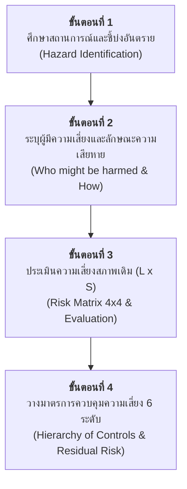

# กิจกรรมปฏิบัติการกลุ่ม (Workshop Week 10 - 11)
## การประเมินและวางมาตรการควบคุมความเสี่ยงในสถานที่ทำงาน
### (Workplace Hazard Identification, Risk Assessment & Hierarchy of Controls)

---

## 1. คำชี้แจงและการจัดกลุ่มปฏิบัติการ (Workshop Instructions)

ให้นักศึกษาแบ่งกลุ่มละ **4 - 5 คน** ร่วมกันวิเคราะห์สถานการณ์จำลอง (Scenario-Based Learning) ที่ได้รับมอบหมาย โดยใช้หลักการและเครื่องมือการประเมินความเสี่ยงตามที่ได้เรียนรู้ในบทเรียน
- การชี้บ่งอันตรายตาม [Week10-02_Step_1.md](file:///d:/GitHubRepos/__ENGEDU/OHS_2569/Week-10/Week10-02_Step_1.md)
- การระบุผู้มีความเสี่ยงและกลุ่มเปราะบางตาม [Week10-03_Step_2.md](file:///d:/GitHubRepos/__ENGEDU/OHS_2569/Week-10/Week10-03_Step_2.md)
- เกณฑ์ตารางเมทริกซ์การประเมินความเสี่ยง $4 \times 4$ ตาม [Week10-04_Step_3.md](file:///d:/GitHubRepos/__ENGEDU/OHS_2569/Week-10/Week10-04_Step_3.md)
- การวางมาตรการควบคุมตามลำดับขั้น 6 ระดับ (Hierarchy of Controls) ตาม [Week10-09.md](file:///d:/GitHubRepos/__ENGEDU/OHS_2569/Week-10/Week10-09.md) และกรณีศึกษา [Week10-10.md](file:///d:/GitHubRepos/__ENGEDU/OHS_2569/Week-10/Week10-10.md)

### บทบาทหน้าที่ของสมาชิกในกลุ่ม (Suggested Roles)
1. **หัวหน้าทีมและผู้อำนวยความสะดวก (Team Leader / Facilitator)** กระตุ้นการระดมสมองและประสานงานภายในกลุ่ม
2. **นักวิเคราะห์อันตรายและเหตุการณ์ (Hazard Analyst)** คัดแยกสภาพแวดล้อม ปัจจัยคุกคาม และจำแนกประเภทอันตราย
3. **ผู้ประเมินความเสี่ยงและเมทริกซ์ (Risk Assessor)** ตรวจสอบระดับความถี่/โอกาส ($L$) ระดับความรุนแรง ($S$) และคำนวณคะแนน
4. **ผู้ออกแบบมาตรการควบคุม (Safety Solutions Architect)** เสนอทางเลือกตามหลักลำดับขั้นการควบคุม 6 ระดับ
5. **ผู้บันทึกและนำเสนอผลงาน (Reporter / Presenter)** จัดทำเอกสารสรุปผล สไลด์นำเสนอ หรือโปสเตอร์สรุปงานกลุ่ม

---

## 2. ลำดับขั้นตอนการทำงาน (Workflow)

### รายละเอียดการปฏิบัติงานแต่ละขั้นตอน

### **ขั้นตอนที่ 1 ศึกษาสถานการณ์สมมติและชี้บ่งอันตราย (Hazard Identification)**
- อ่านเรื่องเล่าสถานการณ์อย่างละเอียด และดึงประเด็นสภาพปัญหา แหล่งกำเนิดอันตราย พฤติกรรมที่ไม่ปลอดภัย และสภาพแวดล้อมที่เสี่ยง
- จำแนกประเภทอันตราย เช่น
  - **อันตรายทางกายภาพ (Physical Hazards)** เสียงดัง ความร้อน แรงสั่นสะเทือน รังสี ทำงานบนที่สูง แสงสว่าง
  - **อันตรายทางกลและเครื่องจักร (Mechanical Hazards)** จุดหนีบ จุดตัด ชิ้นส่วนเคลื่อนไหว การกระเด็น ชน กระแทก
  - **อันตรายทางเคมี (Chemical Hazards)** ฝุ่น ควัน ละออง ไอระเหย ตัวทำละลาย สารกัดกร่อน วัตถุไวไฟ
  - **อันตรายทางชีวภาพ (Biological Hazards)** เชื้อโรค ไวรัส แบคทีเรีย สารคัดหลั่ง สัตว์มีพิษ
  - **อันตรายทางการยศาสตร์ (Ergonomic Hazards)** การยกของหนัก ท่าทางการทำงานซ้ำซาก ก้ม บิด เอี้ยวตัว
  - **อันตรายทางจิตวิทยาสังคม (Psychosocial Hazards)** ความเครียด การเข้ากะดึก การทำงานแข่งกับเวลา

### **ขั้นตอนที่ 2 ระบุว่าใครที่มีความเสี่ยงและเสี่ยงอย่างไร (Who might be harmed and how)**
- **ใครคือผู้ปฏิบัติงานโดยตรง** หน้าที่ ตำแหน่ง ประสบการณ์
- **ใครคือบุคคลอื่นที่อาจได้รับผลกระทบ** เพื่อนร่วมงานข้างเคียง ลูกค้า ผู้รับเหมา ผู้สัญจรผ่าน
- **กลุ่มเปราะบาง (Vulnerable Groups)** แรงงานเยาวชน (ต่ำกว่า 18 ปี), สตรีมีครรภ์, ผู้สูงอายุ, แรงงานข้ามชาติที่ไม่เข้าใจภาษาไทย
- **เส้นทางและลักษณะการสัมผัส (Exposure Routes / Mechanism of Harm)** ได้รับบาดเจ็บอย่างไร เช่น หายใจสูดดม, สัมผัสทางผิวหนัง, ตกจากที่สูง, ถูกหนีบตัด

### **ขั้นตอนที่ 3 ประเมินความเสี่ยงสภาพเดิม (Risk Assessment & Evaluation)**
ใช้เกณฑ์การให้คะแนนจากสไลด์ **Week10-04_Step_3.md**
1. **ประเมินค่าโอกาสเกิด (Likelihood  L)** โดยดูจากมาตรการเดิมที่มีอยู่จริง
   - **4 (สูง)** ไม่มีมาตรการใด ๆ เลย
   - **3 (ปานกลาง)** มีเฉพาะแผนงาน/ขั้นตอน แต่ไม่มีป้ายเตือน และไม่มีการบำรุงรักษาเชิงป้องกัน (PM)
   - **2 (น้อย)** มีแผนงาน + มีป้าย/สัญญาณเตือน แต่ขาดระบบบำรุงรักษา PM
   - **1 (ยาก)** มีแผนงาน + มีป้ายเตือน + มีระบบบำรุงรักษาเชิงป้องกัน (PM) สมบูรณ์
1. **ประเมินค่าความรุนแรง (Severity  S)** จากผลกระทบสูงสุดที่อาจเกิดขึ้น
   - **1 (เล็กน้อย)** ปฐมพยาบาลในที่เกิดเหตุ ทรัพย์สินเสียหายน้อย
   - **2 (ปานกลาง)** บาดเจ็บต้องส่งโรงพยาบาล/รักษาตัว ทรัพย์สินเสียหายปานกลาง
   - **3 (มาก)** สูญเสียอวัยวะ สมรรถภาพลดลง ทรัพย์สินเสียหายสูง
   - **4 (มากที่สุด)** ทุพพลภาพถาวร หรือ เสียชีวิต ทรัพย์สินเสียหายรุนแรงมาก
1. **คำนวณคะแนนความเสี่ยง** $\text{Risk Score} = L \times S$
2. **เทียบในตาราง Risk Matrix** เพื่อระบุระดับ (1 เล็กน้อย, 2 ปานกลาง, 3 สูง, 4 สูงมาก) และตัดสินว่า **"ยอมรับได้"** หรือ **"ยอมรับไม่ได้"**

**ในขั้นตอนนี้ ให้ทำมา 4-5 ความเสี่ยง (ตามจำนวนสมาชิก) แล้วเรียงตามลำดับความเสี่ยง**
### **ขั้นตอนที่ 4 วางมาตรการควบคุมความเสี่ยง (Hierarchy of Controls)**
วิเคราะห์และเสนอมาตรการควบคุมตามลำดับขั้น 6 ระดับ (Hierarchy of Controls) ตามแนวทาง **Week10-09** และ **Week10-10**
1. **ลำดับที่ 1 การขจัดอันตราย / ทดแทน (Elimination & Substitution)**
2. **ลำดับที่ 2 การควบคุมทางวิศวกรรมและเทคโนโลยี (Engineering Controls)**
3. **ลำดับที่ 3 การบริหารจัดการ วิธีปฏิบัติงาน และการฝึกอบรม (Administrative Controls)**
4. **ลำดับที่ 4 สุขอนามัยส่วนบุคคลและสวัสดิการ (Personal Hygiene & Welfare)**
5. **ลำดับที่ 5 อุปกรณ์คุ้มครองความปลอดภัยส่วนบุคคล (PPE)**
6. **ลำดับที่ 6 การเฝ้าระวังด้านอาชีวอนามัย (Occupational Health Surveillance)**
- *ประเมินคะแนนความเสี่ยงที่เหลืออยู่ (Residual Risk)* หลังวางมาตรการใหม่ เพื่อยืนยันว่าระดับความเสี่ยงลดลงจน **"ยอมรับได้"**

---

## 3. ชุดเรื่องเล่าสถานการณ์สมมติ (Workplace Narrative Scenarios)

ให้นักศึกษาเลือกหรือจับสลากสถานการณ์ต่อไปนี้เพื่อดำเนินการวิเคราะห์

---

### สถานการณ์ที่ 1 โรงงานประกอบรถยนต์ (สายการผลิตและเชื่อมประกอบตัวถัง)

**บริบทสภาพแวดล้อม**

โรงงานผลิตยานยนต์ขนาดใหญ่ในนิคมอุตสาหกรรมฝั่งตะวันออก สายการผลิตหลักกำลังเร่งอัตราการผลิตตามคำสั่งซื้อรถยนต์ไฟฟ้า (EV) รุ่นใหม่ รอบเวลาการทำงาน (Takt Time) ถูกบีบให้เสร็จสิ้น 1 คันภายในเวลาเพียง 90 วินาที

**เรื่องราวการปฏิบัติงาน**

นายสมศักดิ์ อายุ 23 ปี พนักงานฝ่ายผลิตเพิ่งผ่านการทดลองงาน ทำหน้าที่ยกและจัดวางชิ้นส่วนโครงสร้างเหล็กประตูรถยนต์เข้าแท่นจับยึด (Jig) จากนั้นใช้ปืนเชื่อมสปอต (Spot Welding Gun) ที่มีน้ำหนักถ่วงระบบสลิงช่วยดึง ทำการเชื่อมจุดตามตำแหน่งมาร์กเกอร์กว่า 45 จุดต่อคัน นายสมศักดิ์ต้องก้ม เงย และบิดเอี้ยวตัวเอื้อมมือเข้าไปเชื่อมโครงสร้างด้านในอย่างต่อเนื่องตลอดกะการทำงาน 8 ชั่วโมง

ในบริเวณเดียวกัน มีแขนกลหุ่นยนต์เชื่อมความเร็วสูงทำงานอยู่ข้างหลัง มีม่านกันแสงเชื่อมสีเข้มกั้นบางส่วน แต่สะเก็ดประกายไฟจากการเชื่อมยังคงกระเด็นข้ามแนวม่านเป็นระยะ อากาศในโซนผลิตร้อนอบอ้าว ระบบพัดลมดูดอากาศระบายควันเชื่อมด้านบนส่งเสียงหึ่งและมีคราบเขม่าจับตัวหนา พนักงานสวมเพียงที่อุดหูโฟมและแว่นตานิรภัยทั่วไป เสื้อผ้ามีรอยไหม้เกรียมเป็นจุดๆ จากสะเก็ดไฟ และนายสมศักดิ์เริ่มมีอาการปวดกล้ามเนื้อหลังส่วนล่างรุนแรงจนต้องรับประทานยาคลายกล้ามเนื้อเป็นประจำ

**มาตรการเดิมในพื้นที่**
- มีป้ายเตือนให้สวมใส่อุปกรณ์ PPE และป้ายระวังสะเก็ดไฟ
- มีการฝึกอบรมความปลอดภัยเบื้องต้นตอนรับเข้าทำงาน 1 ครั้ง (ไม่มีการทบทวน)
- ระบบบาลานเซอร์สลิงช่วยพยุงปืนเชื่อมชำรุด ติดขัด ปล่อยให้น้ำหนักปืนตกลงมาที่แขนพนักงาน ไม่มีการบำรุงรักษาเชิงป้องกัน (PM) มานานกว่า 6 เดือน

---

### สถานการณ์ที่ 2 งานก่อสร้างและปรับปรุงผิวทาง กรมทางหลวงชนบท

**บริบทสภาพแวดล้อม**

โครงการปรับปรุงและเสริมผิวแอสฟัลต์คอนกรีตบนถนนสายเชื่อมระหว่างอำเภอ ความกว้าง 2 ช่องจราจร สภาพแวดล้อมเป็นถนนเปิดโล่ง ท่ามกลางอุณหภูมิแดดเมืองไทยในเวลากลางวันสูงกว่า 38 องศาเซลเซียส การจราจรยังมีรถบรรทุกพ่วงและรถกระบะของชาวบ้านวิ่งผ่านเลนฝั่งตรงข้ามด้วยความเร็วสูง

**เรื่องราวการปฏิบัติงาน**

ทีมงานก่อสร้างประกอบด้วยคนงาน 12 คน มีทั้งแรงงานไทยและแรงงานข้ามชาติเพื่อนบ้าน รวมถึงเยาวชนอายุ 17 ปีที่ตามบิดามาช่วยงานรับจ้างรายวัน คนงานกำลังควบคุมเครื่องปูผิวแอสฟัลต์และช่วยกันใช้พลั่วตักเกลี่ยยางมะตอยร้อน (Hot-mix Asphalt) ที่เทลงมาจากรถดัมพ์ อุณหภูมิของยางมะตอยร้อนระอุถึง 150 องศาเซลเซียส ไอระเหยสารประกอบไฮโดรคาร์บอน (Bitumen Fumes) สีเทาลอยคลุ้งปกคลุมทั่วพื้นที่

คนงานต้องเดินเหยียบบนพื้นผิวยางมะตอยที่เพิ่งเกลี่ยเสร็จเพื่อเก็บรายละเอียดขอบทาง มีรถบดล้อเหล็กและรถบดล้อยางขนาดใหญ่ขับถอยหลังไปมาบดอัดพื้นผิวตลอดเวลา เสียงเครื่องยนต์และเสียงสะเทือนของลูกกลิ้งดังสนั่นจนคนงานไม่ได้ยินเสียงแตรรถที่วิ่งสวนมา เสาหลักกรวยจราจรที่ตั้งกั้นแนวทำงานมีระยะห่างและล้มระเนระนาดเนื่องจากแรงลมปะทะ คนงานสวมเสื้อยืดแขนยาว กางเกงยีนส์ ผ้าขาวม้าโพกศีรษะ รองเท้าผ้าใบหรือรองเท้าบูทยางธรรมดา หลายคนเริ่มมีอาการวิงเวียน หน้ามืดจากฮีทสโตรก (Heat Exhaustion) และแสบตาจากควันยางมะตอย

**มาตรการเดิมในพื้นที่**
- มีกรวยยางจราจรและป้ายเตือน "ข้างหน้ามีงานก่อสร้าง" ติดตั้งก่อนถึงเขตก่อสร้าง 50 เมตร
- ไม่มีสัญญาณไฟกระพริบเตือน ไม่มีเจ้าหน้าที่คอยโบกธงควบคุมการจราจรหัวท้าย
- ไม่มีแผนการตรวจสุขภาพ ไม่มีจุดพักดื่มน้ำที่มีร่มเงาอย่างเป็นสัดส่วน

---

### สถานการณ์ที่ 3 โครงการก่อสร้างหมู่บ้านจัดสรรขนาดใหญ่

**บริบทสภาพแวดล้อม**

พื้นที่ก่อสร้างโครงการบ้านเดี่ยวและทาวน์โฮม 2 ชั้น จำนวน 150 ยูนิต เป็นระบบชิ้นส่วนคอนกรีตสำเร็จรูป (Precast Concrete) บริเวณหน้างานมีดินโคลน รถบรรทุก รถแบคโฮ และโมบายเครน (Mobile Crane) กำลังเคลื่อนย้ายสลับกันตลอดวัน

**เรื่องราวการปฏิบัติงาน**

เวลา 16.30 น. ผู้รับเหมากำลังเร่งงานยกติดตั้งแผ่นผนังพรีคาสท์คอนกรีตน้ำหนัก 3.5 ตัน ขึ้นติดตั้งชั้นสองของอาคาร ทีมช่างประกอบด้วย ช่างควบคุมเครน, ช่างส่งสัญญาณมือ (Rigger) วัย 55 ปี, และแรงงานต่างด้าวหญิง 2 คนที่อยู่บนชั้นสองเพื่อรอประคองและยึดค้ำยันชั่วคราว ขณะที่เครนกำลังยกแผ่นคอนกรีตลอยข้ามศีรษะคนงานด้านล่าง ลวดสลิงที่ใช้ยกมีรอยสึกกร่อนและเกลียวบิดงอ ขาช้าง (Outriggers) ของเครนถูกกางลงบนพื้นดินถมใหม่ที่ยังไม่ได้บดอัดแน่นและไม่มีแผ่นเหล็กรองรับ

บนชั้นสองของอาคาร ยังไม่มีการติดตั้งราวกันตก (Guardrails) ที่ช่องบันไดและระเบียงเปิดโล่ง คนงานหญิงยืนอยู่บนขอบคานคอนกรีตโดยไม่มีสายรัดนิรภัยเต็มตัว (Full Body Harness) หรือเชือกช่วยชีวิต (Lifeline) เนื่องจากเร่งรีบให้เสร็จก่อนฝนตก ลมกระโชกแรงเริ่มพัดเข้ามาทำให้แผ่นคอนกรีตที่แขวนอยู่แกว่งตัวไปมา ใกล้กับแนวสายไฟฟ้าแรงสูง 22 kV ที่พาดผ่านริมรั้วโครงการ

**มาตรการเดิมในพื้นที่**
- มีป้าย "เขตอันตราย สวมหมวกนิรภัย" ติดหน้าประตูทางเข้าโครงการ
- คนงานสวมหมวกนิรภัยพลาสติกทั่วไป แต่ไม่มีอุปกรณ์ป้องกันการตก
- ไม่มีระบบตรวจสอบความพร้อมของปั้นจั่น (แบบ ปจ.2) ก่อนเริ่มงานประจำวัน ขาดระบบการขออนุญาตทำงาน (Work Permit)

---

### สถานการณ์ที่ 4 งานบริการจัดเลี้ยงอีเวนต์และครัวจัดเลี้ยงริมแม่น้ำเจ้าพระยา (Banqueting & Event)

**บริบทสภาพแวดล้อม**

โรงแรมหรูระดับ 5 ดาวริมแม่น้ำเจ้าพระยา กำลังจัดงานกาล่าดินเนอร์เปิดตัวสินค้าระดับนานาชาติ มีแขกผู้มีเกียรติเข้าร่วมงานกว่า 500 คน บริเวณลานระเบียงกลางแจ้งติดแม่น้ำและสระว่ายน้ำอินฟินิตี้ พร้อมครัวเปิดชั่วคราวสำหรับการแสดงสดทำอาหาร

**เรื่องราวการปฏิบัติงาน**

พนักงานจัดเลี้ยง (Waiters/Waitresses) ส่วนใหญ่เป็นนักศึกษาพาร์ทไทม์และพนักงานรายวันอายุ 19 - 22 ปี จำนวน 30 คน ต้องเดินยกถาดอาหารโลหะหนักและจานกระเบื้องร้อนจัด เดินขึ้นลงบันไดหินอ่อนที่เชื่อมระหว่างครัวหลักชั้นใต้ดินกับลานจัดเลี้ยงริมน้ำ พื้นบริเวณทางเดินใกล้แม่น้ำมีน้ำกระเซ็นและคราบน้ำมันเตาเปียกลื่น ในขณะที่ฝ่ายจัดฉากกำลังติดตั้งระบบแสง สี เสียง มีสายไฟเมนขนาดใหญ่พาดระเกะระกะข้ามทางเดิน โดยใช้เทปกาวแปะทับไว้แบบลวกๆ

ในเต็นท์ครัวเปิด พ่อครัวกำลังเร่งทำอาหารประเภททอดและย่างโดยใช้เตาแก๊สแรงดันสูงและกระทะน้ำมันเดือด ท่อสายยางก๊าซหุงต้ม (LPG) วางขดใกล้กับเปลวไฟ ถังดับเพลิงเคมีแห้งถูกซ่อนไว้หลังผ้าม่านประดับเพราะกลัวไม่สวยงาม พนักงานเสิร์ฟต้องสวมรองเท้าคัตชูหนังพื้นแข็งตามยูนิฟอร์มโรงแรมซึ่งไม่มีดอกยางกันลื่น หลายคนต้องเดินต่อเนื่องกว่า 10 กิโลเมตรในคืนเดียว พร้อมเผชิญอารมณ์กดดันจากหัวหน้างานเมื่ออาหารออกช้ากว่ากำหนดของตารางเวที

**มาตรการเดิมในพื้นที่**
- มีการบรีฟคิวงานสั้นๆ 10 นาทีก่อนเริ่มงาน เน้นเรื่องมารยาทการบริการ แต่ไม่ได้กล่าวถึงความปลอดภัย
- ไม่มีป้ายเตือนพื้นลื่นในโซนเสิร์ฟ
- อุปกรณ์สายไฟและหัวจ่ายไฟกลางแจ้งไม่ได้ใช้กล่องกันน้ำ (IP rated) และไม่มีระบบเบรกเกอร์ตัดไฟรั่ว (RCD/ELCB)

---

### สถานการณ์ที่ 5 งานบริการเรือโดยสารด่วนเจ้าพระยา

**บริบทสภาพแวดล้อม**

เส้นทางเดินเรือโดยสารประจำทางในแม่น้ำเจ้าพระยา ช่วงฤดูน้ำหลาก กระแสน้ำไหลเชี่ยวและมีผักตบชวาหนาแน่น เรือด่วนกำลังให้บริการในชั่วโมงเร่งด่วนช่วงเย็นที่มีผู้โดยสารอัดแน่นเต็มลำเรือกว่า 150 คน

**เรื่องราวการปฏิบัติงาน**

ลูกเรือประกอบด้วย นายท้ายเรือ (กัปตัน) 1 คน และเด็กท้ายเรือ (กะลาสี) วัยรุ่น 2 คน อายุ 18 และ 20 ปี คอยทำหน้าที่เก็บค่าโดยสาร สังเกตการณ์ และเทียบท่า เด็กท้ายเรือต้องยืนโหนตัวอยู่นอกกราบเรือแคบๆ ขนาดกว้างไม่ถึง 1 ฟุต มือจับเสาหลังคาเรือข้างหนึ่ง อีกมือถือเชือกมะนิลาเส้นใหญ่ เมื่อเรือแล่นเข้าใกล้โป๊ะเทียบท่า นายท้ายเรือจะเบิ้ลเครื่องยนต์ถอยหลังเพื่อชะลอเรือ เกิดเสียงดังสนั่นกว่า 95 เดซิเบล และมีควันดำจากท่อไอเสียพ่นปกคลุมท้ายเรือ

เด็กท้ายเรือต้องกระโดดข้ามจากกราบเรือที่โครงเครงลงสู่โป๊ะเทียบท่าที่ลื่นด้วยตะไคร่น้ำ เพื่อคล้องเชือกเข้ากับหัวหลักผูกเรือ (Bollard) ต้านแรงดึงของเรือที่ถูกกระแสน้ำพัด หากพลาดเพียงนิดเดียว ร่างกายอาจถูกหนีบอัดระหว่างตัวเรือกับโป๊ะปูน หรือพลัดตกน้ำจมหายไปใต้ท้องเรือที่มีใบพัดกำลังหมุน ผู้โดยสารบนโป๊ะเริ่มเบียดเสียดกรูลงเรือก่อนที่เรือจะเทียบสนิท เด็กท้ายเรือไม่ได้สวมเสื้อชูชีพเพราะอ้างว่าอึดอัด เคลื่อนไหวไม่คล่องตัว และสวมเพียงรองเท้าแตะยางฟองน้ำ

**มาตรการเดิมในพื้นที่**
- มีห่วงชูชีพแขวนข้างเรือ 4 จุด และเสื้อชูชีพใต้เบาะผู้โดยสาร (แต่หยิบใช้ยาก)
- มีระเบียบข้อบังคับการเดินเรือของกรมเจ้าท่า
- โป๊ะเทียบท่าไม่มีการขัดล้างตะไคร่น้ำประจำสัปดาห์ ไม่มีตาข่ายกันตก และนายท้ายเรือไม่มีระบบวิทยุสื่อสารรายงานสภาพน้ำกับศูนย์ควบคุม

---

### สถานการณ์ที่ 6 พนักงานขับรถไฟทางไกล (ขบวนรถด่วนพิเศษ)

**บริบทสภาพแวดล้อม**

การปฏิบัติหน้าที่ขับขบวนรถด่วนพิเศษดีเซลราง เส้นทางสายยาวข้ามคืนระยะทางกว่า 750 กิโลเมตร วิ่งผ่านพื้นที่ป่าเขา ทางโค้งลาดชัน และชุมชนที่มีจุดตัดทางลักผ่านจำนวนมาก

**เรื่องราวการปฏิบัติงาน**

พนักงานขับรถไฟ (พขร.) อายุ 52 ปี และช่างเครื่อง (พรร.) อายุ 28 ปี ต้องเข้าเวรขับรถไฟรอบดึกตั้งแต่เวลา 21.00 น. ถึง 06.00 น. ภายในห้องขับแคบๆ ด้านหน้าหัวรถจักร สภาพห้องขับมีเสียงเครื่องยนต์ดีเซลกระหึ่มก้องต่อเนื่อง แผงควบคุมสั่นสะเทือนตลอดเวลา พขร. ต้องใช้สมาธิจ้องมองรางรถไฟฝ่าความมืด หมอกลงจัด และสายฝนที่ตกหนัก โดยมีไฟหน้ารถจักรดวงเดียวนำทาง

พขร. ต้องคอยเหยียบคันเหยียบระบบตรวจสอบความตื่นตัว (Deadman Pedal) ทุกๆ 60 วินาที หากปล่อยเท้า ระบบจะส่งเสียงหวีดเตือนและหยุดรถฉุกเฉิน อย่างไรก็ตาม พขร. มีภาวะความดันโลหิตสูงและเบาหวานสะสม พักผ่อนไม่เพียงพอจากการจัดตารางเวรหมุนเวียนกะ (Shift work) เมื่อขบวนรถเข้าใกล้จุดตัดทางรถไฟที่ไม่มีเครื่องกั้น มีเพียงป้ายเตือน พขร. ต้องเปิดหวีดเตือนยาว ทว่าทัศนวิสัยจำกัดทำให้ยากที่จะหยุดรถได้ทันหากมีรถยนต์ฝ่าฝืนข้ามทาง ความตึงเครียดสะสมตลอด 9 ชั่วโมงสร้างความล้าทั้งทางสายตาและจิตใจอย่างรุนแรง

**มาตรการเดิมในพื้นที่**
- มีระบบ Deadman Device และระบบวิทยุสื่อสารประจำหัวรถจักร
- มีสมุดคู่มือการเดินรถและสัญญาณไฟประจำสถานี
- ยังไม่มีระบบตรวจวัดความเหนื่อยล้าหรือตรวจวัดสารเสพติด/แอลกอฮอล์อัตโนมัติก่อนขึ้นขับในบางสถานีต้นทาง และขาดการประเมินสุขภาพด้านการนอนหลับ (Sleep Apnea)

---

### สถานการณ์ที่ 7 งานบริการอากาศยานภาคพื้นดิน (Ground Handling & Apron Services)

**บริบทสภาพแวดล้อม**

ลานจอดอากาศยาน (Apron) ของท่าอากาศยานนานาชาติ สภาพพื้นที่เปิดโล่งกว้างใหญ่ พื้นคอนกรีตสะท้อนความร้อนสูงกว่า 40 องศาเซลเซียส พร้อมกระแสลมเจ็ตพัดผ่าน ยานพาหนะหลากหลายประเภทวิ่งขวักไขว่ เช่น รถลากเครื่องบิน (Pushback Tug), รถสายพานกระเป๋า, รถเติมน้ำมันอากาศยาน และรถบันได

**เรื่องราวการปฏิบัติงาน**

เจ้าหน้าที่ขนถ่ายสัมภาระ (Baggage Handler) กำลังทำงานแข่งกับเวลาที่เครื่องบินจอดเปลี่ยนถ่าย (Turnaround Time) ซึ่งกำหนดไว้ไม่เกิน 45 นาที พนักงาน 4 คนต้องมุดเข้าไปในห้องเก็บสัมภาระใต้ท้องเครื่องบิน (Cargo Hold) ที่มีเพดานต่ำเพียง 1.1 เมตร ไม่สามารถยืนตรงได้ ต้องคุกเข่า ก้มตัว และเอี้ยวตัวยกกระเป๋าเดินทางที่มีน้ำหนักใบละ 20 - 32 กิโลกรัม จำนวนกว่า 200 ใบ ลำเลียงส่งต่อขึ้นสายพาน

ภายนอกเครื่องบิน เสียงเครื่องยนต์ไอพ่นและเครื่องกำเนิดไฟฟ้าเสริม (APU) ดังสนั่นเกิน 110 เดซิเบล พนักงานขับรถลากตู้สัมภาระต้องขับซิกแซกหลบหลุมจอดและท่อเติมน้ำมันใต้ดิน โดยมีเวลาจำกัด สภาพอากาศร้อนจัดอบอ้าวทำให้เหงื่อเข้าตาจนแสบ อุปกรณ์ครอบหูลดเสียง (Earmuffs) ถูกพนักงานบางคนถอดออกเพราะเหงื่อออกคันและต้องการคุยสื่อสารกับเพื่อน คนงานเริ่มมีอาการเคล็ดขัดยอกข้อมือและหมอนรองกระดูกสันหลังอักเสบ

**มาตรการเดิมในพื้นที่**
- มีข้อกำหนดด้านความปลอดภัยของสนามบิน (Airside Safety Regulations) และจำกัดความเร็วรถไม่เกิน 30 กม./ชม.
- แจกจ่ายเสื้อกั๊กสะท้อนแสง รองเท้าหัวเหล็ก และที่ครอบหู
- ขาดการตรวจวัดน้ำหนักกระเป๋ารายชิ้นที่หน้างาน และไม่มีเครื่องผ่อนแรงยกสัมภาระในห้องคาร์โก้แคบๆ

---

### สถานการณ์ที่ 8 พนักงานบริการบนอากาศยาน (Cabin Crew / ลูกเรือเดินอากาศ)

**บริบทสภาพแวดล้อม**

ห้องโดยสารเครื่องบินพาณิชย์ขนาด 300 ที่นั่ง ขณะทำการบินข้ามทวีปที่ระดับความสูง 36,000 ฟุต ความกดอากาศในห้องโดยสารเทียบเท่าความสูง 8,000 ฟุตเหนือระดับน้ำทะเล ความชื้นสัมพัทธ์ในอากาศต่ำมาก (ต่ำกว่า 15%)

**เรื่องราวการปฏิบัติงาน**

ลูกเรือกำลังเร่งให้บริการเสิร์ฟอาหารค่ำและเครื่องดื่มร้อนแก่ผู้โดยสารเต็มลำ แอร์โฮสเตสและสจ๊วตต้องเข็นรถเข็นอาหาร (Meal Cart) หนักกว่า 90 กิโลกรัม ไปตามทางเดินแคบๆ ที่มีความลาดชันตามมุมบินของเครื่องบิน และต้องยกเหยือกกาแฟและน้ำร้อนอุณหภูมิ 90 องศาเซลเซียส รินเสิร์ฟข้ามตัวผู้โดยสารในที่นั่งแคบ

ทันใดนั้น เครื่องบินตกหลุมอากาศรุนแรง (Severe Clear-Air Turbulence) อย่างกะทันหันโดยไม่มีสัญญาณเตือนล่วงหน้า ตัวเครื่องวูบตกลงอย่างรวดเร็ว รถเข็นอาหารที่ไม่ทันได้เหยียบเบรกล็อคล้อไถลพุ่งเข้าชนเก้าอี้ผู้โดยสาร กาน้ำร้อนกระเด็นลวกแขนลูกเรือ ลูกเรือคนหนึ่งถูกแรงเหวี่ยงร่างลอยขึ้นกระแทกกับเพดานห้องโดยสารก่อนตกลงมาที่พื้นทางเดินจนกระดูกข้อเท้าหัก นอกเหนือจากความเสี่ยงอุบัติเหตุ ลูกเรือยังต้องเผชิญกับอาการ Jet Lag จากการบินข้ามเขตเวลาหลายโซน และความเครียดสะสมจากการรับมือผู้โดยสารที่เมาสุราและก่อความไม่สงบ (Unruly Passengers)

**มาตรการเดิมในพื้นที่**
- มีระเบียบปฏิบัติมาตรฐานความปลอดภัยการบิน (Safety SOP) เมื่อมีสัญญาณรัดเข็มขัด
- มีการฝึกอบรมการอพยพฉุกเฉินประจำปี (Recurrent Training)
- ระบบล็อกล้อรถเข็นบางคันฝืดและชำรุดจากการใช้งานหนัก และไม่มีมาตรการจำกัดการเสิร์ฟน้ำร้อนในโซนที่มีรายงานสภาพอากาศแปรปรวนล่วงหน้า

---

### สถานการณ์ที่ 9 เจ้าหน้าที่ติดตั้งและควบคุมพลุดอกไม้ไฟ (Pyrotechnics Specialist)

**บริบทสภาพแวดล้อม**

แท่นแพลอยน้ำเหล็กกลางแม่น้ำ เพื่อเตรียมการแสดงพลุดอกไม้ไฟเฉลิมฉลองเทศกาลส่งท้ายปีเก่าต้อนรับปีใหม่ ท่ามกลางกระแสลมหนาวกรรโชกแรง และมีเรือนำเที่ยวแล่นผ่านไปมารอบรัศมี 150 เมตร

**เรื่องราวการปฏิบัติงาน**

ทีมผู้เชี่ยวชาญและคนงานติดตั้งพลุจำนวน 8 คน กำลังทำการบรรจุลูกพลุขนาด 4 ถึง 10 นิ้ว ลงในกระบอกยิงไฟเบอร์กลาส (Mortar Tubes) นับพันกระบอกบนแท่นแพ ตัวดินพลุประกอบด้วยสารเคมีออกซิไดเซอร์ (โปแตสเซียมเปอร์คลอเรต) และสารประกอบโลหะหนักที่ไวไฟสูง ทีมงานต้องต่อสายชนวนไฟฟ้า (Electric Matches  E-matches) เข้ากับระบบคอมพิวเตอร์ยิงแบบไร้สาย

เนื่องจากเวลาใกล้ถึงกำหนดแสดง คนงานเร่งต่อสายไฟโดยใช้คัตเตอร์ปอกสายไฟเปลือย บางคนพกโทรศัพท์มือถือและวิทยุสื่อสารติดตัวซึ่งอาจปล่อยคลื่นเหนี่ยวนำให้ชนวนไฟฟ้าทำงานก่อนกำหนด ท่อกระบอกยิงบางกระบอกถูกวางเรียงชิดกันเกินไปและมีคราบเขม่าดินปืนตกค้างจากการใช้งานปีก่อน บนแท่นลอยน้ำไม่มีหลังคากำบัง คนงานสูบบุหรี่ในบริเวณใกล้เคียงเพื่อคลายหนาว เสื้อผ้าที่สวมใส่เป็นผ้าใยสังเคราะห์ที่อาจสะสมไฟฟ้าสถิต (Static Electricity) หากเกิดประกายไฟเพียงนิดเดียว แท่นพลุทั้งแท่นอาจระเบิดต่อเนื่องเป็นลูกโซ่

**มาตรการเดิมในพื้นที่**
- มีถังดับเพลิงเคมีแห้ง 2 ถัง วางอยู่ที่มุมแท่นแพ
- มีการขออนุญาตจุดพลุจากฝ่ายปกครองท้องถิ่น
- ไม่มีการวัดกระแสไฟฟ้าสถิต ไม่มีสายดิน (Grounding) เชื่อมต่อแท่นแพกับน้ำ ไม่มีการกันแนวเขตเรือสัญจรภายนอกอย่างเด็ดขาด

---

### สถานการณ์ที่ 10 ช่างเทคนิคซ่อมบำรุงกังหันลมผลิตไฟฟ้า (Wind Turbine Technician)

**บริบทสภาพแวดล้อม**

ทุ่งกังหันลมผลิตไฟฟ้าบนสันเขาสูงในภาคตะวันออกเฉียงเหนือ กังหันลมแต่ละต้นมีความสูงของเสาทาวเวอร์ 100 เมตร และมีเส้นผ่านศูนย์กลางใบพัดกว่า 120 เมตร สภาพอากาศแปรปรวน ลมแรง และมีเมฆฝนฟ้าคะนองก่อตัวในช่วงบ่าย

**เรื่องราวการปฏิบัติงาน**

ช่างเทคนิค 2 คน ต้องทำการปีนบันไดแนวดิ่งภายในเสาทาวเวอร์ที่มืดและแคบเพื่อขึ้นไปยังห้องเครื่องส่วนบน (Nacelle) บันไดมีความสูงชัน แม้จะมีระบบรางดึงสายกันตก (Ladder Fall Arrest System) แต่ช่างต้องแบกเป้ใส่เครื่องมือไฮดรอลิกหนัก 15 กิโลกรัม ปีนขึ้นไปจนเหนื่อยหอบ เมื่อขึ้นถึงห้อง Nacelle พบว่าอุณหภูมิภายในร้อนจัดจากเครื่องกำเนิดไฟฟ้า มีละอองน้ำมันเกียร์รั่วซึมหยดลงบนพื้นทางเดินจนลื่น

ช่างต้องเปิดฝาครอบด้านบนเพื่อออกไปตรวจสอบรอยร้าวบนโคนใบพัดภายนอกตัวอาคาร โดยต้องยืนบนขอบแคบๆ ที่ความสูง 100 เมตร ต้านแรงลมกระโชกแรงกว่า 40 กม./ชม. ขณะกำลังใช้ประแจขันน็อตแรงบิดสูง ประแจเกิดหลุดมือตกลงสู่พื้นดินด้านล่าง และทันใดนั้น มีเสียงฟ้าร้องเตือนพายุฝนฟ้าคะนองเข้ามาใกล้ เสากังหันลมเป็นจุดดึงดูดฟ้าผ่า การอพยพหนีลงจากบันไดแนวดิ่ง 100 เมตร ต้องใช้เวลาอย่างน้อย 15-20 นาที ซึ่งอาจหนีไม่ทันหากเกิดฟ้าผ่าหรือไฟไหม้ห้องเครื่อง

**มาตรการเดิมในพื้นที่**
- ช่างสวมชุดนิรภัยเต็มตัว (Harness) พร้อมเชือกนิรภัยคู่ (Twin Lanyards)
- ผ่านการฝึกอบรมทำงานบนที่สูง (Working at Heights)
- ไม่มีลิฟต์โดยสารในเสา ขาดระบบตรวจวัดและเตือนภัยพายุฟ้าผ่าระยะไกลแบบเรียลไทม์ และแผนกู้ภัยฉุกเฉิน (Rescue Plan) ขาดการซ้อมแผนจริง

---

### สถานการณ์ที่ 11 เจ้าหน้าที่เก็บรวบรวมและคัดแยกขยะติดเชื้อของโรงพยาบาลศูนย์

**บริบทสภาพแวดล้อม**

อาคารพักขยะและโรงบำบัดขยะติดเชื้อของโรงพยาบาลศูนย์ขนาด 800 เตียง รองรับขยะติดเชื้อจากตึกผู้ป่วยวิกฤต (ICU) ห้องผ่าตัด ห้องคลอด และห้องปฏิบัติการชันสูตรโรค มีขยะติดเชื้อเข้าสู่อาคารเฉลี่ยวันละ 2.5 ตัน

**เรื่องราวการปฏิบัติงาน**

นายวิชัย อายุ 48 ปี และลูกจ้างหญิงวัย 56 ปี ทำหน้าที่เข็นรถเข็นขยะรวบรวมถุงขยะสีแดงจากวอร์ดต่างๆ มายังอาคารพักขยะ ถุงพลาสติกสีแดงบางใบถูกมัดปากถุงหลวม และมีการบรรจุขยะเกินพิกัดจนถุงปริแตก ขณะยกถุงแดงโยนเข้าสู่ถังขยะใหญ่ นายวิชัยถูกเข็มฉีดยาที่ทะลุออกมาจากถุงทิ่มแทงเข้าที่บริเวณต้นขา เนื่องจากมีผู้ทิ้งเข็มฉีดยาปะปนมากับขยะสำลีเปื้อนเลือดโดยไม่ทิ้งลงในกล่องปลดเข็มพลาสติกแข็ง (Sharp Box)

ในห้องคัดแยกและป้อนเข้าเตาเผา อากาศร้อนอบอ้าว มีกลิ่นเหม็นเน่ารุนแรง พื้นห้องมีน้ำชะขยะเปรอะเปื้อน พนักงานต้องใช้มือและคีมด้ามสั้นช่วยดึงถุงขยะที่ติดค้างในช่องลำเลียงหน้าเตาเผา ความร้อนจากเตาแผ่ออกมาทำให้พนักงานอึดอัดจนต้องดึงหน้ากากอนามัยลงมาไว้ใต้คาง ละอองฝอยและกลิ่นสารคัดหลั่งฟุ้งกระจายในบรรยากาศ โดยที่ลูกจ้างไม่ทราบประวัติโรคติดต่อของผู้ป่วยเจ้าของขยะเหล่านั้น (เช่น เชื้อไวรัสตับอักเสบบี, ไวรัสซี, หรือเชื้อวัณโรคดื้อยา)

**มาตรการเดิมในพื้นที่**
- มีป้ายสัญลักษณ์ชีววัตถุอันตราย (Biohazard) หน้าห้องพักขยะ
- มีการแจกถุงมือยางแพทย์แบบบาง (ไม่ใช่ถุงมือยางหนากันบาด) และหน้ากาก Surgical Mask ทั่วไป
- โรงพยาบาลยังไม่ได้ฉีดวัคซีนป้องกันไวรัสตับอักเสบ บี ให้แก่คนงานเก็บขยะกลุ่มนี้ และไม่มีระบบล้างตา/ชำระล้างฉุกเฉินในอาคารพักขยะ

---

### สถานการณ์ที่ 12 พนักงานคลังสินค้าห้องเย็นอาหารแช่แข็งอุณหภูมิติดลบ (-25°C)

**บริบทสภาพแวดล้อม**

ศูนย์กระจายสินค้าอาหารสดและเนื้อสัตว์แช่แข็งขนาดใหญ่ อาคารคลังสินค้าเป็นห้องปิดทึบ มีระบบทำความเย็นด้วยก๊าซแอมโมเนีย (Ammonia Refrigeration System) อุณหภูมิภายในห้องเก็บสินค้าคงที่อยู่ที่ -25 องศาเซลเซียส มีชั้นวางพาเลทเหล็กสูง 5 ชั้น (สูงกว่า 10 เมตร) ทางเดินระหว่างชั้นแคบ

**เรื่องราวการปฏิบัติงาน**

พนักงานขับรถยกโฟล์กลิฟต์ (Reach Truck) และพนักงานหยิบสินค้า (Order Picker) ต้องเข้าไปปฏิบัติหน้าที่จัดเรียงและเบิกจ่ายกล่องเนื้อสัตว์แช่แข็งตลอดทั้งกะ เมื่อเปิดประตูทางเข้าห้องเย็น อากาศอุ่นภายนอกกระทบกับความเย็นจัดภายใน ทำให้เกิดหมอกไอน้ำบดบังทัศนวิสัยอย่างรุนแรง พื้นคอนกรีตมีน้ำแข็งเกาะเป็นแผ่นบาง (Black Ice) ทำให้รถโฟล์กลิฟต์ลื่นไถลได้ง่าย

พนักงานสวมชุดกันหนาวหนาพิเศษ (Freezer Suit) ถุงมือ และหมวกไหมพรม แต่เมื่อทำงานไปได้ประมาณ 45 นาที ร่างกายเริ่มสูญเสียความร้อน นิ้วมือและนิ้วเท้าเริ่มชาจนหยิบจับสิ่งของไม่ถนัด (Hypothermia / Frostbite risk) แบตเตอรี่ของรถยกและวิทยุสื่อสารเสื่อมประสิทธิภาพเร็วจากความเย็นจัด ในบางช่วงพนักงานต้องปีนขึ้นไปจัดกล่องบนแร็คสูงด้วยความรีบร้อน และระบบท่อแอมโมเนียด้านบนเริ่มมีน้ำแข็งเกาะหนาเตอะ เสี่ยงต่อการแตกร้าวจากการชนหรือการสั่นสะเทือน ซึ่งหากแอมโมเนียรั่วไหลในพื้นที่ปิด พนักงานจะไม่สามารถเอาชีวิตรอดได้

**มาตรการเดิมในพื้นที่**
- มีเทอร์โมมิเตอร์วัดอุณหภูมิ และสัญญาณเตือนไฟไหม้
- มีชุดกันหนาวแจกจ่ายให้พนักงานทุกคน
- ไม่มีระบบกำหนดเวลาพักอุ่นร่างกาย (Warm-up break) ที่แน่นอน พนักงานมักทนทำงานยาว 3 ชั่วโมงติดต่อกัน และปุ่มกดเปิดประตูด้านใน (Emergency Exit Release Button) มีน้ำแข็งเกาะติดขัด

---

### สถานการณ์ที่ 13 นักประดาน้ำเชิงพาณิชย์งานเชื่อมและซ่อมบำรุงใต้น้ำ (Commercial Underwater Welder)

**บริบทสภาพแวดล้อม**

การซ่อมบำรุงโครงสร้างฐานรากของแท่นขุดเจาะน้ำมันหรือเสาสะพานข้ามแม่น้ำขนาดใหญ่ ที่ระดับความลึก 25 - 30 เมตร ใต้น้ำมีกระแสน้ำไหลแรง อุณหภูมิต่ำ และทัศนวิสัยเป็นศูนย์ (มืดสนิท ต้องใช้ไฟฉายส่องระยะใกล้ไม่เกิน 1 ฟุต)

**เรื่องราวการปฏิบัติงาน**

นักประดาน้ำเชิงพาณิชย์ (Diver) สวมหมวกดำน้ำแบบจ่ายอากาศจากผิวน้ำ (Surface-Supplied Diving Helmet) ต้องดำดิ่งลงไปใต้ฐานโครงสร้างเพื่อทำการตัดและเชื่อมเหล็กด้วยกระบวนการเชื่อมอาร์กใต้น้ำ (Wet Welding) โดยใช้ขั้วเชื่อมไฟฟ้ากระแสตรงแรงดันสูง กระแสไฟฟ้าที่ไหลผ่านน้ำเค็มสร้างความเสี่ยงต่อการถูกไฟฟ้าช็อตอย่างรุนแรง

นอกจากนี้ การตัดโลหะใต้น้ำทำให้เกิดการสะสมของก๊าซไฮโดรเจนและออกซิเจนในกระเปาะปิดใต้ซอกโครงสร้าง หากเกิดประกายไฟอาจเกิดการระเบิดใต้น้ำอย่างรุนแรง คลื่นกระแทกใต้น้ำสามารถทำลายอวัยวะภายในของนักประดาน้ำได้ทันที ในขณะเดียวกัน นักประดาน้ำต้องเผชิญกับแรงกดดันมหาศาลจากความลึก และต้องคำนวณเวลาดำน้ำอย่างเข้มงวดเพื่อป้องกันโรคน้ำหนีบ (Decompression Sickness  DCS หรือ The Bends) สายท่อส่งอากาศและสายสัญญาณสื่อสาร (Umbilical Cable) ที่โยงจากผิวน้ำอาจไปเกี่ยวกับซากปรักหักพังใต้เสาสะพานจนฉีกขาด

**มาตรการเดิมในพื้นที่**
- มีทีมผิวน้ำ (Diving Supervisor) คอยตรวจสอบเวลาและควบคุมการจ่ายอากาศ
- ใช้อุปกรณ์เชื่อมเฉพาะสำหรับงานใต้น้ำ
- ไม่มีห้องปรับบรรยากาศแรงดันสูง (Decompression Chamber) สำรองในเรือปฏิบัติงาน ต้องใช้เวลาเดินทางไปยังโรงพยาบาลบนฝั่งกว่า 2 ชั่วโมงหากเกิดเหตุฉุกเฉิน

---

### สถานการณ์ที่ 14 ไรเดอร์ส่งอาหารและพัสดุด่วนแพลตฟอร์มดิจิทัล (Platform Delivery Rider)

**บริบทสภาพแวดล้อม**

การขับขี่รถจักรยานยนต์ส่งอาหารและสินค้าทั่วกรุงเทพมหานครและปริมณฑล ท่ามกลางสภาพการจราจรที่ติดขัดอย่างหนัก สภาพอากาศร้อนอบอ้าว สลับกับพายุฝนฟ้าคะนอง น้ำท่วมขัง และมลพิษทางอากาศฝุ่น PM2.5 สูงเกินเกณฑ์มาตรฐาน

**เรื่องราวการปฏิบัติงาน**

นายกอล์ฟ อายุ 26 ปี ขับขี่รถจักรยานยนต์รับงานส่งอาหารผ่านแอปพลิเคชัน โดยระบบอัลกอริทึมจะกำหนดเวลาส่งมอบและให้คะแนนดาว หากส่งช้าจะถูกหักคะแนนหรือระงับสัญญาณรับงาน นายกอล์ฟจึงต้องขับซอกแซกด้วยความเร็วระหว่างช่องว่างของรถยนต์ ข้ามเลน และขับขึ้นทางเท้าในบางจุด สายตาต้องคอยเหลือบมองสมาร์ตโฟนที่ติดอยู่บนแฮนด์รถตลอดเวลาเพื่อดูแผนที่ GPS และรับออเดอร์ใหม่

ด้านหลังรถบรรทุกกล่องเก็บความร้อนขนาดใหญ่ที่มีน้ำหนักถ่วงท้าย ทำให้การทรงตัวของรถจักรยานยนต์เสียสมดุล ในช่วงฝนตก ถนนลื่นและมีฝาท่อโลหะที่ทำให้ล้อปัดล้มได้ง่าย นายกอล์ฟต้องทำงานเฉลี่ยวันละ 12 - 14 ชั่วโมงเพื่อทำยอดรายได้ให้คุ้มค่าผ่อนรถ ส่งผลให้เกิดความเมื่อยล้าสะสม หลับใน อาการปวดหลังและข้อมือเรื้อรัง และไม่มีสวัสดิการประกันสังคมมาตรา 33 หรือการประกันอุบัติเหตุครอบคลุมจากบริษัทแพลตฟอร์ม

**มาตรการเดิมในพื้นที่**
- แอปพลิเคชันมีป๊อปอัปเตือน "ขับขี่ปลอดภัย สวมหมวกกันน็อก" เมื่อเปิดแอป
- ไรเดอร์จัดซื้อหมวกนิรภัยแบบครึ่งใบ (Half-face) ราคาถูกมาสวมใส่เอง
- ขาดการตรวจสภาพรถจักรยานยนต์ตามระยะ และไม่มีการจำกัดชั่วโมงการขับขี่สูงสุดต่อวันในระบบแอปพลิเคชัน

---

## 4. แบบฟอร์มรายงานผลการวิเคราะห์สำหรับนักศึกษา (Workshop Worksheet Template)

ให้นักศึกษาแต่ละกลุ่มนำสถานการณ์ที่ได้รับมอบหมายไปจัดทำรายงานผลการวิเคราะห์ตามแบบฟอร์ม 4 ลำดับงานดังนี้

### **ใบงานส่วนที่ 1 การชี้บ่งอันตรายและผู้มีความเสี่ยง (ขั้นตอนที่ 1 และ 2)**

| ลำดับ | กิจกรรม / จุดปฏิบัติงาน      | อันตรายที่ชี้บ่งได้ (Hazard Identified) |     ประเภทอันตราย     | ใครคือผู้มีความเสี่ยง (รวมกลุ่มเปราะบาง)     | ลักษณะความสูญเสีย / ผลกระทบที่อาจเกิด      |
| :---: | :--------------------------- | :-------------------------------------- | :-------------------: | :------------------------------------------- | :----------------------------------------- |
|   1   | *(เช่น การบรรจุลูกพลุลงท่อ)* | ประกายไฟจากไฟฟ้าสถิต / ดินปืนระเบิด     | ทางเคมี / วัตถุระเบิด | ช่างติดตั้งพลุ, คนงานข้างเคียง, เรือนำเที่ยว | บาดเจ็บสาหัส เสียชีวิต ไฟไหม้ ทรัพย์สินพัง |
|   2   | ...                          | ...                                     |          ...          | ...                                          | ...                                        |
|   3   | ...                          | ...                                     |          ...          | ...                                          | ...                                        |

---

### **ใบงานส่วนที่ 2 การประเมินความเสี่ยงสภาพเดิม (ขั้นตอนที่ 3)**

> ใช้เกณฑ์ประเมินจาก [Week10-04_Step_3.md](file:///d:/GitHubRepos/__ENGEDU/OHS_2569/Week-10/Week10-04_Step_3.md)

| อันตรายที่วิเคราะห์ | มาตรการเดิมที่มีอยู่จริง | โอกาสเกิด ($L$) (1 - 4) | ความรุนแรง ($S$) (1 - 4) | ผลคูณความเสี่ยง ($L \times S$) | ระดับความเสี่ยง (1-4) | การตัดสินใจ (ยอมรับได้ / ยอมรับไม่ได้) |
| :------------------ | :----------------------- | :------------------------: | :-------------------------: | :-------------------------------: | :----------------------: | :---------------------------------------: |
| 1. ...              | ...                      |            ...             |             ...             |                ...                |           ...            |                    ...                    |
| 2. ...              | ...                      |            ...             |             ...             |                ...                |           ...            |                    ...                    |
| 3. ...              | ...                      |            ...             |             ...             |                ...                |           ...            |                    ...                    |

---

### **ใบงานส่วนที่ 3 แผนมาตรการควบคุมความเสี่ยง 6 ระดับ (ขั้นตอนที่ 4)**

> ออกแบบมาตรการตามลำดับขั้นการควบคุม (Hierarchy of Controls) อ้างอิง [Week10-09.md](file:///d:/GitHubRepos/__ENGEDU/OHS_2569/Week-10/Week10-09.md) และ [Week10-10.md](file:///d:/GitHubRepos/__ENGEDU/OHS_2569/Week-10/Week10-10.md)

| ลำดับขั้นการควบคุม                                                   | รายละเอียดมาตรการที่กลุ่มนำเสนอ | ความเป็นไปได้ (ทำได้ / ทำไม่ได้) | เหตุผลสนับสนุนและวิธีการปฏิบัติ |
| :------------------------------------------------------------------- | :------------------------------ | :---------------------------------: | :------------------------------ |
| **1. ขจัด / ทดแทน** *(Elimination & Substitution)*                   |                                 |                                     |                                 |
| **2. ควบคุมทางวิศวกรรม** *(Engineering Controls)*                    |                                 |                                     |                                 |
| **3. การบริหารจัดการและวิธีปฏิบัติ** *(Administrative Controls)*     |                                 |                                     |                                 |
| **4. สุขอนามัยส่วนบุคคลและสวัสดิการ** *(Personal Hygiene & Welfare)* |                                 |                                     |                                 |
| **5. อุปกรณ์คุ้มครองความปลอดภัยส่วนบุคคล** *(PPE)*                   |                                 |                                     |                                 |
| **6. การเฝ้าระวังด้านอาชีวอนามัย** *(Health Surveillance)*           |                                 |                                     |                                 |

---

### **ใบงานส่วนที่ 4 การประเมินความเสี่ยงซ้ำหลังปรับปรุงมาตรการ (Residual Risk Assessment)**

| อันตรายที่ควบคุม | มาตรการใหม่ที่นำมาใช้ | โอกาสเกิดใหม่ ($L_{new}$) (1 - 4) | ความรุนแรงใหม่ ($S_{new}$) (1 - 4) | คะแนนความเสี่ยงใหม่ ($L_{new} \times S_{new}$) | ระดับความเสี่ยงใหม่ | ผลการตัดสินใจหลังปรับปรุง |
| :--------------- | :-------------------- | :----------------------------------: | :-----------------------------------: | :-----------------------------------------------: | :-----------------: | :-----------------------: |
| 1. ...           | ...                   |                 ...                  |                  ...                  |                        ...                        |         ...         |       **ยอมรับได้**       |
| 2. ...           | ...                   |                 ...                  |                  ...                  |                        ...                        |         ...         |       **ยอมรับได้**       |

---

## 5. เกณฑ์การประเมินผลงานกลุ่ม (Rubric Assessment)

1. **ความถูกต้องในการชี้บ่งอันตราย (25%)** ชี้บ่งอันตรายได้ครอบคลุมทั้งทางตรง ทางอ้อม และมองเห็นอันตรายแฝงในเรื่องเล่า
2. **ความสมเหตุสมผลในการประเมินคะแนน ($L \times S$) (25%)** ให้คะแนนสอดคล้องกับมาตรการเดิมจริง และอ้างอิงเกณฑ์ใน Matrix ได้ถูกต้อง
3. **คุณภาพและความคิดสร้างสรรค์ของมาตรการควบคุม (30%)** ออกแบบมาตรการโดยเน้นขจัดต้นเหตุและวิศวกรรมมากกว่าพึ่งพาเพียง PPE และคำนึงถึงความเป็นไปได้จริง
4. **การทำงานร่วมกันและการนำเสนอผลงาน (20%)** มีการแบ่งบทบาทชัดเจน ตอบคำถามได้ตรงประเด็น และสรุปข้อมูลเป็นระบบ เข้าใจง่าย

---

## 6. ประเด็นแลกเปลี่ยนความคิดเห็นท้ายบทเรียน (Human Factors & Discussion Prompts)

ในช่วงท้ายของการนำเสนอผลงาน ให้แต่ละกลุ่มเตรียมคำตอบร่วมอภิปรายสั้นๆ 1-2 นาที ในประเด็น **"มิติด้านมนุษย์และสังคมของงาน (Human & Social Dimensions)"** เพื่อสะท้อนมุมมองการทำงานจริง

1. **มุมมองจากผู้ปฏิบัติงานจริง (In Their Shoes)** 
   หากสมาชิกในกลุ่มหรือคนในครอบครัวของเราต้องเป็นผู้ไปปฏิบัติงานในสถานการณ์นั้นจริง ๆ อะไรคือสิ่งที่คิดว่าสร้างความเหนื่อยล้าหรือกังวลใจให้เขามากที่สุดในแต่ละวัน? และมาตรการความปลอดภัยที่กลุ่มคิดขึ้นมา จะช่วยปกป้องให้เขากลับบ้านไปหาคนที่รักได้อย่างไร?
2. **คุณค่าและความสำคัญต่อสังคม (Behind the Scenes)** 
   หากไม่มีผู้ปฏิบัติงานในสายอาชีพนี้คอยทำงานที่หนักและมีความเสี่ยงแทนเรา คิดว่าชีวิตประจำวัน ความสะดวกสบาย หรือสังคมรอบตัวเราจะได้รับผลกระทบอย่างไรบ้าง?
3. **การออกแบบความปลอดภัยที่คำนึงถึงคนทำงาน (Human-Centered Safety)** 
   ทำไมมาตรการความปลอดภัยที่มีประสิทธิภาพ จึงไม่ควรเป็นการ "สั่งการหรือผลักภาระ" ให้คนทำงานต้องระวังตัวเองเพียงอย่างเดียว (เช่น การสั่งให้สวมแต่ PPE หรือติดแค่ป้ายเตือน) แต่ต้องเป็นการปรับปรุงสภาพแวดล้อมและระบบงาน เพื่อสร้างความมั่นใจและสุขภาวะที่ดีให้แก่คนทำงานทุกคน?

---

> *"ทุกฟันเฟืองของสังคม ขับเคลื่อนด้วยหยาดเหงื่อและความเสี่ยงของคนทำงาน*  
> *วิชาชีพความปลอดภัย จึงไม่ได้มีไว้เพียงเพื่อ 'ออกกฎเกณฑ์'*  
> *แต่มีไว้เพื่อ 'ปกป้องผู้คนที่กำลังขับเคลื่อนโลก' ให้ได้กลับบ้านอย่างปลอดภัยในทุกๆ วัน"*

